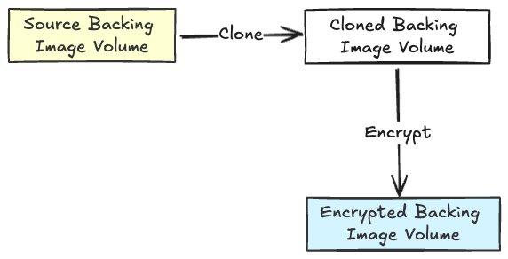

# Support Block Volume Encryption/Decryption

This enhancement focuses on the encryption and decryption of block volumes, particularly involving boot volumes and data volumes. 


## Summary

This enhancement introduces encryption and decryption capabilities for block volumes, specifically targeting boot volumes (virtual machine images) and data volumes. This functionality will enhance security by ensuring that data stored in these volumes is encrypted and can be decrypted when attached. 

## Related Issues

https://github.com/harvester/harvester/issues/3129

## Motivation


### Goals

- Implement encryption for boot volumes and data volumes (support hot plug). 
- Provide a clear and detailed setup process for users to enable encryption/decryption. 

### Non-goals

- This enhancement will not cover GUI-related changes.
- **This enhancement only aims to admin user since Harvester only has an admin user and lacks of user management.**


## Proposal

Since Longhorn uses clone mechanism to encrypt/decrypt Boot volume, so Harvester will follow that. This means that there would be two virtual machine image after encryption. One is encrypted, and the other is source virtual machine image. 



Data volumes are different from Boot volume. Because Longhorn supports block encryption/decryption, so Harvester could encrypt/decrypt data volume directly. 

Regardless of volumes used, Longhorn will decrypt volume when it's attached to virtual machine. So, we'll be able to read the boot volumes and data volumes in the virtual machine. 

### User Stories

#### Story 1 - Use encrypted boot volume to start virtual machine

Admin wants to encrypt the current boot volume for security, so Admin follows up the guideline:

1. Prepare a source virtual machine image, which you could upload or use URL to download.
2. Create a secret for encryption and template storage class.
3. Encrypt the source virtual machine image with the secret and storage class.

After that, Admin will get an encrypted virtual machine image as boot volume. Then, Admin can start the virtual machine with selecting encrypted boot volume in GUI. 

For security reason, Admin decides to delete that original virtual machine image. The encrypted image is independent of the original image. 

For this moment, Admin only has this encrypted virtual machine image and Admin can reuse this boot volume.

Over time, Admin wants to decrypt the encrypted virtual machine image. Admin follows up the guideline:

1. Prepare an encrypted virtual machine image with above steps.
2. Decrypt the encrypted virtual machine image with the secret and storage class from encrypted virtual machine image.

After that, Admin will have an encrypted virtual machine image and an unencrypted virtual machine image. Admin could select one of them to start the virtual machine in GUI.


#### Story 2 - Use encrypted data volume in virtual machine

Admin wants to encrypt a data volume for security, so Admin follows up the guideline:

1. Create a secret and template storage class for encryption/decryption.
2. Select previous storage class when creating a new data volume.

Now, Admin can read the data in the VM. Besides, Admin could attach this encrypted volume to any virtual machine, even as hot plug volume.

Furthermore, any non-admin users in Rancher Integration mode can still use this storage class to create an encrypted volume.

### User Experience In Detail


#### Encrypt a Virtual Machine Image


1. Prepare a image

2. Create a secret
    ```yaml
    apiVersion: v1
    kind: Secret
    metadata:
        name: longhorn-crypto
        namespace: longhorn-system # you could create secret in any namespace
    stringData:
        CRYPTO_KEY_VALUE: "Some secret value here"
        CRYPTO_KEY_PROVIDER: "secret"
        CRYPTO_KEY_CIPHER: "aes-xts-plain64"
        CRYPTO_KEY_HASH: "sha256"
        CRYPTO_KEY_SIZE: "256"
        CRYPTO_PBKDF: "argon2i"
    ```
3. Create Storage Class
    ```yaml
    kind: StorageClass
    apiVersion: storage.k8s.io/v1
    metadata:
      name: harvester-longhorn-encryption
    provisioner: driver.longhorn.io
    allowVolumeExpansion: true
    parameters:
        numberOfReplicas: "2"
        staleReplicaTimeout: "2880" # 48 hours in minutes
        fromBackup: ""
        migratable: "true"
        encrypted: "true"
        csi.storage.k8s.io/provisioner-secret-name: "longhorn-crypto"
        csi.storage.k8s.io/provisioner-secret-namespace: "longhorn-system"
        csi.storage.k8s.io/node-publish-secret-name: "longhorn-crypto"
        csi.storage.k8s.io/node-publish-secret-namespace: "longhorn-system"
        csi.storage.k8s.io/node-stage-secret-name: "longhorn-crypto"
        csi.storage.k8s.io/node-stage-secret-namespace: "longhorn-system"
    ```

4. Create encrypted virtual machine image from a non-encrypted virtual machine image.
    ```yaml
    apiVersion: harvesterhci.io/v1beta1
    kind: VirtualMachineImage
    metadata:
        annotations:
          harvesterhci.io/storageClassName: harvester-longhorn-encryption
        name: encrypted-alpine-extended
        namespace: default
    spec:
        displayName: encrypted-alpine-extended-3.20.2-x86_64.iso
        retry: 3
        sourceType: clone
        securityParameters:
            cryptoOperation: "encrypt"
            sourceImageName: "image-fnw6n" # it's VirtualMachineImage and not display name
            sourceImageNamespace: "default"
    ```
   Or you could use `Edit as YAML` button.
    

5. Now, it's just like a normal image you could choose in GUI.
    

#### Decrypt a Virtual Machine Image


1. Prepare an encrypted virtual machine image.

2. Create an unencrypted virtual machine image
    ```yaml
    apiVersion: harvesterhci.io/v1beta1
    kind: VirtualMachineImage
    metadata:
        annotations:
          harvesterhci.io/storageClassName: harvester-longhorn
        name: decrypt-alpine-extended
        namespace: default
    spec:
        displayName: decrypt-alpine-extended-3.20.2-x86_64.iso
        retry: 3
        sourceType: clone
        securityParameters:
            cryptoOperation: "decrypt"
            sourceImageName: "encrypted-alpine-extended" # not display name
            sourceImageNamespace: "default"
    ```

3. You could select this decrypted image in GUI.
    


#### Encrypt a Data Volume


1. Create a Secret:
    ```yaml
    apiVersion: v1
    kind: Secret
    metadata:
        name: longhorn-crypto
        namespace: longhorn-system
    stringData:
        CRYPTO_KEY_VALUE: "Some secret value here"
        CRYPTO_KEY_PROVIDER: "secret"
        CRYPTO_KEY_CIPHER: "aes-xts-plain64"
        CRYPTO_KEY_HASH: "sha256"
        CRYPTO_KEY_SIZE: "256"
        CRYPTO_PBKDF: "argon2i"
    ```

2. Create Storage Class
    ```yaml
    kind: StorageClass
    apiVersion: storage.k8s.io/v1
    metadata:
      name: harvester-longhorn-encryption
    provisioner: driver.longhorn.io
    allowVolumeExpansion: true
    parameters:
        numberOfReplicas: "2"
        staleReplicaTimeout: "2880" # 48 hours in minutes
        fromBackup: ""
        migratable: "true"
        encrypted: "true"
        csi.storage.k8s.io/provisioner-secret-name: "longhorn-crypto"
        csi.storage.k8s.io/provisioner-secret-namespace: "longhorn-system"
        csi.storage.k8s.io/node-publish-secret-name: "longhorn-crypto"
        csi.storage.k8s.io/node-publish-secret-namespace: "longhorn-system"
        csi.storage.k8s.io/node-stage-secret-name: "longhorn-crypto"
        csi.storage.k8s.io/node-stage-secret-namespace: "longhorn-system"
    ```

3. Select previous storage class when creating the volume
    
    
    Besides, you could attach this encrypted volume as hot plug volume.
    
    


### API changes


```diff
type VirtualMachineImageSpec struct {
-	// +kubebuilder:validation:Enum=download;upload;export-from-volume
+	// +kubebuilder:validation:Enum=download;upload;export-from-volume;clone
	SourceType VirtualMachineImageSourceType `json:"sourceType"`
+   // +optional
+	SecurityParameters *VirtualMachineImageSecurityParameters `json:"securityParameters,omitempty"`
}

+type VirtualMachineImageSecurityParameters struct {
+   // +kubebuilder:validation:Required
+	// +kubebuilder:validation:Enum=encrypt;decrypt
+	CryptoOperation VirtualMachineImageCryptoOperationType `json:"cryptoOperation"`

+   // +kubebuilder:validation:Required
+	SourceImageName string `json:"sourceImageName"`

+   // +kubebuilder:validation:Required
+	SourceImageNamespace string `json:"sourceImageNamespace"`
+}
```

### Design


### Implementation Overview

Harvester uses similar parameters in Longhorn, so we just need to sync those parameters to backing image in Longhorn to activate the encryption/decryption feature.

For example:

Let's say we have this:

```yaml
apiVersion: harvesterhci.io/v1beta1
kind: VirtualMachineImage
metadata:
    annotations:
        harvesterhci.io/storageClassName: harvester-longhorn-encryption
    name: encrypted-alpine-extended
    namespace: default
spec:
    displayName: encrypted-alpine-extended-3.20.2-x86_64.iso
    retry: 3
    sourceType: clone
    securityParameters:
        cryptoOperation: "encrypt"
        sourceImageName: "alpine-extended" # not display name
        sourceImageNamespace: "default"
```

The `sourceImageName` is from here:

```yaml
apiVersion: harvesterhci.io/v1beta1
kind: VirtualMachineImage
metadata:
  annotations:
    harvesterhci.io/storageClassName: harvester-longhorn
  name: alpine-extended
  namespace: default
spec:
  displayName: alpine-extended-3.20.2-x86_64.iso
  retry: 3
  sourceType: download
  url: https://dl-cdn.alpinelinux.org/alpine/v3.20/releases/x86_64/alpine-extended-3.20.2-x86_64.iso
```

We'll get the `harvester-longhorn-encryption` storage class parameters to put them into `spec.storageClassParameters` in mutator of admission webhook. We need to make sure the secret name and namespace are same between `csi.storage.k8s.io/node-publish`, `csi.storage.k8s.io/node-stage` and `csi.storage.k8s.io/provisioner`.

```yaml
apiVersion: harvesterhci.io/v1beta1
kind: VirtualMachineImage
metadata:
    annotations:
        harvesterhci.io/storageClassName: harvester-longhorn-encryption
    name: encrypted-alpine-extended
    namespace: default
spec:
    displayName: encrypted-alpine-extended-3.20.2-x86_64.iso
    retry: 3
    sourceType: clone
    securityParameters:
        cryptoOperation: "encrypt"
        sourceImageName: "alpine-extended" # not display name
        sourceImageNamespace: "default"
    storageClassParameters:
        csi.storage.k8s.io/node-publish-secret-name: encryption
        csi.storage.k8s.io/node-publish-secret-namespace: default
        csi.storage.k8s.io/node-stage-secret-name: encryption
        csi.storage.k8s.io/node-stage-secret-namespace: default
        csi.storage.k8s.io/provisioner-secret-name: encryption
        csi.storage.k8s.io/provisioner-secret-namespace: default
        migratable: "true"
        numberOfReplicas: "2"
        staleReplicaTimeout: "2880"
```

After that, we sync some parameters to backing image in Longhorn and create a new storage class for this backing image.

```yaml
apiVersion: longhorn.io/v1beta2
kind: BackingImage
metadata:
  name: vmi-d93d3210-e547-463f-8f3a-30d3ce8e87a9
  namespace: longhorn-system
spec:
  minNumberOfCopies: 3
  sourceParameters:
    backing-image: "{this is the backing image name, will get it via VirtualMachineImage}"
    encryption: "encrypt"
    secret: "longhorn-crypto"
    secret-namespace: "longhorn-system"
  sourceType: clone
---
allowVolumeExpansion: true
apiVersion: storage.k8s.io/v1
kind: StorageClass
metadata:
  name: longhorn-encrypted-alpine-extended
parameters:
    backingImage: vmi-d93d3210-e547-463f-8f3a-30d3ce8e87a9
    backingImageDataSourceType: clone
    csi.storage.k8s.io/node-publish-secret-name: encryption
    csi.storage.k8s.io/node-publish-secret-namespace: default
    csi.storage.k8s.io/node-stage-secret-name: encryption
    csi.storage.k8s.io/node-stage-secret-namespace: default
    csi.storage.k8s.io/provisioner-secret-name: encryption
    csi.storage.k8s.io/provisioner-secret-namespace: default
    encrypted: "true"
    migratable: "true"
    numberOfReplicas: "2"
    staleReplicaTimeout: "2880"
provisioner: driver.longhorn.io
reclaimPolicy: Delete
volumeBindingMode: Immediate
```

### Validator and Mutator

We need to validate following this:

1. Validate following parameters has same secret name and namespace when creating an encrypted storage class
    - `csi.storage.k8s.io/node-publish-secret-name`
    - `csi.storage.k8s.io/node-publish-secret-namespace`
    - `csi.storage.k8s.io/node-stage-secret-name`
    - `csi.storage.k8s.io/node-stage-secret-namespace`
    - `csi.storage.k8s.io/provisioner-secret-name`
    - `csi.storage.k8s.io/provisioner-secret-namespace`
    - `encrypted`
2. Validate that secret must exist when creating an encrypted storage class.
3. Validate that secret couldn't be deleted when it's used by storage class.
4. Validate that storage class from annotation must exist when creating an encrypted virtual machine image.
5. Validate that encryption/decryption related parameters must exist when creating an encrypted/decrypted virtual machine image.
6. Validate the encrypted image can not be encrypted again, and the non-encrypted image can not be decrypted.

Before the creation of an encrypted virtual machine is processed by Harvester controller, we currently have an admission webhook that mutates its `spec.storageClassParameters` with storage class from annotation. We should allow extra following parameters to be injected into virtual machine image:
- `csi.storage.k8s.io/node-publish-secret-name`
- `csi.storage.k8s.io/node-publish-secret-namespace`
- `csi.storage.k8s.io/node-stage-secret-name`
- `csi.storage.k8s.io/node-stage-secret-namespace`
- `csi.storage.k8s.io/provisioner-secret-name`
- `csi.storage.k8s.io/provisioner-secret-namespace`
- `encrypted`

### Test plan

- Verify that volumes can be encrypted and decrypted as specified. 
- Verify that encrypted boot volume and data volume can be attached to virtual machines.
- Verify that the encrypted data volume, when used as a hot plug volume, can be attached to virtual machines.
- Verify that VM restoring snapshots, backups, and migrations works as expected with encrypted volumes.
- Ensure that encrypted volumes are not accessible without the correct decryption keys.  
  We could verify this by checking `/dev/longhorn` in the host like following screenshot after starting VM.  
  If it's encrypted, it shows LUKS header information. Otherwise, it shows invalid LUKS device.
  

  Then, you could use wrong password to `lukeOpen` it. If passphrase is wrong, it shows `No key available with this passphrase`. If passphrase is correct, it shows `which is in use (already mapped or mounted)` because CSI driver have mounted it. The mounted path is in `/dev/mapper` on the same host.
  
- Verify that VM image is encrypted.
  Suggest that only start one VM without extra disks. After vm starts, there is only one disk in `/dev/longhorn`. Use the same method as in the previous step to verify it.
  

### Limitations

- Don't support that export to image from encrypted boot and data volumes. 
- Don't support that download encrypted image and upload it to reuse.
- Don't support that data volume restoring from encrypted to unencrypted or unencrypted to encrypted one.


### Upgrade strategy

None

## Notes

In some discussions with @bk201 @Vicente-Cheng @WebberHuang1118 , we considered to follow CSI interface for encryption. For example, Harvester only requires that CSI driver provides Harvester  with an encrypted volume. Harvester would attach it to trigger the CSI driver's decryption. Next, Harvester would copy image data to this volume.

However, this approach could lead to performance issue. With this way, Harvester needs to copy image data to encrypted volume each time when starting VMs, but underlying backing image does not. This is not efficient. Although we could use `snapshot` to avoid this, our `virtualmachineimages.harvesterhci.io` is tightly coupled with Longhorn. This would result in more steps for end-users to create encrypted virtual machine image.

Therefore, at this moment, we've decided to follow Longhorn's method for encryption/decryption until we find a better solution.

## FAQ

### Q1: If we use k8s secret to encrypt volume, how to prevent different users from reading the secret?

Depend on environment. 

If we use standalone Harvester, there is only one user. So, we can't avoid this.

If we use Harvester with Rancher Integration, we could assign different users to different projects and namespaces. By this, we could prevent different users from reading the other secret. Please check [Multi-Tenancy with Rancher Integration](https://docs.harvesterhci.io/v1.3/rancher/virtualization-management/#multi-tenancy-example).

### Q2: Can we prevent users from creating Storage Class?

Yes. Please follow answer of Q1 to use Rancher Integration to create different projects and namespaces. Storage class is available to everyone, normal users can still read it. But, they can't create it.

The only way for normal users to create Storage Class is to request admin to create it.

### Q3: How do we ***really*** know this volume is encrypted or not?

For end-user, they never know. The CSI driver automatically decrypts the volume when volumes are attached to VMs.

But, for admin which can log in to host, they could check `/dev/longhorn/pvc-xxxx` by command `cryptsetup luksDump {pvc_name}` after VMs start. Please check screenshots of [Test Plan](#test-plan).
