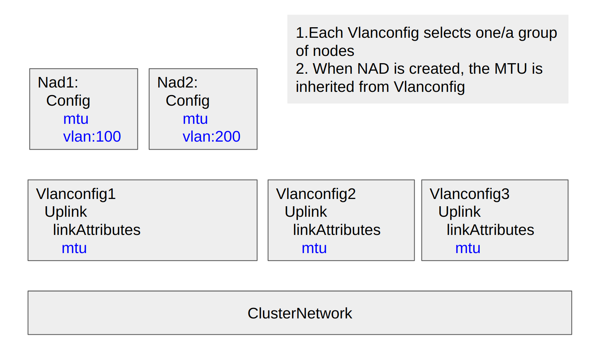

# MTU and other Network Information Propagation

Review the proper propagation of MTU and other information between Harvester network elements and NetworkAttachmentDefinition.

## Summary

Harvester has conception of `Clusternetwork` and `Vlanconfig`, they are the connections between Harvester and the Kubernetes general term `NetworkAttachmentDefinition`, hereafter it is referred as `NAD`.

### Related Issues

The URL For the related enhancement issues in Harvester repo.

#### Issue Type 1: MTU is not synced to NAD

[BUG The bridge MTU is not changed](https://github.com/harvester/harvester/issues/4353)

MTU of the uplink is set as 9000; MTU of the bridge (e.g. storage-br) is still 1500 but the bond's is 9000

Closed, via PR [Sync MTU value to NAD](https://github.com/harvester/network-controller-harvester/pull/87)

#### Issue Type 2: Change MTU on the Fly

[Question Should updated MTU apply on existed VM network? #4389](https://github.com/harvester/harvester/issues/4389)

Closed, expected to be solved on issue #4355.

[The MTU value does not propagate to all the interfaces if MTU is configured after the VlanConfig creation #4752](https://github.com/harvester/harvester/issues/4752)

Closed, expected to be solved on issue #4355.

#### Issue Type 3: Move MTU to Clusternetwork

[ENHANCEMENT Support configure MTU in the cluster network #4355](https://github.com/harvester/harvester/issues/4355)

#### JIRA ticket: Question about Jumbo frames in Harvester

[Question about Jumbo frames in Harvester](https://jira.suse.com/browse/SURE-7171)

>What sense does it make to have Jumbo frames (MTU 9000) on Harvester physical interfaces?
When jumbo frames are configured, the CNI is not configured accordingly. The MTU of all pod interfaces is 1450 (1500 minus vxlan overhead). Even when the storage network is configured, the MTU of the virtual storage adapter is 1500. As a result, all relevant traffic is using MTU 1500. Only node traffic, e.g. image pulls can (in theory) profit from MTU 9000, but only if the registry is also using jumbo frames. E.g. VM images are downloaded from inside a pod and therefore use MTU 1500. Please describe a scenario where (and how) jumbo frames are useful and increase the performance!
How about the possibility of using jumbo frames in guest clusters?

:::note

We did not give a formal answer to this yet, it is complex and needs testing.

:::

## Motivation

In the context of Harvester, user may ask:

(1) Can a network with MTU 9000 benefit Harvester [Storage Network](https://docs.harvesterhci.io/v1.3/advanced/storagenetwork), specifically Longhorn?

A detailed analysis is needed to identify the L2 packet characters of Longhorn data replication. 

It depends how LH copies the trunks of data from its TCP/IP connection in most cases. 1K, 4K or 1M? If a big part of the packets are under 1500, then MTU 9000 does not bring big improvements. Meanwhile, sending 1000 packets in 0.1 second or 0.001 second also makes things different. When the traffic is high and there are potential network related pressures, the higher MTU may help.

This applies to Kubernetes management network as well.

(2) Can a network with MTU 9000 benefit a group of VMs?

It is also related the traffic.

:::note

In most cases, MTU is not changed in the lifecycle of a cluster. It is not decided by a single bare-metal server, but affected by all the devices on the same L2 network, all should have the same MTU to avoid L2 packets being dropped. And when the traffic transfers to the L3 network, it also relies on on the L3 gateway to handle different MTUs on different networks.

:::

The above tickets are mostly motivated from such, users tried to change the MTU to achieve the potential better performance.

### Goals

1. Review the current design and implementation.

2. Decide the best solution to solve current issues/limitations.

### Non-goals [optional]

What is out of scope for this enhancement? Listing non-goals helps to focus discussion and make progress.

## Proposal

This is where we get down to the nitty gritty of what the proposal actually is.

### MTU Propagation Path

In Harvester, the `MTU` is propagated from `Vlanconfig` to `NAD`.

User configures the `MTU` on the [Uplink](https://docs.harvesterhci.io/v1.3/networking/index#how-to-create-a-new-cluster-network) when creating `Vlanconfig`.



### Bridge CNI Specification

https://www.cni.dev/plugins/current/main/bridge/#network-configuration-reference

```
name (string, required):                        the name of the network.
type (string, required):                        “bridge”.
bridge (string, optional):                      name of the bridge to use/create. Defaults to “cni0”.
isGateway (boolean, optional):                  assign an IP address to the bridge. Defaults to false.
isDefaultGateway (boolean, optional):           Sets isGateway to true and makes the assigned IP the default route. Defaults to false.
forceAddress (boolean, optional):               Indicates if a new IP address should be set if the previous value has been changed. Defaults to false.
ipMasq (boolean, optional):                     set up IP Masquerade on the host for traffic originating from this network and destined outside of it. Defaults to false.
mtu (integer, optional):                        explicitly set MTU to the specified value. Defaults to the value chosen by the kernel.
hairpinMode (boolean, optional):                set hairpin mode for interfaces on the bridge. Defaults to false.
ipam (dictionary, required):                    IPAM configuration to be used for this network. For L2-only network, create empty dictionary.
promiscMode (boolean, optional):                set promiscuous mode on the bridge. Defaults to false.
vlan (int, optional):                           assign VLAN tag. Defaults to none.
preserveDefaultVlan (boolean, optional):        indicates whether the default vlan must be preserved on the veth end connected to the bridge. Defaults to true.
vlanTrunk (list, optional):                     assign VLAN trunk tag. Defaults to none.
enabledad (boolean, optional):                  enables duplicate address detection for the container side veth. Defaults to false.
macspoofchk (boolean, optional):                Enables mac spoof check, limiting the traffic originating from the container to the mac address of the interface. Defaults to false.
disableContainerInterface (boolean, optional):  Set the container interface (veth peer inside the container netns) state down. When enabled, IPAM cannot be used.
```

The above fields are converted to a JSON string and set as a string to k8s CRD NAD object.

```
cniv1 "github.com/k8snetworkplumbingwg/network-attachment-definition-client/pkg/apis/k8s.cni.cncf.io/v1"


type NetworkAttachmentDefinition struct {
  metav1.TypeMeta   `json:",inline"`
  metav1.ObjectMeta `json:"metadata,omitempty"`

  Spec NetworkAttachmentDefinitionSpec `json:"spec"`
}

type NetworkAttachmentDefinitionSpec struct {
  Config string `json:"config"`
}

```

Example: The NAD for Harvester storage network.

```
kind: NetworkAttachmentDefinition
spec:
  config: '{"cniVersion":"0.3.1","type":"bridge","dns":{},"bridge":"storage-br","promiscMode":true,"vlan":1,"ipam":{"type":"whereabouts","range":"10.172.0.0/16"}}'
  
```

### Harvester UI sets Fields

When configuring [Vlan Network](https://docs.harvesterhci.io/v1.3/networking/harvester-network#vlan-network) from Harvester UI, below fields are touched:

```

Type: `'L2VlanNetwork', 'UntaggedNetwork'`
Vlan ID:
ClusterNetwork: User select.  Implicitly converted to `Bridge` name.
```

:::note

Harvester only exposes very few fields of Bridge CNI to UI.

:::


The `Route` related information is converted to an annotation on NAD.

```
Route:
  Automatic
  Manual:
    CIDR, Gateway
```

### User Stories


#### Story 1: Install a Cluster with the Predefined MTU

The current implementation is OK.

e.g. MTU 9000

After `Clusternetwork` and `Vlanconfig` are created, all following `NADs` will inherit the MTU value 9000. Pod/VM attached to this NAD also has MTU 9000.

#### Story 2: Change the MTU of a Clusternetwork and Vlanconfig on the Fly

The current implementation is not OK.

Step 1: Install the cluster with the default MTU 1500.

After `Clusternetwork` and `Vlanconfig` is created, all following `NAD`s will inherit the MTU value `1500`.

Step 2: Change the MTU to 9000, step by step on each `Vlanconfig`.

Issue/limitation: MTU on the existing `NAD`s are not updated automatically.

#### Story 3: Set the NAD with a different MTU than the Vlanconfig

Step 1: Create a `Vlanconfig` with the default MTU 1500 and one `NAD` on it.

Step 2: Configure the MTU of this `NAD` to a new value 1400 manually.

There is no direct UI.

Issue/limitation: `NAD` does not expose all the fields on UI (including MTU), only via `kubectl`.

#### Story 4: Set the NAD MTU on the Fly

Step 1. Create NAD with MTU 1500.

Step 2. Create POD/VM on the NAD.

Step 3. Change the NAD MTU to 1400.

Step 4. Replace the POD/VM manually.

Issue/limitation: When NAD is changed, the `consumer POD/VM` needs to be replaced manually.

#### Story 5: Set a different MTU on the Guest OS

When a VM starts with the MTU 1500 configured to its nic. The MTU is also 1500 on the related `NAD` and `Vlanconfig`.

What will happen if the MTU is changed to a value like 9000 from the guest OS by the user manually?

What will happen if the MTU is changed to a value like 1400 from the guest OS by the user manually?

The related note needs to be added to Harvester document.

### User Experience In Detail

### API changes

## Design

### Implementation Overview

#### Update NAD MTU on the fly

No matter Harvester puts MTU on `Clusternetwork` or `Vlanconfig`, an enhancement is needed to:

(1) Sync the information from Harvester to NAD

(2) Allow NAD to have a different MTU than Harvester side.

e.g. for test

(3) Automatically replace/migrate the POD/VM to get the updated MTU, or warn the user that the change will only take effect after the POD/VM is replaced/rebooted.

#### MTU belonging

##### Solution 1: Keep on `Vlanconfig`

Advantages:

(i) MTU is a concept of physical nics, the `Vlanconfig` has `uplink` and the `MTU` is by nature adhered to it.

(ii) More convenient for network adjustment.

e.g. User plans to set a bigger MTU for the VM network, with the `Vlanconfig`, user can 

```

(a) Migrate/stop VM from the nodes belonging to Vlanconfig 1

(b) Set a new MTU on those nodes

(c) Create a few test VMs to test the new network

(d.1) Migrate VM back

(d.2) If not working as expected, revert the changes

```
Repeat (a)..(d) to finish the maintenance of a whole cluster.

Also refer [Replace Ethernet NICs](https://docs.harvesterhci.io/v1.3/networking/best-practice#replace-ethernet-nics), the current `Vlanconfig` proves to be good for changing the network setting on the fly.

(iii) `Vlanconfig` is the right place to cover/encapsulate `NAD` and keep evolving.

Disadvantages:

(i) A bit tedious to adjust the MTU on the fly.

(ii) MTU inconsistency in the middle. It is also possible that the MTU was misconfigured to be not unique for the `Vlanconfig`s under the same `Clusternetwork`.

When this feature [add Harvester alerts](https://github.com/harvester/harvester/issues/2850) is implemented, users will be notified from Harvester UI and the Harvester [Monitoring](https://docs.harvesterhci.io/v1.3/monitoring/harvester-monitoring#alertmanager).

##### Solution 2: Move to `Clusternetwork`

Advantages:

(i) Ideally one click.

Disadvantages:

(i) `Clusternetwork` is like a virtual class, not fit for putting some fields here.

(ii) When `MTU` is on `Clusternetwork`, it is still hard to drop `MTU` from `Vlanconfig`, refer above scenario of changing the MTU on a running cluster. If we have 3 places of MTU, the sync will be even more complex.

(iii) When something is wrong, it will afffect all.

#### The planned VxLan Feature

`Clusternetwork` may still keep unchanged, and a new CRD like `Vxlanconfig` is added to act the similar role of `Vlanconfig`.

From this point, `MTU` is not something belonging to the `Clusternetwork`.

### Test plan

Integration test plan.

### Upgrade strategy

Anything that requires if user want to upgrade to this enhancement

## Note [optional]

Additional notes.
