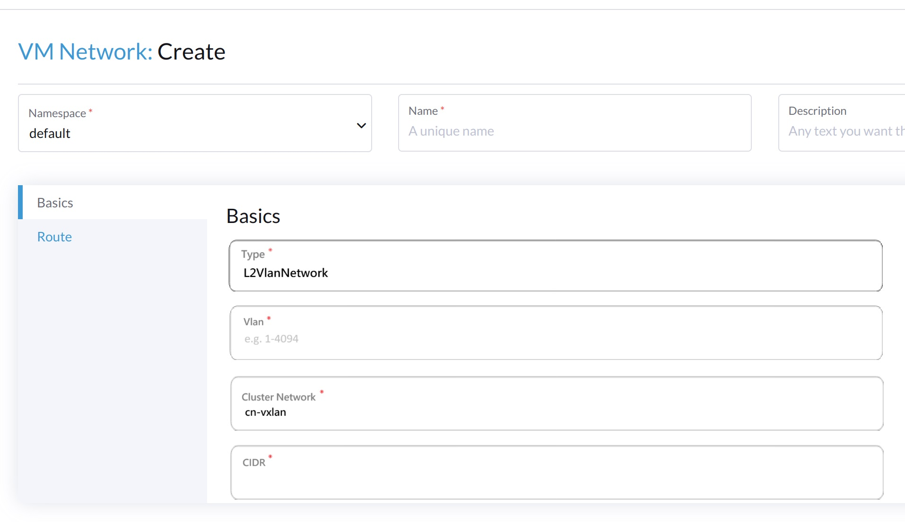
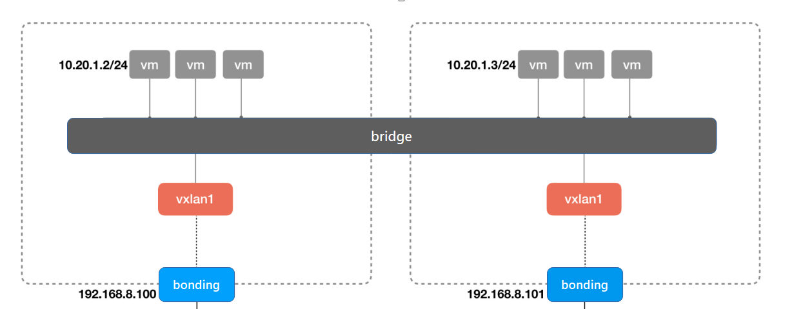
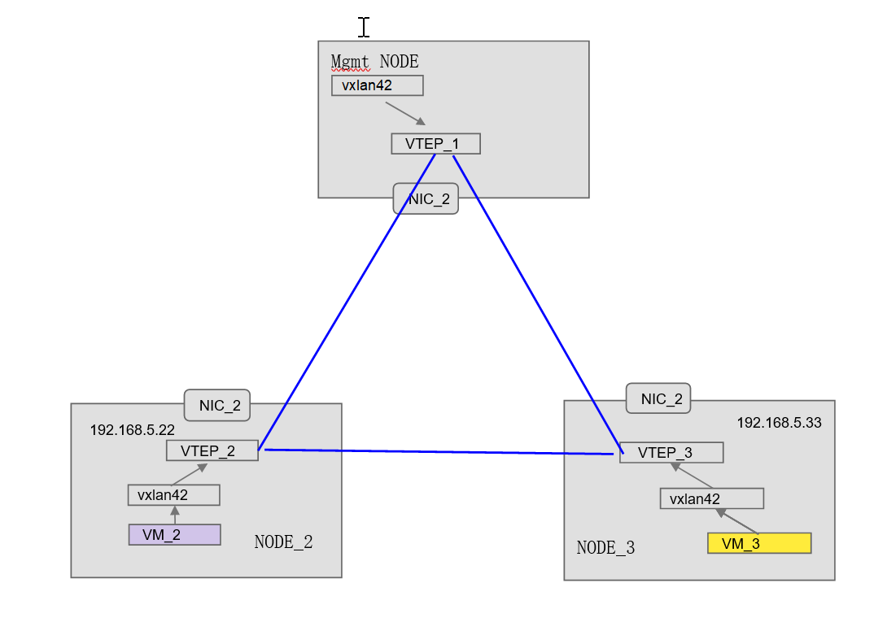
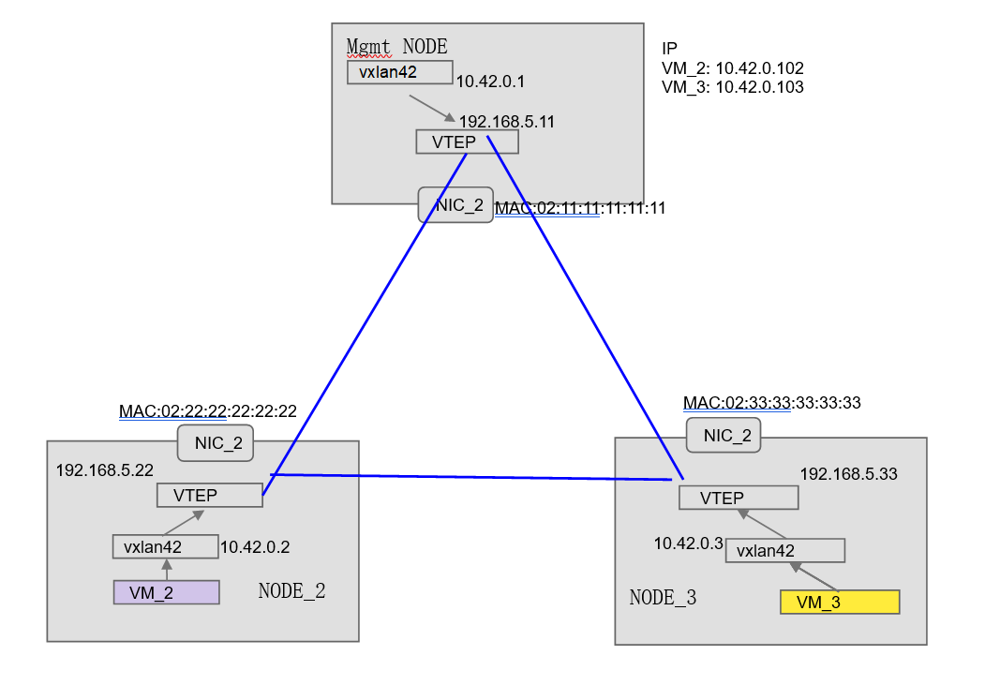

# VxLAN enhancement

## Summary

In real product environments, the need for overlay networks is crucial for scalability and multi-tenancy in cloud-native deployments. Harvester does not support VxLAN for overlay networking. We will enhance the Harvester network by integrating VxLAN support to enable efficient network segmentation and improved traffic management across different network segments.

### Related Issues

- https://github.com/harvester/harvester/issues/2260
- https://github.com/harvester/harvester/issues/2322

## Terminology
| Term                        | Short Term               | Description                                                  |
| --------------------------- | ------------------------ | ------------------------------------------------------------ |
| VxLAN Tunnel Endpoint       | VTEP                     | An entity that encapsulates and decapsulates traffic into/from VxLAN frames. |
| Virtual Network Identifier  | VNI                      | A 24-bit number used to segment different VxLAN networks. |
| VM Group                    | -                        | A group of VM provisioned by Harvester Cluster, those VMs can communicate with each other by default. Different VM Groups are isolated. |
| VxLAN interface             | VxLAN iface              | A virtual network interface that is used to transmit and receive VxLAN encapsulated traffic. |
| Traffic Policy              | -                        | A set of rules that define how traffic is allowed to flow between different network entities, such as VMs and external networks. |
| Forwarding Database	      | FDB                      | A table used by bridges and switches to associate MAC addresses with ports, allowing them to forward traffic to the correct destination. |
| Address Resolution Protocol | ARP		         | A networking protocol used to map an IP address to a physical (MAC) address on a local network. |
| Border Gateway Protocol     | BGP		         | An autonomous system routing protocol designed to exchange routing and reachability information between different networks. |
| BGP Extended for EVPN	      | BGP EVPN	         | A set of extended community attributes used with BGP to support the distribution of Ethernet VPN (EVPN) information, such as MAC addresses and VNIs, across a network. |

## Motivation

### Goals

- Integrate VxLAN support to allow the creation of overlay networks.
  - Support each Virtual Network is used for one VM Group
  - Support VM live migration and persistent IP address, VM can freely migrate/move in the Harvester Cluster without change of IP address
  - Support VM Group use VIP to communicate with outside
- Support automatically establishing of VxLAN tunnel, all host NODEs in the specific Cluster Network are member of VxLAN network and should be able to build full mesh VxLAN tunnel connection
- Enable efficient network segmentation and traffic management across different network segments.

### Non-goals [optional]

- Integrate with kube-vip to provide load balancer service for VMs based on vxlan network.
- Allow provisioning guest k8s cluster and manage the cluster with Rancher through the vxlan network.

## Proposal
.

### User Stories

In Harvester, we assume the following:

 - The user provides physical network connectivity to make sure echo Node are reachable to each other
 - Multi networks may exist.
 - The management network is always existing.

A detailed explanation of Harvester networking is in the Harvester network samples.

A user plans to deploy a Harvester cluster and assumes:

 - Mgmt is a built-in cluster network and does not support any additional vxlanconfigs.
 - Users are allowed to add a custom cluster network and add vxlanconfigs under it.
 - Users should select cluster network when creating a VxLAN network.
 - User configures multiple overlay networks using VxLAN VNI on the selected cluster network
 - User has multiple nodes, each with multiple NICs.
 - User requires strict traffic policies to be enforced between VMs and with external networks to ensure security and compliance.


#### Story 1

Adding Virtual Network


User specifies the VNI and the related CIDR, VxLAN interfacde are created automatically and attached to the bridge which belongs to the Cluster Network..




Harvester Host Cluster should have knowledge of all the existing VMs, VTEP and the created VxLAN interface.
It should adds the MAC-IP mapping in the table for each VM and convert them into FDB entry/ARP etnry, so the VTEP can skip dynamic MAC learning

The VM-VM communication under the same VM Network means the packets with the same VNI are able to be forwared to the VMs attached to the same VM Network.

#### Story 2

VM migration

When an VM is migrated/moved to another NODE, Host Harvester Cluster needs to remove the ARP entry in the original NODE and add corresponding VxLAN FDB, ARP to the other NODE.

If the there's now VM attached to the same Cluster Network, the bridge/bonding interface needs to be created and the VxLAN interface should be created to deploy the VM Network.

#### Story 3

VM-internet communication

First, make sure the guest Cluster Network is able to connect to the internet via the bonding interface.
Then, the VxLAN interface attached to the bridge should play as a router of All VMs which attached to the same VM Network (the same VNI)
The iptables rule for the routing should be added on the NODE, and the default route entry in the VM should be destined to the IP of the VxLAN interface
All VMs attached to the internet can be done by the 


### User Experience In Detail

#### An example of VxLAN user operation

The user will be able to use Harvester VxLAN network to create isolated Guest Kubernetes Cluster with following steps.

(1) Create one guest Cluster Network on a dedicated NIC(different from the management NIC), IP addresses are static set/dynamic provisioned by DHCP from provider network, CIDR e.g. 192.168.5.0/24

(2) Create one VxLAN overlay network on top of the guest Cluster Network, say VxLAN_1, VNI 42, the overlay network CIDR, e.g. 10.42.0.0/8. The default port number can be configured manually or automatically. The port 8472 is occupied for `flannel` by default. The port 4789 is used for demonstration in the following operations. The Local IP and remote peers of the VTEP in each NODE are fetched from APIServer. The vxlan interface will be created with the specified VNI on the NODE.
```
ip link add vxlan42 type vxlan id 42 dstport 4789 local 192.168.5.11 dev cn-vxlan_1-bo
ip link set vxlan42 master cn-vxlan_1-br
```
(3) Create VMs attached to the VxLAN_1, and move one of the VM to NODE_2/NODE_3.
The bridge/bonding interfaces of the guest Cluster Network should be created automatically on NODE_2/NODE_3. 
The bonding interface will play as the VTEP which needs the IP address to be assigned automatically from DHCP.
The `vxlan42` interface should also be created and attached to the brige interface like (2). 
```
on NODE_2
ip link add vxlan42 type vxlan id 42 dstport 4789 local 192.168.5.22 dev cn-vxlan_1-bo
ip link set vxlan42 master cn-vxlan_1_br

on NODE_3
ip link add vxlan42 type vxlan id 42 dstport 4789 local 192.168.5.33 dev cn-vxlan_1-bo
ip link set vxlan42 master cn-vxlan_1-br
```
(4) Note that we don't use `group` option while creating the vxlan interface, the broadcast packets will not be sent to the multicast group to learn the FDB entry from other VTEPs.
We need to manually add the FDB entry on each NODE so the VM on the VxLAN network can find each other by ARP. 
```
on Mgmt NODE:	add NODE_2, NODE_3 in the forwarding table. The broadcast packets would be correctly forwarded and the gratuitous ARP can work on top of it.
bridge fdb append 00:00:00:00:00:00 dev vxlan42 dst 192.168.5.22
bridge fdb append 00:00:00:00:00:00 dev vxlan42 dst 192.168.5.33
bridge fdb append 02:22:22:22:22:22 dev vxlan42 dst 192.168.5.22
bridge fdb append 02:33:33:33:33:33 dev vxlan42 dst 192.168.5.33

on NODE_2:	add Mgmt NODE and NODE_3 in the forwarding table.
bridge fdb append 00:00:00:00:00:00 dev vxlan42 dst 192.168.5.11
bridge fdb append 00:00:00:00:00:00 dev vxlan42 dst 192.168.5.33
bridge fdb append 02:11:11:11:11:11 dev vxlan42 dst 192.168.5.11
bridge fdb append 02:33:33:33:33:33 dev vxlan42 dst 192.168.5.33

on NODE_3:	add Mgmt NODE and NODE_2 
bridge fdb append 00:00:00:00:00:00 dev vxlan42 dst 192.168.5.11
bridge fdb append 00:00:00:00:00:00 dev vxlan42 dst 192.168.5.22
bridge fdb append 02:11:11:11:11:11 dev vxlan42 dst 192.168.5.11
bridge fdb append 02:22:22:22:22:22 dev vxlan42 dst 192.168.5.22
```

(5) The VxLAN interface on each NODE should play as the ARP proxy for VMs attached to the same VxLAN network.
Then the packet destined to the VM have the ARP response from the corresponding VTEP and correctly forwarded.
Adding the ARP entry for each VM for other NODEs which has no information for it. 
```
if the VM is on the Mgmt NODE, the following arp entry needs to be added on
NODE_2/NODE_3:
sudo ip neigh add 10.42.0.21 lladdr 02:11:11:11:11:11 dev vxlan0

if the VM is on the NODE_2, then we need to add the ARP entry on
Mgmt NODE/NODE_3:
sudo ip neigh add 10.42.0.21 lladdr 02:22:22:22:22:22 dev vxlan0
```

(6) Use the VxLAN interface created in (3) to play as the router for all VMs attached to the same VxLAN network on the NODE.
The `vxlan` interface can connect the external network via the uplink/bonding interface of the guest ClusterNetwork.
Thus all VMs which route via the vxlan interface can connect to the external network.
The `iptables` rules which do the masquerade should be added and the `default` route entry should also be configured on the attached VM.
```
if the VM resides on the Mgmt NODE:
sysctl -w net.ipv4.ip_forward=1
iptables -t nat -s 10.42.0.0/24 -A POSTROUTING -j MASQUERADE
ip addr add 10.42.0.1 dev vxlan42	(or automatically assigned by IPAM/DHCP)

on the VM:
ip route add default dev enp2s0 via 10.42.0.1
```

### API changes

## Design

### Implementation Overview
(1) Extend current network-controller to create the extra vxlan interface, manipulate FDB and ARP entires.

(2) Use kube-virt to create VM, allocate the IP from the specified CIDR for the vxlan, and set up the default route correctly

(3) network-controller need to keep tracking the VTEP IP/MAC mapping information for all NODEs. 

### Test plan


### Upgrade strategy

## Note [optional]

(1) to enable cross VxLAN network connection (different VNI) on the same guest Cluster Network, the BGP EVPN is required to route for each VxLAN group. Need to figure out a way for it.

(2) Each `vxlan` interface requires an additional IP address assigned for the spcified VNI bound to the VNI. How to allocate that automatically from IPAM or DHCP?

(3) Use the ovn-kubernetes for the overlay network deployment, which includes the VxLAN and more.

## reference
https://github.com/w13915984028/harvester/blob/vxlan-hep/enhancements/20220530-vxlan-enhancement.md
