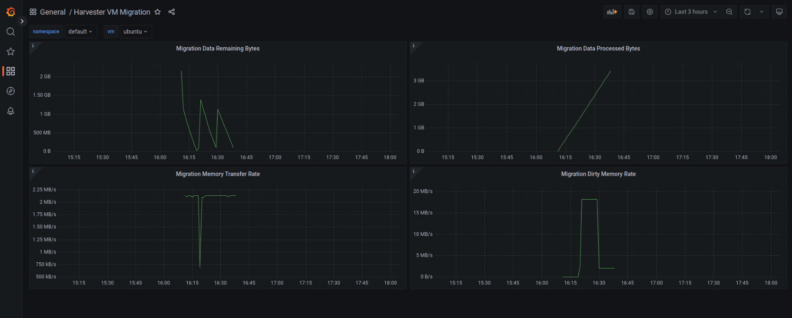
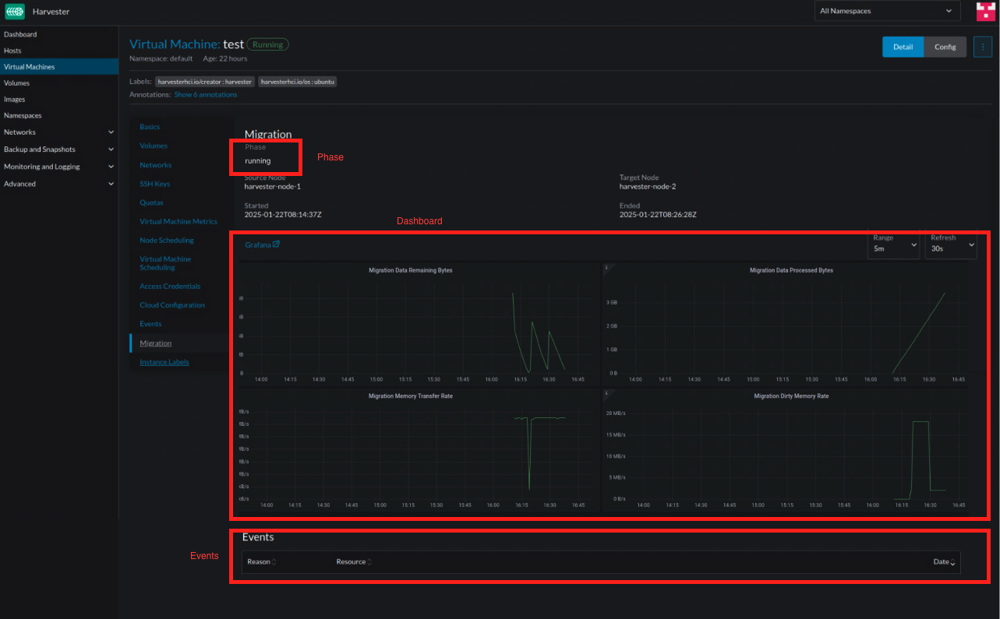

# VM Live Migration Enhancement

## Summary

This enhancement proposal aims to improve the UI of Harvester by exposing detailed information about Virtual Machine live migration. This includes displaying VM migration metrics such as data transferred, remaining data, memory dirtied rate, and memory transfer rate, enabling users to monitor the migration process directly in the Harvester UI.

### Related Issues

https://github.com/harvester/harvester/issues/4352

## Motivation

### Goals

- Expose migration phase and events in the UI.
- Add migration metrics panels to the UI. These metrics are collected by Prometheus, and the panels are created by Grafana. Therefore, the `rancher-monitoring` addon needs to be enabled for the panels to display correctly.

## Proposal

### User Stories

Users currently have limited visibility into live migration details, as we only show basic information such as the source node, target node, and migration start and end times. KubeVirt does expose useful migration metrics to Prometheus, provided that the `rancher-monitoring` addon is enabled. However, there is no existing dashboard to track these metrics. After this enhancement, users will be able to view migration events and key migration metrics directly in the UI, offering a more convenient way to track the migration process.

### API changes

No new APIs are introduced.

## Design

**Implementation Steps**

1. Add vm migration grafana dashboard json model to ConfigMaps to create Grafana Dashboard. Essentially, this involves adding the JSON to [rancherd-12-monitoring-dashboard.yaml]((https://github.com/harvester/harvester-installer/blob/master/pkg/config/templates/rancherd-12-monitoring-dashboard.yaml)). A sample JSON is provided here: https://gist.github.com/brandboat/c180c0074e5349e6df8f991e9d10de64. Below is a screenshot of the Grafana dashboard.

Here are the four metrics displayed in the panels:
    - Migration Data Processed Bytes: Corresponds to [kubevirt_vmi_migration_data_processed_bytes](https://github.com/kubevirt/monitoring/blob/main/docs/metrics.md#kubevirt_vmi_migration_data_processed_bytes) -
The total Guest OS data processed and migrated to the new VM.

    - Migration Data Remaining Bytes: Corresponds to [kubevirt_vmi_migration_data_remaining_bytes](https://github.com/kubevirt/monitoring/blob/main/docs/metrics.md#kubevirt_vmi_migration_data_remaining_bytes) - The remaining guest OS data to be migrated to the new VM.

    - Migration Dirty Memory Rate: Corresponds to [kubevirt_vmi_migration_dirty_memory_rate_bytes](https://github.com/kubevirt/monitoring/blob/main/docs/metrics.md#kubevirt_vmi_migration_dirty_memory_rate_bytes) - The rate of memory being dirty in the Guest OS.

    - Migration Memory Transfer Rate: Corresponds to [kubevirt_vmi_migration_disk_transfer_rate_bytes](https://github.com/kubevirt/monitoring/blob/main/docs/metrics.md#kubevirt_vmi_migration_disk_transfer_rate_bytes) - The rate at which the memory is being transferred, unit is byte per second. Note that the name of this metrics is wrong and should be `kubevirt_vmi_migration_memory_transfer_rate_bytes` and will be fixed by https://github.com/kubevirt/kubevirt/pull/13500

2. For the UI part, navigate to Virtual Machines > Click a specific VM > Migration tab. This page will track the VirtualMachineInstanceMigration phase, events and present the metrics by embedding the Grafana dashboard. The metrics panels will only be visible when the `rancher-monitoring` addon is enabled.

### Test plan

1. Prepare a 3 node harvester cluster.
1. Enable rancher-monitoring addon.
1. Modify KubeVirt CR, and edit `.spec.configuration.migrations.bandwidthPerMigration` to 2Mi as migration may ends quickly, if it goes under one minute, we can't see any metrics on the UI.
1. Create one VM (1 CPU, 2Gi Memory) and migrate the VM to another node.
1. In the UI, go to the Virtual Machines page, click the VM that is under Migrating state, and navigate to the Migration tab, where you will find four metrics: Migration Data Remaining Bytes, Migration Data Processed Bytes, Migration Memory Rate Bytes, and Migration Dirty Memory Rate Bytes. All these metrics should have values greater than 0 except `Dirty Memory Rate Bytes`. This metric will only be greater than 0 when there is memory-intensive activity (e.g. a memory stress test). During the migration, you can observe the following behavior: Processed Bytes should continuously increase; Remaining Bytes should decrease over time.

### Upgrade strategy

Since the current upgrade path to v1.5.0 is v1.4.2 -> v1.5.0, we will add a script (pre-hook.sh) to `harvester/package/upgrade/migrations/upgrade_manifests/v1.4.2` to add the Grafana dashboard json model to ConfigMap.

### Rejected alternative

- Implementing a controller to periodically fetch metrics through the kubevirt-prometheus-metrics endpoint and attach them to the VirtualMachineInstanceMigration annotation. The UI would then display the metrics by showing the annotation values. This approach was proposed as a way to expose metrics without requiring the rancher-monitoring addon, which might not be feasible for users with limited resources. However, this approach has drawbacks: If the user enables the rancher-monitoring addon, this would be redundant with the Rancher monitoring solution. Additionally, if the hardware doesn't meet the specifications required to run the monitoring stack, it's likely that live migration would not be a frequently-used operation, making the added complexity unnecessary.

### References

- https://github.com/kubevirt/kubevirt/pull/7474
- https://github.com/kubevirt/kubevirt/pull/7946
- https://libvirt.org/html/libvirt-libvirt-domain.html
- https://kubevirt.io/user-guide/user_workloads/component_monitoring/
