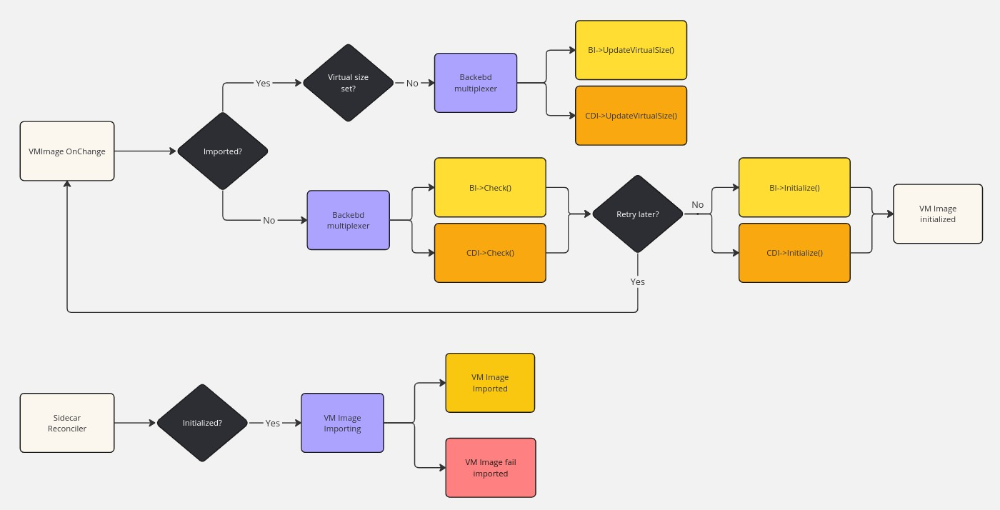
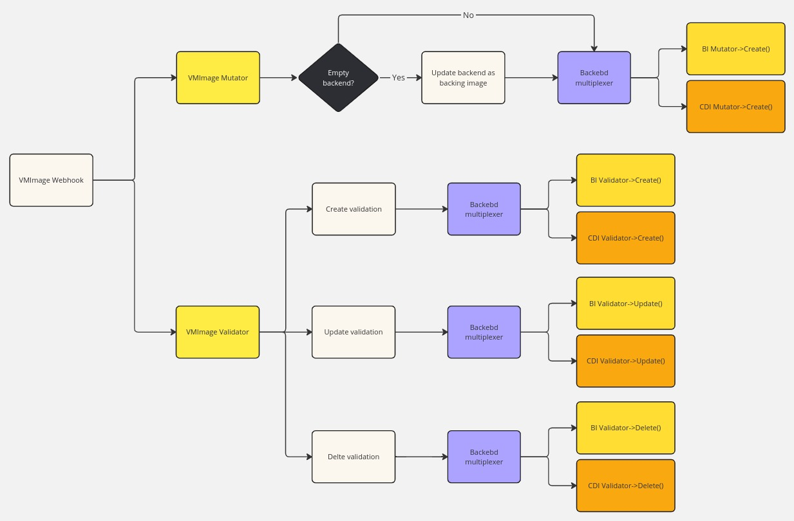
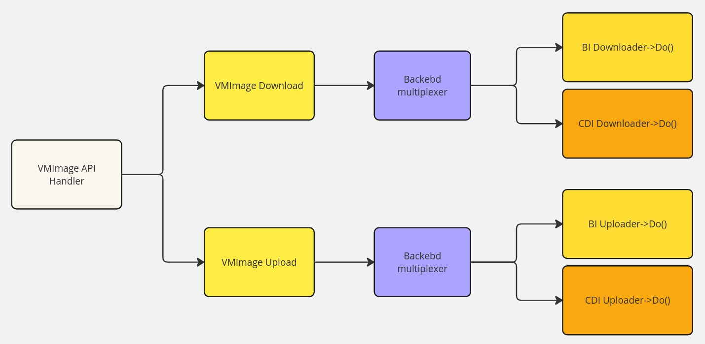

# VM Image Multiple Backend Support

## Summary

This enhancement/refactor makes VM Image support different source backends.

### Related Issues

- https://github.com/harvester/harvester/issues/6936

## Motivation

### Goals

As preparation for [Consume external/third-party storage within Harvester](https://github.com/harvester/harvester/issues/1199), Harvester should be able to store VM Images in the third-party storage. However, currently Harvester only stores images in Longhorn via backing images, which limits the VM rootdisk to be provided by Longhorn in most cases.

This enhancement will refactor VM Image implementation to have general interfaces for different images backend sources. It should seamlessly keep the current use scenarios with [Longhorn Backing Image](https://longhorn.io/docs/1.7.2/advanced-resources/backing-image/) and also support the images backed by [Containerized Data Importer(CDI)](https://github.com/kubevirt/containerized-data-importer).

Once VM Images are integrated with CDI, Harvester would be able to use third-party storage to host VM rootdisk. 

In addition, with this enhancement/refactor, VM Image will have a clear interface to integrate with any image provider solution (e.q. [Longhorn V2 Backing Image](https://github.com/longhorn/longhorn/blob/master/enhancements/20241203-v2-backing-image-support.md))

## Proposal

### User Stories

After integration with [Consume external/third-party storage within Harvester](https://github.com/harvester/harvester/issues/1199), the user should be able to store VM Images in the 3rd-party storage, and provide VM rootdisk with such images.

In addition to this, Harvester will have a clear interface to support other image provider implementations in the future.

### API changes

## Design

### Implementation Overview

#### CRD

- Resource `VirtualMachineImage` adds new field `VMIBackend`
```
type VirtualMachineImageSpec struct {
	// +optional
	// +kubebuilder:default=backingimage
	// +kubebuilder:validation:Enum=backingimage;cdi
	Backend VMIBackend `json:"backend"`

	// +optional
	Description string `json:"description,omitempty"`

	// +kubebuilder:validation:Required
	DisplayName string `json:"displayName"`

    ....
}
```
- `spec.backend` specifies the VM Images's backend type
  - Currently, it only supports Longhorn backing image and Containerized Data Importer(CDI).
  - Could be extended to support more image solutions if needed
  - The multiplexer leads to backing image or CDI implementation

#### Controller Interface

```
type Backend interface {
	Check(vmi *harvesterv1.VirtualMachineImage) error
	Initialize(vmi *harvesterv1.VirtualMachineImage) (*harvesterv1.VirtualMachineImage, error)
	UpdateVirtualSize(vmi *harvesterv1.VirtualMachineImage) (*harvesterv1.VirtualMachineImage, error)
	Delete(vmi *harvesterv1.VirtualMachineImage) error
	AddSidecarHandler()
}
```
- The `Backend` interface cooperates with the VM Image reconciler
  - Backing image and CDI integration should provide their implementation
  - `Check()` provides basic checking for images
  - `Initialize()` provides the initialize operations for images
  - `UpdateVirtualSize()` provides the operation to set images' virtual size
  - `Delete()` provides the operation to delete images
  - `AddSidecarHandler()` provides the operation to reconcile particular CR if needed
    - E.q. for the integration with the backing image, it should have a reconciler for CR `BackingImage` to update CR `VirtualMachineImage` accordingly

#### Webhook Validator Interface
```
type Validator interface {
	Create(request *types.Request, vmi *harvesterv1.VirtualMachineImage) error
	Update(oldVMI, newVMI *harvesterv1.VirtualMachineImage) error
	Delete(vmi *harvesterv1.VirtualMachineImage) error
}
```
- The `Validator` interface cooperates with the Harvester webhook
  - Backing image and CDI integration should provide their implementation
  - `Create()` provides the validation during VM Image resource creation
  - `Update()` provides the validation during VM Image resource update
  - `Delete()` provides the validation during VM Image resource deletion

#### Webhook Mutator Interface
```
type Mutator interface {
	Create(vmi *harvesterv1.VirtualMachineImage) (types.PatchOps, error)
}
```
- The `Mutator` interface cooperates with the Harvester webhook
  - Backing image and CDI integration should provide their own implementation
  - `Create()` provides the mutate operation during VM Image resource creation

#### API Downloader Interface
```
type Downloader interface {
	Do(vmi *harvesterv1.VirtualMachineImage, rw http.ResponseWriter, req *http.Request) error
}
```
- The `Downloader` interface cooperates with the VM Image API download handler
  - Backing image and CDI integration should provide their implementation
  - `Do()` provides the operation to download an image

#### API Uploader Interface
```
type Uploader interface {
	Do(vmi *harvesterv1.VirtualMachineImage, req *http.Request) error
}
```
- The `Uploader` interface cooperates with the VM Image API upload handler
  - Backing image and CDI integration should provide their implementation
  - `Do()` provides the operation to upload an image

### Flow Chart ###

#### VM Image Controller ####



#### VM Image Webhook ####



#### VM Image API Handler ####



---

### Test plan

1. Creating VM image with upload
   - Uploading an OS image file from local
   - Checking the VM image could progress to the completed status
   - Creating a VM with the VM image

2. Creating VM image with download
   - Downloading an OS image file from a certain URL
   - Checking the VM image could progress to the completed status
   - Creating a VM with the VM image

3. Creating VM image with export
   - Creating a volume with an existing OS VM Image
   - Exporting the volume as a new image
   - Checking the exported VM image could progress to the completed status
   - Creating a VM with the VM image

4. VM Image encryption
   - Creating a [secret and sc for encryption](https://docs.harvesterhci.io/v1.4/image/image-security/)
   - Creating an encrypted VM image from an existing VM image (non-encrypted)
   - Checking the encrypted VM image could progress to the completed status
   - Creating a VM with the VM image

5. VM Image decryption
   - Continuing from the above steps
   - Creating a VM image by decrypting the encrypted VM image
   - Checking the decrypted VM image could progress to the completed status
   - Creating a VM with the VM image

6. VM Image Downloading
   - Triggering downloading an existing VM image
   - The VM image should downloaded as a compressed file
