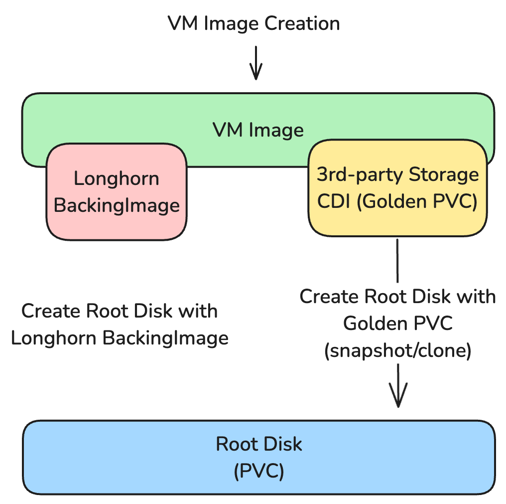
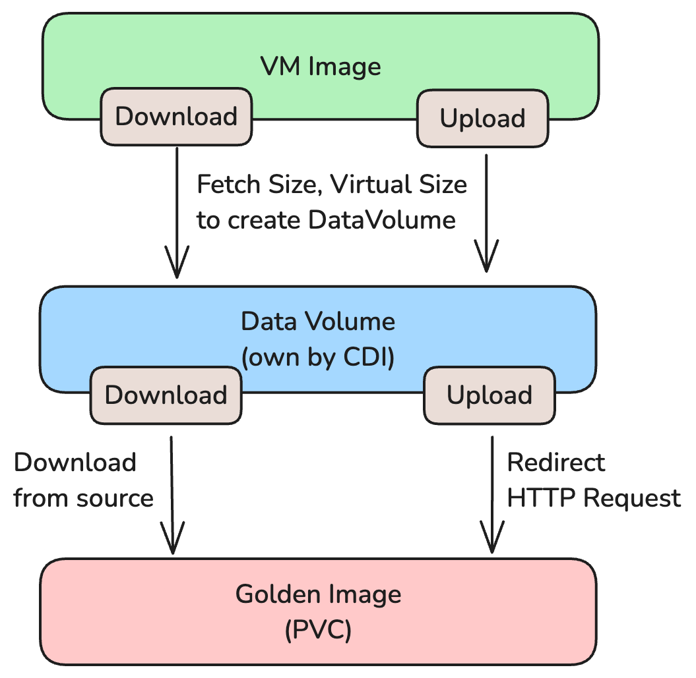
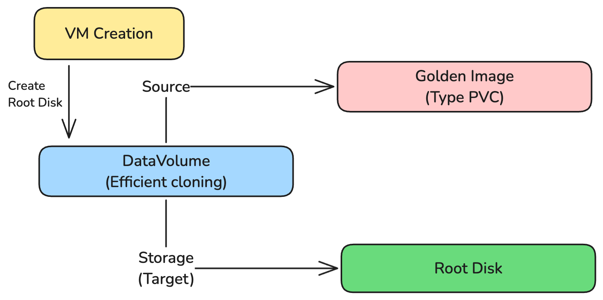

# Third Party Storage Support

Third-party storage support is a feature that allows users to use third-party storage solutions in Harvester for root disks and data disks.

## Summary

This enhancement aims to provide a generic way to leverage third-party storage solutions which already have CSI driver. By introducing Containerized-Data Importer (CDI), Harvester can support third-party storage solutions with the current Virtual Machine Image path for the root and data disks.

### Related Issues

https://github.com/harvester/harvester/issues/1199

## Motivation

### Goals

To provide a generic way to leverage third-party storage solutions with the current Virtual Machine Image path for root and data disks.

### Non-goals [optional]

Virtual Machine Backup and Restore with third-party storage are not in the scope of this enhancement.

## Proposal

We will introduce Containerized-Data Importer (CDI) to abstract the Virtual Machine Image path for generic third-party storage solutions.
The CDI will respond to the VM Image and the root disk with the third-party storage solution.

### User Stories

#### User wants to use LVM for better performance and latency 

Harvester introduces the LVM CSI driver v1.4.0. But the user can now only use it for the data disk. The user wants to use LVM for both the root and data disks.

#### Users already have a storage solution on their data center and wants to use it in Harvester

Most users already have a storage solution in their data center (e.g. Ceph, HPE, NetApp, etc.). They want to use their existing storage solution in Harvester for data and root disks.

### User Experience In Detail

This enhancement will abstract the Virtual Machine Image path generically. So, the user only needs to choose the corresponding StorageClass provided by the third-party storage solution. They can create a VM Image with their storage solution. Then, they can create a VM with the VM Image.

### API changes

#### VirtualMachineImage

We will add the following fields to the *VirtualMachineImage* CRD:

```yaml
spec:
  ...
  // The VM Image will store the data volume in the target storage class.
  TargetStorageClassName: string
  ...
status:
  ...
  // The VM Image will store the data volume in the target storage class.
  TargetStorageClassName: string
  ...
```

## Design

### High-level Architecture



### Implementation Overview

We could split the implementation into the following parts:
- Introduce Containerized Data Importer (CDI) to Harvester
- VM Image Creation through CDI
- Root Disk Creation through CDI

#### Introduce Containerized Data Importer (CDI) to Harvester

To introduce Containerized-Data Importer (CDI) to Harvester, we need to add the charts and the CRDs to Harvester. The CDI will be responsible for the VM Image and the root disk creation with the third-party storage solution. 

#### VM Image Creation through CDI

The VM Image creation design could be like the following:


Because the target PVC (golden image) size should be defined before DataVolume creation, we need to prefetch the size and virtual size.
We have different mechanisms for different source types (download/upload) for size/virtual size prefetching, and progress updates.

For the golden image, we need to add webhook to protect the golden image from being deleted. The golden image should be protected until the VM Image is deleted.

Also, we should not display the golden image on the volume page in the UI.

#### Root Disk Creation through CDI

The VM root disk creation design could be like the following:


The root disk creation is similar to the VM Image creation. Now, with the golden image, we use the golden image as the source (type PVC), and the storage (target) is the root disk configuration. The root disk will be created with the CDI efficient cloning.

One thing we need to take care of is that the root disk created by the CDI should be deleted with the DataVolume. If we only delete the PVC, the CDI will recreate it again with the DataVolume configuration.

#### Storage Profile

The Storage Profile is the concept to abstract the storage configuration for DataVolume creation. The Storage Profile comes from the CDI side. You can refer to the [CDI Storage Profile](https://github.com/kubevirt/containerized-data-importer/blob/main/doc/storageprofile.md) for more details.

The most important fields in the storage profile are the following:
- cloneStrategy: The clone strategy for the DataVolume clone. It depends on the storage solution capability. The CDI supports the following clone strategies:
  - copy - copy blocks of data over the network
  - snapshot - clones the volume by creating a temporary VolumeSnapshot and restoring it to a new PVC
  - csi-clone - clones the volume using a CSI clone
- snapshotClass: The snapshot class is used for the snapshot clone strategy. You should define the correct snapshot class name. For example, Longhorn has two snapshot classes:
  - longhorn - `longhorn` is used for the Longhorn Backup
  - longhorn-snap - `longhorn-snapshot` is used for the Longhorn Snapshot
  
  So, you need to specify the correct snapshot class `longhorn-snap` in the storage profile.

Here is the example of the Storage Profile for the Longhorn:
```yaml
apiVersion: cdi.kubevirt.io/v1beta1
kind: StorageProfile
metadata:
  creationTimestamp: "2025-03-06T09:57:45Z"
  generation: 3
  labels:
    app: containerized-data-importer
    app.kubernetes.io/component: storage
    app.kubernetes.io/managed-by: cdi-controller
    cdi.kubevirt.io: ""
  name: longhorn
  ownerReferences:
  - apiVersion: cdi.kubevirt.io/v1beta1
    blockOwnerDeletion: true
    controller: true
    kind: CDI
    name: cdi
    uid: 95838eee-0333-48ce-9e56-619c5f1f0de7
  resourceVersion: "6094"
  uid: d128d4f0-4a35-4e8b-959d-d0e62b6c8a29
spec:
  snapshotClass: longhorn-snapshot
status:
  claimPropertySets:
  - accessModes:
    - ReadWriteMany
    volumeMode: Block
  - accessModes:
    - ReadWriteOnce
    volumeMode: Block
  cloneStrategy: snapshot
  dataImportCronSourceFormat: pvc
  provisioner: driver.longhorn.io
  snapshotClass: longhorn-snapshot
  storageClass: longhorn
```
The status comes from the definiation of StorageClass/CSI driver. You can define specific values by adding the spec.\<fields\> in the StorageProfile.

### Test plan

#### System Checklist

- Ensure the CDI is installed default in Harvester
  You can check the CDI installation by running the following command:
  ```shell
  $ kubectl get pods -A |grep cdi
  harvester-system                  cdi-apiserver-58bf7b8b74-gccww                           1/1     Running     0             17h
  harvester-system                  cdi-deployment-6cf7d9b445-9lntd                          1/1     Running     0             17h
  harvester-system                  cdi-operator-7b6695c56d-l5lx4                            1/1     Running     0             17h
  harvester-system                  cdi-uploadproxy-68d59ccffb-qdvns                         1/1     Running     0             17h
  ```

- Ensure the fleet did not complain anythin with the new CDI. (Both fresh install and upgrade)
  You can check the fleet status by running the following command:
  ```shell
  $ kubectl get bundle -A |grep harvester
  fleet-local   mcc-harvester                                 1/1
  fleet-local   mcc-harvester-crd                             1/1
  ```

#### Support Matrix

| Storage Solution | VM Image | VM Rook Disk | VM Data Disk | Volume Export To VM Image | VM Template Generator | VM Live Migration | VM Snapshot | VM Backup |
| --- | --- | --- | --- | --- | --- | --- | --- | --- |
| Longhorn v2 Data Engine | &#10004; | &#10004; | &#10004; | &#10004; | &#10004; | &#10004; |&#10006; | &#10006; |
| Rook (RBD) | &#10004; | &#10004; | &#10004; | &#10004; | &#10004; | &#10004; | &#10004; | &#10006; |
| LVM | &#10004; | &#10004; | &#10004; | &#10004; | &#10004; | &#10006; | &#10004; | &#10006; |
| NFS | &#10004; | &#10004; | &#10004; | &#10004; | &#10004; | &#10004; | &#10006; | &#10006; |

**NOTE:** We only need to test the RBD of Rook, not the CephFS.

The general test items are the following. We should test the same items for the different storage solutions mentioned above.

- Prerequisites
  - Set up and create the corresponding StorageClass for the third-party storage solution. You can refer to the [Longhorn V2 Data Engine](https://docs.harvesterhci.io/v1.5/advanced/longhorn-v2/), [LVM](https://docs.harvesterhci.io/v1.5/advanced/addons/lvm-local-storage) or [Rook](https://harvesterhci.io/kb/use_rook_ceph_external_storage).
  - For NFS, you can use this All-In-One solution: [nfs-ganesha-server-and-external-provisioner](https://github.com/kubernetes-sigs/nfs-ganesha-server-and-external-provisioner)

- VM Image
  - Ensure the VM image can be created through download.
    - GoTo Image Page
    - Create Image with URL (Download)
    - Choose the above StorageClass on the `Storage` tab
    - Create and wait for the VM Image to be ready
    - Ensure the corresponding golden image PVC is created with following command:
    ```shell
    // find the golden image name
    $ imageName=$(kubectl get vmimage -n <namespace> |grep <image display name on UI> |awk '{print $1}')
    // check the golden image
    $ kubectl get datavolume -n <namespace> |grep ${imageName}
    $ kubectl get pvc |grep ${imageName}
    ```
    - The above command should return the golden image PVC.
  - Ensure the VM image can be created through upload.
    - GoTo Image Page
    - Create Image with File (Upload)  
    - Choose the above StorageClass on the `Storage` tab
    - Create and wait for the VM Image to be ready
    - Ensure the corresponding golden image PVC is created with following command:
    ```shell
    // find the golden image name
    $ imageName=$(kubectl get vmimage -n <namespace> |grep <image display name on UI> |awk '{print $1}')
    // check the golden image
    $ kubectl get datavolume -n <namespace> |grep ${imageName}
    $ kubectl get pvc |grep ${imageName}
    ```
    - The above command should return the golden image PVC.
  - Ensure the user can download the VM image locally. (means users' local machine/laptop)
    - GoTo Image Page
    - Click the VM Image
    - Click the `Download` button
    - Check the VM Image is downloaded locally
  - Delete the VM Image and ensure the golden image is deleted.
    - GoTo Image Page
    - Click the VM Image
    - Click the `Delete` button
    - Check the golden image is deleted with following command.
    ```shell
    // find the golden image name
    $ imageName=$(kubectl get vmimage -n <namespace> |grep <image display name on UI> |awk '{print $1}')
    // check the golden image
    $ kubectl get datavolume -n <namespace> |grep ${imageName}
    $ kubectl get pvc |grep ${imageName}
    ```
    - The above command should not return any result.

- VM Root Disk
  - Ensure we could boot from the RAW VM Image.
    - Upload the RAW type VM Image
    - GoTo Virtual Machines Page
    - Create VM and choose the above VM Image in the `Volumes` tab
    - Create and wait for the VM to be ready
  - Ensure we could boot from the QCOW2 VM Image.
    - Upload the QCOW2 type VM Image
    - GoTo Virtual Machines Page
    - Create VM and choose the above VM Image in the `Volumes` tab
    - Create and wait for the VM to be ready

- VM Data Disk
  - Ensure the Data Disk can be created with the VM with the host disk path. (Means configure before VM start)
    - GoTo Virtual Machines Page
    - Create VM with any VM Image and Add Volume with above StorageClass for 3rd-party on the `Volumes` tab
    - Create and wait for the VM to be ready
  - Ensure the Data Disk can be hotplugged to the VM. (Means configure after VM start)
    - GoTo Virtual Machines Page
    - Create VM with any VM Image
    - Create and wait for the VM to be ready
    - GoTo Volumes Page
    - Create Volume with above StorageClass for 3rd-party
    - GoTo Virtual Machines Page
    - Click the VM
    - Click `add volume` button and choose the above Volume to attach
    - Check the Volume is attached to the VM

- Volume Export To VM Image
  - Ensure the volume can be exported to VM Image with any 3rd-party storage solution.
    - GoTo Volumes Page
    - Choose any Volume
    - Click the `Export Image` button
    - Choose any `StorageClass` for the 3rd-party storage solution
    - Create and wait for the VM Image to be ready

**NOTE**: The volume should be exported to any 3rd-party storage solution but only the longhorn v1 volume can be exported to longhorn v1 VM Image.

- VM Template Generator
  - Ensure the VM can generate the VM template with various disk configurations. (Like a mix of the Longhorn v1 and LVM)
    - GoTo Virtual Machines Page
    - Click the VM
    - Click the `Generate Template` button and ensure the `With Data` checkbox is checked
    - Create the VM with the above VM template
    - Create and wait for the VM to be ready

- VM Live Migration
  - Ensure the VM can be live migrated with various disk (those disks need support live migration, means RWX volume) configurations. (Like a mix of the Longhorn v1 and Longhorn v2)
    - GoTo Virtual Machines Page
    - Select the VM with `Running` state
    - Click the `Migrate` button
    - Choose the target node
    - Confirm and wait for the VM to be ready

- VM snapshot
  - Ensure the VM can take the snapshot with various disk (those disks need support snapshot) configurations. (Like a mix of the Longhorn v1 and LVM)
    - GoTo Virtual Machines Page
    - Select the VM
    - Click the `Take Virtual Machine Snapshot` button
    - GoTo Backup and Snapshots Page
    - GoTo Virtual Machine Snapshots Page
    - Check the above VM snapshot is Ready
  - Ensure the above VM snapshot can be restored to the existing VM
    - GoTo Backup and Snapshots Page
    - GoTo Virtual Machine Snapshots Page
    - Select the above VM snapshot
    - Click the `Replace Existing` button
    - Create and wait for the VM to be ready
  - Ensure the above VM snapshot can be restored to the New VM
    - GoTo Backup and Snapshots Page
    - GoTo Virtual Machine Snapshots Page
    - Select the above VM snapshot
    - Click the `Restore New` button
    - Create and wait for the VM to be ready

- VM Backup
  - We did not support the VM backup with any third-party storage solution. So, ensure this action item does not appear in the UI.

- Harvester Upgrade
  - Ensure the upgrade work with the VM running with the 3rd-party storage solution.
    - Create v1.5.0 cluster
    - Create the VM with the 3rd-party storage solution
    - Try to manually upgrade the Harvester. We upgrade to the same version manually to verify.
    - Ensure the upgrade could complete without any issue.

### Upgrade strategy

This enhancement will add extra fields to the current VirtualMachineImage CRD. So, the upgrade needs to handle these new fields.

## Note [optional]

The first validation targets are Longhorn v2 Data Engine, Rook (RBD), LVM, and NFS.
We will need partners to validate this feature with their storage solutions.
