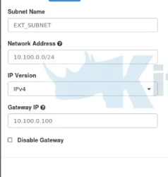
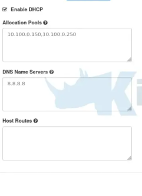

# Enable Overlay Network with Kube-OVN

## Summary
In real product environments, the need for overlay networks is crucial for scalability and multi-tenancy in cloud-native deployments. Harvester does not support overlay networking. We will enhance the Harvester network by integrating Kube-OVN to enable efficient network segmentation and improved traffic management across different network segments.

### Related Issues

- https://github.com/harvester/harvester/issues/2260
- https://github.com/harvester/harvester/issues/2322
- https://github.com/harvester/harvester/issues/7657

## Terminology
| Term                        | Short Term               | Description                                                  |
| --------------------------- | ------------------------ | ------------------------------------------------------------ |
| Virtual Network Identifier  | VNI                      | A 24-bit number used to segment different VxLAN networks. |
| VM Group                    | -                        | A group of VM provisioned by Harvester Cluster, those VMs can communicate with each other by default. Different VM Groups are isolated. |
| Virtural Private Cloud      | VPC                      | VPC is a logical network entity which defines and manages multiple subnets within a single network namespace, to organize and isolate network resources. |
| Subnet                      |                          | A specific IP address range within a VPC, which has various configurations such as CIDR blocks, gateways, and IP allocation policies. |
| Traffic Policy              | -                        | A set of rules that define how traffic is allowed to flow between different network entities, such as VMs and external networks. |
| Border Gateway Protocol     | BGP              | An autonomous system routing protocol designed to exchange routing and reachability information between different networks. |
| BGP Extended for EVPN       | BGP EVPN             | A set of extended community attributes used with BGP to support the distribution of Ethernet VPN (EVPN) information, such as MAC addresses and VNIs, across a network. |

## Motivation

### Goals

- Integrate Kube-OVN support to allow the creation of overlay networks.
  - Support each Subnet is used for one VM Group
  - Support for the creation of multiple isolated virtual private clouds (VPCs) within the Harvester Cluster, each with its own subnet configuration and network policies.
  - Support VM live migration and persistent IP address, VM can freely migrate/move in the Harvester Cluster without change of IP address
  - Support VM Group use VIP to communicate with outside
  - Support multiple network encapsulation protocols including Geneve and VXLAN
- Enable seamless communication between VMs across different Nodes in the Cluster Network while maintaining network isolation
- Enable efficient network segmentation and traffic management across different network segments.
- Provide enhanced networking capabilities such as VLAN support, distributed gateway, NAT translation, and network policies for fine-grained traffic control.

### Non-goals [optional]

- Integrate with kube-vip to provide load balancer service for VMs based on overlay network.
- Allow provisioning guest k8s cluster and manage the cluster with Rancher through the overlay network.

## Proposal
.

### User Stories

In Harvester, we assume the following:

 - The user provides physical network connectivity to make sure echo Node are reachable to each other
 - Multi networks may exist.
 - The management network is always existing.

A detailed explanation of Harvester networking is in the Harvester network samples.

A user plans to deploy a Harvester cluster and assumes:

 - Users are allowed to add a custom cluster network and add overlay network under it.
 - Users should select cluster network when creating a overlay network.
 - User configures multiple overlay networks using VPC and Subnet on the selected cluster network
 - User has multiple nodes, each with multiple NICs.
 - User requires strict traffic policies to be enforced between VMs and with external networks to ensure security and compliance.

#### Story 1

Tunnel establishment

Kube-OVN supports multiple tunneling protocols including Geneve, VXLAN. Geneve is the default protocol due to its flexibility and support for additional metadata. The tunnel establishment process is automated by OVN's control plane. When nodes join the cluster, they automatically establish tunnels to other nodes using the specified protocol.

Traffic between nodes is encapsulated using the selected protocol (Geneve or VXLAN) and transmitted over these tunnels. Users may have options to specify Geneve or VxLAN to build up the overlay network.

#### Story 2

Adding Virtual Network

To add a virtual network with Kube-OVN, we need to define a VPC, Subnet, and NetworkAttachmentDefinition. VPC represents an isolated network environment. Subnet defines a specific IP address range within a VPC. NADs should be created with type "kube-ovn". Kube-OVN supports both static routes and policy-based routes for flexible traffic management.
Thus, users can specify the name, IP range, and gateway for the newly created Virtual Netowork. In addition, the DHCP can be enabled or disabled and the custom route can be configured. The corresponding Subnet, VPC, NAD should be created.




```YAML
kind: Vpc
apiVersion: kubeovn.io/v1
metadata:
  name: test-vpc-1
spec:
  staticRoutes:
    - cidr: 0.0.0.0/0
      nextHopIP: 10.0.1.254
      policy: policyDst
    - cidr: 172.31.0.0/24
      nextHopIP: 10.0.1.253
      policy: policySrc
```

```YAML
kind: Subnet
apiVersion: kubeovn.io/v1
metadata:
  name: net1
spec:
  vpc: test-vpc-1
  cidrBlock: 10.0.0.0/16
```

#### Story 3

Adding VM into a Virtual Network

Creation of Virtual Machines can be done in the usual way selecting the NADs created using type kube-ovn. Controller should take care of adding routes in VMs for subnets used by VMs connected to the same VPC.
Create a NAD that references the subnet you created. This allows the VM to attach to the network. And specify the network attachment using the NAD you created when creating the VM.

```YAML
apiVersion: k8s.cni.cncf.io/v1
kind: NetworkAttachmentDefinition
metadata:
  name: my-virtual-network
  namespace: my-namespace
spec:
  config: '{
    "cniVersion": "0.3.1",
    "type": "kube-ovn",
    "ipam": {
      "type": "kube-ovn",
      "subnet": "my-subnet"
    }
  }'
```

```YAML
apiVersion: kubevirt.io/v1
kind: VirtualMachine
metadata:
  name: my-vm
  namespace: my-namespace
  annotations:
    k8s.v1.cni.cncf.io/networks: my-virtual-network
spec:
```


#### Story 4

VM-VM communication inside a VM Group (VPC)

By default, subnets within the same VPC can communicate with each other. Kube-OVN configures routing to allow communication between subnets within the same VPC.

Network Isolation: If you need isolation, set private: true in the subnet spec and use allowSubnets to define allowed communication.
Routing: Ensure proper routing is configured within your VPC to allow traffic between subnets.
ACLs: Use Subnet ACLs for fine-grained traffic control.


#### Story 5

VM-VM communication in different VM Group (different VPC)

To enable VM-VM communication between different VPCs in Kube-OVN, the VPC peering should be configured accordingly. VPC peering allows workloads within two VPCs to access each other through private addresses as if they were on the same private network, without the need for NAT forwarding through a gateway.

```YAML
kind: Vpc
apiVersion: kubeovn.io/v1
metadata:
  name: vpc-1
spec:
  vpcPeerings:
  - remoteVpc: vpc-2
    localConnectIP: 169.254.0.1/30
  staticRoutes:
  - cidr: 172.31.0.0/16
    nextHopIP: 169.254.0.2
    policy: policyDst
---
kind: Vpc
apiVersion: kubeovn.io/v1
metadata:
  name: vpc-2
spec:
  vpcPeerings:
  - remoteVpc: vpc-1
    localConnectIP: 169.254.0.2/30
  staticRoutes:
  - cidr: 10.0.0.0/16
    nextHopIP: 169.254.0.1
    policy: policyDst

```


#### Story 6

VM-internet communication

 - Refer to https://kubeovn.github.io/docs/v1.12.x/guide/vpc/
 - By default, Kube-OVN VPCs are isolated and do not have Internet access. Enable the External Connectivity on the VPC
```YAML
apiVersion: kubeovn.io/v1
kind: Vpc
metadata:
  name: my-vpc
spec:
  namespace: kube-system
  enableExternal: true  # Allow external connectivity
```
   - Configure an External EIP (Elastic IP) or SNAT for the VPC, fixed public IP (VIP) for outbound traffic, configure an EIP and assign the EIP to the Subnet


   - Ensure the Subnet supports external access
```YAML
apiVersion: kubeovn.io/v1
kind: Subnet
metadata:
  name: my-subnet
  annotations:
    kube-ovn.kubernetes.io/nat-gw: "external" # Enable SNAT for external Internet access
spec:
  vpc: my-vpc
  cidrBlock: 192.168.1.0/24
  gateway: 192.168.1.1
  allowSubnets: "0.0.0.0/0"  # Allow all outbound traffic
  default: false
```
   - Set up a default gateway for the VM, and ensure that the VM has a default route pointing to the subnet gateway.

#### Story 7

Overlay Network (VXLAN/Geneve tunnels) integration with Underlay Network (physical VLAN)
 - Hybrid Mode – Allows certain subnets to be mapped directly to VLANs, so some Pods can use the physical network directly.
 - External Gateway – Uses a gateway node to enable communication between overlay networks and VLANs.

#### Story 8

Support BGP unnumbered with IP unnumbered

Kube-OVN is a Kubernetes-native networking solution that supports various network plugins, including VxLAN EVPN. We may need to install `kube-ovn-speaker` to publish routing information.

#### Story 9

Network policy/Security group/

 - Subnet-Level Network Policies
   - For more granular control over network traffic between different subnets within the same VPC, Subnet ACLs (Access Control Lists) allow you to define rules that govern traffic flow between subnets.
 - VPC-Level Network Policies
   - For broader network policies that affect entire VPCs, MultiNetworkPolicy allows you to define policies that control traffic between different VPCs or between different namespaces within the same VPC.
