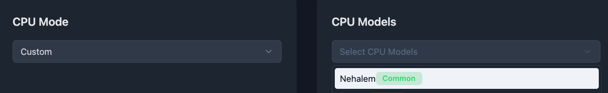
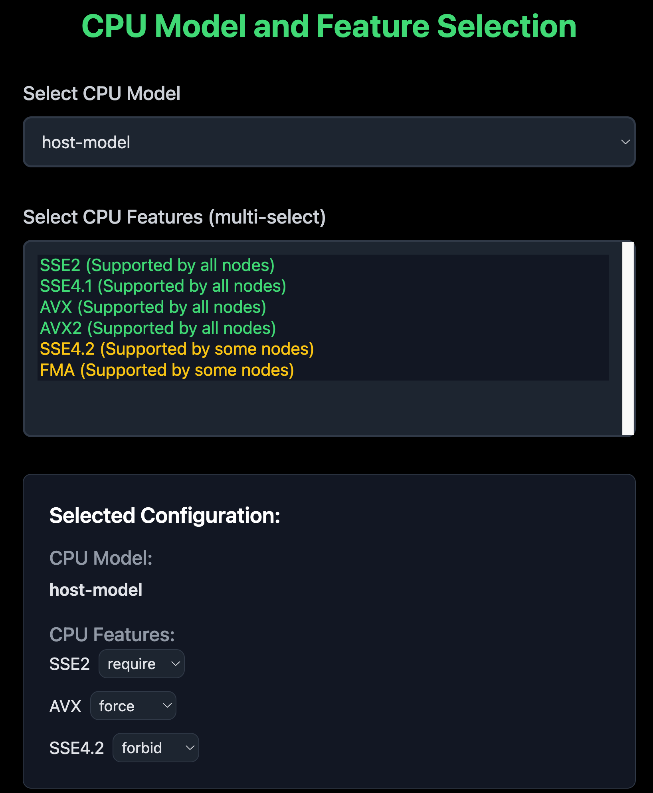

# Selection for CPU models and features for VMs


## Summary

Harvester doesn't provide the options for selecting CPU models and features for VMs. This enhancement is to provide a way to select CPU models and features for VMs.

### Related Issues

https://github.com/harvester/harvester/issues/3015

## Motivation

### Goals

- Support per-VM ang global CPU model/features selections.
- Propagate the scheduling error on GUI.

### Non-goals

- Change the underlying KubeVirt CPU model or migration logic.
- Force migration. It should be done [by upstream](https://github.com/kubevirt/kubevirt/issues/15623).

## Introduction

Before this enhancement, we need to understand how the CPU model and features work in KubeVirt. To make the CPU model and migration logic even easier to grasp, let's use a visual analogy with colored shapes:

Imagine you have colored shapes representing CPU configurations:

- Shapes: Represent CPU models (e.g., Circle, Square, Triangle).
- Colors: Represent CPU features (e.g., Red, Blue, Green).

Here's how they interact:

- Scenario 1: Person requiring a specific color  
    A person requires an object with a specific color (e.g., Red).  
    You can give the person any shape that is red (e.g., a Red Square, a Red Circle, or a Red-Blue Circle).
    However, red color might be only provided with a specific shape. It also means that a feature might be only provided with a specific CPU model.


- Scenario 2: Person requiring a specific shape  
  A person requires an object with a specific shape (e.g., Circle).  
  You can give the person any circle, regardless of its color (e.g., a Red Circle, a Blue Circle, or a Red-Blue Circle).

- Scenario 3: Person requiring a specific color and shape  
  A person requires an object with a specific color and shape (e.g., Red Circle).  
  You must give the person an object that matches the color and shape (e.g., a Red Circle or a Red-Blue Circle).

- Scenario 4: Person requiring a moving to a new location  
  A person requires an object with a specific color and shape (e.g., Red Circle) and is moving to a new location.  
  The new location must provide an object that matches the color and shape (e.g., a Red Circle or a Red-Blue Circle).

A node can provide objects with different shapes and colors. For example, a Node might provide a "Red Square", a "Blue Circle", and a "Red-Blue Circle". 

A VM is like a person who requires different objects. 

Migration is like moving a person with colored shape requirements to a new location that can fulfill those requirements. The destination must provide objects that meet the person's color and shape needs.

You can treat shapes as `cpu-model.node.kubevirt.io/{cpu model}` and colors as `cpu-feature.node.kubevirt.io/{cpu feature}`. For more details, please check the Node section of this enhancement.

## Proposal

Due to multiple nodes, we can't show a big matrix for all the CPU models and features. Instead, we'll provide a dropdown selection menu with colored mark.

### User Stories

#### Story 1

I have multiple nodes that have a common CPU model called `Nehalem`. For some reason, I'll need to migrate my VMs to other nodes without manually shutting down. To ensure compatibility, I create my VMs with `Nehalem` as the CPU model.

### User Experience In Detail

In general, there are two ways to migrate VMs between nodes.

- Use a common CPU model
- Use a Harvester special defined annotation

Before users use the feature, we need to ensure they know what the difference is between these two ways.

- If they know later joined nodes still have common CPU models, they can select a common CPU model for further migration.

In either case, we need to add a ["learn more for migration"](https://docs.harvesterhci.io/v1.5/vm/live-migration/#how-migration-works) link when users try to customize the CPU model and feature.

### API changes

No.

## Design

The CPU models are like this:

- Node-1 cpuModel: IvyBridge, Penryn
- Node-2 cpuModel: IvyBridge, Westmere
- Node-3 cpuModel: IvyBridge, SandyBridge
- Node-4 cpuModel: IvyBridge, Westmere

We'll only show the common one. These are just examples. The real one will match our Harvester GUI style.






### Implementation Overview

#### Frontend

We'll have two ways to configure this.

- Per-VM CPU model/features while creating the VM
- Global VM CPU model/features in settings

Frontend needs to create a new tab in the VM creation page and provide a dropdown selection menu for models and an input box for features. This selection is also available in the VM template page and global settings. Then, calculate the common CPU models across all nodes. 

- If users select the common one, we'll show the option with green mark.

The data of CPU models are from node's labels:

- The model is from `cpu-feature.node.kubevirt.io/{model}` of node's labels. 

This is node's labels example:

```yaml
kind: Node
metadata:
  name: my-node-1
  labels:
    host-model-cpu.node.kubevirt.io/Common-CPU: "true"
    cpu-model.node.kubevirt.io/Intel-A: "true"
    cpu-model.node.kubevirt.io/Common-CPU: "true"
    cpu-model-migration.node.kubevirt.io/Intel-A: "true"
    cpu-model-migration.node.kubevirt.io/Common-CPU: "true"
    cpu-feature.node.kubevirt.io/avx2: "true"
    cpu-feature.node.kubevirt.io/sse4_2: "true"
```

The VM spec is:

```yaml
kind: VirtualMachine
name: my-vm-2
spec:
  template:
    spec:
      domain:
      cpu:
        model: Intel-A
        features:
        - name: avx2
          policy: require
```

- `cpu.model` is optional. If omitted, the default value is `host-model`.
- `cpu.features` is optional.
  - If `cpu.features` is provided, each item in the array must include a `cpu.features[].name` field. 
  - `cpu.features[].policy` is optional. if omitted, the default value is `require`.  
    Valid values are: `force`, `require`, `optional`, `disable`, `forbid`.

Since VM spec in `virtualmachinetemplateversion` is same, please use same logic to fill the model and features.


Action Items:

- [ ] Create a new tab in the VM creation page.
- [ ] Create a new tab in the VM template page.
- [ ] Provide a dropdown selection menu for models and an input box for features.
- [ ] Calculate the common CPU models across all nodes.
- [ ] Propagate the scheduling error on GUI.

#### Backend

Backend should reject the unreasonable request from frontend. When users try to migrate a VM, the `findMigratableNodes` action should return available nodes that matched the selected CPU model and features to avoid scheduling failure.

Action Items:

- [ ] Validate if the selected CPU model and features exist in nodes or not.
- [ ] Filter the nodes based on the selected CPU model and features when calling `findMigratableNodesByVMI`.
- [ ] Write documentation on different usage of the policy field in the VM spec.
- [ ] Write documentation on how to configure cluster-wide CPU model in KubeVirt.

### Test plan

- Case 1: Select the common CPU model
- Case 2: Input a feature
  - Case 2A: With `require` policy
  - Case 2B: With `forbid` policy
  - Case 2C: With `disable` policy

After selecting the CPU model and inputting features, try to migrate the VM to another node.

### Upgrade strategy

The current VM uses the default CPU model (host-model). If users would like to change the CPU model, they need to restart the VM.

## Note

### Real World Example of CPU Model and Feature

In order to have a better understanding of how the CPU model and features work in KubeVirt, I'll provide some real spec examples.

Let's say we have a Node with the following CPU models and features:

```yaml
kind: Node
metadata:
  name: my-node-1
  labels:
    host-model-cpu.node.kubevirt.io/Common-CPU: "true"
    cpu-model.node.kubevirt.io/Intel-A: "true"
    cpu-model.node.kubevirt.io/Common-CPU: "true"
    cpu-model-migration.node.kubevirt.io/Intel-A: "true"
    cpu-model-migration.node.kubevirt.io/Common-CPU: "true"
    cpu-feature.node.kubevirt.io/avx2: "true"
    cpu-feature.node.kubevirt.io/sse4_2: "true"
```

- Scenario 1: VM with default model

    A VM spec requires the following CPU models and features:

    ```yaml
    kind: VirtualMachine
    metadata:
      name: my-vm-1
    spec:
      template:
        spec:
          domain:
            cpu:
              model: host-model # Default. You could ignore this line as well.
    ```
    
    The Pod spec will be like this after first migration:
    
    ```yaml
    kind: Pod
    metadata:
    name: my-vm-1-pod
    spec:
    nodeSelector:
        cpu-model-migration.node.kubevirt.io/Common-CPU: "true"
        cpu-feature.node.kubevirt.io/avx2: "true"
        cpu-feature.node.kubevirt.io/sse4_2: "true"
    ```
    
    BTW, this one is before the migration:

    ```yaml
    kind: Pod
    metadata:
    name: my-vm-1-pod
    spec:
    nodeSelector:
        # yes, there are no any selectors here
    ```

- Scenario 2: VM with specific model

    ```yaml
    kind: VirtualMachine
    name: my-vm-2
    spec:
      template:
        spec:
          domain:
          cpu:
            model: Common-CPU
    ```
    
    The Pod spec will be like this:
    
    ```yaml
    kind: Pod
    metadata:
    name: my-vm-2-pod
    spec:
        nodeSelector:
          cpu-model.node.kubevirt.io/Common-CPU: "true"
    ```

- Scenario 3: VM with specific feature

    ```yaml
    kind: VirtualMachine
    name: my-vm-2
    spec:
      template:
        spec:
          domain:
          cpu:
            features:
            - name: avx2
              policy: require
    ```

  The Pod spec will be like this:

    ```yaml
    kind: Pod
    metadata:
    name: my-vm-2-pod
    spec:
        nodeSelector:
          cpu-feature.node.kubevirt.io/avx2: "true"
    ```

- Scenario 4: VM with specific feature and cluster-wide cpu model

    ```yaml
    kind: VirtualMachine
    name: my-vm-2
    spec:
      template:
        spec:
          domain:
          cpu:
            features:
            - name: avx2
              policy: require
    ```

    The KubeVirt config is:

    ```yaml
    kind: KubeVirt
    metadata:
    name: kubevirt
    namespace: kubevirt 
    spec:
      configuration:
        cpuModel: "Common-CPU"
    ```

    The Pod spec will be like this:

    ```yaml
    kind: Pod
    metadata:
    name: my-vm-2-pod
    spec:
      nodeSelector:
        cpu-feature.node.kubevirt.io/avx2: "true"
        cpu-model.node.kubevirt.io/Common-CPU: "true"
    ```

- Scenario 5: VM with specific model, feature and cluster-wide cpu model

    ```yaml
    kind: VirtualMachine
    name: my-vm-2
    spec:
      template:
        spec:
          domain:
          cpu:
            model: Intel-A
            features:
            - name: avx2
              policy: require
    ```

  The KubeVirt config is:

    ```yaml
    kind: KubeVirt
    metadata:
    name: kubevirt
    namespace: kubevirt 
    spec:
      configuration:
        cpuModel: "Common-CPU"
    ```

  The Pod spec will be like this:

    ```yaml
    kind: Pod
    metadata:
    name: my-vm-2-pod
    spec:
      nodeSelector:
        cpu-feature.node.kubevirt.io/avx2: "true"
        cpu-model.node.kubevirt.io/Intel-A: "true" # It's overridden by the VM spec
    ```