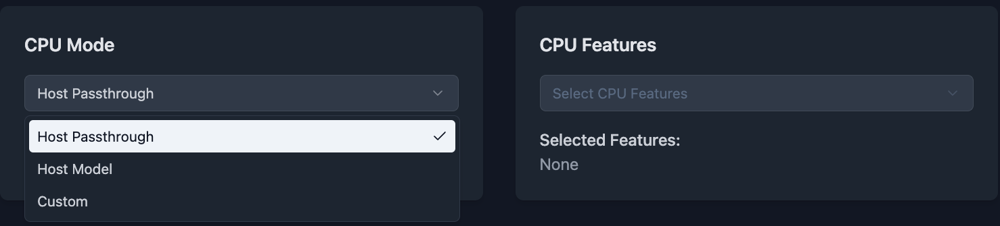

# Selection for CPU models and features for VMs


## Summary

Harvester doesn't provide the options for selecting CPU models and features for VMs. This enhancement is to provide a way to select CPU models and features for VMs.

### Related Issues

https://github.com/harvester/harvester/issues/3015

## Motivation

### Goals

- Provide a way to select a specific CPU model each VM.
- Provide a way to select specific CPU features each VM.
- Provide a documentation on how to configure cluster-wide CPU model.
- Provide a VM template with CPU model and features to reduce the creation time.

### Non-goals

- Change the underlying KubeVirt CPU model or migration logic.
- Provide a generic CPU model for all nodes.


## Introduction

Before this enhancement, we need to understand how the cpu model and feature works in KubeVirt. To make the CPU model and migration logic even easier to grasp, let's use a visual analogy with colored shapes:

Imagine you have colored shapes representing CPU configurations:

- Shapes: Represent CPU models (e.g., Circle, Square, Triangle).
- Colors: Represent CPU features (e.g., Red, Blue, Green).

Here's how they interact:

- Scenario 1: Person requiring a specific color  
    A person requires an object with a specific color (e.g., Red).  
    You can give the person any shape that is red (e.g., a Red Square, a Red Circle, or a Red-Blue Circle).

- Scenario 2: Person requiring a specific shape  
  A person requires an object with a specific shape (e.g., Circle).  
  You can give the person any circle, regardless of its color (e.g., a Red Circle, a Blue Circle, or a Red-Blue Circle).

- Scenario 3: Person requiring a specific color and shape  
  A person requires an object with a specific color and shape (e.g., Red Circle).  
  You must give the person an object that matches the color and shape (e.g., a Red Circle or a Red-Blue Circle).

- Scenario 4: Person requiring a moving to a new location  
  A person requires an object with a specific color and shape (e.g., Red Circle) and is moving to a new location.  
  The new location must provide an object that matches the color and shape (e.g., a Red Circle or a Red-Blue Circle).

A Node can provide objects with different shapes and colors. For example, a Node might provide a "Red Square", a "Blue Circle", and a "Red-Blue Circle". 

A VM is like the person requires different objects. 

Migration is like moving a person with colored shape requirements to a new location that can fulfill those requirements. The destination must provide objects that meet the person's color and shape needs.

You can treat shapes as `cpu-model.node.kubevirt.io/{cpu model}` and colors as `cpu-feature.node.kubevirt.io/{cpu feature}`. For more detailed please check the Node section on this enhancement.

## Proposal

Due to multiple nodes, we can't show a big matrix for all the CPU models and features. Instead, we'll provide a dropdown selection menu with colored mark.

### User Stories

#### Story 1

I have multiple nodes that have a common CPU model called `Nehalem`. For some reason, I'll need to migrate mv VMs to other nodes without manually shutting down. To ensure compatibility, I create my MVs with `Nehalem` as the CPU model.

#### Story 2

Due to specific requirements, my VMs need to support the `avx` CPU feature. I configure the CPU feature `avx` with the `require` policy. As a result, my VMs will only be scheduled to nodes that support the `avx` CPU feature.


#### Story 3

For certain reasons, I don’t want my VMs to have the `avx` CPU feature. Therefore, I configure the CPU feature `avx` with the `forbid` policy. This ensures that my VMs will not be scheduled to nodes that support the avx CPU feature.


### User Experience In Detail

Users need to understand their requirements and strategy of using virtual machine.

- Do they need a specfic cpu model for VMs?
- Do they need a specific cpu feature for VMs?
- Do they need to migrate VM to different cluster without manually shutting down? They need to understand [how live migration works](https://docs.harvesterhci.io/v1.4/vm/live-migration/#how-migration-works).

### API changes

No.

## Design

The CPU models and featres are like this:

- Node-1 cpuModel: Nehalem, Penryn, cpuFeatures: avx
- Node-2 cpuModel: Nehalem, Westmere, cpuFeatures: avx, avx2
- Node-3 cpuModel: Nehalem, SandyBridge, cpuFeatures: avx, bmi2
- Node-4 cpuModel: Nehalem, Westmere, cpuFeatures: avx, clwb

We'll make the common one with green color and uncommon one with yellow color. When selecting the CPU features, we also provide a policy field.


If users select the uncommon one, we'll show the warning message.


Besides custom model, we should also provide [`host-passthrough`](https://kubevirt.io/user-guide/compute/virtual_hardware/#cpu-model-special-cases).




> These are just examples. The real one will match our Harvester GUI style.

### Implementation Overview

#### Frontend

Frontend needs to create a new tab in VM creation page and provide a dropdown selection menu for selecting models and features. This selection is also available in the VM template page. Then, calculate the common and uncommon CPU models and features across all nodes. 

- If users select the common one, we'll show the option with green mark.
- If users select the uncommon one, we'll show the option with yellow mark and a warning message.

The data of CPU models and features are from node's labels:

- The model is from `cpu-feature.node.kubevirt.io/{model}` of node's labels. 
- The feature is from `cpu-feature.node.kubevirt.io/{feature}` of node's labels.

This is node's labels example:

```yaml
kind: Node
metadata:
  name: my-node-1
  labels:
    host-model-cpu.node.kubevirt.io/Common-CPU: "true"
    cpu-model.node.kubevirt.io/Intel-A: "true"
    cpu-model.node.kubevirt.io/Common-CPU: "true"
    cpu-model-migration.node.kubevirt.io/Intel-A: "true"
    cpu-model-migration.node.kubevirt.io/Common-CPU: "true"
    cpu-feature.node.kubevirt.io/avx2: "true"
    cpu-feature.node.kubevirt.io/sse4_2: "true"
```

The VM spec is:

```yaml
kind: VirtualMachine
name: my-vm-2
spec:
  template:
    spec:
      domain:
      cpu:
        model: Intel-A
        features:
        - name: avx2
          policy: require
```

- `cpu.model` is optional. If omitted, the default value is `host-model`.
- `cpu.features` is optional.
  - If `cpu.features` is provided, each item in the array must include a `cpu.features[].name` field. 
  - `cpu.features[].policy` is optional. if omitted, the default value is `require`.  
    Valid values are: `force`, `require`, `optional`, `disable`, `forbid`.

Since VM spec in `virtualmachinetemplateversion` is same, please use same logic to fill the model and features.


Action Items:

- [ ] Create a new tab in VM creation page.
- [ ] Create a new tab in VM template page.
- [ ] Provide a dropdown selection menu for selecting models and features.
- [ ] Calculate common and uncommon the CPU models and features across all nodes.

#### Backend

Backend should reject the unreasonable request from frontend. When users try to migrate a VM, the `findMigratableNodes` action should return available nodes that matched the selected CPU model and features to avoid scheduling failure.

Action Items:

- [ ] Validate if the selected CPU model and features exist in nodes or not.
- [ ] Filter the nodes based on the selected CPU model and features when calling `findMigratableNodesByVMI`.
- [ ] Write a documentation on different usage of policy field in the VM spec.
- [ ] Write a documentation on how to configure cluster-wide CPU model in KubeVirt.

### Test plan

- Case 1: Select the common CPU model
- Case 2: Select the common CPU feature
  - Case 2A: With `require` policy
  - Case 2B: With `forbid` policy
  - Case 2C: With `disable` policy
- Case 3: Select the common CPU model and feature
- Case 4: Select the uncommon CPU model
- Case 5: Select the uncommon CPU feature
- Case 6: Select the uncommon CPU model and feature

After selecting the CPU model and feature, try to migrate the VM to another node.

In case 4, 5 and 6, try to migrate the VM to unmatched node and check the result. It should be failed.


### Upgrade strategy

Current VM uses the default cpu model (host-model). If users would like to change the cpu model, they need to restart the VM.

## Note

### Real World Example of CPU Model and Feature

In order to have a better understanding how the CPU model and feature works in KubeVirt, I'll provide some real spec examples.

Let's say we have a Node with the following CPU models and features:

```yaml
kind: Node
metadata:
  name: my-node-1
  labels:
    host-model-cpu.node.kubevirt.io/Common-CPU: "true"
    cpu-model.node.kubevirt.io/Intel-A: "true"
    cpu-model.node.kubevirt.io/Common-CPU: "true"
    cpu-model-migration.node.kubevirt.io/Intel-A: "true"
    cpu-model-migration.node.kubevirt.io/Common-CPU: "true"
    cpu-feature.node.kubevirt.io/avx2: "true"
    cpu-feature.node.kubevirt.io/sse4_2: "true"
```

- Scenario 1: VM with default model

    A VM spec requires the following CPU models and features:

    ```yaml
    kind: VirtualMachine
    metadata:
      name: my-vm-1
    spec:
      template:
        spec:
          domain:
            cpu:
              model: host-model # Default. You could ignore this line as well.
    ```
    
    The Pod spec will be like this after first migration:
    
    ```yaml
    kind: Pod
    metadata:
    name: my-vm-1-pod
    spec:
    nodeSelector:
        cpu-model-migration.node.kubevirt.io/Common-CPU: "true"
        cpu-feature.node.kubevirt.io/avx2: "true"
        cpu-feature.node.kubevirt.io/sse4_2: "true"
    ```
    
    BTW, this one is before the migration:

    ```yaml
    kind: Pod
    metadata:
    name: my-vm-1-pod
    spec:
    nodeSelector:
        # yes, there are no any selectors here
    ```

- Scenario 2: VM with specific model

    ```yaml
    kind: VirtualMachine
    name: my-vm-2
    spec:
      template:
        spec:
          domain:
          cpu:
            model: Common-CPU
    ```
    
    The Pod spec will be like this:
    
    ```yaml
    kind: Pod
    metadata:
    name: my-vm-2-pod
    spec:
        nodeSelector:
          cpu-model.node.kubevirt.io/Common-CPU: "true"
    ```

- Scenario 3: VM with specific feature

    ```yaml
    kind: VirtualMachine
    name: my-vm-2
    spec:
      template:
        spec:
          domain:
          cpu:
            features:
            - name: avx2
              policy: require
    ```

  The Pod spec will be like this:

    ```yaml
    kind: Pod
    metadata:
    name: my-vm-2-pod
    spec:
        nodeSelector:
          cpu-feature.node.kubevirt.io/avx2: "true"
    ```

- Scenario 4: VM with specific feature and cluster-wide cpu model

    ```yaml
    kind: VirtualMachine
    name: my-vm-2
    spec:
      template:
        spec:
          domain:
          cpu:
            features:
            - name: avx2
              policy: require
    ```

    The KubeVirt config is:

    ```yaml
    kind: KubeVirt
    metadata:
    name: kubevirt
    namespace: kubevirt 
    spec:
      configuration:
        cpuModel: "Common-CPU"
    ```

    The Pod spec will be like this:

    ```yaml
    kind: Pod
    metadata:
    name: my-vm-2-pod
    spec:
      nodeSelector:
        cpu-feature.node.kubevirt.io/avx2: "true"
        cpu-model.node.kubevirt.io/Common-CPU: "true"
    ```

- Scenario 5: VM with specific model, feature and cluster-wide cpu model

    ```yaml
    kind: VirtualMachine
    name: my-vm-2
    spec:
      template:
        spec:
          domain:
          cpu:
            model: Intel-A
            features:
            - name: avx2
              policy: require
    ```

  The KubeVirt config is:

    ```yaml
    kind: KubeVirt
    metadata:
    name: kubevirt
    namespace: kubevirt 
    spec:
      configuration:
        cpuModel: "Common-CPU"
    ```

  The Pod spec will be like this:

    ```yaml
    kind: Pod
    metadata:
    name: my-vm-2-pod
    spec:
      nodeSelector:
        cpu-feature.node.kubevirt.io/avx2: "true"
        cpu-model.node.kubevirt.io/Intel-A: "true" # It's overridden by the VM spec
    ```