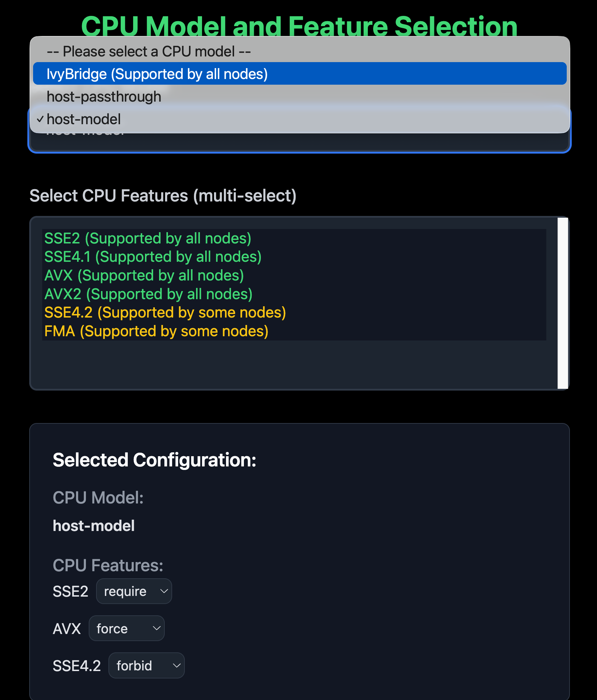

# Selection for CPU models and features for VMs


## Summary

Harvester doesn't provide the options for selecting CPU models and features for VMs. This enhancement is to provide a way to select CPU models and features for VMs.

### Related Issues

https://github.com/harvester/harvester/issues/3015

## Motivation

Primarily, this HEP addresses the limitation of the current default host-model CPU model used by Harvester, where it blocks migrations that are technically legit and possible.

### Goals

- Support per-VM and global CPU model/features selections.
- Propagate the scheduling error on GUI.

### Non-goals

- Change the underlying KubeVirt CPU model or migration logic.
- Force migration. It should be done [by upstream](https://github.com/kubevirt/kubevirt/issues/15623).

## Introduction

Before this enhancement, we need to understand how the CPU model and features work in KubeVirt.

In general, we can use `lscpu` to check CPU model and features in the node.

```
Architecture:                x86_64
  CPU op-mode(s):            32-bit, 64-bit
  Address sizes:             46 bits physical, 48 bits virtual
Vendor ID:                   GenuineIntel
  Model name:                12th Gen Intel(R) Core(TM) i9-12950HX
    Flags:                   fpu vme de pse tsc msr pae ....
```

KubeVirt has a labeler to label the node with above information. Hence, you'll see below information on the node resource.

```yaml
kind: Node
metadata:
  name: my-node-1
  labels:
    host-model-cpu.node.kubevirt.io/SierraForest: "true"
    cpu-model.node.kubevirt.io/IvyBridge: "true"
    cpu-model.node.kubevirt.io/SandyBridge: "true"
    cpu-model-migration.node.kubevirt.io/IvyBridge: "true"
    cpu-model-migration.node.kubevirt.io/SandyBridge: "true"
    cpu-feature.node.kubevirt.io/fpu: "true"
    cpu-feature.node.kubevirt.io/vme: "true"
```

Harvester uses `host-model` as default CPU model. The migration process will be like:

- Start a migration.
- Fill out the nodeSelector in the new POD with
  - A CPU model in `cpu-model-migration.node.kubevirt.io/SierraForest`
  - Some features in `cpu-feature.node.kubevirt.io/xxx`.
- Start the new POD.

That being said, if the CPU Model is from a different generation, the migration might fail with default `host-model`. However, different CPU generations could still have some common CPU models. For example, let's use `IvyBridge` as a common cpu model in different CPU generations. That means if we use `IvyBridge` as the CPU model in the `virtualmachine` spec, this VM can be migrated to another node even though the nodes' CPU generations are different.

## Proposal

Due to multiple nodes, we can't show a big matrix for all the CPU models and features. Instead, we'll provide a new UI that allows users to select or input the CPU model and features.

### User Stories

#### Story 1

I have multiple nodes that have a common CPU model called `Nehalem`. For some reason, I'll need to migrate my VMs to other nodes without manually shutting down. To ensure compatibility, I create my VMs with `Nehalem` as the CPU model.

### User Experience In Detail

If the cluster consists of mainly homogeneous nodes (including new nodes), users can define a universal common CPU model to ensure compatible migrations among the nodes.

### API changes

No.

## Design

The CPU models are like this:

- Node-1 cpuModel: IvyBridge, Penryn
- Node-2 cpuModel: IvyBridge, Westmere
- Node-3 cpuModel: IvyBridge, SandyBridge
- Node-4 cpuModel: IvyBridge, Westmere

We'll only show the common one. These are just examples. The real one will match our Harvester GUI style.




### Implementation Overview

#### Frontend

We'll have two ways to configure this.

- Per-VM CPU model/features while creating the VM
- Global VM CPU model/features in settings

Frontend needs to create a new tab in the VM creation page and provide a dropdown selection menu for models and an input box for features. This selection is also available in the VM template page and global settings. Then, calculate the common CPU models across all nodes. 

- If users select the common one, we'll show the option with a green mark.

The data of CPU models are from node's labels:

- The model is from `cpu-feature.node.kubevirt.io/{model}` of the node's labels. 

This is a node's labels example:

```yaml
kind: Node
metadata:
  name: my-node-1
  labels:
    host-model-cpu.node.kubevirt.io/Common-CPU: "true"
    cpu-model.node.kubevirt.io/Intel-A: "true"
    cpu-model.node.kubevirt.io/Common-CPU: "true"
    cpu-model-migration.node.kubevirt.io/Intel-A: "true"
    cpu-model-migration.node.kubevirt.io/Common-CPU: "true"
    cpu-feature.node.kubevirt.io/avx2: "true"
    cpu-feature.node.kubevirt.io/sse4_2: "true"
```

The VM spec is:

```yaml
kind: VirtualMachine
name: my-vm-2
spec:
  template:
    spec:
      domain:
      cpu:
        model: Intel-A
        features:
        - name: avx2
          policy: require
```

- `cpu.model` is optional. If omitted, the default value is `host-model`.
- `cpu.features` is optional.
  - If `cpu.features` is provided, each item in the array must include a `cpu.features[].name` field. 
  - `cpu.features[].policy` is optional. If omitted, the default value is `require`.  
    Valid values are: `force`, `require`, `optional`, `disable`, `forbid`.

Since VM spec in `virtualmachinetemplateversion` is the same, please use the same logic to fill the model and features.


Action Items:

- [ ] Create a new tab in the VM creation page.
- [ ] Create a new tab in the VM template page.
- [ ] Provide a dropdown selection menu for models and an input box for features.
- [ ] Calculate the common CPU models across all nodes.
- [ ] Propagate the scheduling error on GUI.

#### Backend

Backend should reject unreasonable requests from the frontend. When users try to migrate a VM, the `findMigratableNodes` action should return available nodes that match the selected CPU model and features to avoid scheduling failure.

Action Items:

- [ ] Validate if the selected CPU model and features exist in nodes or not.
- [ ] Filter the nodes based on the selected CPU model and features when calling `findMigratableNodesByVMI`.
- [ ] Write documentation on different usage of the policy field in the VM spec.
- [ ] Write documentation on how to configure cluster-wide CPU model in KubeVirt.

### Test plan

- Case 1: Select the common CPU model
- Case 2: Input a feature
  - Case 2A: With `require` policy
  - Case 2B: With `forbid` policy
  - Case 2C: With `disable` policy

After selecting the CPU model and inputting features, try to migrate the VM to another node.

### Upgrade strategy

The current VM uses the default CPU model (host-model). If users would like to change the CPU model, they need to restart the VM.

## Note

### Real World Example of CPU Model and Feature

In order to have a better understanding of how the CPU model and features work in KubeVirt, I'll provide some real spec examples.

Let's say we have a Node with the following CPU models and features:

```yaml
kind: Node
metadata:
  name: my-node-1
  labels:
    host-model-cpu.node.kubevirt.io/Common-CPU: "true"
    cpu-model.node.kubevirt.io/Intel-A: "true"
    cpu-model.node.kubevirt.io/Common-CPU: "true"
    cpu-model-migration.node.kubevirt.io/Intel-A: "true"
    cpu-model-migration.node.kubevirt.io/Common-CPU: "true"
    cpu-feature.node.kubevirt.io/avx2: "true"
    cpu-feature.node.kubevirt.io/sse4_2: "true"
```

- Scenario 1: VM with default model

    A VM spec requires the following CPU models and features:

    ```yaml
    kind: VirtualMachine
    metadata:
      name: my-vm-1
    spec:
      template:
        spec:
          domain:
            cpu:
              model: host-model # Default. You could ignore this line as well.
    ```
    
    The Pod spec will be like this after first migration:
    
    ```yaml
    kind: Pod
    metadata:
    name: my-vm-1-pod
    spec:
    nodeSelector:
        cpu-model-migration.node.kubevirt.io/Common-CPU: "true"
        cpu-feature.node.kubevirt.io/avx2: "true"
        cpu-feature.node.kubevirt.io/sse4_2: "true"
    ```
    
    BTW, this one is before the migration:

    ```yaml
    kind: Pod
    metadata:
    name: my-vm-1-pod
    spec:
    nodeSelector:
        # yes, there are no any selectors here
    ```

- Scenario 2: VM with specific model

    ```yaml
    kind: VirtualMachine
    name: my-vm-2
    spec:
      template:
        spec:
          domain:
          cpu:
            model: Common-CPU
    ```
    
    The Pod spec will be like this:
    
    ```yaml
    kind: Pod
    metadata:
    name: my-vm-2-pod
    spec:
        nodeSelector:
          cpu-model.node.kubevirt.io/Common-CPU: "true"
    ```

- Scenario 3: VM with specific feature

    ```yaml
    kind: VirtualMachine
    name: my-vm-2
    spec:
      template:
        spec:
          domain:
          cpu:
            features:
            - name: avx2
              policy: require
    ```

  The Pod spec will be like this:

    ```yaml
    kind: Pod
    metadata:
    name: my-vm-2-pod
    spec:
        nodeSelector:
          cpu-feature.node.kubevirt.io/avx2: "true"
    ```

- Scenario 4: VM with specific feature and cluster-wide cpu model

    ```yaml
    kind: VirtualMachine
    name: my-vm-2
    spec:
      template:
        spec:
          domain:
          cpu:
            features:
            - name: avx2
              policy: require
    ```

    The KubeVirt config is:

    ```yaml
    kind: KubeVirt
    metadata:
    name: kubevirt
    namespace: kubevirt 
    spec:
      configuration:
        cpuModel: "Common-CPU"
    ```

    The Pod spec will be like this:

    ```yaml
    kind: Pod
    metadata:
    name: my-vm-2-pod
    spec:
      nodeSelector:
        cpu-feature.node.kubevirt.io/avx2: "true"
        cpu-model.node.kubevirt.io/Common-CPU: "true"
    ```

- Scenario 5: VM with specific model, feature and cluster-wide cpu model

    ```yaml
    kind: VirtualMachine
    name: my-vm-2
    spec:
      template:
        spec:
          domain:
          cpu:
            model: Intel-A
            features:
            - name: avx2
              policy: require
    ```

  The KubeVirt config is:

    ```yaml
    kind: KubeVirt
    metadata:
    name: kubevirt
    namespace: kubevirt 
    spec:
      configuration:
        cpuModel: "Common-CPU"
    ```

  The Pod spec will be like this:

    ```yaml
    kind: Pod
    metadata:
    name: my-vm-2-pod
    spec:
      nodeSelector:
        cpu-feature.node.kubevirt.io/avx2: "true"
        cpu-model.node.kubevirt.io/Intel-A: "true" # It's overridden by the VM spec
    ```