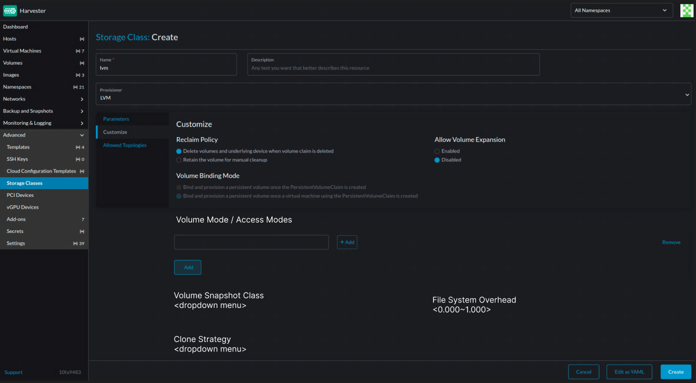

# Expose CDI Settings in Harvester UI

This enhancement proposes exposing five critical CDI settings in the Harvester UI to improve user experience and eliminate the need for direct CRD manipulation.

## Summary

Currently, users must directly modify multiple Custom Resource Definitions (CDI and StorageProfile CRDs) to configure important storage settings in Harvester, creating a complex and error-prone experience. This enhancement proposes exposing five key CDI settings directly in the Harvester UI, making these configurations accessible through a user-friendly interface. The settings include `FileSystemOverhead`, `CloneStrategy`, `VolumeSnapshotClass`, `AccessModes`, and `VolumeMode`, providing a centralized UI interface for storage configuration while automatically managing the underlying CRD updates, improving the user experience for storage administrators and reducing configuration errors.

### Related Issues

https://github.com/harvester/harvester/issues/8077

## Motivation

### Goals

- Expose five CDI settings (FileSystemOverhead, CloneStrategy, VolumeSnapshotClass, AccessModes, VolumeMode) in the Harvester UI
- Eliminate the need for users to directly modify CDI and StorageProfile CRDs
- Provide intuitive UI controls with proper validation
- Maintain consistency between UI configurations and underlying CRDs

## Proposal

### User Stories

#### Story 1: User Configuring Filesystem Overhead

**Before**: User encounters PVC sizing issues due to filesystem overhead and needs to manually edit the CDI CRD using kubectl or the Kubernetes API.

**Why needed**: FileSystemOverhead adjustments are necessary when storage provisioning fails due to incorrect filesystem overhead calculations, as demonstrated in [issue#7993](https://github.com/harvester/harvester/issues/7993).

**After**: The administrator navigates to the Advanced/Storage Classes page in Harvester UI, finds the "Filesystem Overhead" field, enters a value like "0.85", and saves the configuration. The UI automatically updates the CDI CRD.

#### Story 2: User Configuring StorageProfile Settings

**Before**: A storage engineer needs to configure StorageProfile settings like clone strategy, volume snapshot class, access modes, and volume modes but must manually edit StorageProfile CRDs directly.

**Why needed**: StorageProfile settings are essential for proper storage behavior but are currently only accessible through direct CRD manipulation.

**After**: User can directly modify StorageProfile-related settings through the Harvester UI, using intuitive form controls and dropdowns with clear explanations. All changes are automatically applied to the underlying StorageProfile CRDs.

### User Experience In Detail

The CDI settings will be integrated into the existing Storage Classes page in Harvester UI.

### API changes

## Design

### Implementation Overview

#### UI Preview



- Note: These new tab: CDI Settings is not available in the longhorn-v1 StorageClass.
- The new CDI settings can be configured during the creation of a StorageClass or by updating a StorageClass.
- The Volume Mode / Access Modes setting supports multiple combinations, where each combination must have a unique Volume Mode and one or more associated Access Modes.
  - The volume mode should be either `FileSystem` or `Block`.
  - The access modes can have 0~4 unique mode, the access mode could be either `ReadWriteOnce`, `ReadOnlyMany`, `ReadWriteMany` or `ReadWriteOncePod`.
- The Volume Snapshot Class is presented as a dropdown menu listing all available VolumeSnapshotClass names.
- The Clone Strategy is also a dropdown menu with the following fixed options: "copy", "snapshot", and "csi-clone".
- The File System Overhead must be a value between 0 and 1, with a regex pattern of ^(0(?:\.\d{1,3})?|1)$ (i.e., up to three digits after the decimal point).

#### Backend Implementation

Introduce 4 annotations to StorageClass:

- `cdi.harvesterhci.io/filesystemOverhead`: String value representing filesystem overhead percentage (0-1), regex pattern: `^(0(?:\.\d{1,3})?|1)$` (up to 3 digits after the decimal point)
- `cdi.harvesterhci.io/storageProfileCloneStrategy`: String value, one of: "copy", "snapshot", "csi-clone"
- `cdi.harvesterhci.io/storageProfileVolumeSnapshotClass`: String value, must be an existing VolumeSnapshotClass name
- `cdi.harvesterhci.io/storageProfileVolumeModeAccessModes`: JSON string mapping VolumeMode to AccessMode arrays

Below is the StorageClass yaml example:

```yaml
apiVersion: storage.k8s.io/v1
kind: StorageClass
metadata:
  annotations:
    cdi.harvesterhci.io/filesystemOverhead: "0.85"
    cdi.harvesterhci.io/storageProfileCloneStrategy: "snapshot"
    cdi.harvesterhci.io/storageProfileVolumeSnapshotClass: "csi-snapshot-class"
    cdi.harvesterhci.io/storageProfileVolumeModeAccessModes: |
      {"Block":["ReadWriteOnce","ReadOnlyMany"],"Filesystem":["ReadWriteOnce","ReadWriteMany"]}
```

The implementation consists of three main components:

1. StorageClass Webhook Validation
Extend the existing StorageClass validation webhook to validate the five new annotations. The webhook will perform pattern matching for filesystemOverhead, enum validation for cloneStrategy, existence checks for volumeSnapshotClass, and JSON schema validation for volumeModeAccessModes.
2. New StorageClass Controller
Introduce a new storageclass_controller specifically for watching for StorageClass changes and handling filesystemOverhead synchronization to the CDI object and synchronize cloneStrategy, volumeSnapshotClass, and volumeModeAccessModes annotations to the corresponding StorageProfile CRD.

### Compatibility
Currently, the storage_profile_controller automatically populates default values such as cloneStrategy, accessMode, and volumeMode for validated CSI drivers like LonghornV2 and LVM.

For LonghornV2, the previous behavior sets the following defaults when a StorageProfile is created:
- clone strategty is set to `copy`
- volume snapshot class is set to `longhorn-snapshot`

For LVM, the default values are:
- volume mode is set to `Block`
- access modes is set to `["ReadWriteOnce"]`

This HEP preserves the same logic, but shifts it to the StorageClass mutator. The mutator will:
- add annotations `cdi.harvesterhci.io/storageProfileCloneStrategy: "snapshot"` and `cdi.harvesterhci.io/storageProfileVolumeSnapshotClass: "longhorn-snapshot"` to LonghornV2 StorageClasses if both annotations are not set.
- add `cdi.harvesterhci.io/storageProfileVolumeModeAccessModes: "{\"Block\":[\"ReadWriteOnce\"]}"` to LVM StorageClasses if the annotation is not already present.

Note that Longhorn v2 will support CSI clone starting from v1.9.1, we need to set the default CDI clone strategy to `"clone"` in the storage class annotation `cdi.harvesterhci.io/storageProfileCloneStrategy`.

### Test plan

1. Create StorageClass with valid annotations and verify synchronization
2. Update StorageClass annotations and verify changes propagate
3. Delete StorageClass and verify cleanup behavior
4. Test validation rejection for each annotation type
5. Test partial annotation configurations (not all five annotations present)

### Upgrade strategy

Existing StorageClass, CDI, and StorageProfile configurations will continue to work unchanged. The new annotation-based approach is purely additive.

### Notes
- The `csi-driver-config` and `volume-snapshot-class` settings are unrelated to `cdi.harvesterhci.io/volumeSnapshotClass`. The former two are used when creating a VolumeSnapshot, specifying which VolumeSnapshotClass to use for a given provisioner—primarily in the context of volume snapshots or backups.
In contrast, `cdi.harvesterhci.io/volumeSnapshotClass` is used during VM or VM image creation via third-party storage solutions that rely on CDI’s [smart-clone](https://github.com/kubevirt/containerized-data-importer/blob/main/doc/smart-clone.md) mechanism. When the DataVolume source is a PVC and the CloneStrategy is set to snapshot, CDI creates a VolumeSnapshot behind the scenes. In this case, the value of `cdi.harvesterhci.io/volumeSnapshotClass` determines which VolumeSnapshotClass CDI uses.
