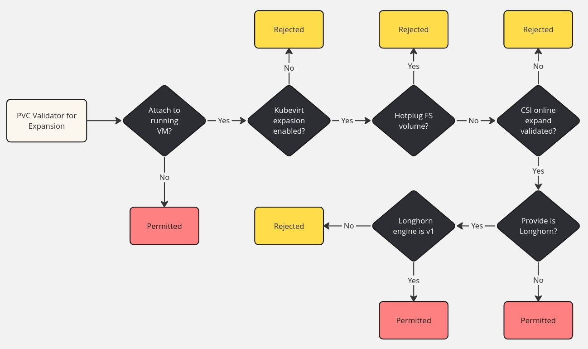
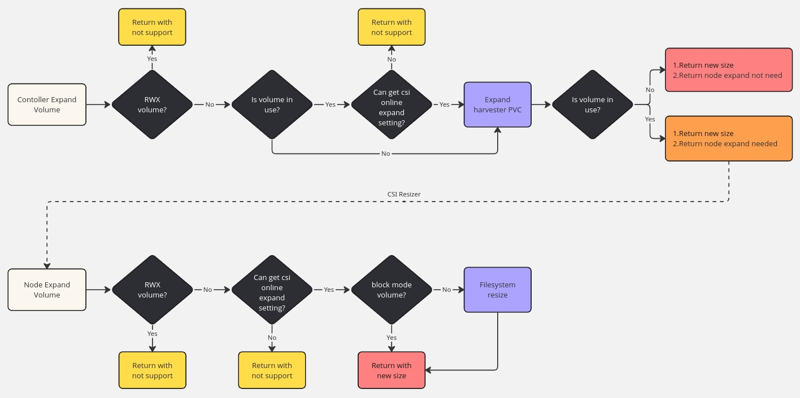

# Volume Online Expansion

## Summary

This feature enables the expansion of volumes while they are attached to a running VM or when the PVC is attached to a running pod in the guest cluster.

### Related Issues

- [Issue #2811](https://github.com/harvester/harvester/issues/2811)
- [Issue #7358](https://github.com/harvester/harvester/issues/7358)

## Motivation

### Goals

The primary goal is to allow resizing of disks or volumes attached to virtual machines without requiring downtime. This feature supports online volume expansion for both Harvester native virtual machines and guest cluster volumes. It leverages the runtime device expansion capabilities of virtual machines and ensures that volume expansion is propagated to the guest cluster through the Harvester CSI driver by implementing the necessary expansion-related CSI interfaces.

This capability is designed to support both the in-house storage solution, Longhorn, and third-party storage solutions, provided their CSI drivers fully support the required expansion capabilities.

## Proposal

### User Stories

Without this feature, expanding a volume requires shutting down the Virtual Machine or detaching the volume in the guest cluster, both of which result in downtime.

### API Changes

## Design

### Implementation Overview

#### CRD

1. **Enable `ExpandDisks` FeatureGate for `KubeVirt` Resource**
    ```yaml
    apiVersion: kubevirt.io/v1
    kind: KubeVirt
    metadata:
      name: kubevirt
      namespace: harvester-system
    spec:
      configuration:
        additionalGuestMemoryOverheadRatio: "1.5"
        developerConfiguration:
          featureGates:
            - LiveMigration
            - HotplugVolumes
            - HostDevices
            - GPU
            - CPUManager
            - VMPersistentState
            - ExpandDisks
        network:
          ...
        vmStateStorageClass: vmstate-persistence
    ```
    - This enables online resize support on the KubeVirt side. See [KubeVirt PR #5981](https://github.com/kubevirt/kubevirt/pull/5981).

2. **Introduce a New Harvester Setting: `csi-online-expand-validation`**
    ```yaml
    apiVersion: harvesterhci.io/v1beta1
    default: '{"driver.longhorn.io":true}'
    kind: Setting
    metadata:
      name: csi-online-expand-validation
    status: {}
    value: '{"topolvm.io":true,"hostpath.csi.k8s.io":true}'
    ```
    - By default, Longhorn is enabled for volume online expansion, and this setting is immutable:
        - The Harvester webhook will handle differences between the v1 and v2 Longhorn engines.
        - The Longhorn v1 engine fully supports volume expansion.
        - The Longhorn v2 engine does not support volume expansion, regardless of whether the volume is attached or detached.
    - For third-party storage providers, users can specify whether their CSI driver supports volume online expansion:
        - By default, Harvester will reject volume online expansion requests for third-party storage.
        - Harvester will only allow volume online expansion if the storage provider is explicitly configured as validated.

3. **Update the ClusterRole `harvesterhci.io:csi-driver` with New Rules**
    ```yaml
    apiVersion: rbac.authorization.k8s.io/v1
    kind: ClusterRole
    metadata:
      name: harvesterhci.io:csi-driver
    rules:
      ...
      - apiGroups:
          - harvesterhci.io
        resources:
          - networkfilesystems
          - networkfilesystems/status
        verbs:
          - '*'
      - apiGroups:
          - harvesterhci.io
        resources:
          - settings
        verbs:
          - ["get","list"]
        resourceNames:
          - "csi-online-expand-validation"
    ```
    - In the guest cluster, the Harvester CSI driver will verify the existence of the `csi-online-expand-validation` setting to determine if the PVC supports online expansion.


#### PVC Webhook Validator

- PVC Webhook Validator for resizing:
  - If the volume is not attached to a running VM:
    - Return `Permitted`
  - If the KubeVirt `expandDisks` feature gate is not enabled:
    - Return `Rejected`
  - If the volume is hotplugged in filesystem mode:
    - Return `Rejected`
  - If the `csi-online-expand-validation` setting is not enabled:
    - Return `Rejected`
  - If the CSI provider is not Longhorn:
    - Return `Permitted`
  - If the data engine is Longhorn `v1`:
    - Return `Permitted`
  - Otherwise:
    - Return `Rejected`


##### Controller Flow Chart



#### Why We need the setting `csi-online-expand-validation`?

The PersistentVolumeClaimResize admission controller allows size changes when the PVC’s StorageClass has `allowVolumeExpansion: true`. This is the only built-in gate for volume expansion. Kubernetes does not check CSI driver capabilities when a PVC's size is updated. The request is admitted (or denied) before any CSI sidecars act.

[Learn more about dynamically expanding volumes with CSI and Kubernetes](https://kubernetes.io/blog/2022/05/05/volume-expansion-ga/).

When a PersistentVolumeClaim (PVC) is requested to expand, the behavior depends on the type of resizer used by the CSI driver:

##### CSI Resizer stop working
- If No `EXPAND_VOLUME` in `ControllerGetCapabilities()` and `NodeGetCapabilities()`

##### Trivial Resizer
- If the CSI driver only reports `EXPAND_VOLUME` in `NodeGetCapabilities()` but not in `ControllerGetCapabilities()`, the trivial resizer is used.
- The trivial resizer always returns `fsResizeRequired = true`, which ensures that `NodeExpandVolume()` is always triggered.
  - [Code Reference](https://github.com/kubernetes-csi/external-resizer/blob/47607c2138bc4fbb6567a18f02390613da9edceb/pkg/resizer/trivial_resizer.go#L63-L65)
  - [NodeExpandVolume Trigger](https://github.com/kubernetes-csi/external-resizer/blob/47607c2138bc4fbb6567a18f02390613da9edceb/pkg/controller/controller.go#L445-L448)

##### Typical Resizer
- If the CSI driver reports `EXPAND_VOLUME` in `ControllerGetCapabilities()`, the typical resizer is used.
- The typical resizer first triggers `ControllerExpandVolume()` and then decides whether to invoke `NodeExpandVolume()` based on the return value of `fsResizeRequired`.
  - [ControllerExpandVolume Trigger](https://github.com/kubernetes-csi/external-resizer/blob/47607c2138bc4fbb6567a18f02390613da9edceb/pkg/resizer/csi_resizer.go#L187-L190)
  - [CSI Client Code](https://github.com/kubernetes-csi/external-resizer/blob/47607c2138bc4fbb6567a18f02390613da9edceb/pkg/csi/client.go#L134-L151)
  - [fsResizeRequired Decision](https://github.com/kubernetes-csi/external-resizer/blob/47607c2138bc4fbb6567a18f02390613da9edceb/pkg/controller/controller.go#L445-L450)

#### Why We Prevent Hotplugged Filesystem PVC from Online Resizing?

A corner case exists for filesystem mode PVCs under the following conditions:

1. A filesystem mode PVC is hotplugged into a running VM.
2. The PVC is not the most recently hotplugged volume for the VM.
3. The VM has not been rebooted after the PVC was hotplugged.

Under these circumstances, the volume will not undergo online expansion. This issue arises because the CSI `NodeExpand()` function is not invoked, as the PVC is not mounted to either the `virt-launcher` pod or the `hotplug` pod.

##### Behavior with Multiple Hotplugged Volumes

When a second volume is hotplugged into the VM, the old `hp-volume` pod is replaced by a new one. The new `hp-volume` pod only handles the `NodeStage()` and `NodePublish()` operations for the second volume. Consequently, the first hotplugged volume undergoes `NodeUnPublish()` and `NodeUnstage()` operations, but its image file remains bind-mounted in the `virt-launcher` pod.

This behavior explains why the online expansion for the first volume is not completed. Since the first volume is no longer managed by the `hp-volume` pod, the necessary CSI operations to propagate the size expansion (e.g., `NodeExpand()`) are not triggered. As a result, the VM does not reflect the volume size expansion for the first hotplugged volume.

#### Harvester CSI Volume Expand Flow



---

### Test plan

#### Harvester Native Virtual Machine

1. Longhorn v1 Block Mode PVC
   - Create a VM with a Longhorn v1 PVC as the root disk.
   - Expand the root disk PVC size.
   - Verify that the corresponding block device inside the VM reflects the increased size.

2. Longhorn v2 Block Mode PVC
   - Create a VM with a Longhorn v2 PVC as the root disk.
   - Attempt to expand the root disk PVC size.
   - Verify that the PVC expansion is denied by the Harvester webhook.

3. NFS CSI PVC with Filesystem Mode
   - [Deploy the NFS CSI driver on Harvester](https://docs.harvesterhci.io/v1.6/advanced/csidriver/#how-to-deploy-the-nfs-csi-driver).
   - Create a VM with an NFS CSI PVC as the root disk.
   - Attempt to expand the root disk PVC size.
   - Verify that the PVC expansion is denied by the Harvester webhook.
   - Enable the CSI-Driver-Validation setting for the NFS CSI driver.
     ```
     apiVersion: harvesterhci.io/v1beta1
     default: '{"driver.longhorn.io":true}'
     kind: Setting
     metadata:
       name: csi-online-expand-validation
     status: {}
     value: '{"nfs.csi.k8s.io":true}'
     ```
   - Attempt to expand the root disk PVC size again.
   - Verify that the corresponding block device inside the VM reflects the increased size.

4. TopoLVM PVC as a Hotplug Volume
   - [Deploy the TopoLVM CSI driver on Harvester](https://github.com/topolvm/topolvm).
   - Create a VM with the root disk provisioned by any CSI provider.
   - Create a PVC using the TopoLVM CSI driver.
   - Hotplug the TopoLVM PVC into the running VM.
   - Verify that the VM detects the hotplugged volume.
   - Enable the CSI-Driver-Validation setting for the TopoLVM CSI driver.
     ```
     apiVersion: harvesterhci.io/v1beta1
     default: '{"driver.longhorn.io":true}'
     kind: Setting
     metadata:
      name: csi-online-expand-validation
     status: {}
     value: '{"nfs.csi.k8s.io":true, "topolvm.io":true}'
     ```
   - Expand the size of the TopoLVM PVC.
   - Verify that the corresponding block device inside the VM reflects the increased size.

#### Guest Cluster

1. Longhorn v1 PVC
   - On Harvester, set the default StorageClass to use Longhorn v1.
   - Apply the following PVC manifest on the guest cluster:
     ```
     apiVersion: v1
     kind: PersistentVolumeClaim
     metadata:
       name: blk-vol
       namespace: default
     spec:
       accessModes:
         - ReadWriteOnce
       resources:
         requests:
           storage: 10Gi
       volumeMode: Block
     ```
   - Deploy a pod to attach the above PVC:
     ```
     apiVersion: v1
     kind: Pod
     metadata:
       name: blk-vol-pod
       namespace: default
     spec:
       containers:
         - name: volume-test
           image: ubuntu
           imagePullPolicy: IfNotPresent
           command: ["/bin/sleep"]
           args: ["3600"]
           volumeDevices:
             - devicePath: /dev/blk-vol
               name: blk-vol
       volumes:
         - name: blk-vol
           persistentVolumeClaim:
             claimName: blk-vol
     ```
   - Expand the PVC size (e.g., from 10Gi to 20Gi).
   - Inside the pod, verify that the block device size has increased using:
     ```
     blockdev --getsize64 /dev/blk-vol
     ```

2. Longhorn v2 PVC
   - On Harvester, set the default StorageClass to use Longhorn v2.
   - Apply the same PVC manifest as in Case 1 on the guest cluster.
   - Deploy the same pod (as in Case 1) to attach the PVC.
   - Expand the PVC size (e.g., from 10Gi to 20Gi).
     - The PVC size will not expand.
     - The PVC will remain in the `Resizing` condition indefinitely.

3. TopoLVM PVC
   - [Deploy the TopoLVM CSI driver](https://github.com/topolvm/topolvm) on the Harvester management cluster.
   - Set the default StorageClass to use `TopoLVM` on Harvester.
   - Apply the same PVC manifest as in Case 1 on the guest cluster.
   - Deploy the same pod (as in Case 1) to attach the PVC.
   - Expand the PVC size (e.g., from 10Gi to 20Gi).
     - Expected Behavior (before enabling validation):
       - The PVC size will not expand.
       - The PVC will remain stuck in the `Resizing` condition.
    - Enable the `CSI-Driver-Validation` setting for the TopoLVM CSI driver (as described in [PR #7978](https://github.com/harvester/harvester/pull/7978#issue-2963039342)).
    - Expand the PVC size again.
    - Expected Result:
      - Inside the pod, verify that the block device size has increased using:
        ```
        blockdev --getsize64 /dev/blk-vol
        ``` 

### Upgrade strategy

None

## Note [optional]

Additional notes.
