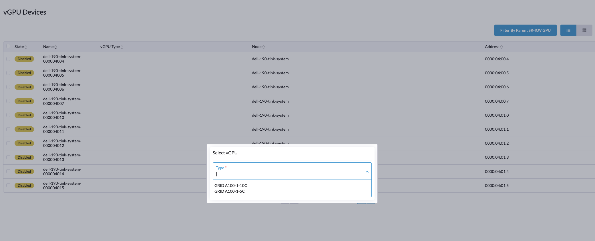

# MIG backed vGPU support

## Summary

This feature enables the Harvester to manage [NVIDIA MIG](https://docs.nvidia.com/datacenter/tesla/mig-user-guide/) backed vGPU instances.


### Related Issues

- [Issue #8652](https://github.com/harvester/harvester/issues/8652)

## Motivation

### Goals

The primary goal of the change is to allow NVIDIA MIG capable GPU's to be shared across VM workloads using the existing vGPU framework.


## Proposal

### User Stories

Allow users with datacenter grade GPUs like H100, A100 to be shared across different VM workloads.

### API Changes

## Design

### Implementation Overview

#### CRD

**Introduce new CRD MIGConfiguration in PCIDevices controller**

```yaml
apiVersion: devices.harvesterhci.io/v1beta1
kind: MigConfiguration
metadata:
  creationTimestamp: "2025-08-28T02:28:19Z"
  generation: 2
  name: dell-190-tink-system-000004000
  ownerReferences:
  - apiVersion: devices.harvesterhci.io/v1beta1
    kind: SRIOVGPUDevice
    name: dell-190-tink-system-000004000
    uid: 61036ecb-086d-45a5-8392-7f911857f8de
  resourceVersion: "8912539"
  uid: 29621561-fb8c-4620-97b1-b6b0ab8397b4
spec:
  enabled: true
  gpuAddress: "0000:04:00.0"
  nodeName: dell-190-tink-system
  profileSpec:
  - id: 19
    name: MIG 1g.5gb
    requested: 6
  - id: 20
    name: MIG 1g.5gb+me
    requested: 1
  - id: 15
    name: MIG 1g.10gb
    requested: 0
  - id: 14
    name: MIG 2g.10gb
    requested: 0
  - id: 9
    name: MIG 3g.20gb
    requested: 0
  - id: 5
    name: MIG 4g.20gb
    requested: 0
  - id: 0
    name: MIG 7g.40gb
    requested: 0
status:
  profileStatus:
  - available: 0
    id: 19
    name: MIG 1g.5gb
    total: 7
    vGPUID:
    - "7"
    - "8"
    - "9"
    - "11"
    - "12"
    - "13"
  - available: 0
    id: 20
    name: MIG 1g.5gb+me
    total: 1
    vGPUID:
    - "10"
  - available: 0
    id: 15
    name: MIG 1g.10gb
    total: 4
  - available: 0
    id: 14
    name: MIG 2g.10gb
    total: 3
  - available: 0
    id: 9
    name: MIG 3g.20gb
    total: 2
  - available: 0
    id: 5
    name: MIG 4g.20gb
    total: 1
  - available: 0
    id: 0
    name: MIG 7g.40gb
    total: 1
  status: synced
```

#### Changes to PCIDevices controller
PCIDevices controller will include the following changes
* Additional check in the `SRIOVGPUDevice` controller to identify if the `SRIOVGPUDevice` is capable of supporting MIG backed GPU partitioning. When a `SRIOVGPUDevice` is enabled, the controller will run commands against the NVIDIA driver runtime pod to query if the GPU supports MIG backed partitioning. If a supported GPU is detected, then PCIDevices controller will generate an associated `MIGConfiguration` object. The `MIGConfiguration` object will contain information about support `MIG profiles` and associated count allow for said profile.

* Additional MIG controller, which will watch for changes in the `MIGConfiguration` object and generate commands to be run against the NVIDIA driver runtime to configure requested MIG profiles. When a `MIGConfiguration` is enabled, the associated MIG profile instance ID's and count is tracked in the `MIGConfiguration` status. When a `MIGConfiguration` is disabled the tracked MIG instance ID's from status are deleted.

* The `MICConfiguration` is owned by the lifecycle of the `SRIOVGPUDevice`. When the parent `SRIOVGPUDevice` is disabled, the related `MIGConfiguration` object is also deleted. This is essential as disable `SRIOVGPUDevice` wipes all MIG information from the underlying GPU device.

* The NVIDIA driver will expose the configured MIG profiles as vGPU types. These can now be consumed via the `VGPUDevices` CRD just like normal time-sliced vGPU devices



* Changes in PCIDevices webhook will ensure the MIG instances cannot be reconfigured on the fly. If a user wishes to reconfigure the MIG instances using different profiles then the user will need to disable the `MIGConfiguration`, make the instance changes and enable the `MIGConfiguration`. This is to ensure scheduling errors when MIG instances are being created on the underlying GPU.

* The MIG controller will recheck the requested MIG instances with underlying GPU every 5 minutes. When requested `MIGConfiguration` matches the underlying GPU the objected will be marked `synced`. In case any manual changes are made by user directly against the GPU, the configuration will be marked `out-of-sync`. The user will need to `disable` and `enable` the `MIGConfiguration` to ensure the controller can reconfigure the underlying MIG instances.


### Test plan

#### Harvester Native Virtual Machine

1. Ensure you have a node with a GPU supporting MIG based GPU partitioning such as NVIDIA A100/H100

2. Ensure the [PCIDevices](https://docs.harvesterhci.io/v1.6/advanced/addons/pcidevices) and [NVIDIA Driver Toolkit](https://docs.harvesterhci.io/v1.6/advanced/addons/nvidiadrivertoolkit) addons are enabled.

3. Ensure appropriate `NVIDIA Driver` is used with the underlying GPU. Users will need to use the NVIDIA Datacenter or NVIDIA AIE drivers supporting their GPU.

4. Enable `SRIOVGPUDevice`

5. Once `MIGConfiguration` is created. Define appropriate count for various MIG profiles available for your GPU and enable the `MIGConfiguration` object. Please refer to the GPU documentation to identify profile and count options.

6. Once `MIGConfiguration` is applied to underlying GPU, the associated `VGPUDevices` with correct available profiles should be available for use with VM's

7. Users can passthrough [MIG backed vGPU](https://docs.harvesterhci.io/v1.6/advanced/vgpusupport) as any other vGPU device to a VM.


### Upgrade strategy

None. Changes will be rolled out as part of `PCIDevices controller` Addon during harvester upgrades.

## Note [optional]

Additional notes.
