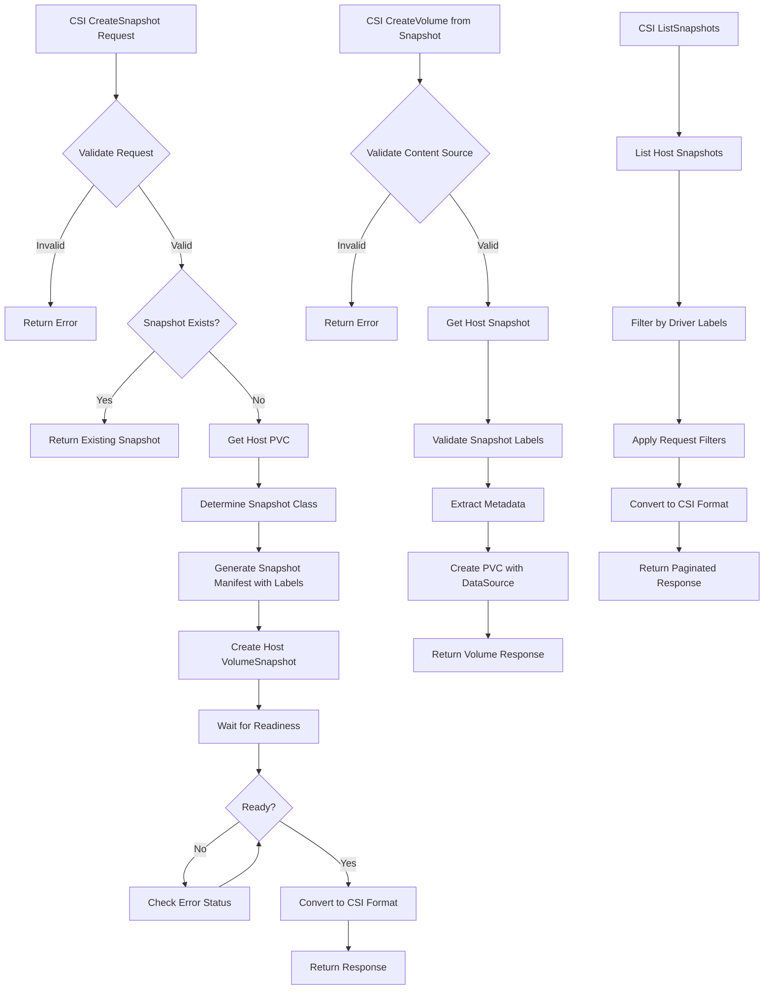

# Harvester CSI Snapshot Support

## Summary

This design document outlines the implementation of CSI snapshot support in the Harvester CSI driver. The feature enables users to create, delete, and list volume snapshots for persistent volumes managed by the Harvester CSI driver, providing point-in-time backup and restore capabilities for workloads running in guest Kubernetes clusters.

### Related Issues

- [Issue #3778](https://github.com/harvester/harvester/issues/3778)

## Motivation

### Goals

- **Enable CSI Snapshot Operations**: Implement CSI snapshot controller capabilities including CreateSnapshot, DeleteSnapshot, and ListSnapshots
- **Support Volume Restoration from Snapshots**: Allow creation of new volumes from existing snapshots
- **Provide Metadata Preservation**: Store essential volume metadata in snapshot labels for proper restoration
- **Ensure Backward Compatibility**: Support existing volume creation workflows while adding snapshot functionality

## Proposal

### User Stories

**Story 1: As a developer**
I want to create snapshots of my application's persistent volumes so that I can create backups before deploying new versions or performing maintenance operations.

**Story 2: As a system administrator**
I want to restore volumes from snapshots so that I can quickly recover from data corruption or restore previous application states.

**Story 3: As a DevOps engineer**
I want to list all available snapshots so that I can manage retention policies and select appropriate snapshots for volume restoration.

**Story 4: As a platform operator**
I want snapshot operations to work seamlessly with various storage provisioners (Longhorn, external storage) without requiring different procedures.

## Design

### Implementation Overview

The Harvester CSI snapshot implementation introduces comprehensive snapshot management capabilities to the existing CSI driver architecture. The solution operates in a host-guest cluster model where the CSI driver runs in guest Kubernetes clusters and manages storage resources in the host Harvester cluster.

#### Key Components

1. **Snapshot Client Integration**: Added `snapclient.Clientset` to interact with VolumeSnapshot APIs
2. **Controller Service Capabilities**: Extended controller capabilities to include:
   - `CREATE_DELETE_SNAPSHOT`
   - `LIST_SNAPSHOTS`
3. **Metadata Management**: Implemented snapshot labeling system for volume metadata preservation
4. **Volume Content Source Validation**: Added support for creating volumes from snapshot sources

#### Core Operations

**CreateSnapshot**
- Validates snapshot creation requests
- Handles existing snapshot scenarios (idempotent operations)
- Creates host cluster VolumeSnapshot resources with proper metadata labels
- Waits for snapshot readiness and returns CSI-compliant responses

**DeleteSnapshot** 
- Validates deletion requests
- Safely removes VolumeSnapshot resources from host cluster
- Handles non-existent snapshot scenarios gracefully

**ListSnapshots**
- Supports pagination and filtering by snapshot ID and source volume
- Validates snapshot metadata to ensure driver compatibility
- Converts host snapshots to CSI format with proper filtering

**Volume Creation from Snapshots**
- Validates snapshot-based volume creation requests
- Extracts metadata from snapshot labels (storage class, volume mode)
- Creates PVCs with proper DataSource references to snapshots
- Prevents creation of RWX volumes from snapshots (unsupported scenario)

#### Metadata Schema

Snapshots created by the driver include essential metadata labels:
- `harvesterhci.io/snapHostSC`: Original storage class name
- `harvesterhci.io/snapHostVolumeMode`: Original volume mode (Block/Filesystem)

#### ClusterRole Update

Purpose: extend existing driver RBAC with the minimal permissions to manage CSI VolumeSnapshot resources. This extends the current role; it does not replace it.

```yaml
apiVersion: rbac.authorization.k8s.io/v1
kind: ClusterRole
metadata:
  name: harvesterhci.io:csi-driver
rules:
  ....
- apiGroups:
  - snapshot.storage.k8s.io
  resources:
  - volumesnapshots
  - volumesnapshotcontents
  verbs: ["*"]
```

Notes:
- Rules are additive; existing bindings remain unchanged

#### Harvester CSI Chart Update

Summary:
- Add csi-snapshotter sidecar to the controller deployment
- Expand RBAC to include snapshot.storage.k8s.io resources
- Introduce a default VolumeSnapshotClass for the Harvester driver
- Expose image values for the snapshotter, bump the provisioner image tag

```diff
diff --git a/charts/harvester-csi-driver/templates/deployment.yaml b/charts/harvester-csi-driver/templates/deployment.yaml
index 0b59225..5ceaafc 100644
--- a/charts/harvester-csi-driver/templates/deployment.yaml
+++ b/charts/harvester-csi-driver/templates/deployment.yaml
@@ -79,6 +79,18 @@ spec:
           volumeMounts:
             - mountPath: /csi/
               name: socket-dir
+        - args:
+            - --v=5
+            - --csi-address=$(ADDRESS)
+          env:
+            - name: ADDRESS
+              value: /csi/csi.sock
+          image: {{ template "system_default_registry" . }}{{ .Values.image.csi.snapshotter.repository }}:{{ .Values.image.csi.snapshotter.tag }}
+          imagePullPolicy: {{ .Values.image.pullPolicy }}
+          name: csi-snapshotter
+          volumeMounts:
+            - mountPath: /csi/
+              name: socket-dir
       serviceAccountName: {{ include "harvester-csi-driver.name" . }}
       {{- with .Values.nodeSelector }}
       nodeSelector:
diff --git a/charts/harvester-csi-driver/templates/rbac.yaml b/charts/harvester-csi-driver/templates/rbac.yaml
index 2ba042a..427bcfe 100644
--- a/charts/harvester-csi-driver/templates/rbac.yaml
+++ b/charts/harvester-csi-driver/templates/rbac.yaml
@@ -47,11 +47,8 @@ rules:
     resources: ["storageclasses"]
     verbs: ["get", "list", "watch"]
   - apiGroups: ["snapshot.storage.k8s.io"]
-    resources: ["volumesnapshots"]
-    verbs: ["get", "list"]
-  - apiGroups: ["snapshot.storage.k8s.io"]
-    resources: ["volumesnapshotcontents"]
-    verbs: ["get", "list"]
+    resources: ["volumesnapshots", "volumesnapshotcontents", "volumesnapshotclasses", "volumesnapshotcontents/status"]
+    verbs: ["*" ]
   - apiGroups: [ "storage.k8s.io" ]
     resources: [ "csinodes" ]
     verbs: [ "get", "list", "watch" ]
diff --git a/charts/harvester-csi-driver/templates/volumesnapshotclass.yaml b/charts/harvester-csi-driver/templates/volumesnapshotclass.yaml
new file mode 100644
index 0000000..3d881b2
--- /dev/null
+++ b/charts/harvester-csi-driver/templates/volumesnapshotclass.yaml
@@ -0,0 +1,8 @@
+apiVersion: snapshot.storage.k8s.io/v1
+kind: VolumeSnapshotClass
+metadata:
+  name: harvester-snapshot
+  annotations:
+    snapshot.storage.kubernetes.io/is-default-class: "true"
+driver: driver.harvesterhci.io
+deletionPolicy: Delete
diff --git a/charts/harvester-csi-driver/values.yaml b/charts/harvester-csi-driver/values.yaml
index a753ab4..b7a1162 100644
--- a/charts/harvester-csi-driver/values.yaml
+++ b/charts/harvester-csi-driver/values.yaml
@@ -16,10 +16,13 @@ image:
       tag: v1.2.0
     provisioner:
       repository: rancher/mirrored-longhornio-csi-provisioner
-      tag: v2.1.2
+      tag: v5.3.0
     attacher:
       repository: rancher/mirrored-longhornio-csi-attacher
       tag: v3.2.1
+    snapshotter:
+      repository: rancher/mirrored-longhornio-csi-snapshotter
+      tag: v8.3.0-20250709
   pullPolicy: IfNotPresent
 
 nameOverride: ""
```

Post-deployment validation:
- csi-snapshotter container is running in the csi-controller Pod
- snapshot.storage.k8s.io API group lists VolumeSnapshot, VolumeSnapshotContent, VolumeSnapshotClass resources
- Creating a test VolumeSnapshot yields ReadyToUse=true and a corresponding VolumeSnapshotContent

Compatibility: additive change. Existing workloads continue to function; snapshot features activate once CRDs and RBAC are present.

### Controller Flow Chart



### Test Plan

General prerequisites for all cases:
- Snapshot CRDs and controller are installed in the cluster, and the csi-snapshotter sidecar is running with the Harvester CSI controller.
- A default VolumeSnapshotClass named "harvester-snapshot" exists (or adjust manifests to use a non-default class).
- The StorageClass you intend to use is available and defaulted when not specified explicitly in PVCs.
- Wait for each resource to reach a ready/Bound state before proceeding to the next step.

#### Case 1: CSI snapshot based on host’s Longhorn volume

Prerequisites (in addition to the general ones):
- Longhorn-backed StorageClass is available to the guest cluster (typically the default "harvester" StorageClass).
- Block volume consumption is permitted on the nodes where the test Pod will run.

* Create a block PVC.
  ```
  apiVersion: v1
  kind: PersistentVolumeClaim
  metadata:
    name: blk-vol
    namespace: default
  spec:
    accessModes:
    - ReadWriteOnce
    resources:
      requests:
        storage: 2Gi
    volumeMode: Block
  ```
  - Expectation: PVC phase becomes Bound. If the cluster’s default StorageClass is not the intended one, specify storageClassName explicitly.

* Mount the block PVC to a pod, write some data, ensure the data is persisted, then remove the pod.
  ```
  apiVersion: v1
  kind: Pod
  metadata:
    name: pod-blk-vol
    namespace: default
  spec:
    containers:
    - name: volume-test
      image: ubuntu
      imagePullPolicy: IfNotPresent
      securityContext:
        privileged: true  
      command: ["/bin/sleep"]
      args: ["3600"]
      volumeDevices:
      - devicePath: /dev/blk-vol
        name: blk-vol
    volumes:
      - name: blk-vol
        persistentVolumeClaim:
          claimName: blk-vol
   ```
  - Guidance: Write a recognizable signature or dataset to the device, ensure it is flushed to disk, then delete the Pod.

* Take a snapshot of the block PVC.
  ```
  apiVersion: snapshot.storage.k8s.io/v1
  kind: VolumeSnapshot
  metadata:
    name: snapshot-blk-vol
    namespace: default
  spec:
    volumeSnapshotClassName: harvester-snapshot
    source:
      persistentVolumeClaimName: blk-vol
  ```
  - Expectation: VolumeSnapshot status becomes ReadyToUse=true and a VolumeSnapshotContent object is bound to it.

* Restore the snapshot to a new PVC.
  ```
  apiVersion: v1
  kind: PersistentVolumeClaim
  metadata:
    name: restore-blk-vol
    namespace: default
  spec:
    accessModes:
      - ReadWriteOnce
    resources:
      requests:
        storage: 2Gi
    storageClassName: harvester
    dataSource:
      apiGroup: snapshot.storage.k8s.io  
      kind: VolumeSnapshot
      name: snapshot-blk-vol
    volumeMode: Block
  ```
  - Expectation: Restored PVC becomes Bound and references a provisioned PV restored from the snapshot.

* Mount both the source and restored PVCs to a pod.
  ```
  apiVersion: v1
  kind: Pod
  metadata:
    name: pod-restore-blk-vol
    namespace: default
  spec:
    containers:
    - name: volume-test
      image: ubuntu
      imagePullPolicy: IfNotPresent
      securityContext:
        privileged: true  
      command: ["/bin/sleep"]
      args: ["3600"]
      volumeDevices:
      - devicePath: /dev/blk-vol
        name: blk-vol
      - devicePath: /dev/restore-blk-vol
        name: restore-blk-vol
    volumes:
      - name: blk-vol
        persistentVolumeClaim:
          claimName: blk-vol
      - name: restore-blk-vol
        persistentVolumeClaim:
          claimName: restore-blk-vol
  ```
  - Verification: Compare the content of both block devices. For example, validate identical signatures or checksums. The two PVCs should have identical content.

Cleanup:
- Delete the validation Pod, the restored PVC, the snapshot, and the source PVC in that order (snapshot deletion is subject to its deletionPolicy; default here is Delete).

Troubleshooting:
- If the snapshot is not ReadyToUse, inspect VolumeSnapshot/VolumeSnapshotContent status and related events. Verify the csi-snapshotter sidecar is running and the VolumeSnapshotClass exists.
- If restore PVC is Pending, ensure the referenced VolumeSnapshot is ready and the storage class is correct.
- For block devices, ensure the Pod runs on a node that supports privileged device access.

#### Case 2: CSI snapshot based on host’s NFS filesystem volume

Prerequisites (in addition to the general ones):
- NFS CSI driver is installed in the host Harvester cluster.
- In the guest cluster, a passthrough StorageClass pointing to the host’s NFS StorageClass exists and is set as the default for this test, as referenced in the Harvester docs.

* Deploy the NFS CSI driver on Harvester.
* In the guest cluster, create a custom StorageClass as described [here](https://docs.harvesterhci.io/latest/rancher/csi-driver#passthrough-custom-storageclass) that points to the host’s NFS StorageClass, and set the custom StorageClass as default.
* Create a filesystem PVC.
  ```
  apiVersion: v1
  kind: PersistentVolumeClaim
  metadata:
    name: fs-vol
  spec:
    accessModes:
      - ReadWriteOnce
    volumeMode: Filesystem
    resources:
      requests:
        storage: 2Gi
  ```
  - Expectation: PVC becomes Bound under the NFS-backed StorageClass.

* Mount the filesystem PVC to a pod, write some data, ensure the data is persisted, then remove the pod.
  ```
  apiVersion: v1
  kind: Pod
  metadata:
    name: pod-fs-vol
  spec:
    containers:
      - name: ubuntu
        image: ubuntu:latest
        command: ["/bin/bash", "-c", "sleep infinity"]
        volumeMounts:
          - name: fs-vol
            mountPath: /data-fs-vol
    volumes:
      - name: fs-vol
        persistentVolumeClaim:
          claimName: fs-vol
  ```
  - Guidance: Create a small test directory structure and files under /data-fs-vol, ensure data is synced, then delete the Pod.

* Take a snapshot of the filesystem PVC.
  ```
  apiVersion: snapshot.storage.k8s.io/v1
  kind: VolumeSnapshot
  metadata:
    name: snapshot-fs-vol
    namespace: default
  spec:
    volumeSnapshotClassName: harvester-snapshot
    source:
      persistentVolumeClaimName: fs-vol
  ```
  - Expectation: VolumeSnapshot becomes ReadyToUse=true with a bound VolumeSnapshotContent.

* Restore the snapshot to a new PVC.
  ```
  apiVersion: v1
  kind: PersistentVolumeClaim
  metadata:
    name: restore-fs-vol
    namespace: default
  spec:
    accessModes:
      - ReadWriteOnce
    resources:
      requests:
        storage: 2Gi
    storageClassName: harvester
    dataSource:
      apiGroup: snapshot.storage.k8s.io  
      kind: VolumeSnapshot
      name: snapshot-fs-vol
    volumeMode: Filesystem
  ```
  - Expectation: Restored PVC becomes Bound and contains the filesystem state from the snapshot.

* Mount both the source and restored PVCs to a pod.
  ```
  apiVersion: v1
  kind: Pod
  metadata:
    name: pod-fs-vol
  spec:
    containers:
      - name: ubuntu
        image: ubuntu:latest
        command: ["/bin/bash", "-c", "sleep infinity"]
        volumeMounts:
          - name: fs-vol
            mountPath: /data-fs-vol
          - name: restore-fs-vol
            mountPath: /data-restore-fs-vol
    volumes:
      - name: fs-vol
        persistentVolumeClaim:
          claimName: fs-vol
      - name: restore-fs-vol
        persistentVolumeClaim:
          claimName: restore-fs-vol
  ```
  - Verification: Compare directory listings, file contents, and metadata (sizes, checksums) between /data-fs-vol and /data-restore-fs-vol. They should match.

Cleanup:
- Delete the validation Pod, the restored PVC, the snapshot, and the source PVC as appropriate.

Troubleshooting:
- If the snapshot remains Pending, confirm the NFS provisioner supports snapshots in the host and that the passthrough StorageClass mapping is correct.
- If the restore PVC is Pending, ensure the VolumeSnapshotClass and the StorageClass used for restore are compatible.

### Upgrade Strategy

None

## Note [optional]

**Current Limitations:**
- RWX (ReadWriteMany) volumes cannot be created from snapshots due to architectural constraints