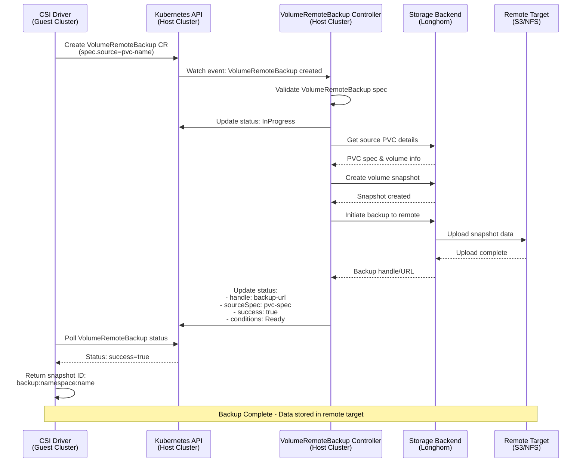
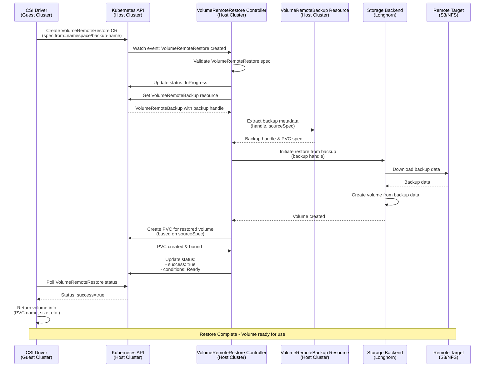
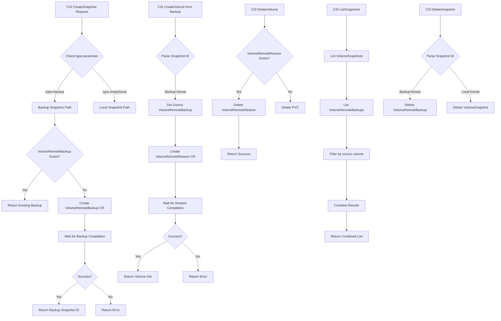

# Harvester CSI Remote Volume Backup and Restore

## Summary

This design document outlines the implementation of remote volume backup and restore functionality in the Harvester CSI driver. The feature enables users to create remote backups of persistent volumes and restore them, providing disaster recovery and cross-cluster data migration capabilities for workloads running in guest Kubernetes clusters.

### Related Issues

- [Issue #2661](https://github.com/harvester/harvester/issues/2661)

## Motivation

### Goals

- **Enable Remote Backup Operations**: Implement CSI snapshot capabilities using remote backup targets for persistent volumes
- **Support Volume Restoration from Remote Backups**: Allow creation of new volumes from existing remote backups stored outside the cluster
- **Provide Disaster Recovery**: Enable backup and restore across different guest clusters for disaster recovery scenarios as long as the guest cluster has the same Harvester as provider
- **Maintain Compatibility**: Work alongside existing local snapshot functionality without breaking changes

## Proposal

### User Stories

**Story 1: As a cluster administrator**
I want to create remote backups of my persistent volumes to remote storage so that I can recover data even if the entire cluster is lost.

**Story 2: As a DevOps engineer**
I want to restore volumes from remote backups in a different guest cluster so that I can migrate workloads across environments or recover from disaster scenarios.

**Story 3: As a backup administrator**
I want to list all remote backups so that I can manage retention policies and select appropriate backups for restoration.

**Story 4: As a system operator**
I want backup operations to be transparent to applications using standard Kubernetes VolumeSnapshot APIs with appropriate parameters to distinguish between local and remote backups.

## Design

### Architecture Overview

The remote backup and restore implementation follows a distributed architecture with clear separation of concerns:

- **Host Cluster (Harvester)**: Manages backup/restore controllers and executes storage operations
- **Guest Cluster (CSI Driver)**: Provides CSI interface and orchestrates backup/restore workflows

The solution leverages custom Harvester resources (`VolumeRemoteBackup` and `VolumeRemoteRestore`) that utilize Longhorn's backup functionality to remote targets. An interface-based design allows flexibility to support third-party storage backends in the future if needed.

#### Why VolumeRemoteBackup and VolumeRemoteRestore Abstractions?

A critical design consideration is how namespace boundaries are handled during restore operations between guest and host clusters. The `VolumeRemoteBackup` and `VolumeRemoteRestore` resources provide a **namespace-agnostic abstraction** that solves this complexity.

**The Namespace Mapping Challenge:**

When restoring a volume in a guest cluster (e.g., from `gvol1` to `gvol2`), the underlying host Harvester cluster has its own namespace topology (e.g., `hvol1` to `hvol2`). The standard Kubernetes VolumeSnapshot mechanism requires different workflows depending on whether the source and target are in the same namespace:

- **Same namespace**: `PVC` → `VolumeSnapshot` → `New PVC` (simple path)
- **Cross-namespace**: `PVC` → `VolumeSnapshot` → `VolumeSnapshotContent` → `New VolumeSnapshot` → `New PVC` (requires cross-namespace reference handling)

**Guest-to-Host Namespace Mapping Scenarios:**

The complexity arises from how guest cluster namespaces map to host cluster namespaces during restore operations:

| Scenario | Guest Cluster Topology | Host Cluster Topology | Workflow Complexity |
|----------|------------------------|----------------------|---------------------|
| **Case 1**: Same namespace, same cluster | `gvol1` and `gvol2` both in `ns-a` | `hvol1` and `hvol2` both in `hns-a` | Simple: Same-namespace restore on both sides |
| **Case 2**: Different namespaces, same cluster | `gvol1` in `ns-a`, `gvol2` in `ns-b` | `hvol1` and `hvol2` both in `hns-a` | Complex: Guest sees cross-namespace restore, host sees same-namespace restore |
| **Case 3**: Different clusters | `gvol1` in `ns-a`, `gvol2` in `ns-b` | `hvol1` and `hvol2` can be in same or different namespaces | Complex: Guest sees cross-namespace restore, host can see same-namespace restore or cross-namespace restore |

**Design Solution:**

The `VolumeRemoteBackup` and `VolumeRemoteRestore` abstractions eliminate this complexity by:

1. **Decoupling from VolumeSnapshot constraints**: Backup metadata (handle, source PVC spec) is stored in VolumeRemoteBackup.status, removing the need to manage VolumeSnapshot/VolumeSnapshotContent across namespace boundaries

2. **Unified workflow**: VolumeRemoteRestore references any VolumeRemoteBackup via `spec.from: "namespace/name"`, enabling **cross-namespace access** where the restore controller can access VolumeRemoteBackup resources in any namespace

3. **Simplified CSI driver**: The driver doesn't need namespace-specific logic; it simply creates VolumeRemoteBackup/VolumeRemoteRestore resources with appropriate cross-namespace references

**Example - Cross-namespace restore on Harvester:**

```
Guest Cluster:
  namespace-a/gvol1 (PVC) --[CSI CreateSnapshot]--> VolumeRemoteBackup in Harvester (hvol-ns1)
  namespace-b/gvol2 (PVC) <--[CSI CreateVolume]---- VolumeRemoteRestore in Harvester (hvol-ns2)

Host Harvester:
  hvol-ns1/hvol1 (PVC) → hvol-ns1/VolumeRemoteBackup (stores backup handle)
  hvol-ns2/VolumeRemoteRestore (spec.from: "hvol-ns1/volumeRemoteBackup-name") → hvol-ns2/hvol2 (PVC)
```

In this scenario, even though guest PVCs are in different namespaces, the host Harvester cluster also maps them to different namespaces (`hvol-ns1` and `hvol-ns2`). The VolumeRemoteRestore in `hvol-ns2` can reference the VolumeRemoteBackup in `hvol-ns1` using the cross-namespace reference format `"hvol-ns1/volumeRemoteBackup-name"`. The VolumeRemoteRestore controller handles this cross-namespace access transparently, retrieving the backup handle from the remote storage target regardless of namespace boundaries.

This abstraction layer ensures consistent behavior across all namespace topology scenarios, whether same-namespace or cross-namespace on either the guest or host side.

### Component Architecture

#### 1. API Resources (Host Cluster)

Two new Custom Resource Definitions (CRDs) are introduced in the Harvester host cluster:

- **`VolumeRemoteBackup`**: Represents a remote backup operation and stores backup metadata
- **`VolumeRemoteRestore`**: Represents a restore operation from an existing backup

#### 2. Controllers (Host Cluster)

Controllers run in the Harvester host cluster and handle the actual backup/restore operations:

- **VolumeRemoteBackup Controller**: Orchestrates backup operations to remote storage
- **VolumeRemoteRestore Controller**: Orchestrates restore operations from remote storage

#### 3. CSI Driver (Guest Cluster)

The CSI driver in the guest cluster acts as a client that:

- Creates and monitors `VolumeRemoteBackup` and `VolumeRemoteRestore` custom resources
- Translates CSI operations to backup/restore workflows
- Communicates with the host cluster via Kubernetes API

### Snapshot Type Routing

The implementation extends the existing CSI snapshot interface to support different snapshot types:

- **Default (empty `type`)**: Local snapshot using standard `VolumeSnapshot` resources
- **`type=backup`**: Remote backup using `VolumeRemoteBackup` resources

### Snapshot ID Format

Different ID formats distinguish between snapshot types:

- **Local snapshots**: Simple name format (e.g., `snapshot-name`)
- **Remote backups**: Namespaced format (e.g., `backup:namespace:name`)

This format enables:
- Unambiguous identification of backup vs. local snapshots
- Cross-namespace backup operations
- Simplified parsing and routing logic

---

## Implementation Details

### Part 1: Host Cluster Implementation (Harvester)

This section describes the changes required in the main Harvester repository.

#### 1.1 New Custom Resource Definitions

**VolumeRemoteBackup CRD**

```go
type VolumeRemoteBackup struct {
    metav1.TypeMeta   `json:",inline"`
    metav1.ObjectMeta `json:"metadata,omitempty"`
    
    Spec   VolumeRemoteBackupSpec   `json:"spec"`
    Status VolumeRemoteBackupStatus `json:"status,omitempty"`
}

type VolumeRemoteBackupSpec struct {
    // Type of backup, currently only "lh" (Longhorn) is supported
    Type VolumeRemoteBackupType `json:"type,omitempty"`
    
    // Source PVC name to backup
    Source string `json:"source"`
}

type VolumeRemoteBackupStatus struct {
    // Handle is the remote backup identifier in the backup target
    Handle string `json:"handle"`
    
    // CSIProvider indicates which CSI driver created the backup
    CSIProvider string `json:"csiProvider"`
    
    // SourceSpec contains the original PVC specification for restoration
    SourceSpec corev1.PersistentVolumeClaimSpec `json:"sourceSpec,omitempty"`
    
    // Success indicates if the backup completed successfully
    Success bool `json:"success,omitempty"`
    
    // Conditions provide detailed status information
    Conditions []Condition `json:"conditions,omitempty"`
}
```

**Resource Immutability:**

The `VolumeRemoteBackup` resource is **immutable** once created. The `spec` fields cannot be modified after creation to ensure backup integrity and prevent inconsistencies between the backup metadata and the actual backup data stored in the remote target. This immutability is enforced by a Harvester webhook that validates and rejects any update attempts to the `spec` fields. Only the `status` fields can be updated by the controller during the backup lifecycle.

**VolumeRemoteRestore CRD**

```go
type VolumeRemoteRestore struct {
    metav1.TypeMeta   `json:",inline"`
    metav1.ObjectMeta `json:"metadata,omitempty"`
    
    Spec   VolumeRemoteRestoreSpec   `json:"spec"`
    Status VolumeRemoteRestoreStatus `json:"status,omitempty"`
}

type VolumeRemoteRestoreSpec struct {
    // Type of restore, currently only "lh" (Longhorn) is supported
    Type VolumeRemoteRestoreType `json:"type"`
    
    // From specifies the source VolumeRemoteBackup in format "namespace/name"
    From string `json:"from"`
}

type VolumeRemoteRestoreStatus struct {
    // Success indicates if the restore completed successfully
    Success bool `json:"success,omitempty"`
    
    // Conditions provide detailed status information
    Conditions []Condition `json:"conditions,omitempty"`
}
```

#### 1.2 VolumeRemoteBackup Controller

The VolumeRemoteBackup controller runs in the Harvester host cluster and manages the backup lifecycle.

**Controller Responsibilities:**
- Watch for new `VolumeRemoteBackup` resources created by CSI drivers
- Validate backup specifications and source PVC existence
- Orchestrate backup operations through the storage backend interface
- Update `VolumeRemoteBackup` status with progress and completion information
- Handle backup lifecycle and cleanup operations
- Enforce immutability of `VolumeRemoteBackup` resources by rejecting any updates to the `spec` fields

**Backup Workflow:**

1. **Detection**: Controller watches for newly created `VolumeRemoteBackup` resources
2. **Validation**: Validates the backup specification and verifies source PVC exists
3. **Snapshot Creation**: Creates a volume snapshot in the storage backend (e.g., Longhorn)
4. **Remote Upload**: Initiates upload of snapshot data to the configured remote target (S3, NFS, etc.)
5. **Metadata Capture**: Stores PVC specification in `status.sourceSpec` for future restoration
6. **Status Update**: Updates `status.handle` with the remote backup identifier/URL
7. **Completion**: Sets `status.success=true` and updates conditions

**Key Operations:**
- Creates volume snapshots in the storage backend
- Uploads snapshot data to configured remote targets (e.g., S3, NFS)
- Captures PVC metadata for future restoration
- Manages backup lifecycle and cleanup
- Provides detailed progress through status conditions



#### 1.3 VolumeRemoteRestore Controller

The VolumeRemoteRestore controller runs in the Harvester host cluster and manages the restore lifecycle.

**Controller Responsibilities:**
- Watch for new `VolumeRemoteRestore` resources created by CSI drivers
- Validate restore specifications and source backup existence
- Orchestrate restore operations through the storage backend interface
- Create new PVCs bound to restored volumes
- Update `VolumeRemoteRestore` status with progress and completion information

**Restore Workflow:**

1. **Detection**: Controller watches for newly created `VolumeRemoteRestore` resources
2. **Backup Resolution**: Locates the source `VolumeRemoteBackup` resource specified in `spec.from`
3. **Metadata Extraction**: Retrieves backup handle and source PVC specification from `VolumeRemoteBackup.status`
4. **Download**: Downloads backup data from the remote target to the storage backend
5. **Volume Creation**: Creates a new volume from the downloaded backup data
6. **PVC Creation**: Creates a new PVC bound to the restored volume using the original specification
7. **Status Update**: Sets `status.success=true` and updates conditions
8. **Completion**: CSI driver receives completion notification

**Validation and Protection Mechanisms:**

To ensure data integrity and prevent restore failures, the system implements validation and protection mechanisms:

- **VolumeRemoteBackup Existence Validation**: When a `VolumeRemoteRestore` resource is created, the Harvester webhook validates that the referenced `VolumeRemoteBackup` resource (specified in `spec.from`) exists in the cluster. If the referenced backup has already been deleted, the webhook rejects the `VolumeRemoteRestore` creation with an appropriate error message.

- **Deletion Protection During Restore**: As a corner case, if a `VolumeRemoteBackup` is deleted while a `VolumeRemoteRestore` operation is actively using it, the Harvester webhook intercepts the deletion request and rejects it. This prevents data corruption or restore failures that could occur if the backup metadata becomes unavailable during an ongoing restore operation. The webhook checks for active `VolumeRemoteRestore` resources referencing the `VolumeRemoteBackup` before allowing deletion.

**Key Operations:**
- Retrieves backup metadata from `VolumeRemoteBackup` resources
- Downloads backup data from remote targets
- Creates new volumes with restored data
- Creates PVCs bound to restored volumes
- Manages restore lifecycle



---

### Part 2: Guest Cluster Implementation (CSI Driver)

This section describes the changes required in the harvester-csi-driver repository.

#### 2.1 CSI Controller Server Architecture

The CSI driver in the guest cluster acts as a client that orchestrates backup/restore operations by creating and monitoring custom resources in the host cluster.

**Communication Model:**
- CSI driver communicates with the host cluster via Kubernetes API
- Creates `VolumeRemoteBackup` and `VolumeRemoteRestore` resources in the host cluster
- Polls resource status until operations complete
- Translates CSI operations to backup/restore workflows

#### 2.2 Core CSI Operations

The CSI driver extends existing operations to support remote backup and restore workflows.

**CreateSnapshot - Extended for Backup Mode**

Determines snapshot type based on the `type` parameter and routes accordingly:

- **Local Path** (`type` not set or empty): Creates standard `VolumeSnapshot` resource
- **Backup Path** (`type=backup`): Creates `VolumeRemoteBackup` resource in host cluster

```go
func (cs *ControllerServer) CreateSnapshot(ctx context.Context, req *csi.CreateSnapshotRequest) (*csi.CreateSnapshotResponse, error) {
    // Validate request
    if err := validateCreateSnapshotRequest(req); err != nil {
        return nil, err
    }
    
    // Determine snapshot type and route
    isBackupSnapshot := req.Parameters != nil && req.Parameters["type"] == "backup"
    
    if isBackupSnapshot {
        // Create remote backup using VolumeRemoteBackup
        return cs.handleBackupSnap(ctx, req.GetName(), req.GetSourceVolumeId())
    }
    
    // Create local snapshot using VolumeSnapshot
    return cs.handleLocalSnap(ctx, req.GetName(), req.GetSourceVolumeId())
}
```

**Backup Snapshot Handler:**
1. Check if `VolumeRemoteBackup` with the same name already exists
2. If not exists, create new `VolumeRemoteBackup` CR in host cluster with source PVC reference
3. Add labels for tracking (source volume, CSI provider, etc.)
4. Wait for backup completion by polling `status.success`
5. Return CSI snapshot response with namespaced snapshot ID (`backup:namespace:name`)

**CreateVolume - Extended for Restore from Backup**

Detects restore operations through snapshot ID format and routes accordingly:

- **Regular Path**: Standard volume creation or local snapshot restore
- **Restore Path**: Creates `VolumeRemoteRestore` resource when snapshot ID has `backup:` prefix

```go
func (cs *ControllerServer) CreateVolume(ctx context.Context, req *csi.CreateVolumeRequest) (*csi.CreateVolumeResponse, error) {
    // Validate and get parameters
    volumeParameters, volSizeBytes, err := cs.validateCreateVolReq(req)
    if err != nil {
        return nil, err
    }
    
    // Check if this is a restore from backup
    if cs.isBackupSnapshotRestore(req) {
        return cs.buildHostVolumeRemoteRestore(ctx, req, volumeParameters)
    }
    
    // Regular volume creation or local snapshot restore
    hostPVC, err := cs.buildHostPVC(ctx, req, volumeParameters, volSizeBytes)
    // ...continue with regular flow...
}
```

**Restore Handler:**
1. Parse snapshot ID to extract namespace and backup name
2. Retrieve source `VolumeRemoteBackup` to get volume size and metadata
3. Create `VolumeRemoteRestore` CR in host cluster referencing the source backup
4. Wait for restore completion by polling `status.success`
5. Return CSI volume response with restored volume information

**DeleteVolume - Extended for Restore Cleanup**

Handles cleanup of restore resources before standard volume deletion:

```go
func (cs *ControllerServer) DeleteVolume(ctx context.Context, req *csi.DeleteVolumeRequest) (*csi.DeleteVolumeResponse, error) {
    // Check if there's a VolumeRemoteRestore with the same name
    deleted, err := cs.deleteVolumeRemoteRestoreIfExists(ctx, req.GetVolumeId())
    if err != nil {
        return nil, err
    }
    
    if deleted {
        return &csi.DeleteVolumeResponse{}, nil
    }
    
    // Continue with regular PVC deletion
    // ...
}
```

**DeleteSnapshot - Extended for Backup Mode**

Routes deletion based on snapshot ID format:

- **Backup format** (`backup:namespace:name`): Deletes `VolumeRemoteBackup` resource
- **Local format**: Deletes standard `VolumeSnapshot` resource

**ListSnapshots - Extended to Include Backups**

Provides unified listing of both local snapshots and remote backups:

```go
func (cs *ControllerServer) ListSnapshots(ctx context.Context, req *csi.ListSnapshotsRequest) (*csi.ListSnapshotsResponse, error) {
    // List local VolumeSnapshots
    localSnaps, nextToken, err := cs.listLocalSnaps(ctx, listOptions, req)
    if err != nil {
        return nil, err
    }
    
    // List remote VolumeRemoteBackups
    backupSnaps, err := cs.listBackupSnaps(ctx, req)
    if err != nil {
        logrus.Warnf("Failed to list VolumeRemoteBackups: %v", err)
        backupSnaps = []*csi.ListSnapshotsResponse_Entry{}
    }
    
    // Combine and return
    allSnaps := append(localSnaps, backupSnaps...)
    return &csi.ListSnapshotsResponse{
        Entries:   allSnaps,
        NextToken: nextToken,
    }, nil
}
```

**List Operations:**
1. Query both `VolumeSnapshot` and `VolumeRemoteBackup` resources
2. Filter `VolumeRemoteBackup` by source volume label if requested
3. Convert `VolumeRemoteBackup` resources to CSI snapshot format with namespaced IDs
4. Combine results from both sources
5. Return unified snapshot list

#### 2.3 CSI Driver Flow Chart



#### 2.4 Code Changes in CSI Controller Server

**New Client Fields:**
```go
type ControllerServer struct {
    // ...existing fields...
    harvClient      *harvclient.Clientset  // For VolumeRemoteBackup/VolumeRemoteRestore operations
    // ...
}
```

The controller server is extended with a Harvester client to communicate with the host cluster API for creating and monitoring `VolumeRemoteBackup` and `VolumeRemoteRestore` resources.

---

## Upgrade Strategy

This feature is designed as an additive enhancement with full backward compatibility:

- **No Breaking Changes**: Existing local snapshot functionality remains completely unchanged
- **Opt-in Feature**: Remote backup requires explicit `type=backup` parameter
- **CRD Deployment**: `VolumeRemoteBackup` and `VolumeRemoteRestore` CRDs must be deployed in the Harvester host cluster
- **Transparent Operation**: No changes required to existing `VolumeSnapshot` workflows

## Limitations and Implementation

**Current Limitations:**
- Only Longhorn volumes support remote backup functionality (`type=lh`)
- Backup operations require a Longhorn backup target to be configured in Harvester
- Cross-cluster restore requires both clusters to use the same Harvester provider

**Implementation Details:**
- VolumeRemoteBackup and VolumeRemoteRestore controllers run in the Harvester host cluster
- CSI driver in guest cluster communicates with host cluster APIs to manage backup/restore resources
- Backup data is stored in remote S3-compatible storage or NFS configured as Longhorn backup target
- Snapshot IDs use namespaced format to support cross-namespace operations and disambiguation
- Interface-based design allows future extensibility for third-party storage backends
