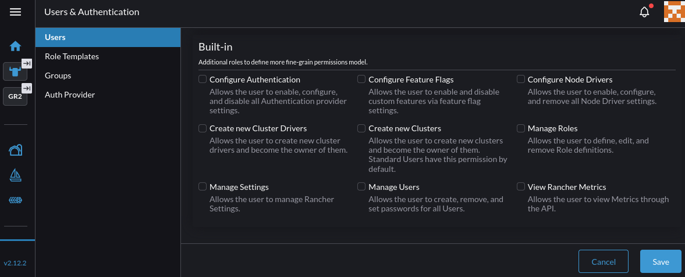

# Rancher Integration RBAC

## Summary

The goal of this proposal is to define a set of [role-based access control (RBAC)][1] roles to regulate Rancher users' access and operational privileges to Harvester resources. Cluster administrators can utilize these roles to enforce cluster-scoped and project-scoped permissions in multi-tenant environment. Team members are assigned roles with appropriate level of permissions to execute their functions, based on their responsibilities.

These new roles complement the existing Harvester/Rancher integration authentication and authorization models. They are derived from Rancher's built-in roles. By mapping these roles to specific Harvester resource permissions, we create a seamless integration that enhances security and operational efficiency.

### Related Issues

[[FEATURE] Introduce Harvester RBAC roles for Rancher](https://github.com/harvester/harvester/issues/7909)

## Motivation

The current cluster permissions assigned to Rancher users do not adequately address the need for fine-grained access control over Harvester resources. When a user is added to a Harvester cluster, they are granted either the 'Cluster Owner' or 'Cluster Member' role:


The 'Cluster Owner' role offers full administrative access to all resources within the cluster, while the 'Cluster Member' role offers access to a subset of generic Kubernetes and Rancher API, without any Harvester-related permissions.

Similarly, there are also no Harvester-related project-scoped roles that can regulate access to Harvester resources within projects. The built-in 'Project Owner', 'Project Member' and 'Read-Only' roles pertained mostly to Kubernetes and Rancher resources.

The proposed enhancement aims to address these gaps.

### Goals

* ***Utilize Rancher RBAC framework*** to define the new RBAC roles to manage Harvester resources.

This approach offers Rancher users with a consistent and familiar user membership and RBAC management experience.

During the initial implementation phase, RBAC roles are defined to segregate cluster-scoped from namespace-scoped access, and read-only from read-write operations.

More granular roles with specific permissions to manage, for example, the network stack or storage configuration can be introduced in future phases based on user feedback and requirements.

If needed, user can use the provided role templates to create new or complement existing custom roles via Rancher's role "Inherit From" feature.

* Define a set of RBAC roles to ***support cluster-scoped operations*** on Harvester resources.

The cluster-scoped roles consist of permissions for cluster users to manage virtualization workloads, infrastructure, advanced cluster settings and system upgrade resources at the cluster level.

The privileges granted by the roles span across all projects within the cluster.

Generally, these roles do not have permissions to modify Rancher resources like Rancher settings, device configuration, cluster membership etc.

* Define a set of RBAC roles to ***support namespace-scoped operations*** on Harvester resources.

The namespace-scoped roles consist of permissions for project users to manage virtualization workload resources within specific projects.

Generally, these roles do not have permissions to access infrastructure and system resources, nor project resources outside of the RBAC binding context.

* Enforce access control ***at the UI and API levels***.

Identify UI changes needed to ensure that users can only see and interact with resources they have permissions for. This may include hiding or disabling UI elements that correspond to actions or resources outside of the user's permissions.

In addition, API endpoint tests are executed with user-generated API tokens to ensure that API requests are properly authorized based on the user's roles and permissions.

### Non-goals [optional]

TBD.

## Proposal

The primary objective is to utilize the Rancher `RoleTemplate` API to define a set of cluster-scoped and namespace-scoped RBAC roles to attribute Harvester permission groups.

The proposed roles do not include Rancher-level administrative permissions, which grant privileges to manage Rancher resources like cluster membership or node drivers configuration. These permissions can be granted to users from the existing "Built-In" global permissions page:



The manifests for these roles will be delivered as a Helm chart. Rancher administrator can add and manage this chart via the Rancher "Apps -> Chart" UI on the `local` cluster.

The following section outlines the proposed RBAC roles and their functions.

### Cluster Roles Definition

The following is the list of the proposed cluster-scoped roles:

* `View Virtualization Resources`
* `Manage Virtualization Resources`

The `View Virtualization Resources` role provides a read-only "single pane of glass" experience to cluster user.

This role inherits its permissions from the built-in `Cluster Member` and `View` roles.

When assigned this role, a cluster user can:

* view all workload resources including virtual machines, volumes, virtual machine images, storage classes
* view all backup and restore resources
* view all infrastructure resources such as hosts, disks and networks
* view all host devices like PCI devices, SR-IOV devices, vGPU devices
* view all projects and namespaces
* view cluster memberships
* view project memberships
* view SSH keys, templates and secrets
* view advanced cluster settings
* view cluster and workload metrics
* generate support bundles

This role **does not** grant permissions to:

* upgrade the cluster
* modify virtualization and infrastructure resources
* modify host devices like PCI devices, SR-IOV devices, vGPU devices
* modify projects and namespaces
* modify cluster memberships
* modify project memberships
* modify SSH keys, templates and secrets
* modify advanced cluster settings

The `Manage Virtualization Resources` role provides a cluster "power user" with management access to all virtualization resources.

This role inherits its permissions from the built-in `Edit` role.

With this role, a cluster user can:

* modify all workload resources including virtual machines, volumes, virtual machine images, storage classes
* modify all backup, restore and snapshot resources
* modify all infrastructure resources such as hosts, disks and networks
* modify all host devices like PCI devices, SR-IOV devices, vGPU devices
* modify all projects, namespaces
* modify SSH keys, templates and secrets
* modify advanced cluster settings
* modify project memberships
* view cluster memberships
* view cluster and workload metrics
* generate support bundles

This role **does not** grant permissions to:

* upgrade the cluster
* modify cluster memberships

Cluster users can view, create or modify downstream guest clusters configuration in Harvester projects where they are designated the appropriate project roles.

### Project Roles Definition

The following is the list of the proposed namespace-scoped roles:

* `View Virtualization Resources`
* `Manage Virtualization Resources`

The `View Virtualization Resources` role inherits the permissions of the built-in `Read-Only` role.

It offers project user view permissions into designated project resources:

* view all resources within the designated project
* view SSH keys, templates and secrets
* view namespaces within the project
* view project workload metrics

This role **does not** grant permissions to:

* modify resources within the designated project
* modify project memberships
* modify infrastructure resources
* modify host devices like PCI devices, SR-IOV devices, vGPU devices

The `Manage Virtualization Resources` role inherits the permissions of the built-in `Project User`, allowing project users to deploy and manage their virtualization workloads and services within the designated projects.

Specifically, they can:

* modify all resources within the designated project
* modify SSH keys, templates and secrets
* modify namespaces within the project
* view project workload metrics

This role **does not** grant permissions to:

* modify project memberships
* modify infrastructure resources
* modify host devices like PCI devices, SR-IOV devices, vGPU devices

Project users can view, create or modify downstream guest clusters configuration only in Harvester projects where they are designated the appropriate project roles.

### User Stories

#### Story 1

As a Harvester cluster owner, I want to be able to add/modify/revoke cluster membership by assigning appropriate RBAC roles to users, so that I can ensure that users have the right level of access to Harvester resources based on their responsibilities.

#### Story 2

As a Harvester project owner, I want to be able to add/modify/revoke project membership by assigning appropriate RBAC roles to users, so that I can ensure that users have the right level of access to Harvester resources within my projects based on their responsibilities.

### User Experience In Detail

Cluster owner can manage cluster membership from the existing "Virtualization Management" page in the Rancher UI.

New and existing cluster members are assigned one of the newly defined cluster roles from the "Cluster Permissions" list:


Project owner can manage project membership from the "Projects/Namespaces" page in the Harvester UI.

New and existing project members are assigned one of the newly defined project roles from the "Project Permissions" list:


⚠️ Cluster owner should not modify the roles definition from the Rancher UI "Role Templates" page. Helm should be the primary mechanism to manage the lifecycle of these roles.

### API changes

No changes to existing APIs.

## Design

### Implementation Overview

The RBAC roles are implemented using the Rancher [`RoleTemplate` API][2].

The roles are defined as YAML manifests and delivered via a Helm chart. Rancher administrator can add and manage this chart via the Rancher "Apps -> Chart" UI on the `local` cluster.

In order for the Harvester UI to render certain views correctly, extra permissions have be added to the minimum set of permissions needed to authorized the API requests. For example, in order to view the virtual machine listing page, the user also needs `get`, `list`, and `watch` permissions on the `namespaces`, `persistentvolumes`, `persistentvolumeclaims`, `storageclasses`, `backups`, `restores` and `virtualmachineimages` resources.

Hence, to avoid bloating the scope of UI changes and QA effort in this release, roles with more granular permissions to access specific resource types, to perform specific operation types, to manage networking stack or storage configuration are postponed to future phases, after gathering more user feedback and requirements.

We should also re-evaluate the [current logic that auto-registers the `harvester-authenticated` group][4] to expose certain resources to all authenticated users. This group impersonates role bindings without evaluating the user's assigned roles, which could potentially lead to unauthorized access.

Due to the additive nature of the RBAC permissions, a project-scoped user should never be assigned cluster-scoped roles to prevent granting them excessive access to other projects they are not authorized for.

#### Cluster Roles Specification

The sample manifest of the `View Virtualization Resources` cluster role:

```yaml
administrative: false
apiVersion: management.cattle.io/v3
builtin: false
clusterCreatorDefault: false
context: cluster
description: Provides view-only access to all resources in Harvester
displayName: View Virtualization Resources
external: false
hidden: false
kind: RoleTemplate
locked: false
metadata:
  labels:
    app.kubernetes.io/component: harvesterhci-rancher-integration
    app.kubernetes.io/name: harvesterhci
    app.kubernetes.io/part-of: harvesterhci-rbac
  name: virt-view-cluster
projectCreatorDefault: false
roleTemplateNames:
  - projects-view
  - monitoring-ui-view
  - clusterroletemplatebindings-view
  - nodes-view
rules:
  - apiGroups:
      - harvesterhci.io
    resources:
      - supportbundles
    verbs:
      - "*"
  - apiGroups:
      - network.harvesterhci.io
    resources:
      - "*"
    verbs:
      - get
      - list
      - watch
  - apiGroups:
      - loadbalancer.harvesterhci.io
    resources:
      - "*"
    verbs:
      - get
      - list
      - watch
  - apiGroups:
      - devices.harvesterhci.io
    resources:
      - "*"
    verbs:
      - get
      - list
      - watch
  - apiGroups:
      - node.harvesterhci.io
    resources:
      - "*"
    verbs:
      - get
      - list
      - watch
  - apiGroups:
      - harvesterhci.io
    resources:
      - "*"
    verbs:
      - get
      - list
      - watch
  - apiGroups:
      - harvesterhci.io
    resources:
      - settings
    verbs:
      - get
      - list
      - watch
      - create
```

The sample manifest of the `Manage Virtualization Resources` cluster role:

```yaml
administrative: false
apiVersion: management.cattle.io/v3
builtin: false
clusterCreatorDefault: false
context: cluster
description: Provides management access to all resources in Harvester
displayName: Manage Virtualization Resources
external: false
hidden: false
kind: RoleTemplate
locked: false
metadata:
  labels:
    app.kubernetes.io/component: harvesterhci-rancher-integration
    app.kubernetes.io/name: harvesterhci
    app.kubernetes.io/part-of: harvesterhci-rbac
  name: virt-cluster-manage
projectCreatorDefault: false
roleTemplateNames:
  - monitoring-ui-view
  - cluster-member
  - storage-manage
  - nodes-manage
  - projects-view
  - edit
  - projectroletemplatebindings-manage
  - project-member
rules:
  - apiGroups:
      - ""
    resources:
      - namespaces
    verbs:
      - "*"
  - apiGroups:
      - loadbalancer.harvesterhci.io
    resources:
      - "*"
    verbs:
      - "*"
  - apiGroups:
      - network.harvesterhci.io
    resources:
      - "*"
    verbs:
      - "*"
  - apiGroups:
      - node.harvesterhci.io
    resources:
      - "*"
    verbs:
      - "*"
  - apiGroups:
      - devices.harvesterhci.io
    resources:
      - "*"
    verbs:
      - "*"
  - apiGroups:
      - harvesterhci.io
    resourceNames: []
    resources:
      - "*"
    verbs:
      - "*"
```

#### Project Roles Specification

The sample manifest of the `View Virtualization Resources` project role:

```yaml
administrative: false
apiVersion: management.cattle.io/v3
builtin: false
clusterCreatorDefault: false
context: project
displayName: View Virtualization Resources
external: false
hidden: false
kind: RoleTemplate
locked: false
metadata:
  labels:
    app.kubernetes.io/component: harvesterhci-rancher-integration
    app.kubernetes.io/name: harvesterhci
    app.kubernetes.io/part-of: harvesterhci-rbac
  name: virt-project-view
projectCreatorDefault: false
roleTemplateNames:
  - read-only
  - monitoring-ui-view
rules:
  - apiGroups:
      - loadbalancer.harvesterhci.io
    resourceNames: []
    resources:
      - '*'
    verbs:
      - get
      - list
      - watch
```

The sample manifest of the `Manage Virtualization Resources` project role:

```yaml
administrative: false
apiVersion: management.cattle.io/v3
builtin: false
clusterCreatorDefault: false
context: project
description: Provides management access to projects in Harvester
displayName: Manage Virtualization Resources
external: false
hidden: false
kind: RoleTemplate
locked: false
metadata:
  labels:
    app.kubernetes.io/component: harvesterhci-rancher-integration
    app.kubernetes.io/name: harvesterhci
    app.kubernetes.io/part-of: harvesterhci-rbac
  name: virt-project-manage
projectCreatorDefault: false
roleTemplateNames:
  - project-member
  - monitoring-ui-view
rules:
  - apiGroups:
      - loadbalancer.harvesterhci.io
    resources:
      - '*'
    verbs:
      - '*'
```

### Test plan

Automated tests should be implemented to provide comprehensive coverage of the new RBAC roles and their associated permissions.

In general, the test plan should include the following steps:

* Generate API tokens for users assigned with each of the newly defined RBAC roles.
* Use these tokens to execute API requests against Harvester APIs to verify that the permissions granted by each role are correctly enforced.
* Ensure that unauthorized actions are appropriately denied and return the correct error responses.
* Test both cluster-scoped and namespace-scoped roles to ensure proper segregation of permissions.
* UI tests should also be conducted to verify that users can only see and interact with resources they have permissions for.

In general, the easiest way to set up the test environment is to manually preseed the Rancher instance with test users and their corresponding RBAC roles from the UI. Then retrieve their kubeconfig files from the UI to automate the API execution against the Harvester cluster.

Programmatically creating the test users and generate their kubeconfig files involves a bit more setup as detailed below.

#### Example Test Scenario Using The Users and Kubeconfig API

In this example test scenario, we create a new Rancher user named `testuser` on an instance of Rancher v2.13.2. This user is assigned the `View Virtualization Resources` project role in the `demo` project in Harvester. A kubeconfig file is generated for `testuser` to access the Harvester cluster and verify the permissions granted by the role assigned to `testuser`.

This test setup uses the [Rancher CLI][6] to simplify the [authentication process][7] required to generate the API token needed for the kubeconfig file.

Obtain the Rancher CA certificate from the Rancher "Global Settings" UI and save it as `.cacert` in the current directory.

Login via the Rancher CLI:

```sh
./rancher login --cacert ./.cacert --token <bearer-token-from-rancher-ui> https://<rancher-hostname>
```

Create a `demo` project in the Harvester cluster if it does not exist.

Export some common variables in the current shell:

```sh
export USER_ID="testuser"
export USER_PASSWORD=$(openssl rand -base64 14)
export ROLE_TEMPLATE_NAME="virt-project-view"
export HARVESTER_CLUSTER_NAME="hv-lab"
export HARVESTER_PROJECT_NAME="demo"
export RANCHER_SERVER_URL="https://<rancher-hostname>"
export CLUSTER_ID=$(rancher clusters ls | grep ${HARVESTER_CLUSTER_NAME} | tr -s ' ' | cut -d' ' -f2)
export PROJECT_ID=$(rancher projects ls | grep ${HARVESTER_PROJECT_NAME} | tr -s ' ' | cut -d' ' -f1 | cut -d ":" -f2)
```

🔒 The `USER_PASSWORD`  can be overridden to suit your testing environment. It is required later to generate the API token for `testuser`.

Retrieve the Rancher's `cluster-admin` kubeconfig file:

```sh
rancher clusters kf local > rancher.kubeconfig
```

On Rancher, create the new user `testuser`:

```sh
kubectl --kubeconfig=rancher.kubeconfig create -f -<<EOF
apiVersion: management.cattle.io/v3
kind: User
metadata:
  name: "${USER_ID}"
displayName: test user
username: "${USER_ID}"
EOF
```

Create a password for `testuser` in the `cattle-local-user-passwords` namespace:

```sh
kubectl --kubeconfig=rancher.kubeconfig create -f -<<EOF
apiVersion: v1
kind: Secret
metadata:
  name: testuser
  namespace: cattle-local-user-passwords
type: Opaque
stringData:
  password: ${USER_PASSWORD}
EOF
```

Assign the `Standard User` global role and the `View Virtualization Resources` project role to the user:

```sh
kubectl --kubeconfig=rancher.kubeconfig create -f -<<EOF
apiVersion: management.cattle.io/v3
globalRoleName: user
kind: GlobalRoleBinding
metadata:
  generateName: grb-
userName: ${USER_ID}
userPrincipalName: ${USER_ID}
---
apiVersion: management.cattle.io/v3
kind: ProjectRoleTemplateBinding
metadata:
  generateName: prtb-
  namespace: ${CLUSTER_ID}-${PROJECT_ID}
projectName: ${CLUSTER_ID}:${PROJECT_ID}
roleTemplateName: ${ROLE_TEMPLATE_NAME}
userName: ${USER_ID}
userPrincipalName: local://${USER_ID}
EOF
```

Retrieve an API token for `testuser`:

🔒 By default, the Rancher CLI uses the `local` auth provider to perform the authentication in this next step. When prompted, provide use the `${USER_ID}` and `${USER_PASSWORD}` variables for authentication. It is possible to configure the Rancher CLI to use the OAuth auth provider, depending on the Rancher instance setup.

```sh
API_TOKEN=$(rancher token --server "${RANCHER_SERVER_URL}" --user "${USER_ID}" --cluster "${CLUSTER_ID}" --skip-verify | jq -r .status.token)
```

Generate a kubeconfig file for `testuser` to access the Harvester cluster:

```sh
curl -sk -XPOST -H"Authorization: Bearer ${API_TOKEN}" "${RANCHER_SERVER_URL}/v3/clusters/${CLUSTER_ID}?action=generateKubeconfig" | jq -r .config | yq . > testuser.kubeconfig
```

🤷 If the `testuser.kubeconfig` file is empty, then the API token isn't generated correctly. Change the `--user` option to an arbirtrary user (e.g., `testuser1`) triggers a relogin. This usually fixes the issue and generates the API token correctly.

Use the `testuser.kubeconfig` file to execute API requests against the Harvester cluster to verify the permissions granted by the assigned role:

```sh
$ kubectl --kubeconfig=testuser.kubeconfig -n demo-blue get vm,vmi,po
NAME                               AGE   STATUS    READY
virtualmachine.kubevirt.io/vm-00   10d   Running   True
virtualmachine.kubevirt.io/vm-01   11d   Running   True

NAME                                       AGE   PHASE     IP            NODENAME           READY
virtualmachineinstance.kubevirt.io/vm-00   44h   Running   10.52.0.116   hp-4-tink-system   True
virtualmachineinstance.kubevirt.io/vm-01   10d   Running   10.52.0.82    hp-4-tink-system   True

NAME                            READY   STATUS    RESTARTS   AGE
pod/virt-launcher-vm-00-f5l4w   2/2     Running   0          44h
pod/virt-launcher-vm-01-25tjg   2/2     Running   0          10d

$ kubectl --kubeconfig=testuser.kubeconfig -n isim-dev-blue get vm,vmi,po
Error from server (Forbidden): virtualmachines.kubevirt.io is forbidden: User "testuser" cannot list resource "virtualmachines" in API group "kubevirt.io" in the namespace "isim-dev-blue"
Error from server (Forbidden): virtualmachineinstances.kubevirt.io is forbidden: User "testuser" cannot list resource "virtualmachineinstances" in API group "kubevirt.io" in the namespace "isim-dev-blue"
Error from server (Forbidden): pods is forbidden: User "testuser" cannot list resource "pods" in API group "" in the namespace "isim-dev-blue"
```

### Upgrade strategy

No upgrade strategy needed. New roles are added without modifying existing roles or permissions.

User who already owns their own custom roles can add the proposed Helm chart to their chart specification as [subchart][3].

## Note [optional]

### How Rancher Impersonation System Works

When using Harvester, a Rancher user's scope of permissions is managed by the Rancher [centralized authentication and impersonation system][5].

Rancher users data are managed by the `user.management.cattle.io` API. The system assigns cluster-scoped and project-scoped permissions to users by binding the `User` resource to the `RoleTemplate` resources, via the `ClusterRoleTemplateBinding` and `ProjectRoleTemplateBinding` resources respectively. The `ClusterRoleTemplateBinding` objects are normally found in the namespace named after the `<cluster-id>`. The `ProjectRoleTemplateBinding` objects are found in the namespace named after the `<cluster-id>-<project-id>`.

User requests are routed from Rancher to Harvester via the Rancher authentication proxy. The request is authenticated using standard bearer token and includes the Kubernetes impersonation headers. This impersonation mechanism maps Rancher users to Kubernetes service accounts and groups in Harvester.

On Harvester, the `cattle-cluster-agent` component receives and forwards the request to the Kubernetes API server on Harvester. The agent authorizes the requests by applying the roles and bindings defined in each cluster's policies. A service account `cattle-impersonation-system/cattle-impersonation-<userid>` is created on behalf of the Rancher user. The `ClusterRole` and `ClusterRoleBinding` resources, named after `cattle-impersonation-<userid>`, allow the service account to impersonate the Rancher user, its principal ID, the `userextras.authentication.k8s.io` resource, and the `system:authenticated` and `system:cattle:authenticated` groups.

### List of UI Issues

#### Cluster Role - View Virtualization Resources

* User should not see the "Create Schedule" option on the "Virtual Machines" listing page
* User should not see the "Encrypt Image" option on the "Images" listing page
* User should not see the "Edit Config" option on the "Projects/Namespaces" listing page
* User should not see the "Create" button in the "Virtual Machine Networks" page
* User should not see the "Suspend" option in the "Backup and Snapshots Virtual Machine Schedules" listing page
* User should not see the "Add" button in the "RBAC Cluster Members" listing page
* User should not see the "Set as default" option in the "Advanced Storage Classes" page
* User should not be allowed to download SSH keys from the "SSH Keys" listing page
* User should not be allowed to download secrets from the "Secrets" listing page
* User should not see the "Disable" option in the "Add-Ons" listing page
* User should not see the "Enable Passthrough" option in the devices listing page

#### Namespace Role - View Virtualization Resources

* Same as "Cluster Role - View Virtualization Resources"

Additional notes.

[1]: https://ranchermanager.docs.rancher.com/how-to-guides/new-user-guides/authentication-permissions-and-global-configuration/manage-role-based-access-control-rbac
[2]: https://ranchermanager.docs.rancher.com/api/api-reference#tag/managementCattleIo_v3/operation/readManagementCattleIoV3RoleTemplate
[3]: https://helm.sh/docs/chart_template_guide/subcharts_and_globals/
[4]: https://github.com/harvester/harvester/blob/0bdc55c4e5402aedff971efb684cc7a69191ba15/pkg/data/rbac.go
[5]: https://ranchermanager.docs.rancher.com/reference-guides/rancher-manager-architecture/communicating-with-downstream-user-clusters
[6]: https://github.com/rancher/cli
[7]: https://github.com/rancher/cli/blob/675f7fbaaf72152ac86eee5d1b78daa6780d1cb5/cmd/kubectl_token.go#L331-L348
