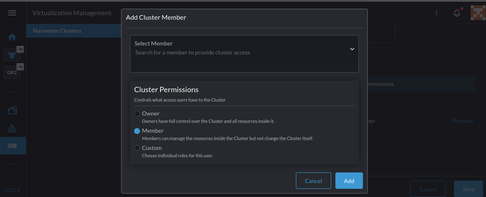
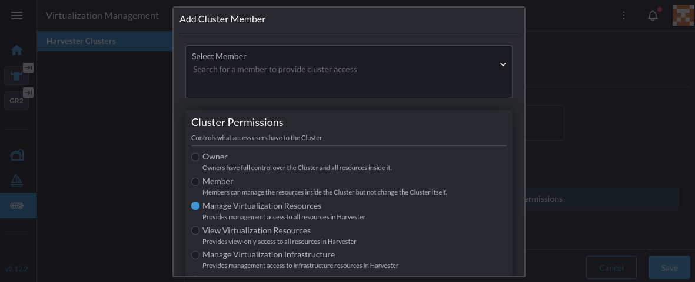
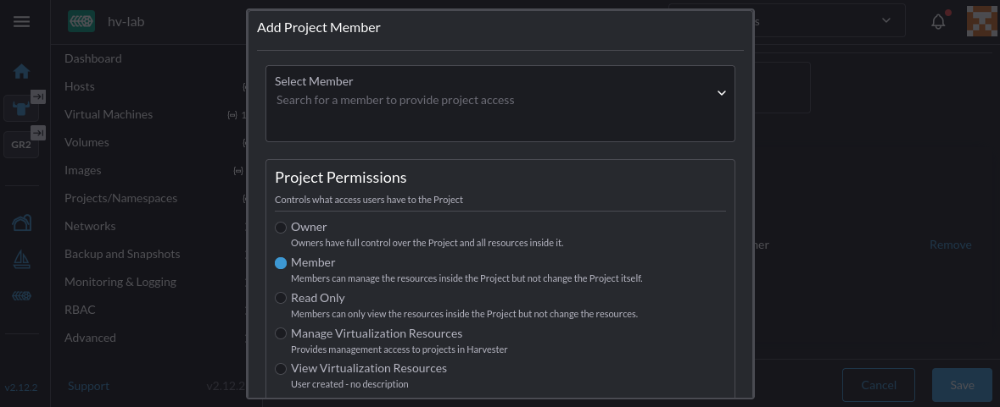

# Rancher Integration RAC

## Summary

The goal of this proposal is to define a set of [role-based acccess control (RBAC)][1] roles to regulate Rancher users' access and operational privileges to Harvester resources. Cluster administrators can utilize these roles to enforce cluster-scoped and project-scoped permissions in multi-tenant environment. Team members are assigned roles with appropriate level of permissions to execute their functions, based on their responsibilities.

These new roles complement the existing Harvester/Rancher integration authentication and authorization models. They are derived from Rancher's built-in roles. By mapping these roles to specific Harvester resource permissions, we create a seamless integration that enhances security and operational efficiency.

### Related Issues

[[FEATURE] Introduce Harvester RBAC roles for Rancher](https://github.com/harvester/harvester/issues/7909)

## Motivation

The current cluster permissions assigned to Rancher users do not adequately address the need for fine-grained access control over Harvester resources. When a user is added to a Harvester cluster, they are granted either the 'Cluster Owner' or 'Cluster Member' role:



The 'Cluster Owner' role offers full administrative access to all resources within the cluster, while the 'Cluster Member' role offers access to a subset of generic Kubernetes and Rancher API, without any Harvester-related permissions.

Similarly, there are also no Harvester-related project-scoped roles that can regulate access to Harvester resources within projects. The built-in 'Project Owner', 'Project Member' and 'Read-Only' roles pertained mostly to Kubernetes and Rancher resources.

The proposed enhancement aims to address these gaps.

### Goals

* Utilize Rancher RBAC framework to define the new RBAC roles to manage Harvester resources.

This approach offers Rancher users with a consistent and familiar user membership and RBAC management experience.

During the initial implementation phase, RBAC roles are defined to seggregate cluster-scoped from namespace-scoped access, and read-only from read-write operations.

More granular roles with specific permissions to manage, for example, the network stack or storage configuration can be introduced in future phases based on user feedback and requirements.

If needed, user can use the provided role templates to create new or complement existing custom roles.

* Define a set of RBAC roles to support cluster-scoped operations on Harvester resources.

The cluster-scoped roles consist of permissions for cluster users to manage virtualization workloads, infrastructure, settings and system upgrade resources at the cluster level.

Generally, the privileges granted by the roles span across all projects within the cluster.

* Define a set of RBAC roles to support namespace-scoped operations on Harvester resources.

The namespace-scoped roles consist of permissions for project users to manage virtualization workload resources within specific projects.

Generally, these roles do not have permissions to access infrastructure and system resources, nor project resources outside of the RBAC binding context.

* Enforce access control at the UI and API levels.

Identify UI changes needed to ensure that users can only see and interact with resources they have permissions for. This may include hiding or disabling UI elements that correspond to actions or resources outside of the user's permissions.

In addition, API endpoint tests are executed with user-generated API tokens to ensure that API requests are properly authorized based on the user's roles and permissions.

### Non-goals [optional]

TBD.

## Proposal

The primary objective is to utilize the Rancher `RoleTemplate` API to define a set of cluster-scoped and namespace-scoped RBAC roles to attribute Harvester permission groups.

The manifests for these roles will be delivered as a Helm chart.

In the initial delivery phase, Rancher administrator can manually download and install this chart in Rancher from the Harvester `charts` repository. Automatic registration of these roles during the Harvester/Rancher integration setup process can be considered in future phases.

The following section outlines the proposed RBAC roles and their functions.

### Cluster Roles Definition

The following is the list of the proposed cluster-scoped roles:

* `View Virtualization Resources`
* `Manage Virtualization Resources`
* `Manage Virtualization Infrastructure`

The `View Virtualization Resources` role provides a read-only "single pane of glass" experience to cluster user.

When assigned this role, a cluster user can:

* view all workload resources including virtual machines, volumes, virtual machine images, storage classes
* view all backup and restore resources
* view all infrastructure resources such as hosts, disks and networks
* view all host devices like PCI devices, SR-IOV devices, vGPU devices
* view all projects and namespaces
* view cluster memberships
* view SSH keys, templates and secrets
* view advanced cluster settings
* view cluster and workload metrics
* generate support bundles

This role **does not** grant permissions to:

* upgrade the cluster
* modify virtualization and infrastructure resources
* modify host devices like PCI devices, SR-IOV devices, vGPU devices
* modify projects and namespaces
* modify cluster memberships
* modify SSH keys, templates and secrets
* modify advanced cluster settings

The `Manage Virtualization Resources` role provides a cluster "power user" with management access to all virtualization resources.

With this role, a cluster user can:

* modify all workload resources including virtual machines, volumes, virtual machine images, storage classes
* modify all backup, restore and snapshot resources
* modify all infrastructure resources such as hosts, disks and networks
* modify all host devices like PCI devices, SR-IOV devices, vGPU devices
* modify all projects, namespaces
* modify SSH keys, templates and secrets
* modify advanced cluster settings
* view cluster memberships
* view cluster and workload metrics
* generate support bundles

This role **does not** grant permissions to:

* upgrade the cluster
* modify cluster memberships

The `Manage Virtualization Infrastructure` role provides specialized permissions to infrastructure experts to manage infrastructure resources and respond to infrastructure-related incidents.

This role allows a cluster user to:

* view all workload resources as defined in the `View Virtualization Resources` role
* modify virtual machine images and storage classes
* modify all infrastructure resources such as hosts, disks and networks
* modify all host devices like PCI devices, SR-IOV devices, vGPU devices
* modify advanced cluster settings
* restore virtual machines and volumes from backups and snapshots
* view cluster and workload metrics

This role **does not** grant permissions to:

* upgrade the cluster
* modify cluster memberships

### Project Roles Definition

The following is the list of the proposed namespace-scoped roles:

* `View Virtualization Resources`
* `Manage Virtualization Resources`

The `View Virtualization Resources` role inherits the permissions of the built-in `Read-Only` role.

It offers project user view permissions into designated project resources:

* view all resources within the designated project
* view SSH keys, templates and secrets
* view namespaces within the project
* view project workload metrics

This role **does not** grant permissions to:

* modify resources within the designated project
* modify project memberships
* modify infrastructure resources
* modify host devices like PCI devices, SR-IOV devices, vGPU devices

The `Manage Virtualization Resources` role inherits the permissions of the built-in `Project User`, allowing project users to deploy and manage their virtualization workloads and services within the designated projects.

Specifically, then can:

* modify all resources within the designated project
* modify SSH keys, templates and secrets
* modify namespaces within the project
* view project workload metrics

This role **does not** grant permissions to:

* modify project memberships
* modify infrastructure resources
* modify host devices like PCI devices, SR-IOV devices, vGPU devices

### User Stories

#### Story 1

As a Harvester cluster owner, I want to be able to add/modify/revoke cluster membership by assigning appropriate RBAC roles to users, so that I can ensure that users have the right level of access to Harvester resources based on their responsibilities.

#### Story 2

As a Harvester project owner, I want to be able to add/modify/revoke project membership by assigning appropriate RBAC roles to users, so that I can ensure that users have the right level of access to Harvester resources within my projects based on their responsibilities.

### User Experience In Detail

Cluster owner can manage cluster membership from the existing "Virtualization Management" page in the Rancher UI.

New and existing cluster members are assigned one of the newly defined cluster roles from the "Cluster Permissions" list:



Project owner can manage project membership from the "Projects/Namespaces" page in the Harvester UI.

New and existing project members are assigned one of the newly defined project roles from the "Project Permissions" list:



⚠️ Cluster owner should not modify the roles definition from the Rancher UI "Role Templates" page. Helm should be the primary mechanism to manage the lifecycle of these roles.

### API changes

No changes to existing APIs.

## Design

### Implementation Overview

The RBAC roles are implemented using the Rancher [`RoleTemplate` API][2].

The roles are defined as YAML manifests and delivered via a Helm chart.

During the initial phase, the Helm chart can be installed manually in Rancher by a Rancher administrator after the Harvester/Rancher integration is set up. The automatic installation of the Helm chart during the integration setup process can be considered in future phases.

In order for the Harvester UI to render certain views correctly, extra permissions have be added to the minimum set of permissions needed to authorized the API requests. For example, in order to view the virtual machine listing page, the user also needs `get`, `list`, and `watch` permissions on the `namespaces`, `persistentvolumes`, `persistentvolumeclaims`, `storageclasses`, `backups`, `restores` and `virtualmachineimages` resources.

Hence, to avoid bloating the scope of UI changes and QA effort in this release, roles with more granular permissions to access specific resource types, to perform specific operation types, to manage networking stack or storage configuration are postponed to future phases, after gathering more user feedback and requirements.

We should also re-evaluate the [current logic that auto-registers the `harvester-authenticated` group][4] to expose certain resources to all authenticated users. This group impersonates role bindings without evaluating the user's assigned roles, which could potentially lead to unauthorized access.

#### Cluster Roles Specification

The sample manifest of the `View Virtualization Resources` cluster role:

```yaml
administrative: false
apiVersion: management.cattle.io/v3
builtin: false
clusterCreatorDefault: false
context: cluster
description: Provides view-only access to all resources in Harvester
displayName: View Virtualization Resources
external: false
hidden: false
kind: RoleTemplate
locked: false
metadata:
  labels:
    app.kubernetes.io/name: harvesterhci
    app.kubernetes.io/component: harvesterhci-rancher-integration
    app.kubernetes.io/part-of: harvesterhci-rbac
  name: virt-view-cluster
projectCreatorDefault: false
roleTemplateNames:
  - projects-view
  - monitoring-ui-view
  - nodes-view
  - clusterroletemplatebindings-view
  - workloads-view
  - secrets-view
  - services-view
rules:
  - apiGroups:
      - kubevirt.io
    resources:
      - "*"
    verbs:
      - get
      - list
      - watch
  - apiGroups:
      - harvesterhci.io
    resources:
      - supportbundles
    verbs:
      - "*"
  - apiGroups:
      - network.harvesterhci.io
    resources:
      - "*"
    verbs:
      - get
      - list
      - watch
  - apiGroups:
      - loadbalancer.harvesterhci.io
    resources:
      - "*"
    verbs:
      - get
      - list
      - watch
  - apiGroups:
      - devices.harvesterhci.io
    resources:
      - "*"
    verbs:
      - get
      - list
      - watch
  - apiGroups:
      - node.harvesterhci.io
    resources:
      - "*"
    verbs:
      - get
      - list
      - watch
  - apiGroups:
      - harvesterhci.io
    resources:
      - "*"
    verbs:
      - get
      - list
      - watch
  - apiGroups:
      - harvesterhci.io
    resourceNames: []
    resources:
      - settings
    verbs:
      - get
      - list
      - watch
```

The sample manifest of the `Manage Virtualization Resources` cluster role:

```yaml
administrative: false
apiVersion: management.cattle.io/v3
builtin: false
clusterCreatorDefault: false
context: cluster
description: Provides management access to all resources in Harvester
displayName: Manage Virtualization Resources
external: false
hidden: false
kind: RoleTemplate
locked: false
metadata:
  labels:
    app.kubernetes.io/name: harvesterhci
    app.kubernetes.io/component: harvesterhci-rancher-integration
    app.kubernetes.io/part-of: harvesterhci-rbac
  name: virt-cluster-manage
projectCreatorDefault: false
roleTemplateNames:
  - monitoring-ui-view
  - cluster-member
  - storage-manage
  - nodes-manage
  - projects-view
  - workloads-manage
  - secrets-manage
rules:
  - apiGroups:
      - kubevirt.io
    resources:
      - "*"
    verbs:
      - "*"
  - apiGroups:
      - harvesterhci.io
    resources:
      - "*"
    verbs:
      - "*"
  - apiGroups:
      - ""
    resources:
      - namespaces
    verbs:
      - "*"
  - apiGroups:
      - loadbalancer.harvesterhci.io
    resources:
      - "*"
    verbs:
      - "*"
  - apiGroups:
      - network.harvesterhci.io
    resources:
      - "*"
    verbs:
      - "*"
  - apiGroups:
      - node.harvesterhci.io
    resources:
      - "*"
    verbs:
      - "*"
  - apiGroups:
      - devices.harvesterhci.io
    resources:
      - "*"
    verbs:
      - "*"
  - apiGroups:
      - longhorn.io
    resourceNames: []
    resources:
      - "*"
    verbs:
      - "*"
  - apiGroups:
      - snapshot.storage.k8s.io
    resourceNames: []
    resources:
      - volumesnapshots
    verbs:
      - "*"
```

The sample manifest of the `Manage Virtualization Infrastructure` cluster role:

```yaml
administrative: false
apiVersion: management.cattle.io/v3
builtin: false
clusterCreatorDefault: false
context: cluster
description: Provides management access to infrastructure resources in Harvester
displayName: Manage Virtualization Infrastructure
external: false
hidden: false
kind: RoleTemplate
locked: false
metadata:
  labels:
    app.kubernetes.io/name: harvesterhci
    app.kubernetes.io/component: harvesterhci-rancher-integration
    app.kubernetes.io/part-of: harvesterhci-rbac
  name: virt-cluster-infra
projectCreatorDefault: false
roleTemplateNames:
  - nodes-manage
  - cluster-member
  - virt-view-cluster
rules:
  - apiGroups:
      - devices.harvesterhci.io
    resources:
      - "*"
    verbs:
      - "*"
  - apiGroups:
      - node.harvesterhci.io
    resources:
      - "*"
    verbs:
      - "*"
  - apiGroups:
      - network.harvesterhci.io
    resources:
      - "*"
    verbs:
      - "*"
  - apiGroups:
      - harvesterhci.io
    resources:
      - virtualmachinebackups
    verbs:
      - "*"
  - apiGroups:
      - harvesterhci.io
    resources:
      - supportbundles
    verbs:
      - "*"
  - apiGroups:
      - harvesterhci.io
    resources:
      - virtualmachineimages
    verbs:
      - "*"
  - apiGroups:
      - harvesterhci.io
    resources:
      - schedulevmbackups
    verbs:
      - "*"
  - apiGroups:
      - harvesterhci.io
    resourceNames: []
    resources:
      - virtualmachinerestores
    verbs:
      - "*"
  - apiGroups:
      - longhorn.io
    resourceNames: []
    resources:
      - "*"
    verbs:
      - "*"
  - apiGroups:
      - storage.k8s.io
    resourceNames: []
    resources:
      - storageclasses
    verbs:
      - "*"
  - apiGroups:
      - harvesterhci.io
    resourceNames: []
    resources:
      - settings
    verbs:
      - "*"
  - apiGroups:
      - snapshot.storage.k8s.io
    resourceNames: []
    resources:
      - "*"
    verbs:
      - "*"
```

#### Project Roles Specification

The sample manifest of the `View Virtualization Resources` project role:

```yaml
administrative: false
apiVersion: management.cattle.io/v3
builtin: false
clusterCreatorDefault: false
context: project
displayName: View Virtualization Resources
external: false
hidden: false
kind: RoleTemplate
locked: false
metadata:
  labels:
    app.kubernetes.io/name: harvesterhci
    app.kubernetes.io/component: harvesterhci-rancher-integration
    app.kubernetes.io/part-of: harvesterhci-rbac
  name: virt-project-view
projectCreatorDefault: false
roleTemplateNames:
  - read-only
rules:
  - apiGroups:
      - harvesterhci.io
    resourceNames: []
    resources:
      - keypairs
    verbs:
      - list
      - get
      - watch
  - apiGroups:
      - loadbalancer.harvesterhci.io
    resourceNames: []
    resources:
      - "*"
    verbs:
      - list
      - get
      - watch
```

The sample manifest of the `Manage Virtualization Resources` project role:

```yaml
administrative: false
apiVersion: management.cattle.io/v3
builtin: false
clusterCreatorDefault: false
context: project
description: Provides management access to projects in Harvester
displayName: Manage Virtualization Resources
external: false
hidden: false
kind: RoleTemplate
locked: false
metadata:
  labels:
    app.kubernetes.io/name: harvesterhci
    app.kubernetes.io/component: harvesterhci-rancher-integration
    app.kubernetes.io/part-of: harvesterhci-rbac
  name: virt-project-manage
projectCreatorDefault: false
roleTemplateNames:
  - project-member
  - workloads-manage
rules:
  - apiGroups:
      - harvesterhci.io
    resourceNames: []
    resources:
      - keypairs
    verbs:
      - "*"
  - apiGroups:
      - loadbalancer.harvesterhci.io
    resourceNames: []
    resources:
      - "*"
    verbs:
      - "*"
```

### Test plan

Automated tests should be implemented to provide comprehensive coverage of the new RBAC roles and their associated permissions.

In general, the test plan should include the following steps:

* Generate API tokens for users assigned with each of the newly defined RBAC roles.
* Use these tokens to execute API requests against Harvester APIs to verify that the permissions granted by each role are correctly enforced.
* Ensure that unauthorized actions are appropriately denied and return the correct error responses.
* Test both cluster-scoped and namespace-scoped roles to ensure proper segregation of permissions.
* UI tests should also be conducted to verify that users can only see and interact with resources they have permissions for.

### Upgrade strategy

No upgrade strategy needed. New roles are added without modifying existing roles or permissions.

User who already owns their own custom roles can add the proposed Helm chart to their chart specification as [subchart][3].

## Note [optional]

Additional notes.

[1]: https://ranchermanager.docs.rancher.com/how-to-guides/new-user-guides/authentication-permissions-and-global-configuration/manage-role-based-access-control-rbac
[2]: https://ranchermanager.docs.rancher.com/api/api-reference#tag/managementCattleIo_v3/operation/readManagementCattleIoV3RoleTemplate
[3]: https://helm.sh/docs/chart_template_guide/subcharts_and_globals/
[4]: https://github.com/harvester/harvester/blob/0bdc55c4e5402aedff971efb684cc7a69191ba15/pkg/data/rbac.go
