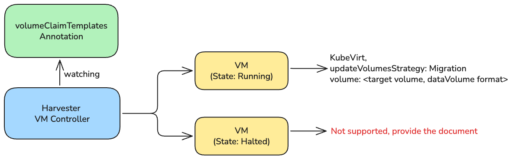

# Storage Migration

## Summary

Storage migration enables users to migrate VM volumes from one storage vendor to another without significant downtime. As Harvester supports multiple storage backends, users need a way to move existing VM data between different storage classes — for example, migrating from Longhorn replicated storage to LVM local storage for better performance, or from local storage to replicated storage for higher availability.

### Related Issues

- https://github.com/harvester/harvester/issues/8285
- https://github.com/harvester/harvester/issues/9412

## Motivation

### Goals

- Allow users to migrate VM volumes from one StorageClass to another.
- Implement support for online storage migration only; offline storage migration behavior remains unchanged.
- Provide documentation describing the recommended offline (VM powered-off) storage migration procedure, without introducing new offline migration features.
- Add DataVolume layer on top of PersistentVolumeClaim to support various storage vendors and enable storage migration.

### Non-goals [optional]

- Cross-cluster storage migration is not in scope.

## Proposal

Introduce a storage migration mechanism that allows users to migrate VM volumes between different storage classes. The migration process is built on top of KubeVirt's VM live migration. However, since storage migration involves copying the entire volume data to the target volume, it may take significantly longer than a regular VM live migration depending on the volume size and storage performance.

### User Stories

#### Story 1: Migrate from local storage to replicated storage for HA

A user has a VM running on LVM local storage. They now need to enable live migration for the VM, which requires replicated storage. The user wants to migrate the volume to Longhorn replicated storage so the VM can be live-migrated across nodes.

#### Story 2: Migrate to third-party storage

A user has integrated a third-party storage solution (e.g., Ceph, NetApp) into Harvester. They want to move existing VM volumes to leverage the new storage backend without downtime.

### User Experience In Detail

1. The user creates the target volume for migration, which is a new PVC with the desired StorageClass.
2. The user navigates to the VM detail page and selects a volume to migrate.
3. The system validates that the migration is feasible (e.g., sufficient capacity in the target storage).
4. The user confirms the migration, and the system begins the migration process by initiating a VM live migration while copying the volume data in the background.
5. Once the migration is complete, the VM automatically uses the new volume.

### API changes

#### harvesterhci.io/volumeClaimTemplates Annotation

We extend the existing `harvesterhci.io/volumeClaimTemplates` annotation on the VirtualMachine CR to support storage migration. A new optional `targetVolume` field is added to each entry to indicate the target PVC for migration.

```json
[
  {
    "pvc": {
      "metadata": {
        "name": "my-vol",
        "namespace": "default",
        "annotations": {
          "harvesterhci.io/imageId": "default/image-abc"
        }
      },
      "spec": {
        "accessModes": ["ReadWriteMany"],
        "resources": {
          "requests": {
            "storage": "10Gi"
          }
        },
        "storageClassName": "longhorn",
        "volumeMode": "Block"
      }
    },
    "targetVolume": "new-pvc-name"
  },
  {
    "pvc": {
      "metadata": {
        "name": "data-vol",
        "namespace": "default"
      },
      "spec": {
        "accessModes": ["ReadWriteMany"],
        "resources": {
          "requests": {
            "storage": "20Gi"
          }
        },
        "storageClassName": "longhorn",
        "volumeMode": "Block"
      }
    }
  }
]
```

- `pvc`: The original PVC spec for the volume, same as the existing format.
- `targetVolume` (optional): The name of the new PVC that the volume should be migrated to. When this field is set, the system will trigger a storage migration for this volume during VM live migration. If not set, the volume remains unchanged.

## Design

### High-level Architecture



### Implementation Overview

1. **New API Field**: Extend the `harvesterhci.io/volumeClaimTemplates` annotation to include an optional `targetVolume` field that specifies the target PVC for migration.
2. **VM Controller**: Enhance the VM controller to detect when a volume has a `targetVolume` specified. When such a volume is detected, the controller will initiate a storage migration process during VM live migration.

The VM Controller will update the following fields in the VM spec:
- Update `spec.template.spec.volumes` to reference the new storage backend. The controller MUST:
  - Prefer the `dataVolume` volume source when the migration flow has created or associated a DataVolume for the `targetVolume` PVC (for example, when a DataVolume CR exists that owns or references the target PVC), and set `volume.dataVolume.name` to that DataVolume name.
  - Fallback to the `persistentVolumeClaim` volume source (setting `volume.persistentVolumeClaim.claimName` to the `targetVolume` PVC name) when no such DataVolume is present for the target volume.
- Update the `updateVolumesStrategy` to `Migration` to trigger the migration process.

3. **DataVolume Integration**: Leverage CDI's DataVolume as the top layer for volume management. The migration would use a new DataVolume that references the target PVC. The DataVolume introduces an abstraction layer that allows for seamless data copying (cloning) between different storage backends.

### Error Handling

#### Cancellation

When a user cancels an in-progress storage migration:

1. The user triggers the cancellation via the UI or API.
2. The controller aborts the ongoing VM live migration.
3. The VM continues to run with the original volume — no data is lost.
4. The controller clears the `targetVolume` field from the annotation.
5. The target PVC is not automatically cleaned up; the user is responsible for deleting it if no longer needed.

#### Migration Failure

When a storage migration fails (e.g., target storage runs out of space, network error, node failure):

1. KubeVirt automatically retries the VM live migration.
2. The retry loop continues until the migration succeeds or the user explicitly cancels it.
3. To stop the retry, the user must trigger a cancellation (same flow as described in the Cancellation section above).
4. The controller updates the VM status/conditions to reflect the failure reason so the user can investigate the underlying issue.

### Backwards Compatibility

With the introduction of the `targetVolume` field, existing VMs that do not specify this field will continue to function as before without any changes. The storage migration feature is entirely opt-in, so there are no breaking changes for existing users.

### Test plan

#### Online Migration Tests

- Create VM with a volume on the source storage class.
- Create a new PVC with the target storage class.
- (Option 1) Update the VM's `harvesterhci.io/volumeClaimTemplates` annotation to include the `targetVolume` field pointing to the new PVC.
- (Option 2) Use UI to trigger the migration by selecting the target PVC for the volume.
- Verify that the migration process starts and completes successfully.

#### StorageMigration Cancellation Tests

- Create StorageMigration scenario as above and try to cancel the migration in the middle of the process.
- Ensure the VM continues to run with the original volume and no data is lost.

#### StorageMigration Failure Tests

- Create StorageMigration scenario as above and try to cancel the migration in the middle of the process.
- Ensure everything is rolled back to the original state and the VM is still functional with the original volume.

### Upgrade strategy

No changes for the upgrade process. The new migration feature is opt-in and does not affect existing functionality.

## Note [optional]

None.

## References
Kubevirt Volume Migration: https://kubevirt.io/user-guide/storage/volume_migration/