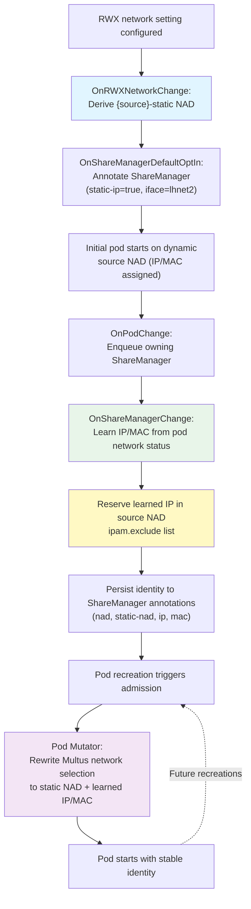

# RWX Static Share Manager Network Identity

## Summary

This design document describes the Harvester backend changes that provide a stable secondary network identity for Longhorn RWX Share Manager pods. The feature builds on the existing Harvester RWX network selection, derives a static NetworkAttachmentDefinition from the already selected source network, learns the first working IP and MAC from the running Share Manager pod, and then reuses that identity on later pod recreations.

The implementation supports both RWX networking modes:

- **Dedicated RWX network**: Share Manager traffic uses the NetworkAttachmentDefinition created for the RWX network setting.
- **Shared storage network**: Share Manager traffic uses the existing storage-network NetworkAttachmentDefinition when the RWX setting is configured to share the storage network.

Once a Share Manager identity is learned, Harvester records the source NAD, derived static NAD, IP address, MAC address, and interface name on the Longhorn `ShareManager`. The Harvester pod mutator then updates the pod's Multus network attachment request so the same interface, IP, and MAC are requested on subsequent pod starts.

### Related Issues

- [Issue #10047](https://github.com/harvester/harvester/issues/10047)

## Motivation

### Goals

- **Provide stable L3 identity**: Preserve the Share Manager pod IP across pod recreation after the initial working identity is learned.
- **Provide stable L2 identity**: Preserve the Share Manager pod MAC address together with the static IP.
- **Reuse the existing RWX network source**: Apply static identity management to the NAD that Harvester already selects for RWX traffic, whether that is the dedicated RWX network or the shared storage network.
- **Avoid manual per-volume network configuration**: Automatically opt in Longhorn Share Managers when a Harvester RWX network is configured.
- **Protect the learned address from reuse**: Add the learned Share Manager IP to the source NAD `ipam.exclude` list so Whereabouts does not allocate it to another pod.
- **Clean up derived state**: Remove stale derived NADs and source NAD excludes when the source network changes or the Share Manager is removed.

## Proposal

### User Stories

**Story 1: As a Harvester administrator**
I want RWX Share Manager pods to keep a stable network identity on the configured RWX network so that NFS traffic has a predictable endpoint.

**Story 2: As a platform operator**
I want Share Manager pods to keep the same secondary interface IP and MAC after recreation so that clients do not need to chase changing NFS endpoints.

**Story 3: As a storage administrator**
I want Harvester to manage the static Multus configuration and address reservation automatically so that operational work stays close to the existing RWX network setting.

**Story 4: As a cluster operator**
I want old static network resources to be cleaned up when the RWX network source changes so that stale NADs and address reservations do not accumulate.

## Design

### Architecture Overview

The static Share Manager network identity implementation is contained in the Harvester backend and uses existing Kubernetes and Longhorn resources:

- **Harvester RWX network setting**: Selects the source network. The source is either the dedicated RWX NAD or the storage-network NAD when the RWX setting shares the storage network.
- **Share Manager controller**: Reconciles Longhorn `ShareManager` annotations, learns pod network identity, reserves learned IPs in the source NAD exclude list, and removes reservations on cleanup.
- **RWX network setting handler**: Creates or updates the derived static NAD and removes obsolete derived NADs when the source changes.
- **Pod watcher**: Requeues Share Managers when their pods change and delays pod removal while required static identity annotations are still being prepared.
- **Pod mutator**: Rewrites the Share Manager pod Multus network selection to request the derived static NAD, learned IP, learned MAC, and configured interface.

No new public Harvester CRD is introduced. The feature is coordinated through internal annotations on Longhorn `ShareManager` objects and generated NetworkAttachmentDefinitions.

### Component Architecture

#### 1. Source Network Selection

The controller reads the Harvester RWX network setting to determine the source NAD:

- If `share-storage-network` is `true`, Harvester reads the storage-network setting and uses its `storage-network.settings.harvesterhci.io/net-attach-def` annotation.
- If `share-storage-network` is `false`, Harvester uses the RWX setting's `rwx-network.settings.harvesterhci.io/net-attach-def` annotation.

The selected source NAD must be marked as either a Harvester storage network or Harvester RWX network through the existing annotations:

- `storage-network.settings.harvesterhci.io`
- `rwx-network.settings.harvesterhci.io`

If the RWX setting is empty, the source NAD cannot be found, or the source NAD is not one of the supported Harvester-managed network types, the Share Manager controller clears the static network state and records the reason in `rwx-harvester-csi.harvesterhci.io/static-ip-status`.

#### 2. Default Share Manager Opt-in

When a usable RWX network source is configured, Harvester automatically annotates Longhorn `ShareManager` objects in the Longhorn namespace with:

```yaml
rwx-harvester-csi.harvesterhci.io/static-ip: "true"
rwx-harvester-csi.harvesterhci.io/interface: "lhnet2"
```

This keeps the static identity flow internal to Harvester. The controller only reconciles Share Managers that have `static-ip=true` and a requested interface annotation.

#### 3. Derived Static NetworkAttachmentDefinition

The RWX network setting handler ensures a derived static NAD exists for the selected source NAD.

For a source NAD named:

```text
harvester-system/rwx-network-762g9
```

Harvester creates or updates:

```text
harvester-system/rwx-network-762g9-static
```

The derived NAD keeps the source CNI configuration but replaces `ipam` with:

```json
{"type":"static"}
```

Hash labels used by the source storage or RWX network controller are removed from the derived NAD so the static NAD is managed by the Share Manager network flow instead of being treated as a source network object.

When the RWX setting points to a new source NAD, Harvester deletes the static NAD derived from the previous source.

#### 4. Learning and Reserving Network Identity

The first Share Manager pod is allowed to come up through the normal dynamic source network path. Harvester then watches the pod's Multus network status and looks for the requested interface.

When the controller finds the requested interface, it reads:

- The first IP address from the interface status.
- The MAC address from the interface status.
- The prefix length from the source NAD IPAM range.

The controller writes the learned identity back to the Longhorn `ShareManager`:

```yaml
rwx-harvester-csi.harvesterhci.io/nad: "harvester-system/rwx-network-762g9"
rwx-harvester-csi.harvesterhci.io/static-nad: "harvester-system/rwx-network-762g9-static"
rwx-harvester-csi.harvesterhci.io/ip: "172.16.0.22/24"
rwx-harvester-csi.harvesterhci.io/mac: "02:00:00:00:00:01"
```

After learning the IP, Harvester appends the host-specific reservation to the source NAD `ipam.exclude` list. For example, a learned `172.16.0.22/24` address is reserved in the dynamic source NAD as:

```json
"exclude":["172.16.0.1/28","172.16.0.22/32"]
```

This prevents Whereabouts from assigning the learned Share Manager IP to another pod while the Share Manager later requests that same address through the derived static NAD.

If the pod is temporarily absent but the Share Manager already has a complete learned identity, Harvester preserves the annotations. This allows recreation to use the known static identity.

#### 5. Pod Mutation

The Harvester pod mutator handles pods owned by Longhorn `ShareManager` objects. When the owning Share Manager has a complete static network identity, the mutator updates the existing Multus network selection for the requested interface.

The mutator requires all of the following annotations before making a change:

- `rwx-harvester-csi.harvesterhci.io/static-nad`
- `rwx-harvester-csi.harvesterhci.io/ip`
- `rwx-harvester-csi.harvesterhci.io/mac`
- `rwx-harvester-csi.harvesterhci.io/interface`

For the matching interface selection, the mutator sets:

- `name` and `namespace` to the derived static NAD.
- `ips` to the learned IP in CIDR form.
- `mac` to the learned MAC.
- `interface` to the requested interface.

The mutator only updates an existing interface selection. If the requested interface is not already present in the pod's network annotation, the mutator leaves the pod unchanged.

#### 6. Pod Removal Guard

The controller watches Share Manager pod removals. If the RWX network is configured but the owning Share Manager has not yet completed the static identity annotations, Harvester requeues the Share Manager and returns an error from the remove handler. This gives the controller a chance to learn and persist the pod's current network identity before the pod disappears.

Once the Share Manager has the source NAD, static NAD, IP, MAC, and no pending status reason, pod removal is allowed to proceed.

#### 7. Cleanup

Harvester removes static identity state in these cases:

- If the source NAD is no longer valid, the Share Manager `nad`, `static-nad`, `ip`, and `mac` annotations are cleared and a status reason is recorded.
- If the source NAD changes, the previously learned IP is removed from the old source NAD `ipam.exclude` list and the learned identity is cleared.
- If the Share Manager is removed, the learned IP is removed from the current source NAD `ipam.exclude` list.
- If the derived static NAD is missing, the controller keeps the source NAD annotation, clears the learned identity, records a pending status, and requeues the RWX setting and Share Manager.

### End-to-End Flow



#### Controller Roles

| Handler | Responsibility |
|---|---|
| `OnRWXNetworkChange` | Derives `{source}-static` NAD when RWX setting changes; enqueues ShareManagers |
| `OnShareManagerDefaultOptIn` | Auto-annotates ShareManagers with `static-ip=true`, `iface=lhnet2` |
| `OnShareManagerChange` | Main reconciler: validates NADs, learns IP/MAC from pod, reserves IP |
| `OnPodChange` | Enqueues owning ShareManager when pod network status updates |
| `OnPodRemove` | Blocks pod deletion until static identity is fully learned |
| `OnShareManagerRemove` | Releases reserved IP from source NAD exclude list |
| Pod Mutator (webhook) | Rewrites pod's Multus network to use static NAD + learned IP/MAC |

The default opt-in handlers run in a separate registration block from the main reconciliation handlers, keeping the auto-annotation behavior isolated from the static identity logic.

---

## Implementation Details

### Part 1: Controller Registration

The `share-manager-static-ip` controller registers handlers for:

- RWX network setting changes.
- Share Manager changes.
- Share Manager removals.
- Share Manager pod changes.
- Share Manager pod removals.

The default opt-in handlers are intentionally separate from the main static identity reconciliation path. This keeps the automatic annotation behavior small and lets the main controller focus on validating the network, learning identity, and maintaining static state.

### Part 2: RWX Network Setting Handler

The setting handler performs three operations whenever the RWX setting changes:

1. Resolve the current source NAD and previous source NAD.
2. Ensure the current source has a derived `*-static` NAD.
3. Delete the derived static NAD for the previous source when the source changed.

After reconciling derived NADs, the handler requeues Share Managers that request static IP handling so they refresh their source and static NAD annotations.

### Part 3: Share Manager Reconciliation

The Share Manager controller performs reconciliation in this order:

1. Check whether the Share Manager requests static IP handling.
2. Resolve and validate the source NAD from the RWX network setting.
3. Clear stale identity when the source NAD changed.
4. Ensure the derived static NAD exists and write the static NAD annotation.
5. Learn IP and MAC from the current Share Manager pod if needed.
6. Reserve the learned IP in the source NAD `ipam.exclude` list.
7. Update the Share Manager annotations only when the desired state changed.

The controller stores transient problems in:

```text
rwx-harvester-csi.harvesterhci.io/static-ip-status
```

Current status reasons include:

- `rwx network configuration does not reference a source NAD`
- `source NAD is not available`
- `source NAD is not marked as a RWX network`
- `waiting for the derived static NAD`
- `waiting for the share manager pod network identity`

### Part 4: Pod Mutator

The pod mutator now receives the Longhorn Share Manager cache during webhook setup. For Share Manager pods, it loads the owning `ShareManager` and updates the Multus networks annotation only when the Share Manager has complete static identity annotations.

The mutation is intentionally conservative:

- It does nothing if `static-ip` is not `true`.
- It does nothing until static NAD, IP, MAC, and interface are all present.
- It does nothing if the requested interface is not already in the pod's Multus network annotation.
- It preserves unrelated network selections.

### Part 5: Generated Clients and Test Fakes

The change adds generated Longhorn ShareManager controller clients and fake client helpers used by the controller and webhook tests. It also refreshes Whereabouts generated clients used by the project.

## Test Plan

The Harvester backend unit tests cover:

- Using the storage network source when RWX is configured with `share-storage-network=true`.
- Using the dedicated RWX source NAD when RWX is configured with `share-storage-network=false`.
- Creating and updating derived static NADs with `ipam.type=static`.
- Removing old derived static NADs when the source network changes.
- Default opt-in of Share Managers when the RWX network is configured.
- Waiting for pod network identity before writing IP and MAC annotations.
- Preserving learned identity when the pod is absent.
- Reserving learned IPs in the source NAD exclude list.
- Removing reserved IPs when Share Managers are removed or source networks change.
- Blocking pod removal while static identity is incomplete.
- Mutating Share Manager pod network selections with static NAD, IP, MAC, and interface.
- Skipping mutation when required annotations or the requested interface are missing.

End-to-end validation should confirm:

- RWX Share Manager pods attach to the expected RWX or shared storage network.
- A Share Manager pod keeps the same secondary interface IP and MAC after recreation.
- The learned IP is present in the source NAD `ipam.exclude` list while the Share Manager exists.
- Changing the RWX network setting creates a new derived static NAD and removes the old static NAD.
- Removing a Share Manager releases its learned IP from the source NAD exclude list.

## Upgrade Strategy

This enhancement is backward compatible.

Existing clusters without a configured RWX network source do not enter the static identity flow. When a usable RWX network source is configured, Harvester automatically opts Share Managers into static identity management and learns identity from the first running pod before enforcing the static NAD, IP, and MAC on future pod starts.

During upgrade, existing Share Manager pods may need one reconcile cycle to have their identity learned and recorded. Until the complete identity is available, the pod mutator leaves pod network annotations unchanged and the Share Manager carries a static IP status reason describing what is still pending.
