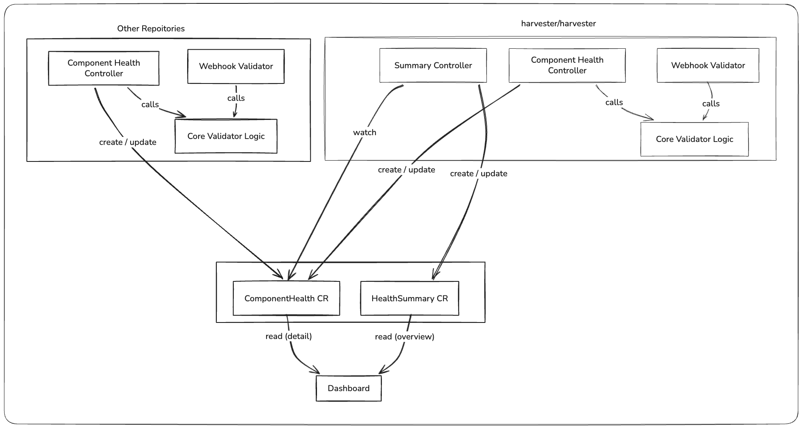

# Service Health Dashboard

## Summary

Harvester currently lacks a unified way to inspect the health of its internal components. When users report issues, the investigation requires manually checking resources across multiple controllers. This enhancement introduces a framework for proactive health reporting: each component maintains a `ComponentHealth` CR describing its current check results, and a summary controller aggregates all component CRs into a single `HealthSummary` CR that the dashboard can display.

### Related Issues

https://github.com/harvester/harvester/issues/8436

## Motivation

When a user-reported issue is vague, there is no single place to determine the root cause. Engineers must inspect each component individually. In addition, certain invalid operations (e.g. deleting default resources) are only caught at the moment the user attempts them, rather than surfaced proactively.

### Goals

- Provide a `ComponentHealth` CRD so each component can report its own health checks continuously.
- Provide a `HealthSummary` CRD that aggregates all component health statuses into a single resource the dashboard can read.
- Share the same validation logic between the webhook layer and the health check layer to ensure consistency.

### Non-goals

- Replacing or duplicating existing Kubernetes node/pod health mechanisms.

## Introduction

There are three architectural layers to this enhancement, each building on the previous:

**Layer 1 — Admission Webhooks**

Each component registers a validating admission webhook that blocks requests which would break unexpected behaviors. This is a purely reactive layer: it only acts when a user attempts an invalid operation.

**Layer 2 — ComponentHealth CRD**

Each component runs a reconcile loop that re-evaluates the same validation rules used by its webhook and writes the results to its own `ComponentHealth` CR. This makes health status continuously visible rather than discoverable only at request time.

**Layer 3 — HealthSummary CRD**

A dedicated summary controller watches all `ComponentHealth` CRs and maintains a single `HealthSummary` CR. The dashboard reads only the summary CR for the overview, then fetches individual `ComponentHealth` CRs for detail when a user drills down.

#### Architecture Diagram



## Proposal

### User Stories

#### Story 1

As a Harvester administrator, I open the dashboard and immediately see that the upgrade component is reporting an error because a default StorageClass is missing. I can click through to see which resource is affected and take action before attempting an upgrade.

#### Story 2

As an engineer debugging a customer issue, I run `kubectl get componenthealth --all` and instantly see which components have active warnings or errors, without needing to inspect each controller's logs individually.

#### Story 3

As a VM operator, I see a warning on the dashboard that three of my VMs cannot be live migrated because they have CD-ROM devices attached. I can resolve the issue before scheduling a maintenance window.

### API Changes

Two new CRDs are introduced under the `health.harvesterhci.io/v1beta1` API group. Both are cluster-scoped.

#### ComponentHealth

Each component creates and owns one `ComponentHealth` CR named after itself.

```yaml
apiVersion: health.harvesterhci.io/v1beta1
kind: ComponentHealth
metadata:
  name: upgrade-controller
status:
  lastCheckedAt: "2026-05-15T10:00:00Z"
  checks:
    - severity: Error    # Error | Warning | Info
      reason: DefaultStorageClassMissing
      message: "Default StorageClass 'longhorn' is missing"
      affectedCount: 1
      affectedResource:
        apiVersion: storage.k8s.io/v1
        kind: StorageClass
        names:
          - longhorn
    - severity: Warning
      reason: VMCDRomAttached
      message: "150 VMs cannot be live migrated: CD-ROM attached"
      affectedCount: 150
      truncated: true
      affectedResource:
        apiVersion: kubevirt.io/v1
        kind: VirtualMachine
        names:
          - default/vm1
          - default/vm2
```

`affectedResource.names` uses `namespace/name` for namespaced resources and bare `name` for cluster-scoped resources. When the number of affected resources exceeds a threshold (recommended: 20), `names` is truncated to that limit and `truncated: true` is set to signal to the dashboard that more exist.

`affectedResource` is a pointer field and may be absent for checks that do not relate to a specific resource kind.

#### HealthSummary

There is exactly one `HealthSummary` CR, named `cluster`, maintained by the summary controller.

```yaml
apiVersion: health.harvesterhci.io/v1beta1
kind: HealthSummary
metadata:
  name: cluster
status:
  lastCheckedAt: "2026-05-15T10:00:00Z"
  components:
    - name: upgrade-controller
      errorCount: 1
      warningCount: 0
    - name: pcidevices-controller
      errorCount: 0
      warningCount: 2
```

The summary CR does not embed the check details from each component. Its only role is to give the dashboard a single read to determine per-component error and warning counts. Detail is always fetched from the individual `ComponentHealth` CR.

### Go Types

```go
// ComponentHealth

type ComponentHealthStatus struct {
    LastCheckedAt metav1.Time   `json:"lastCheckedAt"`
    Checks        []CheckResult `json:"checks,omitempty"`
}

type CheckResult struct {
    Severity         Severity          `json:"severity"`
    Reason           string            `json:"reason"`
    Message          string            `json:"message"`
    AffectedCount    int               `json:"affectedCount,omitempty"`
    Truncated        bool              `json:"truncated,omitempty"`
    AffectedResource *AffectedResource `json:"affectedResource,omitempty"`
}

type AffectedResource struct {
    APIVersion string   `json:"apiVersion"`
    Kind       string   `json:"kind"`
    Names      []string `json:"names"`
}

type Severity string

const (
    SeverityError   Severity = "Error"
    SeverityWarning Severity = "Warning"
    SeverityInfo    Severity = "Info"
)

// HealthSummary

type HealthSummaryStatus struct {
    LastCheckedAt metav1.Time        `json:"lastCheckedAt"`
    Components    []ComponentSummary `json:"components,omitempty"`
}

type ComponentSummary struct {
    Name         string `json:"name"`
    ErrorCount   int    `json:"errorCount"`
    WarningCount int    `json:"warningCount"`
}
```

## Design

### Implementation Overview

#### Shared Validation Logic

This framework surfaces two broad categories of health signal:

- **Missing required resources** — a default or system resource that must always exist has been removed (e.g. the default StorageClass was deleted). The corresponding webhook blocks the deletion; the health controller confirms the resource still exists and reports an error if it does not.
- **Resource configuration that blocks expected operations** — a resource exists but its current configuration prevents a normal operation from succeeding (e.g. a VM has a CD-ROM device attached and cannot be live-migrated). There is no deletion webhook for this case; the health controller detects and surfaces it proactively.

Shared validation logic lives in `pkg/util/validator/`. These packages expose a `Validator` struct whose methods return `([]AffectedResource, error)`, with no dependency on webhook error types or health CR types.

```go
// pkg/util/validator/storage.go

type AffectedResource struct {
    Namespace string // empty for cluster-scoped resources
    Name      string
}

type StorageValidator struct { ... }

// ValidateDefaultStorageClasses returns any required default StorageClasses
// that are currently missing. An empty slice means all defaults are present.
func (v *StorageValidator) ValidateDefaultStorageClasses(
    storageClassCache StorageClassCache,
) ([]AffectedResource, error) {
    var missing []AffectedResource
    for _, name := range requiredDefaultStorageClasses {
        _, err := storageClassCache.Get(name)
        if apierrors.IsNotFound(err) {
            missing = append(missing, AffectedResource{Name: name})
            continue
        }
        if err != nil {
            return nil, err
        }
    }
    return missing, nil
}
```

#### Webhook Layer

The webhook validator blocks deletion of any resource that is in the required-defaults list. It may call the shared validator or apply the same list directly:

```go
// pkg/webhook/resources/storageclass/validator.go

func (v *storageClassValidator) Delete(_ *types.Request, obj runtime.Object) error {
    sc := obj.(*storagev1.StorageClass)
    if isRequiredDefault(sc.Name) {
        return werror.NewMethodNotAllowed(
            fmt.Sprintf("default StorageClass %q cannot be deleted", sc.Name))
    }
    return nil
}
```

#### Component Health Controller

The health controller injects the same shared `Validator` and builds a `CheckResult` from the structured output. Severity, reason, and resource metadata are decided here — the shared validator has no opinion on them:

```go
// pkg/controller/master/componenthealth/storage.go

func (h *storageHealthHandler) checkDefaultStorageClasses() (*CheckResult, error) {
    missing, err := h.validator.ValidateDefaultStorageClasses(h.storageClassCache)
    if err != nil {
        return nil, err
    }
    if len(missing) == 0 {
        return nil, nil
    }
    names := toNameList(missing)
    return &CheckResult{
        Severity:      SeverityError,
        Reason:        "DefaultStorageClassMissing",
        Message:       fmt.Sprintf("Default StorageClass(es) missing: %s", names),
        AffectedCount: len(missing),
        AffectedResource: &healthv1beta1.AffectedResource{
            APIVersion: storagev1.SchemeGroupVersion.String(),
            Kind:       "StorageClass",
            Names:      names,
        },
    }, nil
}
```

The reconcile loop collects results from all check functions and patches the CR:

```go
var checks []CheckResult

if cr, err := h.checkDefaultStorageClasses(); err != nil {
    return err
} else if cr != nil {
    checks = append(checks, *cr)
}

// ... additional check functions ...

status := ComponentHealthStatus{
    LastCheckedAt: metav1.Now(),
    Checks:        checks,
}
// patch the ComponentHealth CR status
```

The controller is event-driven where possible (e.g. watch the relevant resource to trigger re-evaluation on change).

```go
storageClassClient.OnChange(ctx, "compoent-health-sc", handler1)
virtualMachineClient.OnChange(ctx, "compoent-health-vm", handler2)
```

#### Summary Controller

A single summary controller in the main Harvester process watches all `ComponentHealth` CRs. On any change:

1. It filters out any CR named `cluster` to avoid processing its own output.
2. It reads all other `ComponentHealth` CRs.
3. It computes per-component error and warning counts.
4. It upserts the `HealthSummary` CR named `cluster`, creating it if absent.

```go
func (c *SummaryController) OnComponentHealthChange(key string, health *v1beta1.ComponentHealth) error {
    if health.Name == "cluster" {
        return nil
    }
    return c.reconcileSummary(ctx)
}
```

#### Scale Consideration

For checks that may match a large number of resources (e.g. VMs that cannot migrate), the controller must not write an unbounded list into the CR. The implementation must cap `AffectedResource.Names` at a configurable limit (default: 20) and set `Truncated: true` when the full result set exceeds that limit. `AffectedCount` always reflects the true total regardless of truncation.


Action Items:

- [ ] Define `health.harvesterhci.io/v1beta1` CRD manifests for `ComponentHealth` and `HealthSummary`.
- [ ] Define the `Checker` interface and shared validation package.
- [ ] Implement the summary controller.
- [ ] Implement `ComponentHealth` reconciler and `Checker` integration per component, starting with: upgrade, live migration, PCI devices.
- [ ] Add webhook registration per componentg using the same `Checker` implementations.
- [ ] Add dashboard support to read `HealthSummary` and drill down to `ComponentHealth`.

### Test Plan

Covered in individual component pull requests. At minimum each component must provide:

- Unit tests for each `Checker` implementation.
- An integration test that verifies the `ComponentHealth` CR reflects the expected check results when a check condition is introduced and cleared.

### Upgrade Strategy

The `HealthSummary` CR is created by the summary controller on first run; no manual bootstrap is required. Existing clusters upgrading to this version will have their `ComponentHealth` CRs created the first time each component's controller reconciles after upgrade.

## Limitations

### Cross-repository Import Dependency

`HealthSummary` is read and written exclusively by the summary controller inside `harvester/harvester`, so its Go types can remain entirely within that repository.

`ComponentHealth` is different: any component that lives in a separate repository (e.g. `pcidevices-controller`) must write its own `ComponentHealth` CR. That means the `health.harvesterhci.io/v1beta1` API types — including `ComponentHealth`, `CheckResult`, `AffectedResource`, and the generated client/informer code — must be importable from outside `harvester/harvester`. This introduces a cross-repository import dependency: external component repositories must vendor or depend on the Harvester API package that exposes these types.

As a result, any breaking change to the `ComponentHealth` Go types or CRD schema requires coordinated updates across all repositories that implement a component health controller.
