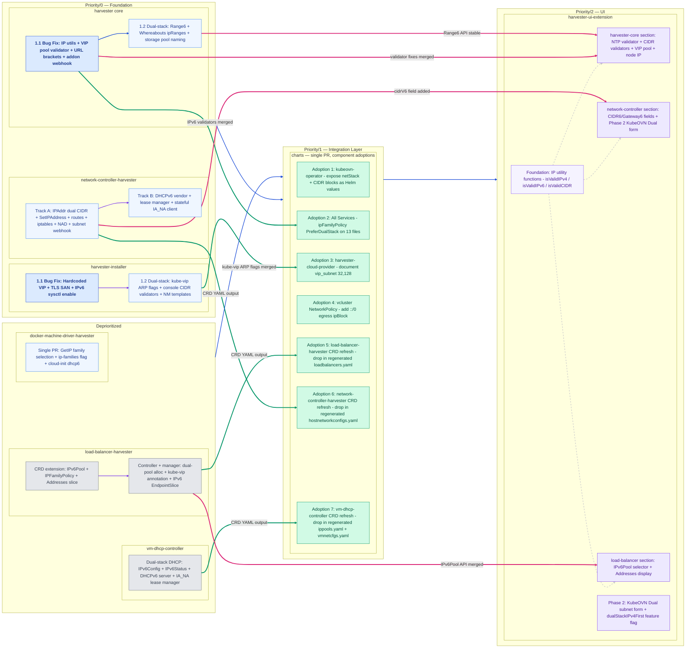

# Dual-Stack IPv4-First Networking Support

Introduce dual-stack (IPv4 + IPv6) networking across the Harvester platform with IPv4 as the
primary address family. Every component that currently hardcodes IPv4-only assumptions is
extended to carry, validate, and act on both address families while preserving full backward
compatibility for existing IPv4-only deployments.

---

## Table of Contents

- [Summary](#summary)
  - [Related Issues](#related-issues)
- [Motivation](#motivation)
  - [Goals](#goals)
  - [Non-goals](#non-goals)
  - [Experimental Status](#experimental-status)
- [Proposal](#proposal)
  - [User Stories](#user-stories)
  - [User Experience In Detail](#user-experience-in-detail)
  - [API Changes](#api-changes)
- [Design](#design)
  - [Implementation Overview](#implementation-overview)
- [Test Plan](#test-plan)
  - [Scope for this HEP](#scope-for-this-hep)
  - [Unit Tests](#unit-tests)
  - [Integration Tests *(deferred)*](#integration-tests-deferred--for-reference-only)
  - [End-to-End Tests *(deferred)*](#end-to-end-tests-deferred--for-reference-only)
  - [Test Infrastructure *(deferred)*](#test-infrastructure-deferred-to-ipv6-first-hep)
- [Upgrade Strategy](#upgrade-strategy)
- [Note: Design Principle](#design-principle-opt-in-switch-off-by-default)

---

## Summary

Harvester's networking stack is currently end-to-end IPv4-only. Address fields, CRD validation
rules, DHCP servers, IP utility helpers, installer templates, Helm chart values, and UI
validators all assume a single IPv4 address family. This works for existing deployments but
blocks operators who run dual-stack infrastructure, where both IPv4 and IPv6 addresses must be
simultaneously valid and routable on the same network segment.

This proposal adds **IPv4-first dual-stack** support across eight Harvester repositories:
`vm-dhcp-controller`, `network-controller-harvester`, `harvester` (core),
`load-balancer-harvester`, `harvester-installer`, `docker-machine-driver-harvester`, `charts`,
and `harvester-ui-extension`. IPv4 remains the primary address family at every layer; IPv6 is
the secondary. Existing single-stack IPv4 clusters are unaffected — all changes are additive and
backward-compatible.

The work is organized into delivery phases aligned with dependency order:
- **Priority/0 (Foundation):** Cluster infrastructure and host networking — `harvester` (core),
  `harvester-installer`, `network-controller-harvester`
- **Priority/1 (Integration):** Charts and integrations that consume Priority/0 API contracts — `charts`
- **Priority/2 (Polish & UI):** `harvester-ui-extension`
- **Deprioritized:** Components constituting the Rancher Cloud Provider integration path —
  `load-balancer-harvester`, `vm-dhcp-controller`, `docker-machine-driver-harvester`. Full
  dual-stack Harvester Cloud Provider support (guest cluster provisioning) is deferred to a
  follow-on iteration once the cluster infrastructure foundation is validated.

**Release safety:** Every sub-task in this plan is structured so that Harvester remains in a
fully working, releasable state after each individual merge. No combination of partial merges
leaves the platform broken or blocks a release. If a blocker is hit mid-cycle, all already-merged
sub-tasks can ship as-is in the current release and the blocked sub-task defers to the next.
There is no scenario where merged work would need to be reverted to make a release.

Explicitly out of scope for this proposal: IPv6-only mode, IPv6-first ordering, DHCPv6 for host
interfaces (covered by a separate HEP), in-place IP family migration, and guest OS
IPv6 configuration enforcement.

### Related Issues

- https://github.com/harvester/harvester/issues/10637 — primary tracking issue (Epic)
- https://github.com/harvester/harvester/issues/10755 — harvester-installer
- https://github.com/harvester/harvester/issues/10756 — harvester (core)
- https://github.com/harvester/harvester/issues/10758 — docker-machine-driver-harvester *(deprioritized)*
- https://github.com/harvester/harvester/issues/10759 — network-controller-harvester
- https://github.com/harvester/harvester/issues/10767 — load-balancer-harvester *(deprioritized)*
- https://github.com/harvester/harvester/issues/10768 — vm-dhcp-controller *(deprioritized)*
- https://github.com/harvester/harvester/issues/10769 — charts
- https://github.com/harvester/harvester/issues/10770 — harvester-ui-extension

---

## Motivation

We can roll out IPv6 support in stages. A dual-stack, IPv4-first setup means supporting both
IPv4 and IPv6 in the same cluster where, by default, each service works with IPv4 addresses
unless explicitly overridden.

This approach is more flexible and forgiving, allowing for an easier transition. Administrators can
enable IPv6 for individual components incrementally, work around unverified components by
leaving them in single-stack mode, and validate end-to-end functionality before committing to
a fully dual-stack deployment.

### Goals

- **Experimental:** All dual-stack configuration surfaces delivered in this iteration are
  labeled experimental at every entry point — installer console warning, UI tooltip, and API
  field description. Existing IPv4-only paths are completely unaffected and carry no warnings.

- **Non-breaking upgrade:** Upgrading from an IPv4-only Harvester version leaves all
  components in single-stack IPv4 mode. No existing resource, field default, or cluster
  behavior changes; dual-stack is activated only by explicit administrator action.

- **Additive only:** Every change introduces new optional fields or new accepted input formats.
  Omitting a new field or supplying a single IPv4 CIDR (the existing format) leaves the
  component behaving exactly as before.

- **Bug fixes (unconditional — ship regardless of dual-stack adoption):** These correct wrong
  behavior in all deployments, not just dual-stack ones:
  - Fix hardcoded VIP literal, TLS SAN, and server-url in the installer so every deployment
    uses the administrator-supplied VIP rather than compile-time constants.
  - Fix IPv6 VIP URL construction to use RFC 3986 bracket notation in generated kubeconfigs.
  - Fix IPv6 address rejection in the `vip-pools` validator.
  - Fix webhook guards to check `V6UsingIPs` alongside `V4UsingIPs` so active IPv6
    allocations are not silently ignored when disabling KubeOVN or changing Subnet topology.
  - Enable IPv6 at the kernel level during the live installer session and persist it on the
    installed node so NetworkManager profiles with `[ipv6] method=auto` take effect.

- **Install time:** Accept comma-separated IPv4-first CIDR pairs for `cluster-cidr`,
  `service-cidr`, and `cluster-dns`; enforce IPv4-first ordering at the installer console;
  configure kube-vip in ARP mode for the IPv4 primary VIP.

- **Host networking:** Allow VLAN interfaces (`HostNetworkConfig`) to carry a comma-separated
  IPv4-first CIDR pair; extend bridge-VLAN management to assign, route, and clean up IPv6
  addresses alongside IPv4, including `ip6tables` rules and IPv6 sysctl.

- **VM overlay networking:** Expose `netStack` as a Helm value in `kubeovn-operator` so VM
  Networks can be created with `spec.protocol: Dual` — the only change needed to let VM NICs
  receive IPv6 addresses from KubeOVN's existing IPAM. Also expose `ipv6` and `dualStack`
  CIDR blocks as chart values.

- **Workload networks:** Allow `storage-network`, `rwx-network`, and `vm-migration-network`
  to accept an optional secondary IPv6 CIDR alongside the existing IPv4 CIDR.

- **Charts:** Add `ipFamilyPolicy: PreferDualStack` and `ipFamilies: [IPv4, IPv6]` to Helm
  chart Services so they degrade gracefully on IPv4-only clusters.

- **UI:** Display IPv6 addresses (IPv4-first), accept IPv6 CIDRs in settings forms, and
  expose a `Dual` subnet protocol option (gated on E6 CRD verification).

- **Deprioritized (Rancher Cloud Provider path — follow-on iteration):** The components below
  enable guest cluster provisioning, VM DHCP assignment, and load balancer dual-stack exposure.
  They will be picked up once the cluster infrastructure foundation above is validated:
  - **`docker-machine-driver-harvester`** ([#10758](https://github.com/harvester/harvester/issues/10758)): IPv4-first IP selection for Rancher guest cluster node provisioning on dual-stack VMs.
  - **`load-balancer-harvester`** ([#10767](https://github.com/harvester/harvester/issues/10767)): Dual-stack `LoadBalancer` with a secondary IPv6 pool and kube-vip dual-VIP annotation.
  - **`vm-dhcp-controller`** ([#10768](https://github.com/harvester/harvester/issues/10768)): Stateful DHCPv6 (IA_NA) for VM NICs via embedded `dhcpv6/server6`.

### Non-goals

- **IPv6-first or IPv6-only ordering (`[IPv6, IPv4]` or `[IPv6]`).** This proposal covers
  exclusively the first step of a multi-phase IPv6 adoption path:
  1. **This HEP:** IPv4-first dual-stack — the default family stays IPv4; IPv6 is additive.
  2. **Future HEP (IPv6-first):** IPv6 as the primary family, IPv4 secondary.
  3. **Future HEP (IPv6-only):** No IPv4 at all.
  Each phase must be separately designed and approved. IPv6-first changes to ordering, default
  CIDR values, and primary VIP family are out of scope for this proposal and belong to the
  correct future HEP.

- **IPv6-only mode.** Running Harvester on a management network with no IPv4 connectivity is
  out of scope; it is covered by the future IPv6 Support HEP.

- **DHCPv6 for host interfaces.** Assigning IPv6 addresses to **host VLAN interfaces** via
  a dynamic DHCPv6 client (Track B of `network-controller-harvester`) is out of scope for
  this HEP and is handled by the broader IPv6 Support HEP alongside the E2 architecture
  decision. Track A (all other `network-controller-harvester` host-network changes) merges
  fully under this HEP. Note: DHCPv6 **for VM guests** via `vm-dhcp-controller` is tracked
  in [#10768](https://github.com/harvester/harvester/issues/10768) and is deprioritized for
  this iteration.

- **In-place IP family migration.** Converting a running IPv4-only cluster to dual-stack
  without reinstalling is not supported; cluster IP family is baked into RKE2 config, etcd
  peer URLs, and kube-vip configuration at install time.

- **Guest OS IPv6 configuration enforcement.** Address assignment inside the VM guest is
  guest-OS-specific. This proposal covers the host and network infrastructure; guest-facing
  cloud-init validation is extended only to avoid rejecting valid dual-stack configs.

- **NAT64/DNS64 or any protocol translation.** This proposal assumes dual-stack infrastructure
  where both families are natively routable.

- **Rancher server IPv6 support.** Rancher itself must be reachable via IPv6 for Harvester to
  register in IPv6-only environments; that is tracked separately.

- **Backup target IPv6.** Configuring NFS/S3 backup targets reachable only via IPv6 is out of
  scope.

- **VM management network (`mgmt`) IPv6 NAT/Masquerade.** VMs on the default `mgmt` network
  require separate changes to the mgmt bridge and masquerade rules; tracked as follow-on work.

- **Dual-stack integration and end-to-end test infrastructure.** Provisioning a dual-stack
  CI environment (dual-stack lab cluster, DHCPv6-capable guest images, CNI multicast
  verification) is deferred to the IPv6-first HEP. That HEP requires a dual-stack test
  environment regardless; building it once there — rather than prematurely here — avoids
  duplicating the infrastructure investment. For this HEP, the test obligation is unit tests
  and IPv4 regression only. The dual-stack integration and E2E test cases are documented
  below for completeness and will be executed against the environment provisioned by the
  IPv6-first HEP.

---

### Experimental Status

All dual-stack **configuration surfaces** delivered in this iteration are considered
**experimental**. IPv4-only operation is unaffected and remains fully supported.
Experimental status applies until the integration and E2E test suite (deferred to the
IPv6-first HEP) completes successfully and each surface is explicitly promoted to stable.

| Surface | Where | Status |
|---------|-------|--------|
| Dual-stack CIDR input at install time (`cluster-cidr`, `service-cidr`, `cluster-dns`) | Installer console | **Experimental** — display a warning when a comma-separated pair is entered |
| Dual-stack `HostNetworkConfig` CIDR pair | UI / kubectl | **Experimental** — gated by the same warning convention |
| `storage-network`, `rwx-network`, `vm-migration-network` IPv6 CIDR | UI / settings API | **Experimental** |
| `netStack: dual_stack` in `kubeovn-operator` chart values | Helm / UI VM Networks form | **Experimental** — `Dual` protocol subnet option gated on E6 verification |
| IPv6 address display and input in all settings forms | UI | **Experimental** |
| `vip-pools` IPv6 CIDR entries | UI / kubectl | **Experimental** |

**What experimental means in practice:**
- Each configuration surface produces a visible warning or annotation (console prompt, UI
  tooltip, or API field description) indicating the feature is experimental.
- Existing IPv4-only paths pass through without any warning or behavior change.
- Dual-stack activation should not be used in production without thorough evaluation in the
  target environment.

---

## Proposal

### User Stories

#### Story 1 — Administrator configures a dual-stack Harvester cluster at install time *(experimental)*

**Before:** The Harvester installer accepts only a single IPv4 CIDR for each of cluster-cidr,
service-cidr, and cluster-dns. Any attempt to enter a comma-separated pair is rejected by the
console validators. The resulting cluster cannot assign IPv6 addresses to pods, services, or
nodes.

**Why this matters:** Data-center operators managing environments with both IPv4 and IPv6
routable infrastructure need the cluster control-plane to support both families simultaneously
so workloads can be reachable via either protocol without additional gateway complexity.

**After:** The installer console accepts comma-separated IPv4-first CIDR pairs (e.g.
`10.42.0.0/16,fd42::/48`) for cluster-cidr and service-cidr, and comma-separated IPv4,IPv6
DNS addresses for cluster-dns. The console enforces IPv4-first ordering and rejects reversed
inputs with a clear error message. RKE2 is configured with IPv4 as the primary family for all
pod, service, and DNS allocation. kube-vip is correctly configured in ARP mode (IPv4 primary
VIP) via the `env:` injection path that the bundled chart actually reads.

#### Story 2 — VM guest receives both IPv4 and IPv6 addresses via DHCP *(deprioritized — [#10768](https://github.com/harvester/harvester/issues/10768))*

Extending `vm-dhcp-controller` to serve stateful DHCPv6 (IA_NA) leases alongside DHCPv4 is
deprioritized for this iteration. The full design — including an embedded `dhcpv6/server6`,
IPv6Config API extension, and pool range limits — is captured in
[#10768](https://github.com/harvester/harvester/issues/10768). IPv4 DHCP operation is
completely unaffected by this deferral.

#### Story 3 — Rancher provisions guest cluster nodes on a dual-stack Harvester cluster *(deprioritized — [#10758](https://github.com/harvester/harvester/issues/10758))*

**Before:** The `docker-machine-driver-harvester` reads only `vmi.Status.Interfaces[0].IP` (a
single string), explicitly rejects any address where `ip.To4() == nil`, and times out when
the QEMU guest agent surfaces an IPv6 address first. Node provisioning fails on dual-stack VMs
where IPv6 is the first-reported address.

**Why this matters:** Rancher customers using dual-stack Harvester infrastructure cannot
provision downstream (guest) Kubernetes clusters because the node driver cannot resolve a
usable IP for SSH and agent installation.

**After:** The driver scans `vmi.Status.Interfaces[0].IPs []string` (the full address list)
using an IPv4-first selection algorithm driven by the new `--harvester-ip-families` flag
(default `"IPv4"`; accepts `"IPv4,IPv6"`). Rancher always receives an IPv4 address for
provisioning. The driver also populates `BaseDriver.IPv6Address` from `GetIPv6()`, enabling
dual-stack node certificates in environments where both families are required.

#### Story 4 — LoadBalancer resource exposes a service on both IPv4 and IPv6 *(deprioritized — [#10767](https://github.com/harvester/harvester/issues/10767))*

**Before:** A Harvester `LoadBalancer` resource references a single IPv4 IPPool. The resulting
Kubernetes Service has only one LoadBalancer ingress (IPv4), and there is no mechanism to
assign a second external IPv6 VIP to the same service.

**Why this matters:** Administrators serving traffic on dual-stack clusters need load balancers to
be reachable on both families without requiring two separate services.

**After:** The administrator sets `spec.ipv6Pool` to an IPv6-family IPPool alongside the existing
`spec.ipPool`. The controller creates a `PreferDualStack` Kubernetes Service annotated with
`kube-vip.io/loadbalancerIPs: "<ipv4>,<ipv6>"`. kube-vip assigns both VIPs. The
`LoadBalancerStatus.Addresses` field carries all assigned VIPs; the existing `Address` field
retains the IPv4 VIP for backward compatibility. Omitting `spec.ipv6Pool` leaves the
LoadBalancer in single-stack IPv4 mode unchanged.

#### Story 5 — Host VLAN interfaces carry IPv4 and IPv6 addresses simultaneously *(experimental)*

**Before:** `HostNetworkConfig.Spec.IPs` accepts only a single IPv4 CIDR per interface. The
corresponding VLAN link has only the IPv4 address configured. VM networking on that host cannot
forward IPv6 traffic.

**Why this matters:** On a dual-stack cluster, the host interface bridging VM traffic must
itself have both address families configured so that both IPv4 and IPv6 packets can be
forwarded and routed correctly.

**After:** The `IPAddr` CRD type accepts either a single IPv4 CIDR (existing behavior) or a
comma-separated IPv4-first pair (e.g. `"10.0.1.5/24,2001:db8::5/64"`). The CEL validation
rule enforces IPv4-first ordering at admission. The `SetIPAddress` implementation assigns both
addresses to the VLAN link and cleans up stale addresses for both families. Single IPv4 CIDRs
continue to work without any configuration change.

#### Story 6 — UI user can display and configure IPv6 addresses *(experimental)*

**Before:** IPv6 VM/VMI addresses are silently dropped from the IP display column (filtered by
`isIpv4()`). IPv6 NTP server addresses are rejected by the settings validator. IPv6 CIDRs
entered in the storage-network, RWX-network, or VM-migration-network forms are rejected.

**Why this matters:** Administrators managing dual-stack clusters need the UI to accurately reflect
the network state and accept valid IPv6 inputs rather than silently discarding or rejecting them.

**After:** VM/VMI IPv6 addresses are displayed alongside IPv4 addresses (IPv4 first). NTP
settings accept IPv6 server addresses. Storage/RWX/VM-migration network forms accept IPv6
CIDRs and exclude lists. The KubeOVN subnet form exposes a `Dual` protocol option. Error
messages and placeholder text are updated to be family-agnostic.

#### Story 7 — Administrator creates a dual-stack VM Network (KubeOVN overlay) *(experimental)*

**Before:** All VM Networks backed by KubeOVN operate in IPv4-only mode. The
`kubeovn-operator` chart hardcodes `netStack: ipv4`, which prevents KubeOVN from entering
dual-stack mode even though the `subnets.kubeovn.io` CRD already defines `spec.protocol:
Dual`, the `ProtocolDual` constant, and a comma-separated `spec.cidrBlock` field. There is no
way to create a VM Network that assigns both IPv4 and IPv6 addresses to VM NICs on the overlay
network.

**Why this matters:** Administrators running dual-stack infrastructure need VMs connected to the
KubeOVN overlay to be reachable on both address families. Without dual-stack Subnet support,
those VMs can only communicate over IPv4 regardless of the host or cluster configuration.

**After:** An administrator sets `netStack: dual_stack` in the `kubeovn-operator` Helm values. They
then create a VM Network with `spec.cidrBlock: "10.0.0.0/16,fd00::/112"` and `spec.protocol:
Dual` via the Harvester VM Networks UI or kubectl. VMs on that network receive both IPv4 and
IPv6 addresses from KubeOVN's built-in IPAM. The Harvester UI displays the `Dual` protocol
option in the subnet form (gated on E6 CRD verification). No Harvester-owned CRD, controller,
or NAD changes are required — this is a single chart value change exposing what KubeOVN
already supports. Administrators who keep `netStack: ipv4` (the default) see no change.

#### Story 8 — Administrator configures storage, RWX, and VM-migration networks with dual-stack CIDRs *(experimental)*

**Before:** The `storage-network`, `rwx-network`, and `vm-migration-network` Harvester settings
accept only a single IPv4 CIDR for the Whereabouts IPAM range. The webhook validators enforce
an IPv4-only minimum prefix length (`/16`), and the IP utility functions (`incrementIP`,
`getBroadcastAddress`) fail silently on IPv6 inputs. There is no way to provision storage or
live-migration traffic over IPv6 CIDRs, and entering an IPv6 CIDR is rejected at the settings
webhook with a misleading validation error.

**Why this matters:** Storage replication, RWX (ReadWriteMany) volume traffic, and VM live
migration are latency-sensitive workloads that must be routable on the same network fabric as
other dual-stack traffic. Administrators who have segmented their storage and migration networks
onto IPv6-routable segments cannot use those segments with Harvester today.

**After:** Each setting accepts an optional comma-separated IPv4-first CIDR pair (e.g.
`10.52.0.0/24,fd52::/120`). The `networkutil.Config` struct gains `Range6`/`Exclude6` fields;
`IPAMConfig` emits the Whereabouts `ipRanges` dual-stack list format when both are present.
The webhook validators call an IPv6-appropriate minimum prefix length check (`/112`) for the
IPv6 part. The IPPool name derivation sanitises the IPv6 CIDR so it produces a valid
Kubernetes object name (colons replaced). Administrators who supply only an IPv4 CIDR (the
existing format) see no change in behavior.

### User Experience In Detail

#### Installing a dual-stack Harvester cluster *(experimental)*

At the installer console, the administrator enters cluster-cidr as `10.42.0.0/16,fd42::/48` and
service-cidr as `10.43.0.0/16,fd43::/112`. The console validates each part independently,
checks that the first part is an IPv4 CIDR and the second is an IPv6 CIDR (IPv4-first
enforcement), and accepts the input. The cluster boots with RKE2 allocating pod IPs from the
IPv4 range first. kube-vip advertises the VIP (IPv4) via ARP.

If the administrator enters the pair in IPv6-first order (`fd42::/48,10.42.0.0/16`), the console
immediately displays: *"Dual-stack CIDRs must be in IPv4-first order (e.g. 10.42.0.0/16,fd42::/48)"*
and the field is not accepted.

#### Configuring a dual-stack IPPool for VM DHCP *(deprioritized — [#10768](https://github.com/harvester/harvester/issues/10768))*

The administrator creates an `IPPool` YAML:

```yaml
apiVersion: network.harvesterhci.io/v1alpha1
kind: IPPool
metadata:
  name: vm-pool-dual
  namespace: default
spec:
  ipv4Config:
    serverIP: 192.168.100.1
    cidr: 192.168.100.0/24
    pool:
      start: 192.168.100.10
      end: 192.168.100.100
    router: 192.168.100.1
  ipv6Config:
    serverIP: fd00::1
    cidr: fd00::/112
    pool:
      start: fd00::10
      end: fd00::fff0   # ≤ 65535 addresses — within the safe limit
    router: fd00::1
```

The webhook validates that the IPv6 pool range does not exceed 65535 addresses (rejects a full
`/64`). The controller assigns both a stateful DHCPv4 and a stateful DHCPv6 (IA_NA) lease to
each VM NIC associated with this pool. VM guests must be configured to solicit DHCPv6 (e.g.
via `cloud-init network-config v2: dhcp6: true`) — this is an administrator prerequisite that the
controller cannot enforce.

#### Configuring a dual-stack LoadBalancer *(deprioritized — [#10767](https://github.com/harvester/harvester/issues/10767))*

```yaml
apiVersion: loadbalancer.harvesterhci.io/v1beta1
kind: LoadBalancer
metadata:
  name: my-lb
spec:
  ipPool: ipv4-pool
  ipv6Pool: ipv6-pool
  ipFamilyPolicy: PreferDualStack
```

Both `ipv4-pool` and `ipv6-pool` are pre-existing `loadbalancer.harvesterhci.io/v1beta1`
`IPPool` objects that the administrator must create beforehand with the appropriate address ranges;
`spec.ipv6Pool` is simply a reference by name to one of these load-balancer IPPool objects.

The controller allocates one IPv4 address from `ipv4-pool` and one IPv6 address from
`ipv6-pool`. It creates a `PreferDualStack` Service annotated with
`kube-vip.io/loadbalancerIPs: "10.52.1.5,fd52::5"`. kube-vip assigns both VIPs. The
`LoadBalancerStatus.Addresses` field lists both. The administrator can reach the service on either
family. Omitting `ipv6Pool` leaves the LoadBalancer operating exactly as before.

#### Viewing dual-stack VM addresses in the UI

In the VM list view, the IP column shows all addresses — IPv4 first, followed by IPv6. The
node list's internal IP shows the IPv4 address (IPv4-first selection from
`status.addresses[].InternalIP`). NTP server settings accept entries like `2001:db8::1`.
Storage-network range fields accept `fd00::/64` as a valid CIDR input.

### API Changes

**`harvester/vm-dhcp-controller`** — [`IPPool`](https://github.com/harvester/vm-dhcp-controller/blob/1011326b85b9a9be44bad1e98c3a537214d094cf/pkg/apis/network.harvesterhci.io/v1alpha1/ippool.go) and [`VirtualMachineNetworkConfig`](https://github.com/harvester/vm-dhcp-controller/blob/1011326b85b9a9be44bad1e98c3a537214d094cf/pkg/apis/network.harvesterhci.io/v1alpha1/virtualmachinenetworkconfig.go)

- `IPPoolSpec`: new optional `IPv6Config *IPv6Config` struct containing `CIDR`, `ServerIP`,
  `Pool.Start`, `Pool.End`, `Pool.Exclude`, `Router`, `DNS []string`, `LeaseTime`. Address
  fields use `Format=cidr`. Webhook enforces pool range size ≤ 65535.
- `IPPoolStatus`: new `IPv6 *IPv6Status` with `Allocated map[string]string`, `Used`, `Available`.
  New printer columns for `IPv6Available` and `IPv6Used`.
- `NetworkConfigStatus`: new `AllocatedIPv6Address string`.
- `NetworkConfig.IPAddress`: `Format=ipv4` restriction removed (changed to bare `type: string`);
  new `IPv6Address *string` added.

**`harvester/network-controller-harvester`** — [`IPAddr` type](https://github.com/harvester/network-controller-harvester/blob/fc85f32ced4b466d2e13dd49797f2d45c0c63039/pkg/apis/network.harvesterhci.io/v1beta1/hostnetworkconfig.go#L22-L24)

- `IPAddr type string`: `MaxLength` increased 50 → 100. CEL validation rule extended to also
  accept a comma-separated IPv4-first pair; reversed inputs (`ipv6,ipv4`) rejected at admission.
- Regenerated `network.harvesterhci.io_hostnetworkconfigs.yaml` CRD.
- `Layer3NetworkConf`: new `CIDR6 string` and `Gateway6 string` fields (`omitempty`).

**`harvester/harvester` (core)** — [`networkutil.Config`](https://github.com/harvester/harvester/blob/bfc85b48cbd6283fc50060244e7713a1c05fdcbf/pkg/util/network/common.go#L17-L22) / [`IPAMConfig`](https://github.com/harvester/harvester/blob/bfc85b48cbd6283fc50060244e7713a1c05fdcbf/pkg/util/network/common.go#L35-L40)

- `networkutil.Config`: new `Range6 string` and `Exclude6 []string` (`omitempty`).
- `IPAMConfig`: new `IPRanges []RangeConfiguration` (`omitempty`) for Whereabouts dual-stack
  `ipRanges` format.

**`harvester/load-balancer-harvester`** — [`LoadBalancer`](https://github.com/harvester/load-balancer-harvester/blob/3f9678964d3cc3adbcd7141282d0a1a701993e08/pkg/apis/loadbalancer.harvesterhci.io/v1alpha1/type.go)

- `LoadBalancerSpec`: new `IPv6Pool string` and `IPFamilyPolicy *corev1.IPFamilyPolicy`
  (`omitempty`).
- `AllocatedAddress`: new `IPv6Pool`, `IPv6IP`, `IPv6Mask`, `IPv6Gateway` (`omitempty`).
- `LoadBalancerStatus`: new `Addresses []string` (`omitempty`); existing `Address` unchanged.
- `BackendServer` interface: new `GetDualStackAddresses() (ipv4, ipv6 string, ok bool)`.

**`harvester/docker-machine-driver-harvester`** — [`Driver` struct](https://github.com/harvester/docker-machine-driver-harvester/blob/89a09a8c7fb5bcc49adbec31a21296dd69cf619a/harvester/harvester.go#L28-L84) / [`NetworkInterface`](https://github.com/harvester/docker-machine-driver-harvester/blob/89a09a8c7fb5bcc49adbec31a21296dd69cf619a/harvester/config.go#L52-L59)

- `Driver` struct: new `IPFamilies []string` field (JSON-serialized).
- New `--harvester-ip-families` CLI flag and `HARVESTER_IP_FAMILIES` env var (default `"IPv4"`).
- Cloud-init `NetworkInfo`: `dhcp6` and `static6` subnet types recognized by validators.

**`harvester/charts`** — [kubeovn-operator](https://github.com/harvester/charts/tree/4aa9af37bef94134c3877c13e04af8bff1cdb646/charts/kubeovn-operator-crd)

- `values.yaml`: new `configurationSpec.networking.netStack` (default `"ipv4"`), new
  `configurationSpec.ipv6.*` and `configurationSpec.dualStack.*` CIDR section.
- `templates/configuration.yaml` and `templates/configmap.yaml`: `netStack` and CIDR blocks
  templated from values. `dualStack.*` fields require comma-separated `IPv4,IPv6` pairs.
- **VM Network enabling path:** exposing `netStack` as a value is the single gating change
  for dual-stack VM Networks. No Harvester CRD, controller, or NAD changes are needed;
  KubeOVN already supports `spec.protocol: Dual` in the Subnet CRD.

---

## Design



### Implementation Overview

The implementation follows the dependency order in the delivery plan. All changes are additive
and backward-compatible. Feature activation requires explicit administrator action (setting new
optional fields or providing comma-separated CIDR pairs); omitting new fields leaves all
components in IPv4-only mode.

#### Delivery Plan

| Repository | Priority | Issue | Notes |
|------------|----------|-------|-------|
| `harvester` (core) | 0 — Foundation | [#10756](https://github.com/harvester/harvester/issues/10756) | Bug fixes unconditional; dual-stack extension requires E5 |
| `harvester-installer` | 0 — Foundation | [#10755](https://github.com/harvester/harvester/issues/10755) | Sub-task 1.1 bug fixes unconditional; Sub-task 1.2 requires E3; dual-stack CIDR input is **experimental** |
| `network-controller-harvester` | 0 — Foundation | [#10759](https://github.com/harvester/harvester/issues/10759) | Track A (static dual-stack) has no blockers; Track B (DHCPv6 for host interfaces) is out of scope for this HEP |
| `charts` | 1 — Integration | [#10769](https://github.com/harvester/harvester/issues/10769) | Sub-task 1.1 has no blockers; Sub-task 1.2 waits on upstream CRD regeneration |
| `harvester-ui-extension` | 2 — UI | [#10770](https://github.com/harvester/harvester/issues/10770) | IP utility foundations unblock per-area work; `Dual` subnet option gated on E6 |
| `load-balancer-harvester` | Deprioritized | [#10767](https://github.com/harvester/harvester/issues/10767) | Cloud Provider path; kube-vip v0.9.8 confirmed; no external blockers |
| `vm-dhcp-controller` | Deprioritized | [#10768](https://github.com/harvester/harvester/issues/10768) | Cloud Provider path; requires E7, E8 for DHCPv6 |
| `docker-machine-driver-harvester` | Deprioritized | [#10758](https://github.com/harvester/harvester/issues/10758) | Cloud Provider path; self-contained; no external blockers |

Full sub-task breakdowns, risk assessments, and implementation details are captured in each linked issue.

#### External Blockers — Must Resolve Before Coding

The following questions must be answered before their dependent implementations begin. They
require investigation or lab testing rather than code changes in Harvester.

| # | Blocker | Affects | Action | If blocked: observable failure mode |
|---|---------|---------|--------|--------------------------------------|
| E1 | **Resolved:** kube-vip v0.9.8 confirmed in `harvester/harvester-manifests` | load-balancer-harvester *(deprioritized)*, charts | kube-vip v0.9.8 is confirmed deployed. The `kube-vip.io/loadbalancerIPs` annotation (available since v0.5.12) is supported. This blocker is resolved. |
| E2 | Decide DHCPv6 mode: stateful IA_NA vs. stateless INFORMATION-REQUEST | network-controller-harvester Track B | **Deferred — Track B is out of scope for this HEP** (see Non-goals: DHCPv6 for host interfaces). This decision is tracked by the broader IPv6 Support HEP. Track A is unaffected and has no dependency on this blocker. | N/A for this HEP. |
| E3 | Verify `-iptables` kube-vip image supports `vip_ndp` env var | harvester-installer | `docker run --rm rancher/mirrored-kube-vip-kube-vip-iptables:v1.0.4 manager --help 2>&1 \| grep -i ndp` | If NDP is unsupported, omit `vip_ndp` from the `env:` block entirely — it would be a no-op anyway. The kube-vip ARP advertisement addition (`vip_arp`/`vip_leaderelection` under `env:`) and the hardcoded VIP fix (Sub-task 1.1) are unconditional and ship regardless of this result. |
| E4 | Verify `harvester-cluster-repo` Service gets IPv4 ClusterIP naturally on IPv4-first cluster | harvester-installer | Test on live IPv4-first dual-stack cluster | If the Service gets an IPv6 ClusterIP, the force-recreation step in the post-install systemd service must be kept. If confirmed IPv4, that step is removed. Either outcome is handled by the conditional in the implementation; the installer ships either way. |
| E5 | Confirm Whereabouts v0.9.3 pool naming for IPv6 CIDRs | harvester (core) | Inspect `pkg/storage/*.go` in Whereabouts v0.9.3 source | If Whereabouts derives pool names directly from the CIDR string (containing `:`) without sanitisation, the `IPPool` objects for IPv6 CIDRs will fail to create with an `Invalid object name` admission error. This is the only blocker that could require architectural rework (switching from `ipRanges` list to a different approach). **Must be resolved before coding the `Range6`/`IPRanges` extension.** The bug fixes in `harvester` core (`ValidateCIDRs`, `net.JoinHostPort`) are unconditional and ship regardless. |
| E6 | Confirm KubeOVN `subnet.spec.protocol` includes `"Dual"` on target Harvester version | harvester-ui-extension | `kubectl get crd subnets.kubeovn.io -o yaml \| grep -A5 protocol` | If `"Dual"` is absent from the CRD enum, the `Dual` protocol option is not added to the UI subnet form. All other UI changes (IPv6 address display, NTP validator, CIDR validators) are independent and ship regardless. |
| E7 | Validate SLES 15 and Ubuntu 22.04 guests solicit DHCPv6 with `cloud-init dhcp6: true` | vm-dhcp-controller *(deprioritized)* | Boot test VMs; verify DHCPv6 Solicit captured | If guests do not solicit DHCPv6, the embedded `dhcpv6/server6` instance runs and listens but leases are never collected by VMs. IPv4 DHCP is completely unaffected. The dual-stack IPPool feature can still be merged — administrators who configure `spec.ipv6Config` will just not see IPv6 leases until the guest OS issue is resolved or documented as a prerequisite. |
| E8 | Verify CNI (Canal) forwards DHCPv6 multicast `ff02::1:2` (port 547) to agent pod | vm-dhcp-controller *(deprioritized)* | `tcpdump -i eth1 port 547` on agent pod in lab cluster | If Canal drops DHCPv6 multicast, Solicit messages from VM guests never reach the controller. Same silent failure as E7 — IPv4 unaffected, IPv6 leases not delivered. If confirmed blocked, a CNI policy exception or unicast DHCPv6 workaround must be evaluated before declaring vm-dhcp-controller dual-stack complete. |


## Test Plan

### Scope for this HEP

This HEP's test obligations are limited to two categories that require no new infrastructure:

**1. Unit tests** — cover all new code paths (IPv6 input handling, dual-stack selection
logic, validator fixes, URL construction). These run on any standard CI runner and are
required to pass before every PR merges.

**2. IPv4 regression** — the existing Harvester CI test suite. Because dual-stack is entirely
opt-in and all changes are additive, the existing IPv4 test suite is the primary safety net
for the entire plan. No new test infrastructure is required. The requirement is simply that
all existing IPv4 tests continue to pass unchanged after every PR.

**Dual-stack integration and end-to-end tests are out of scope for this HEP.** Their test
cases are documented below for completeness and to give the IPv6-first HEP a ready-made test
plan. Execution is deferred: a dual-stack test environment is an infrastructure investment
that the IPv6-first HEP requires regardless of this one. Building it once there — when
IPv6-first ordering, which needs full dual-stack validation, is being delivered — avoids
duplicating the investment prematurely for a feature that is opt-in and already protected
by IPv4 regression.

### Unit Tests

Unit tests have no infrastructure dependency and run on any standard CI runner. No dual-stack
network or cluster is required.

Each repository adds unit tests covering:

- **All IPv6-input edge cases for fixed webhook validators** (vm-dhcp-controller): IPv6
  addresses in `checkPoolRange`, `checkServerIP`, `checkDNSRecords`; before/after the `.As4()`
  fix; reversed-family pool boundaries.
- **`selectIP` helper** (docker-machine-driver-harvester): IPv4-only, IPv6-only, mixed,
  empty, dual-stack preference ordering, non-degenerate cases.
- **`incrementIP` and `getLastAddress`** (harvester core): IPv4 and IPv6 inputs; boundary
  addresses; no-broadcast-for-IPv6 assertion.
- **VIP pool `ValidateCIDRs`** (harvester core): IPv6 CIDR inputs accepted after fix.
- **kubeconfig URL generation** (harvester core): IPv6 VIP produces correctly bracketed URL.
- **`isValidIPv6`, `isValidCIDR` utilities** (harvester-ui-extension): full RFC notation cases.
- **Cloud-init network-data validation** (docker-machine-driver-harvester): `dhcp6`/`static6`
  subnet types accepted.
- **IPPool name derivation** (harvester core): IPv6 CIDR produces valid Kubernetes object name.
- **CEL validation rule** (network-controller-harvester): IPv4-only, dual-stack IPv4-first,
  dual-stack IPv6-first (rejected), single IPv6 (rejected) inputs.

### Integration Tests (deferred — for reference only)

> **These tests are out of scope for this HEP.** They require a dual-stack cluster with RKE2
> configured IPv4-first. Execution is deferred to the IPv6-first HEP when a dual-stack lab
> environment is provisioned. They are recorded here so the test plan is not lost and can
> be picked up directly when that environment is available.

- **vm-dhcp-controller:** Create an `IPPool` with both `IPv4Config` and `IPv6Config`; create a
  `VirtualMachineNetworkConfig` referencing that pool; verify both addresses are allocated;
  verify DHCPv4 and DHCPv6 leases are created; verify deallocation clears both families.
- **network-controller-harvester:** Apply a `HostNetworkConfig` with a dual-stack `IPAddr`;
  verify both addresses appear on the VLAN link; verify single-CIDR `IPAddr` (existing format)
  still works.
- **harvester-installer:** Boot a single-node dual-stack cluster; verify RKE2 node has both
  IPv4 and IPv6 pod CIDRs; verify kube-vip is in ARP mode; verify console rejects IPv6-first
  CIDR input.
- **load-balancer-harvester:** Create a dual-stack `LoadBalancer` with both pool references;
  verify two ingress entries in `svc.Status.LoadBalancer.Ingress`; verify both VIPs are
  reachable (requires kube-vip ≥ v0.5.12 on the cluster).
- **harvester core:** Create a storage-network setting with a comma-separated IPv4+IPv6 CIDR;
  verify Whereabouts `IPPool` objects are created for both families.

### End-to-End Tests (deferred — for reference only)

> **These tests are out of scope for this HEP.** They require a full dual-stack Harvester
> deployment. The vm-dhcp-controller lease test is additionally blocked on E7 and E8. All
> E2E test cases are deferred to the IPv6-first HEP alongside the dual-stack test
> environment. They are recorded here to be picked up directly when that environment is ready.

- Deploy a full Harvester cluster with dual-stack configuration via the installer.
- Spin up VMs on a dual-stack `IPPool`; verify VMs receive both IPv4 and IPv6 leases (requires
  guest OS DHCPv6 configuration confirmed per E7).
- Provision a downstream Rancher cluster on dual-stack VMs using the docker-machine driver;
  verify node IP is IPv4 and `GetIPv6()` populates a secondary IPv6 address.
- Create a `LoadBalancer`; verify both VIPs respond to traffic.

### Test Infrastructure (deferred to IPv6-first HEP)

The table below documents what a full dual-stack test environment requires. Provisioning
this environment is out of scope for this HEP and is deferred to the IPv6-first HEP, which
needs a dual-stack environment regardless. When that environment is provisioned, the
integration and E2E test cases above can be run against it with no rework.

| Tier | Infrastructure required | Notes |
|------|------------------------|-------|
| Unit tests | None — any CI runner | **In scope for this HEP.** Run in every PR. |
| IPv4 regression | Existing Harvester CI (IPv4-only) | **In scope for this HEP.** Already in place; no new work needed. |
| Dual-stack integration | Dual-stack lab cluster (RKE2 IPv4-first, kube-vip ≥ v0.5.12) | **Deferred to IPv6-first HEP.** Not in current CI pipeline. |
| Dual-stack E2E | Full dual-stack Harvester install | **Deferred to IPv6-first HEP.** Requires dual-stack lab network, DHCPv6-capable guest images (E7), CNI multicast forwarding verified (E8). |

## Upgrade Strategy

Dual-stack is entirely opt-in. No existing field defaults change. On upgrade from an
IPv4-only Harvester version:

1. New optional fields (`IPv6Config`, `IPv6Pool`, `Range6`, etc.) are absent from existing
   resources; all components continue to operate in single-stack IPv4 mode.
2. The two `harvester-installer` bug fixes (hardcoded VIP literal, hardcoded TLS SAN/server-url)
   apply only to new installations. Existing clusters retain their current installer-configured
   behavior until reinstalled.
3. The `kubeovn-operator` chart gains new values with safe IPv4-only defaults; existing
   deployments inherit `netStack: ipv4` (the default) with no kubeovn config change.
4. The webhook `.As4()` bug fixes in `vm-dhcp-controller` are purely correctness fixes for
   IPv6 inputs. Existing IPv4-only `IPPool` objects are unaffected.
5. The VIP URL bracket fix (`net.JoinHostPort`) is backward-compatible — it only changes
   behavior when the stored VIP is an IPv6 address (which previously produced a broken URL).
6. `kind: Service` resources updated with `ipFamilyPolicy: PreferDualStack` in the Helm charts
   degrade gracefully to single-stack IPv4 on IPv4-only clusters — no disruption.

To activate dual-stack for a specific component after upgrading:
- Set `IPv6Config` on a new `IPPool` (vm-dhcp-controller).
- Set `Range6` in the target network setting (harvester core).
- Set `spec.ipv6Pool` on a new `LoadBalancer` (load-balancer-harvester).
- Set the `IPAddr` to a comma-separated pair on a `HostNetworkConfig` (network-controller-harvester).
- Set `configurationSpec.networking.netStack: dual_stack` and supply the `dualStack`/`ipv6`
  CIDR values in the `kubeovn-operator` chart values (charts).

No existing single-stack resources need to be migrated. Components that are not yet verified
can stay in IPv4-only mode while verified components are enabled incrementally.

---

## Note

### Design Principle: Opt-In, Switch-Off by Default

The entire dual-stack feature is **opt-in and backwards-compatible**. Every repo's changes leave
IPv4-only behavior as the default. Dual-stack is activated only by:

- Providing comma-separated CIDR pairs (e.g. `10.42.0.0/16,fd42::/48`) where today a single
  CIDR is expected.
- Setting new optional fields (e.g. `IPPool.Spec.IPv6Config`, `LoadBalancer.Spec.IPv6Pool`).
- Changing a named default (e.g. `netStack: ipv4` → `netStack: dual_stack`).

When a field is omitted or left at its default, the component stays IPv4-only. This means:
1. Dual-stack components can be merged without breaking existing deployments.
2. In a dual-stack cluster, individual components that are not yet verified can stay IPv4-only
   while others are enabled — an issue is opened for the unverified component, and it is
   switched on once validated.
3. RKE2 is the known-good foundation. Everything builds on top of its working dual-stack support.
