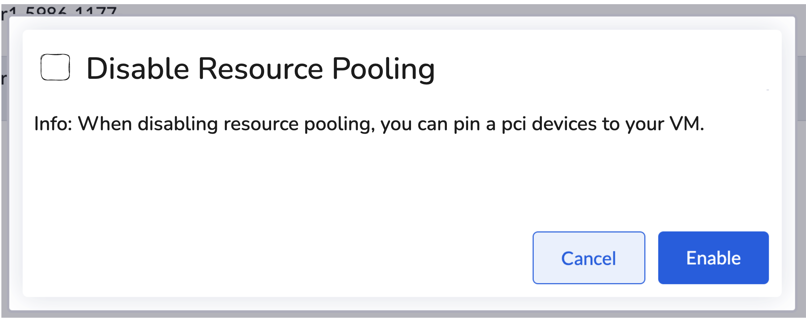

# Disable PCI Devices Resource Pooling

## Summary

When multiple PCI devices of the same model exist in a cluster, they share a `resourceName` based on their vendor and product info. The Kubernetes scheduler picks any available device non-deterministically, so you can't pin a VM to a specific physical device. This enhancement adds a `disableResourcePooling` flag on `PCIDeviceClaim` that gives each device its own unique resource name, so you can always pass through the exact device you want.

### Related Issues

- https://github.com/harvester/harvester/issues/6724

## Motivation

### Goals

- Let users opt a specific PCI device out of the shared pool via `PCIDeviceClaim.spec.disableResourcePooling`.
- Allow VMs to be pinned to a specific physical PCI device, no matter how many identical devices are in the cluster.
- Keep full backward compatibility — default pooling behavior is unchanged when the flag is not set.

### Non-goals

- Claims that don't set the flag are not affected.

## Proposal

### User Stories

#### Pin a VM to a specific SR-IOV Virtual Function

A user has 8 identical Mellanox VFs on a node. Without this feature, claiming `0000:08:00.2` doesn't help — the scheduler may still pick a different VF on each boot since they all share the same `resourceName`. With `disableResourcePooling: true`, the claim for `0000:08:00.2` gets its own unique name `harvester-node-000008002`, so only that specific VF is ever assigned to the VM.

### User Experience In Detail

#### Creating a claim with resource pooling disabled

Users create a `PCIDeviceClaim` with `spec.disableResourcePooling: true`:

```yaml
apiVersion: devices.harvesterhci.io/v1beta1
kind: PCIDeviceClaim
metadata:
  name: harvester-node-000008002
spec:
  address: "0000:08:00.2"
  nodeName: harvester-node
  userName: admin
  disableResourcePooling: true
```

After reconciliation, the `PCIDevice`'s `status.resourceName` changes from the shared vendor/product name (e.g., `mellanox.com/MT27700_FAMILY_CONNECTX4_VIRTUAL_FUNCTION`) to the device-specific name (e.g., `mellanox.com/harvester-node-000008002`). The VM spec references this unique name in `hostDevices[].deviceName`.

#### UI changes

The UI changes consist of two parts:

1. **Remove old-format resource name checking** — Before Harvester had its own device plugin, resource names could be in an older format. Since Harvester now fully controls the device plugin, the legacy format detection code has been removed ([harvester-ui-extension#889](https://github.com/harvester/harvester-ui-extension/pull/889)).

2. **Add a toggle for `disableResourcePooling`** — A toggle will be added to the PCI device passthrough panel. When enabled, the resource name shown in the VM spec will be the device-specific name instead of the shared pool name. PR: https://github.com/harvester/harvester-ui-extension/pull/902



### API changes

Add an optional boolean field to `PCIDeviceClaimSpec`:

```go
// DisableResourcePooling, when true, assigns this device its own unique
// resource name instead of sharing the vendor/product-based pool name.
// +kubebuilder:validation:Optional
DisableResourcePooling bool `json:"disableResourcePooling,omitempty"`
```

No changes to the `PCIDevice` CRD. The existing `pcidevice.harvesterhci.io/override-resource-name` annotation is reused to carry the per-device name.

## Design

### Implementation Overview

When `disableResourcePooling: true` is set on a `PCIDeviceClaim`, the claim controller calls `ensureIndividualDeviceResourceName()` during reconciliation. It builds a unique resource name as `{vendorPrefix}/{pd.Name}` (e.g., `mellanox.com/harvester-node-000008002`), writes it to the `PCIDeviceOverrideResourceName` annotation on the `PCIDevice`, and updates `PCIDevice.status.resourceName` right away. The `pcidevice` controller already reads this annotation on every reconcile, so no changes there are needed.

When the claim is deleted, `cleanupIndividualDeviceResourceName()` removes the annotation. The `pcidevice` controller then resets `status.resourceName` back to the vendor/product name on its next reconcile, putting the device back into the shared pool — no node restart needed.

### Test plan

**Setup:** Three identical PCI devices (`a`, `b`, `c`) of the same vendor/product exist on a test node.

1. Claim devices `a` and `b` with `disableResourcePooling: false` (the default). Both share the same vendor/product `resourceName` in the shared pool.
2. Claim device `c` with `disableResourcePooling: true`. Check that `c`'s `PCIDevice.status.resourceName` is a unique name (e.g., `{vendorPrefix}/{pd.Name}`) — different from `a` and `b`'s shared name.
3. Create a VM with two PCI devices: one from the shared pool (`a` or `b`) and one pinned to `c`. Start the VM and confirm both devices are passed through.
4. Reboot the VM several times. Check `spec.domain.devices.hostDevices` after each boot. The shared-pool slot should alternate between `a` and `b` non-deterministically, while `c` is always fixed. Expected combinations: `(a, c)` and `(b, c)`.
5. Power off the VM and detach device `c`.
6. Delete the `PCIDeviceClaim` for `c`. Check that the `pcidevice.harvesterhci.io/override-resource-name` annotation is gone and `status.resourceName` is back to the shared vendor/product name. *(Wait ~30 seconds for reconciliation.)*
7. Re-create the claim for `c` with `disableResourcePooling: false`. Check that `c` now has the same `resourceName` as `a` and `b`.
8. Re-attach `c` to the VM. The VM now requests two devices from the shared pool of `a`, `b`, and `c`. Start the VM.
9. Reboot the VM several times. Check `spec.domain.devices.hostDevices`. All three devices are now in the same pool, so the scheduler picks any two. All combinations — `(a, b)`, `(a, c)`, and `(b, c)` — should appear across reboots.

### Upgrade strategy

No upgrade actions needed. `disableResourcePooling` defaults to `false`, so existing claims are unaffected. The feature is opt-in per claim.
