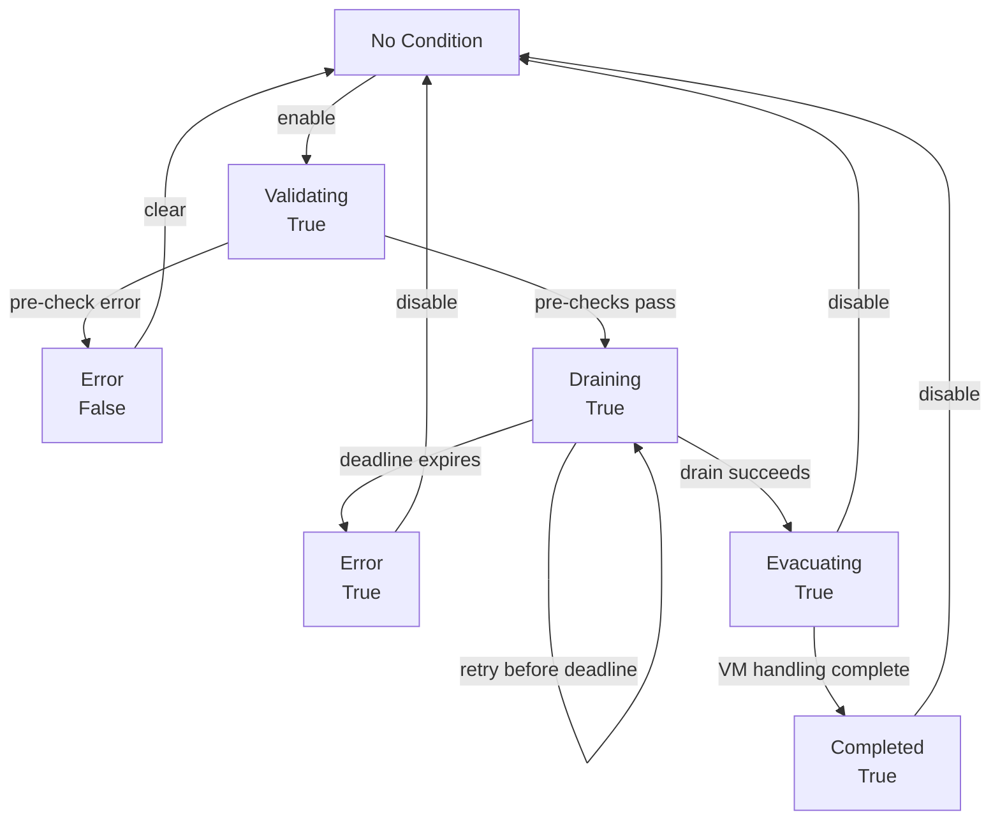

# Make use of status conditions when activating maintenance mode

## Summary

When a node is put into maintenance mode in Harvester today, the lifecycle state is tracked solely through the `harvesterhci.io/maintain-status` annotation on the `Node` object (with the values `running` and `completed`). Annotations are opaque key/value strings: they carry no notion of transition time, no human-readable message, and, most importantly, no standard place to express *why* maintenance mode failed. Users and the UI therefore have very little insight into what is happening, especially when something goes wrong.

This enhancement makes the standard Kubernetes `Node.status.conditions` list the **single source of truth** for the maintenance lifecycle. A new condition of type `MaintenanceMode` is a persisted, reconcile-driven state machine: its reason exposes the current phase (`Validating` -> `Draining` -> `Evacuating` -> `Completed`) and its failure state is `Error`, whose **message** explains exactly what went wrong. The legacy `harvesterhci.io/maintain-status` annotation is removed and every internal consumer is migrated to read the condition instead.

### Related Issues

- https://github.com/harvester/harvester/issues/9022
- Reference PR (initial, annotation-mirroring approach): https://github.com/harvester/harvester/pull/9041
- Related: https://github.com/harvester/harvester/issues/8985, https://github.com/harvester/harvester/issues/8966
- https://jira.suse.com/browse/SURE-11693

## Motivation

Right now only a small set of annotations is set on the node resource when maintenance mode is activated. There is not much information available for users and the UI to understand what is going on, and there is no Kubernetes-native way to surface an error. By moving the maintenance lifecycle to standard node status conditions, we:

- give administrators and the UI a first-class, observable lifecycle with a reliable phase transition time
- attach a human-readable message that is surfaced in the `Hosts` view when maintenance mode fails
- stop overloading annotations with state that properly belongs in `status`
- introduce a reliable, time-bounded drain cycle where a stuck VM evacuation cannot block a node drain indefinitely (especially in heterogeneous mixed-CPU clusters)

### Goals

- Replace the `harvesterhci.io/maintain-status` annotation with a standard node status condition of type `MaintenanceMode`, and make the condition the single source of truth for node maintenance state.
- Define a formal, documented set of reasons: the happy-path lifecycle (`Validating`, `Draining`, `Evacuating`, `Completed`) plus a single failure reason (`Error`). All failure detail is conveyed through the condition `message`.
- Ensure failure messages are visible in the Harvester `Hosts` page through the existing Wrangler summary behavior and migrate the UI extension's maintenance-state consumer to the condition.
- Keep the condition present while maintenance mode is active or has failed, and remove it when maintenance mode is deactivated.
- Provide an explicit `clearMaintenanceMode` action for failures that occur before drain side effects begin.
- Bound the `Draining` phase by a configurable timeout. The default is 15 minutes; a value of `0` disables the timeout.
- Make the overall drain deadline restart-safe without goroutines by reconstructing it from the persisted `Draining` transition time.

### Non-goals

- Altering KubeVirt upstream or relying on a controller-local goroutine to implement the timeout.
- Automatically cancelling migrations, changing VM state, uncordoning the node, removing drain taints, or otherwise attempting to restore pre-drain state after a timeout.
- Automatically retrying failed maintenance mode transitions indefinitely without user intervention.
- Changing the user-facing trigger annotations `harvesterhci.io/drain-requested` and `harvesterhci.io/drain-forced`, these remain the way the API expresses user intent and are unaffected by this enhancement.
- Introducing multiple machine-readable failure reasons (see "Why a single `Error` reason").

## Proposal

A new node status condition of type `MaintenanceMode` is introduced and becomes the authoritative record of the maintenance lifecycle. The Harvester controllers set the condition as the node moves through the lifecycle; on failure they set it to an `Error` state carrying a descriptive message. When maintenance mode is disabled, the condition is removed.

### Condition model and reasons

The condition uses `status` to answer the question *"is the node engaged in maintenance mode?"* and `reason` to express the phase. The four lifecycle reasons map one-to-one to a distinct, controller-observable step, so each controller can tell from the current reason exactly where in the state machine it is.

| `status` | `reason` | Meaning | Set by |
|----------|----------|---------|--------|
| `True` | `Validating` | Request accepted; read-only pre-checks running (control-plane quorum + VM migratability). No side effects yet. | `nodedrain-controller` |
| `True` | `Draining` | Pre-checks passed; VMs that must be stopped are shut down, then the node is cordoned and drained (`DrainNode`). | `nodedrain-controller` |
| `True` | `Evacuating` | The drain returned successfully (handoff); waiting for the last `VirtualMachineInstance`s to leave the node and restarting shut-down VMs. | set by `nodedrain-controller`, acted on by `maintain-controller` |
| `True` | `Completed` | The node is fully drained and in maintenance mode. | `maintain-controller` |
| `False` | `Error` | Maintenance mode failed before drain side effects began. The `message` describes the pre-check failure. | `nodedrain-controller` |
| `True` | `Error` | The drain deadline expired after side effects may have begun. The node remains maintenance-protected; cordon, taints, workloads, and migrations are left unchanged. | `nodedrain-controller` |

`status == True` therefore means "this node is (being) taken into maintenance" and is the signal that other controllers (e.g. the HA quorum check) treat the node as unavailable. This includes `status: True`, `reason: Error`: a timed-out drain may already have cordoned the node or started workload evacuation and must not be treated as available. `status == False` with `reason: Error` means the attempt failed before drain side effects began and maintenance mode is not engaged.

Each reason is a persisted reconcile phase. A controller reads the current reason, performs only that phase's idempotent work, persists the next reason using `UpdateStatus`, and returns. The following reconcile performs the next phase. Retries and delayed requeues remain in the current phase. No generic state-machine framework is introduced.

`LastTransitionTime` changes when the maintenance condition status or reason changes. It is not refreshed by retries in the same phase. In particular, `Draining.LastTransitionTime` is the persisted start of the deadline for all long-running drain work; it remains valid across controller restarts. A maintenance-specific condition setter provides this behavior without changing the semantics of the general node-condition helper. `LastHeartbeatTime` is not used as a controller liveness signal.

### Drain timeout setting

The new `maintenance-mode-drain-timeout` setting is an integer number of minutes. Its default is `15`; `0` disables the overall maintenance drain deadline. The timeout begins on entering `Draining`: the synchronous `DrainNode` call waits for pod eviction and deletion, including VM evacuation, and is where a migration can otherwise block indefinitely.

At the start of every `Draining` reconcile, the controller calculates the same absolute deadline from `Draining.LastTransitionTime + timeout`. `DrainNode` is called with a `context.WithDeadline` using that deadline. This interrupts the currently blocked eviction/deletion wait, while the persisted transition time prevents work-queue retries from receiving a new full timeout. The existing four-minute kubectl drain timeout remains a per-call timeout; failures before the overall deadline may be retried. No goroutine or parallel timeout loop is needed.

When the overall deadline expires, Harvester stops its drain reconciliation and records `MaintenanceMode=True`, `reason=Error`. It does not attempt recovery or rollback. It leaves the node's cordon state, all taints, workloads, VM state, and migrations exactly as observed, then removes only `drain-requested` and `drain-forced` to prevent another automatic attempt. The user must explicitly disable maintenance mode before starting a new attempt.

### Why a single `Error` reason

The review discussion on #9022 suggested a formal set of *failure* reasons (e.g. `FailedPreCheck`, `ConstraintViolation`, `DrainFailed`) so that automation could branch on them. We investigated this against the Rancher/Wrangler summary framework that Harvester relies on to render resource errors in the UI ([`pkg/summary/summarizers.go`](https://github.com/rancher/wrangler/blob/73fdb33d6a7529e14e2f769b66f717468a09201d/pkg/summary/summarizers.go#L320)).

For a **Node**, that framework flags a condition as an error only when:

- the condition `reason` is **exactly** the string `Error`, or
- the condition `type` is one of `OutOfDisk` / `MemoryPressure` / `DiskPressure` / `NetworkUnavailable` (the hard-coded `Node` entry in `GVKConditionErrorMapping`).

The generic `Failed` / `Stalled` fallback does **not** apply to Nodes, because the Node GVK is matched explicitly. Therefore, a custom `MaintenanceMode` condition with any reason other than `Error` (such as `MigrationBlocked`) would **not** be surfaced in the `Hosts` page at all.

Modifying Wrangler is out of scope and not realistic for this enhancement. We accept the framework's behavior as-is and adapt to it:

- All failures use **`reason: Error`** so the error reliably appears in the UI.
- The **specifics are conveyed through the `message`**. The existing controller errors already produce clear, distinct messages for the quorum, non-migratable-VM, and drain-failure cases.

Multiple machine-readable failure reasons are therefore explicitly out of scope: they could not be displayed and would add complexity without user-visible benefit. Note that the granular *lifecycle* reasons (`Validating`/`Draining`/`Evacuating`) are unaffected by this constraint, which only governs how *errors* are surfaced.

### `clearMaintenanceMode` action

Because a pre-check failure (`status: False`, `reason: Error`) is intentionally retained so the error stays visible, a user needs a way to dismiss it. A new custom node action `clearMaintenanceMode` removes only that side-effect-free failed condition. It is not available for `status: True`, `reason: Error`, because clearing that condition could hide a node that remains cordoned or partially drained.

### State Transition Diagram

The `MaintenanceMode` condition follows this state machine. (`status` is shown in parentheses.)



**Transition notes:**

- **No Condition → Validating (True):** Triggered when `nodedrain-controller` observes the `harvesterhci.io/drain-requested` annotation.
- **Validating → Error (False):** A pre-check fails: control-plane quorum would be violated, or non-migratable VMs are present and `force` was not requested. The controller persists `status: False`, `reason: Error` with a message describing the cause, then removes `drain-requested` and `drain-forced` to stop the reconcile loop.
- **Validating → Draining (True):** All pre-checks passed. The controller persists `Draining` and returns. Only the following reconcile starts VM shutdown and the cordon/drain step, so `Draining.LastTransitionTime` is the stable deadline start time.
- **Draining → Draining (retry):** A normal error before the deadline is returned to the work queue. The reason and its transition time do not change.
- **Draining → Error (True), timeout:** The absolute deadline interrupts the current `DrainNode` call. The controller records the error first, then removes only `drain-requested` and `drain-forced`. It does not uncordon, remove taints, cancel migration, stop or restart VMs, or otherwise restore earlier state. Standard and force requests have identical timeout behavior.
- **Draining → Evacuating (True):** `DrainNode` returned successfully. The controller persists `Evacuating` first, then removes the drain intent annotations. `Evacuating` is the explicit handoff signal that `maintain-controller` acts on.
- **Evacuating → Completed (True):** `maintain-controller` confirms no `VirtualMachineInstance` remains on the node and has restarted VMs labelled `harvesterhci.io/maintain-mode-strategy=ShutdownAndRestartAfterEnable`.
- **Error (False) → No Condition (clear):** User invokes `clearMaintenanceMode`; the side-effect-free pre-check error is removed. The user can then start a new maintenance attempt.
- **Evacuating, Completed, or Error (True) → No Condition (disable):** User explicitly disables maintenance mode. Existing disable behavior performs its node and VM operations; the condition is removed last. Disable is not offered in `Validating` or `Draining`, where a synchronous `DrainNode` invocation cannot be safely cancelled through API state.

### User Stories

#### Story 1: Clear visibility of maintenance mode progress
As a Harvester administrator, when I put a node into maintenance mode I want to see which phase it is in: still checking whether it is allowed (`Validating`), actively draining (`Draining`), waiting for the last workloads to leave (`Evacuating`), or fully in maintenance (`Completed`). Today I only see a `Cordoned`/`Maintenance` badge and have to inspect annotations to infer the actual progress.

#### Story 2: A clear error message when maintenance mode fails
As a Harvester administrator, if maintenance mode cannot be enabled I want a clear, human-readable explanation in the `Hosts` page, for example that a control-plane node is already in maintenance, that non-migratable VMs are blocking the drain (and that `force` would shut them down), or that the drain timed out. Today the operation fails with little feedback and often requires reading controller logs. The message must be specific enough that I know what to do next (wait, fix, clear, or disable).

#### Story 3: Clearing a maintenance mode pre-check error
As a Harvester administrator, when maintenance mode fails before drain side effects begin and I decide not to proceed, I want a `Clear Maintenance Mode Error` action to reset the node's condition. A timed-out drain instead requires disable because the node may remain cordoned or partially drained.

#### Story 4: Automated evacuation timeout for stuck VM migrations
As a Harvester administrator, when a VM live migration gets permanently stuck in a non-terminal phase (such as `Scheduling` due to CPU incompatibilities in heterogeneous clusters or resource shortages on target hosts) during a node drain, I want Harvester to stop waiting after a configurable period and show a clear error. Harvester must not automatically cancel migrations, change VM state, or attempt to reconstruct the prior state. Standard and force drains have the same timeout behavior.

### User Experience In Detail

1. The user opens the `Hosts` page and selects `Enable Maintenance Mode` for a node (optionally ticking `Force`).
2. As soon as `drain-requested` is observed, a `MaintenanceMode` condition with `status: True`, `reason: Validating` is created while the read-only pre-checks run.
3. When the pre-checks pass, the condition advances to `status: True`, `reason: Draining`: VMs that must be stopped are shut down and the node is cordoned and drained. This is the long-running phase.
4. A pre-check failure sets `status: False`, `reason: Error`; no drain side effects have occurred and the error can be retried or cleared. Before the drain deadline, ordinary drain errors are retried in `Draining` without resetting the deadline.
5. If the drain deadline expires, the deadline context interrupts the currently blocked `DrainNode` call. Harvester sets `status: True`, `reason: Error`, leaves cordon, taints, workloads, VM state, and migrations unchanged, and removes only the drain intent annotations. The error remains until the user retries or explicitly disables maintenance mode.
6. When the drain returns successfully, the condition becomes `status: True`, `reason: Evacuating`. The node is already cordoned; Harvester waits for the last VM migrations and restart handling.
7. Once all workloads have left the node and any labelled VMs have been restarted elsewhere, the condition becomes `status: True`, `reason: Completed`.
8. `Disable Maintenance Mode` performs the existing explicit disable operations and removes the condition last.

The `Validating`, `Draining`, `Evacuating`, and `Completed` reasons are not rendered as separate UI badges (Wrangler does not summarise them); they are visible via the node YAML / `kubectl`. The existing `Maintenance` badge behaviour is retained.

### API changes

There are no new CRDs. The standard `Node` object's `status.conditions` list gains a `MaintenanceMode` condition.

A new setting is added:

```go
const MaintenanceModeDrainTimeout = "maintenance-mode-drain-timeout"
```

It accepts a non-negative integer number of minutes. The default is `15`; `0` disables timeout enforcement.

New Go constants:

```go
const (
	NodeConditionTypeMaintenanceMode corev1.NodeConditionType = "MaintenanceMode"

	// Lifecycle reasons (status == True).
	NodeConditionReasonValidating string = "Validating"
	NodeConditionReasonDraining   string = "Draining"
	NodeConditionReasonEvacuating string = "Evacuating"
	NodeConditionReasonCompleted  string = "Completed"

	// Failure reason. Must be exactly "Error" so that the
	// Rancher/Wrangler summary surfaces the message in the Hosts page.
	NodeConditionReasonError string = "Error"
)
```

#### Node resource formatter actions

**New action: `clearMaintenanceMode`**
- **Availability:** shown only when a `MaintenanceMode` condition exists with `status: False` / `reason: Error`.
- **Permission:** same permissions as `disableMaintenanceMode`.
- **Behavior:** removes the `MaintenanceMode` condition; does not touch annotations, cordon state, or VMs.
- **Idempotent:** safe to call repeatedly; succeeds even if the condition is already gone.
- **UI label:** `Clear Maintenance Mode Error`.

Action availability is owned by the node resource formatter; the UI only renders the action links returned by the API. The formatter exposes:

| Condition | Actions |
|-----------|---------|
| absent | `enableMaintenanceMode` |
| `Validating` or `Draining` | none |
| `Evacuating` or `Completed` | `disableMaintenanceMode`, `powerAction` |
| `False/Error` | `clearMaintenanceMode` |
| `True/Error` | `disableMaintenanceMode` |

`powerAction` is an existing host power-operation gate, not a maintenance action. Today it is offered only after the drain controller has written `maintain-status=running`; the condition-based replacement offers it in `Evacuating` and `Completed`. `powerAction` is not offered for either error state.

#### Example conditions

```yaml
# Validating: read-only pre-checks running
- type: MaintenanceMode
  status: "True"
  reason: Validating
  message: "Checking whether the node can enter maintenance mode"
  lastTransitionTime: "2026-06-01T10:29:00Z"
  lastHeartbeatTime:  "2026-06-01T10:29:00Z"

# Draining: stopping required VMs, cordoning and draining the node
- type: MaintenanceMode
  status: "True"
  reason: Draining
  message: "Draining the node"
  lastTransitionTime: "2026-06-01T10:29:05Z"

# Evacuating: drained, waiting for the last workloads to move off
- type: MaintenanceMode
  status: "True"
  reason: Evacuating
  message: "Waiting for VM migration and restart handling to complete"
  lastTransitionTime: "2026-06-01T10:30:00Z"

# Completed: node fully in maintenance mode
- type: MaintenanceMode
  status: "True"
  reason: Completed
  message: "Maintenance mode enabled"
  lastTransitionTime: "2026-06-01T10:35:00Z"

# Error caused by non-migratable VMs (force not set), raised during Validating
- type: MaintenanceMode
  status: "False"
  reason: Error
  message: >
    Enabling maintenance mode is impossible. Non-migratable VMs found:
    default/ubuntu-vm cannot be migrated due to host affinity.
    Use 'force drain' to perform a collective shutdown.
  lastTransitionTime: "2026-06-01T10:29:02Z"

# Error caused by control-plane HA quorum — raised during Validating
- type: MaintenanceMode
  status: "False"
  reason: Error
  message: "enabling maintenance mode is impossible: another controlplane is already in maintenance mode, cannot place current node in maintenance mode"
  lastTransitionTime: "2026-06-01T10:29:02Z"

# Error caused by the overall drain deadline
- type: MaintenanceMode
  status: "True"
  reason: Error
  message: >
    Maintenance mode timed out while draining node node-1 after 15 minutes:
    global timeout reached while evicting pod virt-launcher-ubuntu-vm.
    The node remains cordoned and drain-related taints are unchanged.
    Disable maintenance mode before starting a new attempt.
  lastTransitionTime: "2026-06-01T10:44:05Z"
```

## Design

### Implementation Overview

`MaintenanceMode` is owned jointly by the two existing controllers; the `harvesterhci.io/maintain-status` annotation is removed. Each phase is selected by the *current* condition reason, so reconciles are resumable and no external trigger (such as annotation presence/absence) is needed for the handoff between controllers. A phase transition is persisted and ends the current reconcile; the next reconcile handles the new phase.

**`nodedrain-controller.OnNodeChange`:**

1. **Detect intent (→ `Validating`):** when `harvesterhci.io/drain-requested` is present and the condition is absent, set the condition to `status: True`, `reason: Validating` and return. An `Error` condition is terminal for the controller and reconciles only annotation cleanup. Users must resolve `False/Error` through `clearMaintenanceMode` and `True/Error` through `disableMaintenanceMode` before starting a new maintenance attempt.
2. **Pre-checks (reason `Validating`):**
    - Run `DrainPossible`. On `ErrNodeDrainNotPossible`, set `status: False`, `reason: Error` with the quorum message, remove the drain annotations, and stop.
    - Detect non-migratable VMs. If found and `force` is not set, set `status: False`, `reason: Error` with the non-migratable-VM message, remove the drain annotations, and stop.
    - If all pre-checks pass, advance the condition to `status: True`, `reason: Draining`, persist it, and return. This makes `Draining.LastTransitionTime` the restart-safe start of the timeout.
3. **Drain (reason `Draining`):**
    - Shut down VMs that must be stopped: VMs with an explicit `harvesterhci.io/maintain-mode-strategy` (`Shutdown`, `ShutdownAndRestartAfterEnable`, `ShutdownAndRestartAfterDisable`) and, when `force` is requested, all detected non-migratable VMs. VMs with restart strategies are annotated with `harvesterhci.io/maintain-mode-strategy-node-name` so they are restarted upon completing maintenance mode or disabling it, even when `force` was used to bypass non-migratable workloads.
    - Calculate the absolute deadline from `Draining.LastTransitionTime` and `maintenance-mode-drain-timeout`. Call `DrainNode` (cordon + drain) with a context bounded by that deadline. The context interrupts a blocked pod eviction/deletion wait, while the persisted timestamp bounds the total duration across retries.
    - Before the deadline, return ordinary drain errors for a work-queue retry while retaining the `Draining` condition and the same transition time.
    - At the deadline, set `MaintenanceMode=True`, `reason=Error` with the timeout, node name, and last drain error when available. Do not change cordon, taints, workloads, VMs, VMIs, VMIMs, or migrations.
    - After the error condition is persisted, remove only `drain-requested` and `drain-forced`. An `Error` reconcile may retry this annotation cleanup but never invokes `DrainNode` or automatically returns to `Validating`.
    - On a successful drain, persist `Evacuating` first and remove the drain intent annotations second.

**`maintain-controller.OnNodeChanged`:**

4. Reconcile nodes whose `MaintenanceMode` condition reason is `Evacuating`:
    - If any `VirtualMachineInstance` (VMI) remains on the node, enqueue a delayed retry. Timeout enforcement belongs to `Draining`, because `DrainNode` waits synchronously for evacuation before this phase is reached.
    - If no VMIs remain on the node, restart VMs labelled `harvesterhci.io/maintain-mode-strategy=ShutdownAndRestartAfterEnable`. Set `Completed` only after the existing restart work is complete.
    - Use `EnqueueAfter` while VMIs remain or restart work is incomplete. No goroutine is required.

#### Timeout behavior

Timeout is a terminal observation, not a recovery workflow. Standard and force drains behave identically when the overall deadline expires. Harvester stops waiting and exposes the failure, but deliberately does not guess how to resolve or reverse external state. Timeout handling does not delete VMIMs, call KubeVirt evacuation cancellation, stop or restart VMs, alter RunStrategy, remove taints, or uncordon the node.

The timeout is written in two idempotent operations because Node status and metadata cannot be updated atomically:

1. Fetch the latest Node, merge only the `MaintenanceMode=True/Error` condition, and write it through `UpdateStatus` with conflict retry while preserving all unrelated Node status.
2. Fetch the latest Node again and remove only `drain-requested` and `drain-forced` through a normal update.

The status write comes first so a controller restart cannot leave an invisible failed drain after intent cleanup. A Node with `reason=Error` is terminal even if either intent annotation is temporarily still present; those annotations trigger cleanup, not a new attempt. A new attempt begins only after the error condition has been cleared or disabled.

**Disable (API handler):** offered for `Evacuating`, `Completed`, and `Error=True`. Perform the existing uncordon, drain-taint cleanup, intent cleanup, and disable-specific VM behavior first; remove the `MaintenanceMode` condition last so a partial disable remains visible. Disable is not offered in `Validating` or `Draining`.

**Clear error (API handler / `clearMaintenanceMode`):** if the `MaintenanceMode` condition exists with `status: False` / `reason: Error`, remove it. Reject or hide the action for `Error=True`.

Pre-check messages use the existing controller errors. A timeout message includes the configured duration, node name, the last drain error when available, and an explicit statement that Harvester left cordon, taints, workloads, and migrations unchanged.

### Consumers migrated off the annotation

The `harvesterhci.io/maintain-status` annotation is read in several places today; all are migrated to consult the `MaintenanceMode` condition instead. A node is considered "engaged in maintenance mode" whenever it has a `MaintenanceMode` condition with `status: True`, including `reason: Error`. A `False/Error` or absent condition is treated as not engaged.

| Location | Today (annotation) | After (condition) |
|----------|--------------------|-------------------|
| `pkg/api/node/formatter.go` | shows enable vs. disable based on annotation presence | uses the explicit phase/action matrix; gates `clearMaintenanceMode` on `status: False` only |
| `pkg/api/vm/handler.go` (`isDrained`) | annotation present → drained | condition `status: True` → drained (still also honours `drain-requested` and `Unschedulable`) |
| `pkg/webhook/resources/node/validator.go` | cordon/maintenance admission via annotation | via condition engagement |
| `pkg/util/drainhelper/helper.go` (`DrainPossible`) | counts CP nodes without the annotation as available | counts CP nodes without an engaged `MaintenanceMode` condition as available |
| `pkg/controller/master/node/maintain_controller.go` | reads/writes annotation | reads/writes condition |
| `pkg/controller/master/nodedrain/nodedrain_controller.go` | writes `running`, deletes annotation | writes condition |
| `pkg/util/node.go` (`IsOtherNodeAvailable`) | annotation absence means available | `MaintenanceMode=True`, including timeout error, means unavailable |

The trigger annotations `harvesterhci.io/drain-requested` and `harvesterhci.io/drain-forced` are unchanged and continue to express user intent. When calculating control-plane availability, `DrainPossible` explicitly excludes the candidate node and requires the remaining control-plane/etcd nodes to be available; it must not infer availability by counting the candidate's own `Validating` condition.

The node admission webhook recognizes a maintenance request from a newly added `drain-requested` annotation on a normal Node update and checks other nodes through their condition engagement and schedulability. Direct cordon validation remains unchanged. The webhook must not register for the `nodes/status` subresource: doing so would validate unrelated kubelet condition and heartbeat updates.

### UI integration

Wrangler automatically renders a Node condition with `reason: Error`, including its `message`. The UI does not implement separate error handling or a maintenance state machine.

The Harvester UI extension currently reads `harvesterhci.io/maintain-status` in three node-model getters. It replaces those annotation lookups with one shared lookup of the `MaintenanceMode` condition:

- `isEnteringMaintenance` is true only for `True/Validating`, `True/Draining`, and `True/Evacuating`; it continues to display `Entering maintenance mode`.
- `isMaintenance` is true only for `True/Completed`; it continues to display `Maintenance`.
- `isMigratable` is false for every `MaintenanceMode=True`, including `True/Error`.

Both error states leave `isEnteringMaintenance` and `isMaintenance` false, so the existing Wrangler error state and message are not overridden. The backend formatter remains the sole source of action availability. The new `clearMaintenanceMode` action requires only a UI action entry, handler, and translation; it is shown only when the backend provides its action link.

### Test plan

Conditions are validated through `Node.status.conditions` (UI `Edit YAML`, or CLI):

```bash
kubectl get node <NAME> -o jsonpath='{.status.conditions[*]}' | jq
kubectl get node <NAME> -o json | jq '.status.conditions[] | select(.type == "MaintenanceMode")'
```

Unit tests (controllers + `pkg/util` helpers, with fake clients):
- `Validating` is set on `drain-requested`.
- `Validating` → `Draining` when all pre-checks pass.
- `Validating` → `Error` when `DrainPossible` fails, with the quorum message.
- `Validating` → `Error` for non-migratable VMs without force, with the non-migratable-VM message.
- One persisted phase transition occurs per reconcile; the next reconcile starts the next phase.
- `Draining.LastTransitionTime` remains unchanged across retries and reconstructs the timeout deadline after a controller restart.
- `DrainNode` receives the `Draining` deadline through its context.
- A pre-deadline drain error is retried in `Draining`; it does not immediately change the condition to `Error`.
- The overall deadline interrupts a `DrainNode` call that is waiting for a stuck pod eviction/deletion, including a stuck VM live migration.
- Timeout first writes `MaintenanceMode=True/Error`, then removes only `drain-requested` and `drain-forced`.
- Timeout leaves `spec.unschedulable`, every taint, VM and VMI state, VMIMs, migrations, and RunStrategy unchanged.
- Standard and force drain requests produce the same timeout result and no recovery API calls.
- Reconciling `Error` never invokes `DrainNode`; it only completes pending intent-annotation cleanup.
- `Draining` → `Evacuating` only when `DrainNode` succeeds.
- `Evacuating` → `Completed` only after all VMIs are gone and existing `ShutdownAndRestartAfterEnable` handling is complete.
- `clearMaintenanceMode` removes the condition only when `status: False` / `reason: Error`.
- A new maintenance attempt starts only after Clear or Disable removed the prior condition.
- Disable is available in `Evacuating`, `Completed`, and `Error=True`, and removes the condition only after existing explicit disable operations succeed.
- Maintenance condition helper updates `LastTransitionTime` on a status or reason change, but does not write an unchanged condition.
- Status writes fetch the latest Node, merge only `MaintenanceMode`, retry conflicts, and preserve kubelet-owned conditions and other unrelated status fields.
- `DrainPossible` does not count the node entering maintenance as an available second control-plane node.
- The node formatter exposes `powerAction` in `Evacuating` and `Completed` only; the UI renders backend-provided actions without reimplementing their eligibility.
- UI node-model tests cover the shared maintenance-condition lookup, `isEnteringMaintenance`, `isMaintenance`, `isMigratable`, Wrangler-rendered error messages, and the Clear Error action link.
- Node webhook tests cover a newly added `drain-requested` annotation, other-node availability through conditions, and unchanged direct-cordon validation without registering `nodes/status`.

Integration tests (`tests/integration/api`):
- **Successful enablement:** enable on a node, observe `Validating` → `Draining` → `Evacuating` → `Completed`.
- **Disablement:** disable from `Evacuating`, `Completed`, and `True/Error`; observe existing cleanup succeeds before the condition is removed.
- **Non-migratable VMs:** create a non-migratable VM, enable without force, observe `status: False` / `reason: Error` and the message in the UI; clear it with the action; re-enable with force and reach `Completed`.
- **Control-plane quorum:** trigger an HA-quorum violation, observe `reason: Error` with the quorum message, and confirm force does not bypass it.
- **Stuck drain timeout:** simulate a stuck VM live migration, observe the deadline interrupt `DrainNode`, `status: True` / `reason: Error`, and removal of only the intent annotations.
- **No automatic recovery:** verify timeout does not uncordon, remove taints, delete VMIMs, cancel migration, stop/restart VMs, or alter RunStrategy. Verify standard and force requests behave identically.
- **Clear and disable:** verify Clear removes only `False/Error`, while Disable performs existing cleanup and removes `True/Error` last. Verify a new attempt starts only after Clear or Disable.
- **Migration target selection:** confirm `isDrained` based on the condition keeps an engaged node out of migration target selection.
- **UI:** confirm `isEnteringMaintenance`, `isMaintenance`, and migration target eligibility use `MaintenanceMode`, not `maintain-status`.
- **Upgrade validation:** an active `MaintenanceMode` condition blocks upgrade creation with a clear error.

### Upgrade strategy

Maintenance mode must be disabled before an upgrade. Nodes carrying an active `MaintenanceMode` condition or in an unschedulable maintenance state block the upgrade with a clear validation error. No annotation-to-condition migration runs during upgrade: it would require non-atomic status and metadata changes in a path that already rejects unschedulable maintenance nodes.

Nodes without maintenance state are not touched by this enhancement. The rollout updates the backend and UI together; maintenance must not be initiated while old and new components would use different state sources.

## Note

On pre-check failure or drain timeout, `harvesterhci.io/drain-requested` and `harvesterhci.io/drain-forced` are removed after the error condition is visible; retaining them would make the controller continuously re-attempt maintenance mode. A timeout does not perform cleanup beyond removing these intent annotations. The user must disable maintenance mode before starting a new attempt. `clearMaintenanceMode` is available only for a side-effect-free `False/Error` pre-check failure.

### Backward compatibility

- `harvesterhci.io/maintain-status` is **removed**. It is an internal Harvester implementation detail, is not part of any public API contract, and is not known to be consumed by external tooling; the `MaintenanceMode` condition supersedes it.
- `harvesterhci.io/drain-requested` and `harvesterhci.io/drain-forced` remain as internal lifecycle/intent markers and are unchanged.
