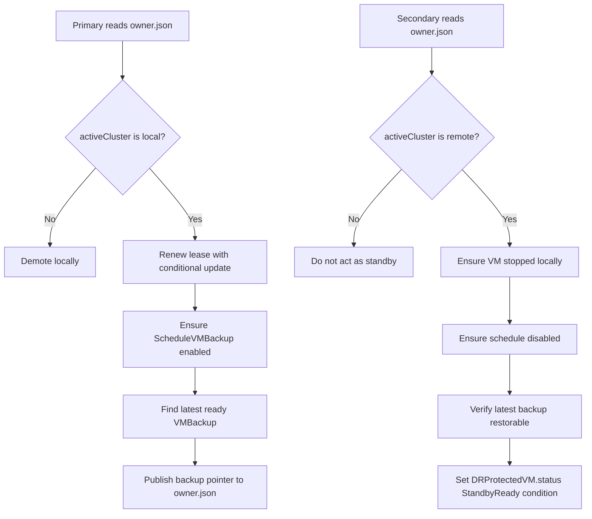
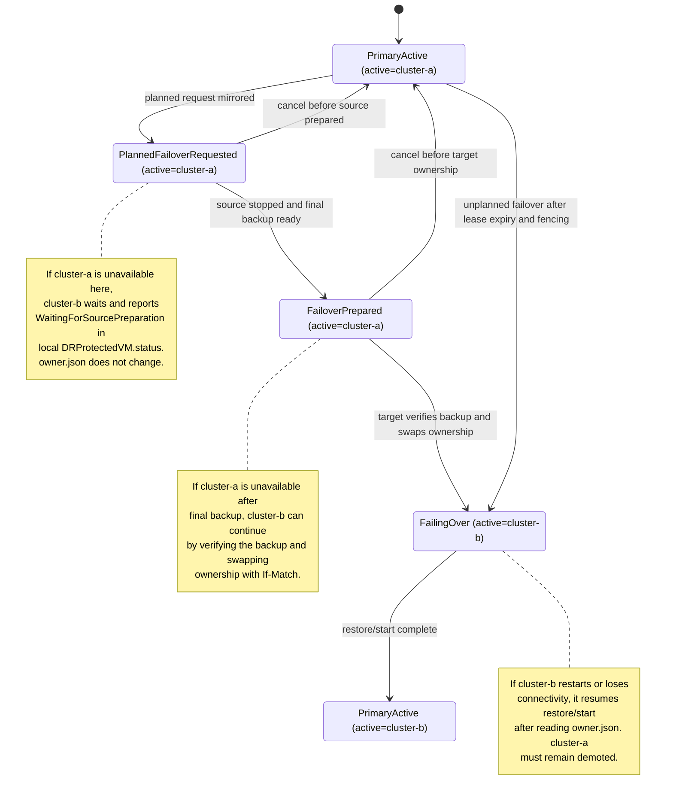

# Harvester Cross-Cluster DR with S3 Coordination

## Summary

This design document proposes cross-cluster disaster recovery for Harvester virtual machines using existing Harvester backup and restore primitives plus a small S3-backed coordination plane. Two Harvester clusters share a backup target for VM backup data and a DR coordination target for per-VM ownership state. Controllers in both clusters coordinate through the shared targets only; no remote-cluster Kubernetes API access is required.

The coordination plane uses atomic compare-and-swap semantics on a per-VM `owner.json` object. For S3-compatible backends, this is implemented with conditional `PutObject` requests using `If-None-Match` and `If-Match`. Harvester provides the in-tree `pkg/coordstore` package and the `cwprobe` utility to verify that the configured backend safely supports these conditional writes before DR is enabled.

### Related Issues

- https://github.com/harvester/harvester/issues/1850

## Motivation

Harvester already has VM backup and restore resources, but safe cross-cluster DR also needs distributed ownership. During failover, two clusters must never both believe they are primary for the same VM. A shared backup target alone is not enough because backup data does not provide an atomic ownership primitive.

The proposed design adds a narrow coordination layer that records which cluster owns each protected VM, which backup is latest and restorable, and whether a failover transition is in progress. The design deliberately reuses `ScheduleVMBackup`, `VMBackup`, and `VMRestore` for data movement instead of introducing a new backup path.

### Goals

- **Prevent Split-Brain**: Ensure only the cluster recorded as owner may run the protected VM.
- **Reuse Existing Backup Primitives**: Drive `ScheduleVMBackup`, `VMBackup`, and `VMRestore` instead of creating a separate data path.
- **Avoid Remote Kubernetes API Access**: Let each cluster operate using only its local Kubernetes API and the shared storage targets.
- **Support Planned and Unplanned Failover**: Provide workflows for controlled maintenance failover and operator-confirmed disaster recovery.
- **Verify Coordination Safety Early**: Refuse to run when the configured coordination target does not enforce conditional writes.
- **Keep Backup Target Compatibility**: Allow existing backup targets such as S3, NFS, CIFS, and Azure Blob for backup data by separating the coordination target from the backup target.

### Non-Goals

- Automatic unplanned failover. When the primary lease expires, the secondary controller reports the condition in its local `DRProtectedVM.status` and marks failover as possible, but it does not promote the secondary until an operator submits a failover request with fencing confirmation. 
- Application-level consistency beyond what Harvester VM backup and restore already provide.
- DNS, VIP, load-balancer, MAC, or IP failover.
- Automatic provisioning of network attachments, VLANs, or site networking.
- Bidirectional data merge after split-brain.
- Replacing Longhorn backup and restore internals.

## Proposal

### User Stories

**Story 1: As a platform operator**
I want to protect selected VMs across two Harvester clusters so that I can recover them on the peer cluster after a site outage.

**Story 2: As a system administrator**
I want planned failover to stop the source VM, take a final backup, restore on the target cluster, and start the VM there so that maintenance can be performed with controlled data loss.

**Story 3: As a disaster recovery operator**
I want unplanned failover to require explicit fencing confirmation so that a network partition does not automatically start the same VM in two places.

**Story 4: As a storage administrator**
I want to verify my S3 or MinIO coordination backend before enabling DR so that unsafe backends are rejected before any failover event.

**Story 5: As an operator using an NFS or CIFS backup target**
I want to keep using that target for backup data while using a separate S3 bucket for DR coordination.

## Design

### Architecture Overview

Two Harvester clusters, for example `cluster-a` and `cluster-b`, participate in DR for a set of protected VMs. Each cluster runs a local `harvester-dr-controller`. Controllers do not call the peer cluster's Kubernetes API. They communicate only through:

- **Backup target**: Stores VM backup data and metadata consumed by existing `VMBackup` and `VMRestore` flows.
- **DR coordination target**: Stores small ownership objects used by the DR controller for compare-and-swap coordination.

The two targets are logically separate. They may be the same physical S3 bucket with different prefixes, but they can also be completely different systems. This allows an operator to keep an existing backup target while adding an S3-compatible coordination target.

| Target | Purpose | Required capabilities |
|--------|---------|-----------------------|
| Backup target | Stores Longhorn volume backups and VM backup metadata. | Existing Harvester backup target support. |
| DR coordination target | Stores per-VM `owner.json` ownership state. | S3-compatible conditional writes verified by probe. |

### Coordination Object

Each protected VM has a deterministic ownership object:

```text
s3://<coordination-bucket>/dr/vms/<namespace>/<vmName>/owner.json
```

Example:

```json
{
  "apiVersion": "dr.harvesterhci.io/v1alpha1",
  "kind": "VMOwnership",
  "namespace": "default",
  "vmName": "vm1",
  "activeCluster": "cluster-a",
  "standbyCluster": "cluster-b",
  "phase": "PrimaryActive",
  "generation": 1,
  "holderIdentity": "cluster-a/harvester-dr-controller",
  "leaseID": "cluster-a-lease-0001",
  "renewTime": "2026-05-03T10:00:00Z",
  "leaseDurationSeconds": 180,
  "latestReadyVMBackup": null,
  "latestReadyVMBackupTime": null
}
```

All ownership transitions update this object with compare-and-swap. A controller reads the object and receives an opaque version string. It must pass that version back when updating the object. If another controller updated the object first, the write fails and the controller re-reads before trying again.

### Coordination Store Package

The compare-and-swap primitive is implemented in-tree under `pkg/coordstore`.

```go
type Store interface {
    Read(ctx context.Context, key string) (data []byte, version string, err error)
    Create(ctx context.Context, key string, data []byte) (version string, err error)
    Update(ctx context.Context, key string, data []byte, expectedVersion string) (newVersion string, err error)
    Delete(ctx context.Context, key string) error
    Probe(ctx context.Context, probePrefix string) error
}
```

The package exposes sentinel errors:

```go
var ErrPreconditionFailed = errors.New("coordstore: conditional write precondition failed")
var ErrNotFound           = errors.New("coordstore: object not found")
```

The S3 implementation uses object ETags as opaque versions. `Create` writes with `If-None-Match: *`. `Update` writes with `If-Match: <expectedVersion>`. The controller treats `ErrPreconditionFailed` as a lost race and retries from a fresh read.

Harvester currently vendors `aws-sdk-go` v1, whose `PutObjectInput` does not expose typed fields for `IfMatch` or `IfNoneMatch`. The S3 implementation builds the request with `PutObjectRequest`, injects the conditional HTTP header, and then calls `Send()`. The header is added before SigV4 signing, so it is included in the signed canonical request.

The `cwprobe` CLI runs the same safety checks against an operator-provided target. Exit code `0` means the backend is safe for CAS-based coordination, `1` means one or more semantic checks failed, and `2` means setup failed.

### API Resources

#### DRProtectedVM

`DRProtectedVM` declares that a VM participates in DR. It is applied on both clusters with matching VM identity and shared initial-primary intent. The resource describes desired DR participation; current ownership is read from `owner.json`.

```yaml
apiVersion: dr.harvesterhci.io/v1alpha1
kind: DRProtectedVM
metadata:
  name: vm1
  namespace: default
spec:
  vmName: vm1
  localClusterID: cluster-a
  peerClusterID: cluster-b
  initialPrimaryCluster: cluster-a
  coordination:
    bucket: harvester-dr-control
    key: dr/vms/default/vm1/owner.json
    lockMode: ConditionalWrite
  backupPolicy:
    schedule: "*/30 * * * *"
    retention: 24
    scheduleVMBackupName: vm1-dr-schedule
  failoverPolicy:
    mode: Manual
    requireFencing: true
    allowAutoFailover: false
```

#### DRFailoverRequest

`DRFailoverRequest` records an operator's intent to move ownership. It may be applied on either cluster. For planned failover, the receiving controller first mirrors the requested handoff into `owner.json` as `PlannedFailoverRequested`. For unplanned failover, the target-side controller writes `owner.json` only after it validates lease expiry, fencing confirmation, and backup restorability. In both cases, controllers decide their local work from the shared ownership state.

```yaml
apiVersion: dr.harvesterhci.io/v1alpha1
kind: DRFailoverRequest
metadata:
  name: failover-vm1-to-cluster-b
  namespace: default
spec:
  protectedVMRef:
    name: vm1
  targetCluster: cluster-b
  mode: Planned
  startVM: true
```

For unplanned failover, explicit fencing confirmation is required:

```yaml
apiVersion: dr.harvesterhci.io/v1alpha1
kind: DRFailoverRequest
metadata:
  name: unplanned-failover-vm1-to-cluster-b
  namespace: default
spec:
  protectedVMRef:
    name: vm1
  targetCluster: cluster-b
  mode: Unplanned
  startVM: true
  fencingConfirmation:
    method: Manual
    message: "I confirm cluster-a is fenced or vm1 cannot run on cluster-a."
```

### Controller Responsibilities

When local cluster is primary:

- Ensure the VM is allowed to run locally.
- Ensure one active `ScheduleVMBackup` exists for the protected VM.
- Renew the ownership lease with a conditional update.
- Watch `VMBackup` resources and publish the latest ready backup into `owner.json`.
- Stop primary behavior immediately if `owner.json` names another active cluster.

When local cluster is secondary:

- Ensure local `ScheduleVMBackup` is absent or disabled.
- Ensure the local VM is not running.
- Watch synced `VMBackup` metadata from the shared backup target.
- Mark standby readiness only when the referenced backup is verifiably restorable.
- Execute target-side failover work after the shared state indicates it is safe.

### Workflow: Bootstrap

1. Operator configures the same backup target on both clusters.
2. Operator configures the same DR coordination target on both clusters.
3. Operator runs `cwprobe` against the coordination target. The probe must pass.
4. Operator deploys the protected VM on the initial primary Harvester cluster.
5. Operator installs `harvester-dr-controller` on both clusters.
6. Operator applies matching `DRProtectedVM` resources on both clusters.
7. The initial primary creates `owner.json` with `If-None-Match: *`, becomes primary, and enables scheduled backups.
8. The secondary reads `owner.json`, remains standby, does not require a pre-created VM, and waits for restorable backup metadata. If a local restored copy already exists from an earlier failover or failback, the controller ensures it is not running.

### Workflow: Steady State



### Workflow: Planned Failover

Assume `cluster-a` is the current primary and `cluster-b` is the requested target.

1. Operator creates a `DRFailoverRequest` with `mode: Planned` and `spec.targetCluster: cluster-b`. The request may be applied on either cluster.
2. The controller on the cluster that receives the `DRFailoverRequest` writes failover intent into `owner.json` with a conditional update. This sets `phase: PlannedFailoverRequested` while leaving `activeCluster: cluster-a`.
3. `cluster-a`'s controller observes the request in `owner.json`, stops the VM, disables scheduled backups, creates a final backup, waits for it to become ready, and updates its local `DRProtectedVM.status` to show that planned handoff is being prepared.
4. `cluster-a`'s controller updates `owner.json` to `FailoverPrepared` with the final backup pointer and `sourceVMStopped: true`.
5. `cluster-b`'s controller verifies the final backup is visible and restorable locally, and updates its local `DRProtectedVM.status` to show restore preparation.
6. `cluster-b`'s controller conditionally swaps ownership in `owner.json`, using `If-Match` against the version it read. This changes `activeCluster` to `cluster-b`, records `previousActiveCluster: cluster-a`, and sets `phase: FailingOver`.
7. `cluster-b`'s controller creates `VMRestore`, starts the VM if requested, enables scheduled backups, updates its local `DRProtectedVM.status` to primary, and updates `owner.json` back to `PrimaryActive`.
8. `cluster-a`'s controller reads the updated `owner.json`, sees `activeCluster: cluster-b`, updates its local `DRProtectedVM.status` to secondary, and keeps local scheduled backups disabled.

The resource changes are:

| Step | Writer | Resource | Local resource change | `owner.json` after this step |
|------|--------|----------|-----------------------|------------------------------|
| Operator action | Operator | `DRFailoverRequest` on either cluster | Creates request with `mode: Planned`, `targetCluster: cluster-b`, and `startVM` preference. | No change yet. Still `activeCluster: cluster-a`, `phase: PrimaryActive`. |
| Mirror request | Receiving controller, either `cluster-a` or `cluster-b` | S3 `owner.json` | No local VM change required. | Conditional `If-Match` update sets `phase: PlannedFailoverRequested`, keeps `activeCluster: cluster-a`, and records `requestedTargetCluster: cluster-b`. |
| Source preparation | `cluster-a` controller | `cluster-a` local resources | Stops VM, disables `ScheduleVMBackup`, creates final `VMBackup`, updates `DRProtectedVM.status` to preparing handoff. | No ownership change yet. Still `phase: PlannedFailoverRequested` while the final backup is running. |
| Source prepared | `cluster-a` controller | S3 `owner.json` | Final backup is ready locally on `cluster-a`. | Conditional `If-Match` update sets `phase: FailoverPrepared`, records final `latestReadyVMBackup`, and sets `sourceVMStopped: true`. |
| Target validation | `cluster-b` controller | `cluster-b` local `DRProtectedVM.status` | Records that final backup is visible/restorable and restore can proceed. | No change. Still `phase: FailoverPrepared`, `activeCluster: cluster-a`. |
| Ownership swap | `cluster-b` controller | S3 `owner.json` | No local VM is started until ownership is acquired. | Conditional `If-Match` update changes `activeCluster: cluster-b`, `standbyCluster: cluster-a`, sets `phase: FailingOver`, and records `previousActiveCluster: cluster-a`. |
| Restore/start | `cluster-b` controller | `cluster-b` local resources | Creates `VMRestore`, starts VM if requested, enables `ScheduleVMBackup`, updates `DRProtectedVM.status` to primary. | Still `activeCluster: cluster-b`, `phase: FailingOver` until restore/start completes. |
| Failover complete | `cluster-b` controller | S3 `owner.json` | Restore/start completed on `cluster-b`. | Conditional `If-Match` update sets `phase: PrimaryActive` with `activeCluster: cluster-b`. |
| Source demotion | `cluster-a` controller | `cluster-a` local resources | Reads `owner.json`, updates `DRProtectedVM.status` to secondary, keeps schedule disabled. | No change by `cluster-a`; `owner.json` remains `activeCluster: cluster-b`, `phase: PrimaryActive`. |

The two clusters have matching VM identity, coordination, backup, and failover settings in `DRProtectedVM.spec`; `localClusterID` and `peerClusterID` are inverted per cluster. Each cluster reports its own local role and observations in `status`. The planned failover state progression keeps the local `DRProtectedVM.status` and shared `owner.json` aligned as follows.

When the failover request is mirrored, the receiving controller updates only `owner.json`. The source cluster has not stopped the VM yet, but both clusters can observe the requested handoff:

`cluster-a` local `DRProtectedVM.status`:

```yaml
status:
  role: Primary
  localClusterID: cluster-a
  peerClusterID: cluster-b
  observedOwnerGeneration: 2
  observedOwnerPhase: PlannedFailoverRequested
  activeCluster: cluster-a
  latestReadyVMBackup: vm1-backup-202605031000
  plannedFailover:
    targetCluster: cluster-b
    sourceVMStopped: false
    finalBackupName: ""
  conditions:
    - type: PlannedFailoverPreparing
      status: "True"
      reason: SourcePreparingFinalBackup
```

S3 `owner.json`:

```json
{
  "apiVersion": "dr.harvesterhci.io/v1alpha1",
  "kind": "VMOwnership",
  "namespace": "default",
  "vmName": "vm1",
  "activeCluster": "cluster-a",
  "standbyCluster": "cluster-b",
  "phase": "PlannedFailoverRequested",
  "generation": 2,
  "holderIdentity": "cluster-a/harvester-dr-controller",
  "leaseID": "cluster-a-lease-0001",
  "renewTime": "2026-05-03T10:10:00Z",
  "leaseDurationSeconds": 180,
  "latestReadyVMBackup": "vm1-backup-202605031000",
  "latestReadyVMBackupTime": "2026-05-03T10:00:00Z",
  "requestedTargetCluster": "cluster-b",
  "requestedFailoverMode": "Planned",
  "requestedStartVM": true
}
```

After `cluster-a` stops the VM and creates the final backup, `cluster-a` updates both its local status and `owner.json`:

`cluster-a` local `DRProtectedVM.status`:

```yaml
status:
  role: Primary
  localClusterID: cluster-a
  peerClusterID: cluster-b
  observedOwnerGeneration: 3
  observedOwnerPhase: FailoverPrepared
  activeCluster: cluster-a
  latestReadyVMBackup: vm1-backup-202605031012-final
  plannedFailover:
    targetCluster: cluster-b
    sourceVMStopped: true
    finalBackupName: vm1-backup-202605031012-final
  conditions:
    - type: PlannedFailoverPrepared
      status: "True"
      reason: FinalBackupReady
```

S3 `owner.json`:

```json
{
  "apiVersion": "dr.harvesterhci.io/v1alpha1",
  "kind": "VMOwnership",
  "namespace": "default",
  "vmName": "vm1",
  "activeCluster": "cluster-a",
  "standbyCluster": "cluster-b",
  "phase": "FailoverPrepared",
  "generation": 3,
  "holderIdentity": "cluster-a/harvester-dr-controller",
  "leaseID": "cluster-a-lease-0001",
  "renewTime": "2026-05-03T10:12:00Z",
  "leaseDurationSeconds": 180,
  "latestReadyVMBackup": "vm1-backup-202605031012-final",
  "latestReadyVMBackupTime": "2026-05-03T10:12:00Z",
  "requestedTargetCluster": "cluster-b",
  "requestedFailoverMode": "Planned",
  "requestedStartVM": true,
  "sourceVMStopped": true
}
```

After `cluster-b` verifies that the final backup is restorable, it conditionally swaps ownership in `owner.json` and starts restore-side work locally:

`cluster-b` local `DRProtectedVM.status`:

```yaml
status:
  role: BecomingPrimary
  localClusterID: cluster-b
  peerClusterID: cluster-a
  observedOwnerGeneration: 4
  observedOwnerPhase: FailingOver
  activeCluster: cluster-b
  latestReadyVMBackup: vm1-backup-202605031012-final
  restoreName: restore-vm1-202605031013
  conditions:
    - type: RestoreInProgress
      status: "True"
      reason: VMRestoreCreated
```

S3 `owner.json`:

```json
{
  "apiVersion": "dr.harvesterhci.io/v1alpha1",
  "kind": "VMOwnership",
  "namespace": "default",
  "vmName": "vm1",
  "activeCluster": "cluster-b",
  "standbyCluster": "cluster-a",
  "phase": "FailingOver",
  "generation": 4,
  "holderIdentity": "cluster-b/harvester-dr-controller",
  "leaseID": "cluster-b-lease-0001",
  "renewTime": "2026-05-03T10:13:00Z",
  "leaseDurationSeconds": 180,
  "latestReadyVMBackup": "vm1-backup-202605031012-final",
  "latestReadyVMBackupTime": "2026-05-03T10:12:00Z",
  "previousActiveCluster": "cluster-a",
  "transitionReason": "PlannedFailover",
  "restoreName": "restore-vm1-202605031013"
}
```

When restore and VM start complete, `cluster-b` updates local status to primary and returns `owner.json` to steady state:

`cluster-b` local `DRProtectedVM.status`:

```yaml
status:
  role: Primary
  localClusterID: cluster-b
  peerClusterID: cluster-a
  observedOwnerGeneration: 5
  observedOwnerPhase: PrimaryActive
  activeCluster: cluster-b
  latestReadyVMBackup: vm1-backup-202605031012-final
  conditions:
    - type: PrimaryActive
      status: "True"
      reason: FailoverComplete
```

S3 `owner.json`:

```json
{
  "apiVersion": "dr.harvesterhci.io/v1alpha1",
  "kind": "VMOwnership",
  "namespace": "default",
  "vmName": "vm1",
  "activeCluster": "cluster-b",
  "standbyCluster": "cluster-a",
  "phase": "PrimaryActive",
  "generation": 5,
  "holderIdentity": "cluster-b/harvester-dr-controller",
  "leaseID": "cluster-b-lease-0001",
  "renewTime": "2026-05-03T10:14:00Z",
  "leaseDurationSeconds": 180,
  "latestReadyVMBackup": "vm1-backup-202605031012-final",
  "latestReadyVMBackupTime": "2026-05-03T10:12:00Z"
}
```

After `cluster-a` observes the final `PrimaryActive` object with `activeCluster: cluster-b`, it updates only its local status and does not write `owner.json`:

`cluster-a` local `DRProtectedVM.status`:

```yaml
status:
  role: Secondary
  localClusterID: cluster-a
  peerClusterID: cluster-b
  observedOwnerGeneration: 5
  observedOwnerPhase: PrimaryActive
  activeCluster: cluster-b
  conditions:
    - type: Demoted
      status: "True"
      reason: PeerBecamePrimary
```

### Workflow: Unplanned Failover

Assume `cluster-a` is the current primary and `cluster-b` is the secondary.

1. `cluster-b`'s controller observes that the primary lease in `owner.json` has not changed for longer than `leaseDurationSeconds`.
2. `cluster-b`'s controller updates only its local `DRProtectedVM.status`. It surfaces conditions such as `PrimaryLeaseExpired=True`, `FailoverPossible=True`, and `FencingRequired=True`. It does not update `owner.json` and does not promote itself at this stage.
3. If `cluster-a` is still reachable, `cluster-a`'s controller continues to reconcile from the current `owner.json` state. If `cluster-a` is down or partitioned, no CR status update happens on `cluster-a` until it recovers.
4. Operator confirms external fencing and creates a `DRFailoverRequest` with `mode: Unplanned`, normally on `cluster-b` because `cluster-a` may be unavailable. The important field is `spec.targetCluster: cluster-b`.
5. `cluster-b`'s controller validates that the lease is expired, fencing confirmation is present, the request targets `cluster-b`, and the latest ready backup is restorable locally.
6. `cluster-b`'s controller conditionally transfers ownership in `owner.json`, using `If-Match` against the version it read. This write changes `activeCluster` to `cluster-b`, records `previousActiveCluster: cluster-a`, and records `transitionReason: UnplannedFailover`.
7. `cluster-b`'s controller creates `VMRestore`, starts the VM if requested, enables scheduled backups, and updates its local `DRProtectedVM.status` to show that `cluster-b` is now primary.
8. When `cluster-a` later recovers, `cluster-a`'s controller reads `owner.json`, sees `activeCluster: cluster-b`, updates its local `DRProtectedVM.status` to secondary, disables local scheduled backups, and stops any local running copy of the VM unless manual split-brain resolution is enabled.

The resource changes are:

| Step | Writer | Resource | Local resource change | `owner.json` after this step |
|------|--------|----------|-----------------------|------------------------------|
| Lease expiry observed | `cluster-b` controller | `cluster-b` local `DRProtectedVM.status` | Sets `PrimaryLeaseExpired=True`, `FailoverPossible=True`, `FencingRequired=True`. | No change. Detection alone does not update shared ownership. Still `activeCluster: cluster-a`, `phase: PrimaryActive`. |
| Source unavailable | `cluster-a` controller | `cluster-a` local resources | No guaranteed change. If `cluster-a` is down or partitioned, it cannot update local CR status. | No change by `cluster-a`. The last successful primary renewal remains the latest object version. |
| Operator action | Operator | `DRFailoverRequest` on reachable cluster, normally `cluster-b` | Creates request with `mode: Unplanned`, `targetCluster: cluster-b`, and fencing confirmation. | No change until `cluster-b` validates the request and performs the ownership transfer. |
| Request validation | `cluster-b` controller | `cluster-b` local `DRProtectedVM.status` | Records that fencing was provided, the request targets local cluster, and the latest backup is restorable. | No change yet. Still `activeCluster: cluster-a`, `phase: PrimaryActive`. |
| Ownership transfer | `cluster-b` controller | S3 `owner.json` | No local VM starts until this write succeeds. | Conditional `If-Match` update changes `activeCluster: cluster-b`, `standbyCluster: cluster-a`, sets `phase: FailingOver`, and records `previousActiveCluster: cluster-a`, `transitionReason: UnplannedFailover`, and fencing details. |
| Restore/start | `cluster-b` controller | `cluster-b` local resources | Creates `VMRestore`, starts VM if requested, enables `ScheduleVMBackup`, updates `DRProtectedVM.status` to becoming/primary. | Still `activeCluster: cluster-b`, `phase: FailingOver` until restore/start completes. |
| Failover complete | `cluster-b` controller | S3 `owner.json` | Restore/start completed on `cluster-b`. | Conditional `If-Match` update sets `phase: PrimaryActive` with `activeCluster: cluster-b`. |
| Old primary recovery | `cluster-a` controller | `cluster-a` local resources | Reads `owner.json`, demotes to secondary, disables schedule, stops local VM copy if needed. | No ownership write by `cluster-a`; `owner.json` remains `activeCluster: cluster-b`, `phase: PrimaryActive`. |

When `cluster-b` first detects lease expiry, its local `DRProtectedVM.status` may look like:

```yaml
status:
  role: Secondary
  localClusterID: cluster-b
  peerClusterID: cluster-a
  observedOwnerGeneration: 7
  observedOwnerPhase: PrimaryActive
  activeCluster: cluster-a
  latestReadyVMBackup: vm1-backup-202605031000
  lease:
    localObservedAt: "2026-05-03T10:17:30Z"
    checkedAt: "2026-05-03T10:21:00Z"
    leaseDurationSeconds: 180
    expired: true
  conditions:
    - type: PrimaryLeaseExpired
      status: "True"
      reason: LeaseNotRenewed
    - type: FailoverPossible
      status: "True"
      reason: LatestBackupRestorable
    - type: FencingRequired
      status: "True"
      reason: UnplannedFailoverRequiresConfirmation
```

At this point, the shared object still shows `cluster-a` as primary because no ownership transfer has happened:

```json
{
  "apiVersion": "dr.harvesterhci.io/v1alpha1",
  "kind": "VMOwnership",
  "namespace": "default",
  "vmName": "vm1",
  "activeCluster": "cluster-a",
  "standbyCluster": "cluster-b",
  "phase": "PrimaryActive",
  "generation": 7,
  "holderIdentity": "cluster-a/harvester-dr-controller",
  "leaseID": "cluster-a-lease-0001",
  "renewTime": "2026-05-03T10:17:00Z",
  "leaseDurationSeconds": 180,
  "latestReadyVMBackup": "vm1-backup-202605031000",
  "latestReadyVMBackupTime": "2026-05-03T10:00:00Z"
}
```

After the operator creates the request on `cluster-b`, the request resource may look like:

```yaml
apiVersion: dr.harvesterhci.io/v1alpha1
kind: DRFailoverRequest
metadata:
  name: unplanned-failover-vm1-to-cluster-b
  namespace: default
spec:
  protectedVMRef:
    name: vm1
  targetCluster: cluster-b
  mode: Unplanned
  startVM: true
  fencingConfirmation:
    method: Manual
    message: "I confirm cluster-a is fenced or vm1 cannot run on cluster-a."
status:
  observedProtectedVM: vm1
  phase: Accepted
  conditions:
    - type: Validated
      status: "True"
      reason: FencingConfirmed
```

While `cluster-b` is restoring the VM, its local `DRProtectedVM.status` may look like:

```yaml
status:
  role: BecomingPrimary
  localClusterID: cluster-b
  peerClusterID: cluster-a
  observedOwnerGeneration: 8
  observedOwnerPhase: FailingOver
  activeCluster: cluster-b
  latestReadyVMBackup: vm1-backup-202605031000
  restoreName: restore-vm1-202605031030
  unplannedFailover:
    previousActiveCluster: cluster-a
    fencingConfirmed: true
    fencingMethod: Manual
  conditions:
    - type: RestoreInProgress
      status: "True"
      reason: VMRestoreCreated
```

For unplanned failover, there is no source-side `FailoverPrepared` phase because the source is unavailable or unsafe to trust. After fencing is confirmed, the target writes the ownership transfer directly from the last observed primary state:

```json
{
  "apiVersion": "dr.harvesterhci.io/v1alpha1",
  "kind": "VMOwnership",
  "namespace": "default",
  "vmName": "vm1",
  "activeCluster": "cluster-b",
  "standbyCluster": "cluster-a",
  "phase": "FailingOver",
  "generation": 8,
  "holderIdentity": "cluster-b/harvester-dr-controller",
  "leaseID": "cluster-b-lease-0001",
  "renewTime": "2026-05-03T10:30:00Z",
  "leaseDurationSeconds": 180,
  "latestReadyVMBackup": "vm1-backup-202605031000",
  "latestReadyVMBackupTime": "2026-05-03T10:00:00Z",
  "previousActiveCluster": "cluster-a",
  "transitionReason": "UnplannedFailover",
  "fencingConfirmed": true,
  "fencingMethod": "Manual",
  "restoreName": "restore-vm1-202605031030"
}
```

After restore and VM start complete, `cluster-b` updates the object back to steady state:

```json
{
  "apiVersion": "dr.harvesterhci.io/v1alpha1",
  "kind": "VMOwnership",
  "namespace": "default",
  "vmName": "vm1",
  "activeCluster": "cluster-b",
  "standbyCluster": "cluster-a",
  "phase": "PrimaryActive",
  "generation": 9,
  "holderIdentity": "cluster-b/harvester-dr-controller",
  "leaseID": "cluster-b-lease-0001",
  "renewTime": "2026-05-03T10:31:00Z",
  "leaseDurationSeconds": 180,
  "latestReadyVMBackup": "vm1-backup-202605031000",
  "latestReadyVMBackupTime": "2026-05-03T10:00:00Z"
}
```

And `cluster-b`'s local status records the new role:

```yaml
status:
  role: Primary
  localClusterID: cluster-b
  peerClusterID: cluster-a
  observedOwnerGeneration: 9
  observedOwnerPhase: PrimaryActive
  activeCluster: cluster-b
  latestReadyVMBackup: vm1-backup-202605031000
  conditions:
    - type: PrimaryActive
      status: "True"
      reason: UnplannedFailoverComplete
```

### Workflow: Old Primary Recovery

Assume `cluster-a` was the old primary, `cluster-b` completed unplanned failover, and `owner.json` now has `activeCluster: cluster-b`.

1. `cluster-a`'s controller starts or regains connectivity.
2. Before taking any VM-affecting action, `cluster-a`'s controller reads `owner.json`.
3. `cluster-a`'s controller sees that `activeCluster` is `cluster-b`, so it does not attempt to renew the old lease and does not write ownership back to `owner.json`.
4. `cluster-a`'s controller updates its local `DRProtectedVM.status` to secondary, disables any local `ScheduleVMBackup`, and stops any local running copy of the VM unless manual split-brain resolution is enabled.
5. `cluster-b`'s controller continues as primary and keeps renewing `owner.json`.

The resource changes are:

| Step | Writer | Resource | Local resource change | `owner.json` after this step |
|------|--------|----------|-----------------------|------------------------------|
| Recovery observation | `cluster-a` controller | S3 `owner.json` | Read only before touching VM state. | No change. The recovered old primary does not write ownership back. |
| Local demotion | `cluster-a` controller | `cluster-a` local `DRProtectedVM.status` | Sets local role to secondary and records that `cluster-b` is active. | No change. Still `activeCluster: cluster-b`, `phase: PrimaryActive`. |
| Local safety cleanup | `cluster-a` controller | `cluster-a` local resources | Disables `ScheduleVMBackup`; stops local VM copy if it is running and manual split-brain resolution is not enabled. | No change by `cluster-a`. |
| Continued primary renewal | `cluster-b` controller | S3 `owner.json` | `cluster-b` continues normal primary work. | Conditional `If-Match` renewals keep `activeCluster: cluster-b` and advance generation/lease fields. |

On recovery, `cluster-a` first reads an object like:

```json
{
  "apiVersion": "dr.harvesterhci.io/v1alpha1",
  "kind": "VMOwnership",
  "namespace": "default",
  "vmName": "vm1",
  "activeCluster": "cluster-b",
  "standbyCluster": "cluster-a",
  "phase": "PrimaryActive",
  "generation": 12,
  "holderIdentity": "cluster-b/harvester-dr-controller",
  "leaseID": "cluster-b-lease-0001",
  "renewTime": "2026-05-03T10:40:00Z",
  "leaseDurationSeconds": 180,
  "latestReadyVMBackup": "vm1-backup-202605031000",
  "latestReadyVMBackupTime": "2026-05-03T10:00:00Z"
}
```

`cluster-a` then updates only its local status and resources:

```yaml
status:
  role: Secondary
  localClusterID: cluster-a
  peerClusterID: cluster-b
  observedOwnerGeneration: 12
  observedOwnerPhase: PrimaryActive
  activeCluster: cluster-b
  localVMRunningBeforeReconcile: true
  splitBrainAction: StopLocalVM
  conditions:
    - type: Demoted
      status: "True"
      reason: PeerIsPrimary
    - type: LocalVMStopped
      status: "True"
      reason: SplitBrainPrevention
```

By default, if the local VM is still running, the controller stops it with a grace period to bound split-brain damage. Operators who need manual rescue behavior can opt into event-only handling with an annotation such as:

```yaml
dr.harvesterhci.io/manual-split-brain-resolution: "true"
```

### Workflow: Interrupted Transition Recovery

Controllers must not reset DR state blindly after a disconnect, restart, or backend outage. The clean-state rule is: every controller starts by reading `owner.json`, then resumes or reports from the phase recorded there. `owner.json` is the checkpoint for shared ownership. Local `DRProtectedVM.status`, `DRFailoverRequest.status`, `VMRestore`, `VMBackup`, and `ScheduleVMBackup` are reconciled to match that checkpoint.

If a controller cannot read the coordination target, it must not perform any ownership-changing or VM-starting action. It updates only its local `DRProtectedVM.status`, for example with `CoordinationUnavailable=True`, and retries with backoff. This prevents a cluster that has stale local state from promoting itself while disconnected from the shared truth.

The recovery behavior by phase is:

| Observed state | Disconnected component | Safe recovery behavior |
|----------------|------------------------|------------------------|
| `owner.json` is still `PrimaryActive`, no failover request was mirrored | Any controller | No shared transition has started. Controllers continue normal reconcile after connectivity returns. |
| `phase: PlannedFailoverRequested`, `activeCluster: cluster-a` | `cluster-a` unavailable before final backup | `cluster-b` must not take ownership. It reports `WaitingForSourcePreparation=True` in `cluster-b`'s local `DRProtectedVM.status.conditions`. When `cluster-a` returns, it resumes source preparation. Operator may cancel planned failover or start unplanned failover only with fencing confirmation. |
| `phase: FailoverPrepared`, `activeCluster: cluster-a`, `sourceVMStopped: true` | `cluster-a` unavailable after final backup | `cluster-b` can continue. It verifies the final backup and conditionally swaps ownership. |
| `phase: FailingOver`, `activeCluster: cluster-b` | `cluster-b` unavailable during restore | `cluster-a` must stay demoted because ownership has already moved. When `cluster-b` returns, it resumes idempotent restore/start and then writes `PrimaryActive`. |
| `phase: FailingOver`, VM already restored/started on `cluster-b`, but S3 update failed | Coordination target unavailable | `cluster-b` reports `CoordinationUnavailable=True` in its local `DRProtectedVM.status.conditions` and retries the final `PrimaryActive` write when the target returns. `cluster-a` remains demoted after it can read `activeCluster: cluster-b`. |
| Coordination target unavailable before ownership swap | `cluster-b` cannot write S3 | `cluster-b` must not start the VM. It reports `CoordinationUnavailable=True` in its local `DRProtectedVM.status.conditions` and retries the conditional write. |
| Old primary returns after unplanned failover | `cluster-a` was down or partitioned | `cluster-a` reads `owner.json` first, demotes locally, disables schedule, and stops the local VM copy if needed. It does not write ownership back. |

For example, if `owner.json` is `PlannedFailoverRequested` but `cluster-a` is unavailable before it can stop the VM and create the final backup, `cluster-b` reports the wait only in its local `DRProtectedVM.status`:

```yaml
status:
  role: Secondary
  localClusterID: cluster-b
  peerClusterID: cluster-a
  observedOwnerGeneration: 2
  observedOwnerPhase: PlannedFailoverRequested
  activeCluster: cluster-a
  plannedFailover:
    targetCluster: cluster-b
    sourceVMStopped: false
    finalBackupName: ""
  conditions:
    - type: WaitingForSourcePreparation
      status: "True"
      reason: SourceClusterUnavailable
```

This condition is not written into `owner.json`; the shared object remains `phase: PlannedFailoverRequested` until the source prepares the handoff, the operator cancels the planned failover, or the operator starts an unplanned failover with fencing confirmation.

Each phase action must be idempotent:

- Creating or disabling `ScheduleVMBackup` is reconciled by desired role.
- Creating a final `VMBackup` should use deterministic ownership/labels so the controller can find an already-created final backup after restart.
- Creating `VMRestore` should use a deterministic name such as `restore-<vm>-<transition-id>` so a restarted target controller can adopt the existing restore instead of creating duplicates.
- Starting or stopping the VM should tolerate the VM already being in the desired state.
- Writing `owner.json` must always use `If-Match` with the last read version; failed CAS means the controller re-reads and re-evaluates the phase.

Abort and cleanup are explicit operations, not automatic resets:

- A planned failover can be cancelled while `phase: PlannedFailoverRequested` and `activeCluster` is still the source. The active source controller writes `PrimaryActive` back to `owner.json`, re-enables its normal schedule, and clears local transition status.
- A planned failover that reached `FailoverPrepared` may be cancelled only if the source VM has not been restarted elsewhere and the target has not acquired ownership. The source controller must write the cancellation with `If-Match`.
- After ownership has moved to `cluster-b` (`phase: FailingOver` with `activeCluster: cluster-b`), the old source must not auto-rollback. Recovery is either completing the target-side restore or performing a later planned failback.

Cancellation is requested through the Kubernetes API, normally with `kubectl`, by updating the existing `DRFailoverRequest` on a reachable cluster:

```bash
kubectl -n default patch drfailoverrequest failover-vm1-to-cluster-b \
  --type=merge \
  -p '{"spec":{"cancel":true}}'
```

The corresponding request shape is:

```yaml
apiVersion: dr.harvesterhci.io/v1alpha1
kind: DRFailoverRequest
metadata:
  name: failover-vm1-to-cluster-b
  namespace: default
spec:
  protectedVMRef:
    name: vm1
  targetCluster: cluster-b
  mode: Planned
  cancel: true
```

If the source cluster is reachable, operators should apply the cancellation on the source cluster, because it is still the `activeCluster` during `PlannedFailoverRequested` and `FailoverPrepared`. If the original request was created on the target cluster, cancellation may also be applied there. In either case, cancellation is effective only after a controller reads `owner.json`, verifies the phase is cancellable, and successfully writes the cancellation with `If-Match`.

The abort/cleanup resource changes are:

| Scenario | Writer | `cluster-a` local `DRProtectedVM.status` | `cluster-b` local `DRProtectedVM.status` | S3 `owner.json` after the action |
|----------|--------|-------------------------------------------|-------------------------------------------|-----------------------------------|
| Cancel while `PlannedFailoverRequested`, before source preparation completed | `cluster-a` controller, or another controller only after confirming `activeCluster: cluster-a` and using `If-Match` | `role: Primary`; clears planned-failover condition; re-enables normal `ScheduleVMBackup`; reports `PrimaryActive=True`. | `role: Secondary`; clears `WaitingForSourcePreparation` or planned-failover observation after it sees the reverted owner object. | Conditional update returns to `phase: PrimaryActive`, keeps `activeCluster: cluster-a`, clears `requestedTargetCluster`, `requestedFailoverMode`, and `requestedStartVM`. |
| Cancel while `FailoverPrepared`, before target acquired ownership | `cluster-a` controller with `If-Match` | `role: Primary`; may restart/allow the VM only after cancellation succeeds; re-enables normal `ScheduleVMBackup`; reports `PrimaryActive=True`. | `role: Secondary`; does not create `VMRestore`; clears target-side restore preparation status after observing cancellation. | Conditional update returns to `phase: PrimaryActive`, keeps `activeCluster: cluster-a`, clears planned-failover fields and `sourceVMStopped`. |
| Target already acquired ownership, `phase: FailingOver`, `activeCluster: cluster-b` | No automatic rollback writer | `role: Secondary`; remains demoted; keeps schedule disabled; must not write ownership back to S3. | `role: BecomingPrimary` or `Primary`; resumes/finishes restore and writes final `PrimaryActive`. | Remains `activeCluster: cluster-b`. The next valid write is target completion to `phase: PrimaryActive`; rollback requires later planned failback. |
| Coordination target unavailable during cancellation | Controller that attempted cancellation | Sets local `CoordinationUnavailable=True`; does not restart/start VM based on an uncommitted cancellation. | Keeps previous observed status until it can read S3 again. | No change. Cancellation is not effective unless the `If-Match` write to `owner.json` succeeds. |

For example, cancellation while still in `PlannedFailoverRequested` returns the source to primary locally and in S3.

`cluster-a` local `DRProtectedVM.status`:

```yaml
status:
  role: Primary
  localClusterID: cluster-a
  peerClusterID: cluster-b
  observedOwnerGeneration: 3
  observedOwnerPhase: PrimaryActive
  activeCluster: cluster-a
  conditions:
    - type: PrimaryActive
      status: "True"
      reason: PlannedFailoverCancelled
```

`cluster-b` local `DRProtectedVM.status` after it observes the reverted owner object:

```yaml
status:
  role: Secondary
  localClusterID: cluster-b
  peerClusterID: cluster-a
  observedOwnerGeneration: 3
  observedOwnerPhase: PrimaryActive
  activeCluster: cluster-a
  conditions:
    - type: StandbyReady
      status: "True"
      reason: PeerRemainsPrimary
```

S3 `owner.json`:

```json
{
  "apiVersion": "dr.harvesterhci.io/v1alpha1",
  "kind": "VMOwnership",
  "namespace": "default",
  "vmName": "vm1",
  "activeCluster": "cluster-a",
  "standbyCluster": "cluster-b",
  "phase": "PrimaryActive",
  "generation": 3,
  "holderIdentity": "cluster-a/harvester-dr-controller",
  "leaseID": "cluster-a-lease-0001",
  "renewTime": "2026-05-03T10:16:00Z",
  "leaseDurationSeconds": 180,
  "latestReadyVMBackup": "vm1-backup-202605031000",
  "latestReadyVMBackupTime": "2026-05-03T10:00:00Z"
}
```

### Ownership State Machine

The ownership state machine is intentionally small. `owner.json` carries the shared phase; local `DRProtectedVM.status` mirrors what each controller observes and what local action is in progress. The diagram below shows a failover from `cluster-a` to `cluster-b`; failback uses the same states with the cluster roles swapped.



Failback from `cluster-b` to `cluster-a` uses the same state machine with the cluster names swapped: `cluster-b` is the source, `cluster-a` is the target, and ownership only moves after the target successfully writes `FailingOver` with `If-Match`.

Rules enforced around the state machine:

- A controller that cannot read `owner.json` cannot move the state machine forward.
- A controller that cannot write `owner.json` cannot treat local work as committed.
- `cluster-b` cannot start the VM until the state machine reaches `FailingOver` with `activeCluster: cluster-b`.
- `cluster-a` cannot auto-rollback after the state machine reaches `FailingOver` with `activeCluster: cluster-b`.
- All state transitions use `If-Match`; a failed CAS means re-read and re-enter the state machine from the observed phase.

### Lease Semantics

The secondary does not compare its local time to a deadline written by the primary. Instead, it measures elapsed local time since the last observed owner-object version change:

1. Primary writes `renewTime` and `leaseDurationSeconds` into `owner.json`.
2. Secondary reads `owner.json` and records `localObservedAt` in its local controller state and `DRProtectedVM.status`. `localObservedAt` is the secondary cluster's local time when it first observed the current unchanged `owner.json` version; it is not a field in `owner.json`.
3. The secondary also tracks the last observed storage version of `owner.json` in controller state, for example the S3 ETag returned by `coordstore.Read`. This storage version may differ from the JSON `generation` field.
4. If a later read shows a changed storage version, secondary refreshes `localObservedAt`.
5. If local elapsed time since `localObservedAt` exceeds `leaseDurationSeconds`, the secondary considers the lease expired.

`renewTime` remains useful for humans and logs, but it does not drive expiry decisions. This avoids false failover decisions caused by clock skew between clusters.

### Safety Invariants

- Only the cluster named by `owner.json.activeCluster` may run the VM.
- Only the active cluster may own an active `ScheduleVMBackup` for the VM.
- All ownership transitions use conditional writes. Blind overwrites are forbidden.
- Planned failover requires the source VM to stop and a final backup to be ready before the target takes ownership.
- Unplanned failover requires local lease expiry observation plus explicit fencing confirmation.
- A recovered old primary must read `owner.json` before resuming VM-affecting behavior.
- Failback is a planned failover in the reverse direction. It is never automatic.

### Backend Compatibility

The coordination target must support conditional writes for `PutObject`.

| Backend | Coordination support |
|---------|----------------------|
| AWS S3 | Supported when conditional `PutObject` is available. |
| MinIO | Supported when the deployed version enforces conditional writes. |
| Other S3-compatible backends | Must pass `cwprobe` before use. |

The controller runs the same probe at startup. If the coordination target fails the probe, the controller refuses to operate because split-brain safety cannot be guaranteed.

### RBAC and Configuration

The DR controller needs local permissions to:

- Read and update `DRProtectedVM` status.
- Read and process `DRFailoverRequest`.
- Manage local `ScheduleVMBackup`, `VMBackup`, and `VMRestore` resources.
- Read local VM state and stop/start protected VMs as required by role.
- Read coordination target credentials from a Secret.

The coordination target should be configurable independently from the backup target. The final API shape is still open: the configuration may be inline on `DRProtectedVM`, referenced through a cluster-scoped `DRCoordinationTarget`, or exposed as a Harvester setting.

## Test Plan

### Unit Tests

- `coordstore.Store` consumer logic handles `ErrNotFound`, `ErrPreconditionFailed`, and generic errors distinctly.
- S3 error classification maps HTTP 412, `PreconditionFailed`, and `ConditionalRequestConflict` to `ErrPreconditionFailed`.
- Empty expected version is rejected for `Update`.
- Lease expiry logic uses local elapsed time since last observed version change.
- Ownership state transitions are idempotent across controller restart.
- Conflicting `DRFailoverRequest` objects are rejected or serialized deterministically.

### Integration Tests

- Run `cwprobe` against a supported S3 or MinIO target and verify all checks pass.
- Run `cwprobe` against a backend or mock that ignores `If-None-Match` and verify the probe fails.
- Bootstrap a protected VM on two clusters and verify only the initial primary enables `ScheduleVMBackup`.
- Verify the secondary disables local schedules and keeps the VM stopped.
- Verify the primary publishes the latest ready `VMBackup` into `owner.json`.
- Verify stale CAS updates fail and retry from a fresh read.

### End-to-End Tests

#### Case 1: Planned Failover

1. Configure shared backup target and shared S3 coordination target.
2. Run `cwprobe`; expect exit code `0`.
3. Install DR controllers on both clusters.
4. Apply matching `DRProtectedVM` resources.
5. Wait for primary to create scheduled backups and secondary to report `StandbyReady=True` in its local `DRProtectedVM.status.conditions`.
6. Create a planned `DRFailoverRequest` targeting the secondary.
7. Verify source VM stops, final `VMBackup` becomes ready, target creates `VMRestore`, and target VM starts.
8. Verify `owner.json.activeCluster` is the target cluster and the old primary no longer has an active schedule.

#### Case 2: Unplanned Failover with Fencing

1. Start with a healthy protected VM and ready standby.
2. Simulate primary outage or controller isolation.
3. Wait for the secondary to surface lease-expired and fencing-required conditions in its local `DRProtectedVM.status.conditions`.
4. Create an unplanned `DRFailoverRequest` with fencing confirmation.
5. Verify target restores from the latest ready backup and becomes primary.
6. Recover the old primary and verify it demotes itself after reading `owner.json`.

#### Case 3: Unsafe Coordination Backend

1. Configure a coordination endpoint that does not enforce conditional writes.
2. Run `cwprobe`; expect failure.
3. Start the DR controller; verify it refuses to operate and reports a clear local `DRProtectedVM.status` condition or event.

#### Case 4: Backup Target Independent from Coordination Target

1. Configure an existing non-S3 backup target for VM backups.
2. Configure a separate S3 or MinIO coordination target.
3. Verify backup, standby readiness, and failover still work.

## Upgrade Strategy

This feature is additive. Existing VM backup and restore behavior is unchanged when no `DRProtectedVM` resources exist.

During controller upgrades:

- Controllers must read `owner.json` on startup before acting.
- In-progress transitions must resume from the phase recorded in `owner.json`.
- State transitions must be idempotent so repeated reconciliation after upgrade is safe.
- If either side is upgraded during planned failover, the peer continues to observe the shared state and the upgraded controller resumes from the current phase.

No migration is required for existing backup targets. A new coordination target configuration is required before enabling DR.
