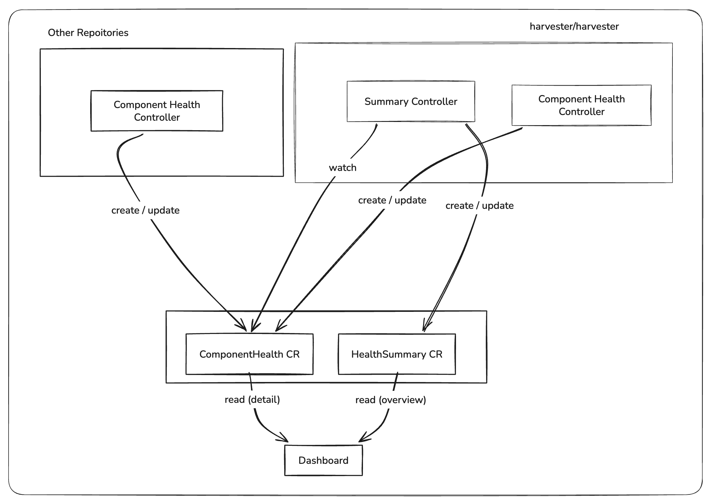
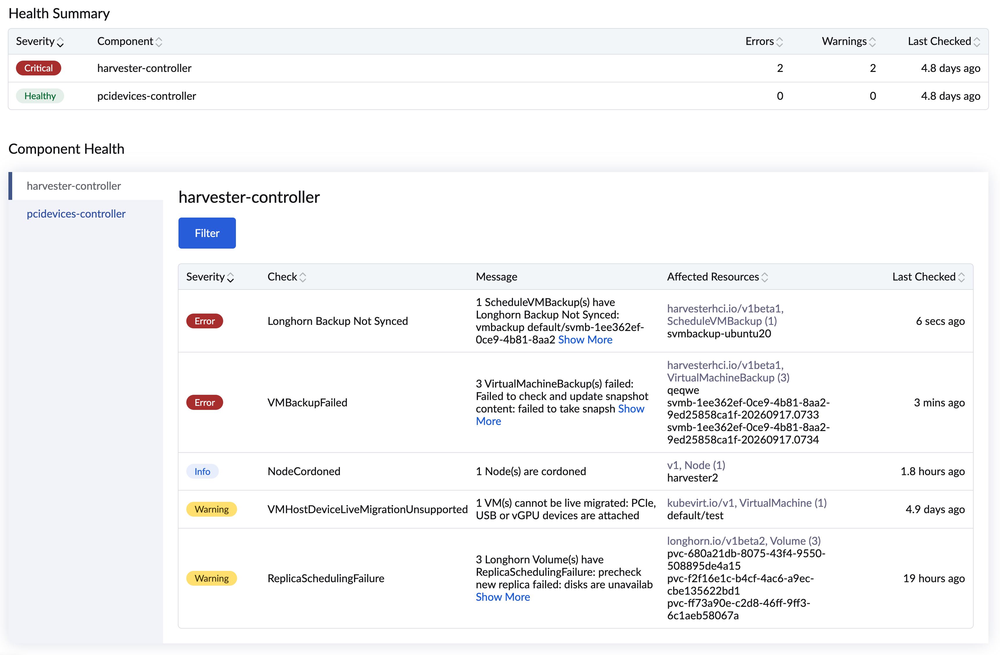
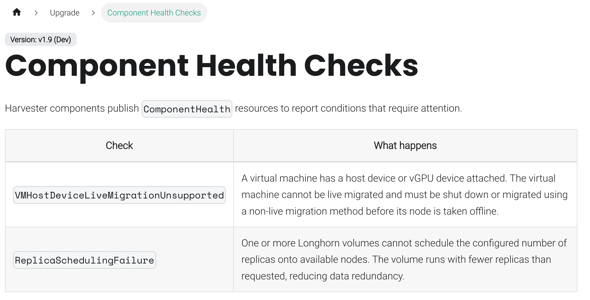

# Service Health Dashboard

## Summary

Harvester currently lacks a unified way to inspect the health of its internal components or show the general status of the system. When users report issues, the investigation requires manually checking resources across multiple controllers. This enhancement introduces a framework for proactive health and status reporting: each component maintains one or more `ComponentHealth` CRs describing its current check results, and a summary controller aggregates all component CRs into a single `HealthSummary` CR. The dashboard then reads the summary for the overview and fetches per-component detail from the individual `ComponentHealth` CRs when needed.

### Related Issues

https://github.com/harvester/harvester/issues/8436

## Motivation

When a user-reported issue is vague, there is no single place to determine the root cause. Engineers must inspect each component individually. Some problems, such as a missing required resource or a misconfigured VM, are only found when someone happens to look, rather than surfaced proactively.

### Goals

- Provide a `ComponentHealth` CRD so each component can report its own health checks.
- Provide a `HealthSummary` CRD that aggregates all component health statuses into a single resource.

### Non-goals

- Replacing or duplicating existing Kubernetes node/pod health mechanisms.
- Admission webhook validation for the resources this framework checks. That is a separate, independent concern and out of scope for this HEP.

## Introduction

There are two architectural layers to this enhancement, each building on the previous:

**Layer 1 — ComponentHealth CRD**

Each component runs one or more reconcile loops that evaluate its own health rules and write the results to the `ComponentHealth` CR(s) it owns (one per resource kind it checks, see [ComponentHealth](#componenthealth) below). This makes health status visible rather than discoverable only when someone happens to look.

**Layer 2 — HealthSummary CRD**

A summary controller watches all `ComponentHealth` CRs and maintains a single `HealthSummary` CR, grouping CRs by their `health.harvesterhci.io/component` label so a component that owns several CRs still contributes one entry. The dashboard reads only the summary CR for the overview. When a user drills down into a component, the Harvester UI extension lists that component's `ComponentHealth` CRs by label selector and aggregates them client-side, since a component's detail is no longer guaranteed to be a single CR.

#### Architecture Diagram



## Proposal

### User Stories

#### Story 1

As a Harvester administrator, I open the dashboard and immediately see that the upgrade component is reporting an error because a default StorageClass is missing. I can click through to see which resource is affected and take action before attempting an upgrade.

#### Story 2

As an engineer debugging a customer issue, I run `kubectl get componenthealths --all-namespaces` and instantly see which components have active warnings or errors, without needing to inspect each controller's logs individually.

#### Story 3

As a VM operator, I see a warning on the dashboard that three of my VMs cannot be live migrated because they use host devices or vGPU devices. I can resolve the issue before scheduling a maintenance window.

### API Changes

Two new CRDs are introduced under the existing `harvesterhci.io/v1beta1` API group. Both are cluster-scoped.

#### ComponentHealth

A logical component (e.g. `harvester-controller`, `pcidevices-controller`) does not own a single `ComponentHealth` CR. Instead, it owns one CR per resource kind (or, for DaemonSet-backed components, one CR per node) it reports on. All CRs belonging to the same logical component share the label `health.harvesterhci.io/component: <component-name>`; DaemonSet-backed CRs additionally carry `health.harvesterhci.io/node: <node-name>`.

CR names follow the convention `<component-name>-<resource-or-node-name>`, e.g. `harvester-controller-node`, `harvester-controller-vm`, `harvester-controller-volume`, or `pcidevices-controller-<node-name>`. If a DaemonSet-backed component later needs to report on more than one resource kind per node, the recommended convention is `<component-name>-<resource>-<node-name>` (e.g. `pcidevices-controller-vgpudevices-<node-name>`).

Splitting the CR per resource (instead of one CR per component) means each reconcile loop within a component only ever patches the status of the CR it owns, avoiding update conflicts that would occur if multiple independent reconcile loops (e.g. a node check and a VM check) raced to patch the same object's status subresource.

```yaml
apiVersion: v1
kind: List
items:
- apiVersion: harvesterhci.io/v1beta1
  kind: ComponentHealth
  metadata:
    name: harvester-controller-node
    labels:
      health.harvesterhci.io/component: harvester-controller
  status:
    lastCheckedAt: "2026-09-22T02:30:04Z"
    checks:
      NodeCordoned:
        severity: Info
        message: "1 Node(s) are cordoned"
        affectedCount: 1
        affectedResources:
          apiVersion: v1
          kind: Node
          names:
            harvester2: {}
- apiVersion: harvesterhci.io/v1beta1
  kind: ComponentHealth
  metadata:
    name: harvester-controller-vm
    labels:
      health.harvesterhci.io/component: harvester-controller
  status:
    lastCheckedAt: "2026-09-17T05:49:20Z"
    checks:
      VMHostDeviceLiveMigrationUnsupported:
        severity: Warning
        message: "1 VM(s) cannot be live migrated: PCIe, USB or vGPU devices are attached"
        affectedCount: 1
        affectedResources:
          apiVersion: kubevirt.io/v1
          kind: VirtualMachine
          names:
            default/test: {}
- apiVersion: harvesterhci.io/v1beta1
  kind: ComponentHealth
  metadata:
    name: pcidevices-controller-harvester2
    labels:
      health.harvesterhci.io/component: pcidevices-controller
      health.harvesterhci.io/node: harvester2
  status:
    lastCheckedAt: "2026-09-22T03:36:45Z"
```

`checks` is a map keyed by `reason`, so a controller can update or delete a single check result when a resource changes or when a warning returns to normal. `affectedResources.names` is a map keyed by resource name. It uses `namespace/name` for namespaced resources and bare `name` for cluster-scoped resources. The map value is currently empty and reserved for future per-resource detail.

`affectedResources` is a pointer field and may be absent for checks that do not relate to a specific resource kind (e.g. a DaemonSet pod that reports no checks yet still updates `lastCheckedAt` to signal liveness, as in the `pcidevices-controller-harvester2` example above). A check is expected to contain one `affectedResources` group because affected resources for the same reason are normally the same `apiVersion` and `kind`.

Because a single logical component can now be represented by several CRs, `kubectl get componenthealths -A` naturally lists one row per resource kind / node rather than one row per component:

```
NAME                                        AGE
harvester-controller-node                   16h
harvester-controller-schedulevmbackup       4d19h
harvester-controller-vm                     5d21h
harvester-controller-vmbackup               4d19h
harvester-controller-volume                 5d21h
pcidevices-controller-harvester1.dap.sys    5d19h
pcidevices-controller-harvester2            5d19h
```

#### HealthSummary

There is exactly one `HealthSummary` CR, named `cluster`, maintained by the summary controller.

```yaml
apiVersion: harvesterhci.io/v1beta1
kind: HealthSummary
metadata:
  name: cluster
status:
  lastCheckedAt: "2026-05-15T10:00:00Z"
  components:
    upgrade-controller:
      errorCount: 1
      warningCount: 0
    harvester-controller:
      errorCount: 0
      warningCount: 1
```

`components` is a map keyed by the `health.harvesterhci.io/component` label value, not by CR name. The summary controller reconciles on every `ComponentHealth` change, lists all `ComponentHealth` CRs, groups them by that label, and sums the error/warning counts of every check across all CRs sharing the same component label into a single entry. This lets a component add, remove, or rename its per-resource CRs without changing the structure of the summary. The summary CR does not embed the check details from each CR. Its only role is to give the dashboard a single read to determine per-component error and warning counts. Detail is always fetched from the individual `ComponentHealth` CRs.

Because the detail view for one logical component may now require reading multiple `ComponentHealth` CRs, the Harvester UI extension is responsible for a basic aggregation step on drill-down: it lists CRs with a `health.harvesterhci.io/component=<name>` label selector (further grouping by `health.harvesterhci.io/node` for DaemonSet-backed components) and merges their `checks` maps for display. The API server performs no aggregation beyond the cluster-wide `HealthSummary` counts.

### Go Types

```go
// ComponentHealth

type ComponentHealthStatus struct {
    LastCheckedAt metav1.Time            `json:"lastCheckedAt"`
    Checks        map[string]CheckResult `json:"checks,omitempty"`
}

type CheckResult struct {
    Severity          Severity           `json:"severity"`
    Message           string             `json:"message"`
    AffectedCount     int                `json:"affectedCount,omitempty"`
    AffectedResources *AffectedResources `json:"affectedResources,omitempty"`
}

type AffectedResources struct {
    APIVersion string                            `json:"apiVersion"`
    Kind       string                            `json:"kind"`
    Names      map[string]AffectedResourceDetail `json:"names,omitempty"`
}

type AffectedResourceDetail struct {
}

type Severity string

const (
    SeverityError   Severity = "Error"
    SeverityWarning Severity = "Warning"
    SeverityInfo    Severity = "Info"

    // LabelKeyComponent groups all ComponentHealth CRs belonging to the same logical component.
    LabelKeyComponent = "health.harvesterhci.io/component"

    // LabelKeyNode is set only on ComponentHealth CRs produced by DaemonSet-backed components;
    // it holds the node the reporting pod is scheduled on.
    LabelKeyNode = "health.harvesterhci.io/node"
)

// HealthSummary

type HealthSummaryStatus struct {
    LastCheckedAt metav1.Time                  `json:"lastCheckedAt"`
    Components    map[string]ComponentSummary `json:"components,omitempty"`
}

type ComponentSummary struct {
    ErrorCount   int    `json:"errorCount"`
    WarningCount int    `json:"warningCount"`
}
```

Both CRDs live in the existing `harvesterhci.io/v1beta1` API group (not a new `health.harvesterhci.io` group), so they are generated and vendored the same way as every other Harvester type.

## Design

### Implementation Overview

#### Check Logic Is Component-owned

This framework surfaces two broad categories of health signal: 

- **Missing required resources** — a default or system resource that must always exist has been removed (e.g. the default StorageClass was deleted). The health controller checks the resource still exists and reports an error if it does not.
- **Resource configuration that blocks expected operations** — a resource exists but its current configuration prevents a normal operation from succeeding (e.g. a VM uses host devices or vGPU devices and cannot be live-migrated). The health controller detects this condition and reports it.

Each component decides its own check logic. There is no shared interface or abstraction that every component's checks must implement.

#### Not Limited to Anomaly Detection

`ComponentHealth` is not restricted to reporting "a resource is not supposed to do something." A component may also use it to surface arbitrary state it wants visible on the dashboard, even when that state is expected or benign — for example, `node.spec.unschedulable` being `true`, or the current phase of a `VirtualMachineBackup`. These are reported the same way as any other check, using `Severity: Info` (or `Warning`/`Error` if the component judges the state worth flagging), so no new mechanism is needed to support them. This keeps the framework useful as a general status/observability surface for a component, not just an anomaly detector.

#### Component Health Controller

Each component's health controller owns one `Handler` with an `OnChange` callback per watched resource kind. Each callback recomputes the checks for the resource kind it owns and patches only the `ComponentHealth` CR named for that resource kind, never a CR shared with another callback in the same component:

```go
// pkg/controller/master/componenthealth/controller.go

const (
    componentName             = "harvester-controller"
    nodeComponentHealthName   = "harvester-controller-node"
    vmComponentHealthName     = "harvester-controller-vm"
    volumeComponentHealthName = "harvester-controller-volume"
)

func Register(ctx context.Context, management *config.Management, _ config.Options) error {
    nodes := management.CoreFactory.Core().V1().Node()
    vmis := management.VirtFactory.Kubevirt().V1().VirtualMachineInstance()
    volumes := management.LonghornFactory.Longhorn().V1beta2().Volume()

    h := &Handler{ /* caches for nodes, vmis, volumes, ... */ }

    nodes.OnChange(ctx, nodeControllerName, h.OnNodeChanged)
    vmis.OnChange(ctx, vmiControllerName, h.OnVMIChanged)
    volumes.OnChange(ctx, volumeControllerName, h.OnVolumeChanged)
    return nil
}
```

`updateComponentHealthChecks(componentHealthName, checks, ownedKeys)` is the shared helper every check function calls to persist its result: it gets-or-creates the named CR, replaces only the entries in `ownedKeys` (so one check function never clobbers another check function's keys within the same CR), stamps `lastCheckedAt`, and sets the `health.harvesterhci.io/component` label:

```go
func (h *Handler) updateComponentHealthChecks(componentHealthName string, checks map[string]harvesterv1.CheckResult, ownedKeys []string) error {
    // get-or-create the CR named componentHealthName
    // remove any existing entries whose key is in ownedKeys, then merge in checks
    // patch status.checks and status.lastCheckedAt, setting the component label
}
```

Because each resource kind's checks live in a dedicated CR, and each CR is only ever written by the `OnChange` callback that owns it, concurrent reconciles across resource kinds cannot race on the same object's status subresource — this is the concurrency motivation for splitting `ComponentHealth` per resource described above.

For DaemonSet-backed components such as `pcidevices-controller`, the same pattern applies per node: each pod computes its own checks and patches only the CR named after its own node (or `<component>-<resource>-<node>` if it later reports on more than one resource kind), so pods on different nodes never contend for the same CR either.

#### Summary Controller

A single summary controller in the main Harvester process watches all `ComponentHealth` CRs. On any change:

1. It reads all `ComponentHealth` CRs.
2. It groups them by the `health.harvesterhci.io/component` label (falling back to the CR name if the label is absent) and sums the error/warning counts of every check across all CRs in the same group.
3. It upserts the `HealthSummary` CR named `cluster`, creating it if absent.

#### UI Extension Aggregation

Because the overview (`HealthSummary`) is already aggregated per component, the dashboard's landing page needs no further work. The drill-down view is where the UI extension performs its own basic aggregation: given a component name, it lists `ComponentHealth` CRs with `health.harvesterhci.io/component=<name>` and merges their `checks` maps (and, for DaemonSet-backed components, further groups by the `health.harvesterhci.io/node` label to present a per-node breakdown) before rendering. This introduces no new backend endpoint; it is a client-side aggregation over the existing `ComponentHealth` list API.

Action Items:

- [ ] Define `harvesterhci.io/v1beta1` CRD manifests for `ComponentHealth` and `HealthSummary`.
- [ ] Implement the summary controller with label-based grouping.
- [ ] Implement `ComponentHealth` reconciler(s) per component, starting with: node, VM live migration, volume, VM backup, scheduled VM backup, PCI devices.
- [ ] Add dashboard/UI extension support to read `HealthSummary` for the overview and aggregate per-component `ComponentHealth` CRs for drill-down.




### Test Plan

Covered in individual component pull requests. At minimum each component must provide:

- Unit tests for each check function.
- An integration test that verifies the `ComponentHealth` CR reflects the expected check results when a check condition is introduced and cleared.

### Upgrade Strategy

The `HealthSummary` CR is created by the summary controller on first run; no manual bootstrap is required. Existing clusters upgrading to this version will have their `ComponentHealth` CRs created the first time each component's controller reconciles after upgrade.

## Notes

### Troubleshooting

Because check reasons are pre-defined keys, we can document each one on the docs website and tell users what to do when it appears.



### Dynamic Status Reporting

Not every check needs a hand-written reconciler. For simple field-to-check mappings, a generic controller could read rules from a `ConfigMap` instead, avoiding a code change per field.

```yaml
apiVersion: v1
kind: ConfigMap
metadata:
  name: componenthealth-dynamic-fields
  namespace: harvester-system
data:
  rules.yaml: |
    - name: NodeUnschedulable
      componentHealthName: harvester-controller-node
      resource:
        apiVersion: v1
        kind: Node
      fieldPath: spec.unschedulable
      matchValue: "true"
      severity: Warning
      message: "Node is marked unschedulable"
    - name: VMBackupPhase
      componentHealthName: harvester-controller-vmbackup
      resource:
        apiVersion: harvesterhci.io/v1beta1
        kind: VirtualMachineBackup
      fieldPath: status.readyToUse
      matchValue: "false"
      severity: Info
      message: "VM backup is not ready to use"
```

This should be treated as a small extension of the core feature, not as a general-purpose rule engine. The intent is only to support simple field-to-status mappings; it is not a generic expression language for arbitrary object traversal or custom logic. To keep the design constrained and low-risk, we limit it to:

1. only simple scalar fields are supported; arrays and maps are out of scope.
2. only the GVKs already used by the health dashboard are supported.

### Addon Components

If we implement this as an addon, the service dashboard addon would need to re-implement each resource check by importing the relevant repositories and duplicating their validation logic. That makes maintenance harder and increases the risk that checks drift from the source component.

It is easier to keep the resource check and validation logic in the owning component itself.

For example:

If this is implemented as an addon:
- We would need to import multiple repositories and duplicate validation logic across them.
- Some checks could be forgotten or missed when moved into the addon.
- Any change in the original repository would also require a corresponding change in the addon.

If this is not implemented as an addon:

- each repository imports the shared Harvester API types from `harvester/harvester`
- each repository only needs to maintain its own scope and validation logic